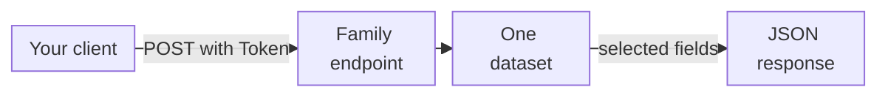

import DocButton from '~/components/webkit/DocButton.vue'
import DocCardGroup from '@aziontech/webkit/doc-card-group'
import DocCard from '@aziontech/webkit/doc-card'

GraphQL is a query language for APIs. A client sends one query that names the records it wants and the fields of each record, and the server returns a JSON object with the same shape as the query. The client chooses the fields, so a response carries nothing the client did not ask for, and a different question needs a different query, not a different endpoint.

**GraphQL API** reads the metrics, events, billing, accounting, and consumption data of your Azion account, with one endpoint per data family under `https://api.azion.com/v4`. Any client that sends an HTTP `POST` with a JSON body and a personal token can call it. Use the GraphQL API to chart request trends, rank the IP addresses, URIs, or user agents behind your traffic, investigate blocked requests, or read your bills and product usage.

<DocButton href="/en/documentation/devtools/graphql/first-steps/" label="Get started" size="medium" />
<DocButton href="/en/documentation/devtools/graphql/overview/" label="See how it works" kind="secondary" size="medium" />

---

## Query structure

A query names one dataset, the arguments that filter, group, and sort it, and the fields to return. This query adds up the requests of your workloads per time bucket in a seven-day window, newest first:

```graphql
query {
  workloadMetrics(
    limit: 5
    filter: { tsRange: {begin: "2026-09-26T14:00:00", end: "2026-10-03T14:00:00"} }
    aggregate: { sum: requests }
    groupBy: [ts]
    orderBy: [ts_DESC]
  ) {
    ts
    sum
  }
}
```

The metrics endpoint returns HTTP `200` and five rows. The response below is cut after the third row:

```json
{
  "data": {
    "workloadMetrics": [
      {
        "ts": "2026-10-03T13:00:00Z",
        "sum": 2
      },
      {
        "ts": "2026-10-03T12:00:00Z",
        "sum": 2
      },
      {
        "ts": "2026-10-03T03:00:00Z",
        "sum": 2
      },
      …
    ]
  }
}
```

- `workloadMetrics` is the dataset, the table the rows come from. It is served by the metrics endpoint, `https://api.azion.com/v4/metrics/graphql`.
- `filter` carries the time window in `tsRange`. Metrics, events, and consumption datasets refuse a query without one.
- `aggregate: { sum: requests }` and `groupBy: [ts]` add up `requests` per time bucket, and the result field is named `sum`, after the function.
- `limit` caps the rows at five. Without it, a query returns 10 rows.

If you have written a GraphQL query before, the syntax is the same. A refused query is the one difference: it returns a JSON object with a `detail` key, not a GraphQL `errors` array.

---

## Endpoints and datasets

The GraphQL API is not one endpoint. It is five APIs, each with its own endpoint and schema, and a query goes to the endpoint that serves its dataset:



1. Your client sends the query in a `POST` request, with the header `Authorization: Token [TOKEN VALUE]` and the value of a personal token.
2. The request goes to the endpoint of the data family the query reads. A query on the events dataset `workloadEvents` sent to the metrics endpoint returns `400`.
3. The endpoint selects the rows of the dataset that the query names, filtered, grouped, and sorted by its arguments.
4. The response holds one array per dataset under the `data` key, with one object per row and only the fields the query selected.

Each endpoint serves one family of data:

| API | Endpoint | Data |
| --- | --- | --- |
| Metrics | `https://api.azion.com/v4/metrics/graphql` | Request data from [Real-Time Metrics](/en/documentation/platform/real-time-metrics/), aggregated into time buckets |
| Events | `https://api.azion.com/v4/events/graphql` | Raw records from [Real-Time Events](/en/documentation/platform/real-time-events/), one per request or event |
| Billing | `https://api.azion.com/v4/billing/graphql` | Bills, financial entries, and payments |
| Accounting | `https://api.azion.com/v4/accounting/graphql` | The products and metrics accounted to the account |
| Consumption | `https://api.azion.com/v4/consumption/graphql` | Product usage per workload, as accounted data |

For the datasets, time resolution, and retention behind each endpoint, refer to [How the GraphQL API works](/en/documentation/devtools/graphql/overview/).

---

## Scope and limits

- **Read only**: the GraphQL API answers queries. It has no mutations, and no query changes your account.
- **Authentication**: every request carries `Authorization: Token [TOKEN VALUE]`. A `Bearer` header is refused like a missing one, with `401` and `Authentication credentials were not provided.` To create a token, refer to [Personal tokens](/en/documentation/guides/platform/account-and-billing/personal-tokens/).
- **Clients**: the [GraphiQL Playground](/en/documentation/devtools/graphql/graphql-playground/) is an in-browser editor served at each endpoint URL to a signed-in Azion Console session. `curl` or any HTTP client sends the query as a JSON body, and [Run GraphQL queries in Postman](/en/documentation/guides/platform/observability/query-graphql-postman/) covers Postman. The [aziontech/azion-queries](https://github.com/aziontech/azion-queries) repository holds query examples to adapt.
- **Datasets and fields**: [Datasets and query arguments](/en/documentation/devtools/graphql/features/) lists the datasets of each endpoint and the arguments they share. The fields of each dataset are on [Real-Time Metrics fields](/en/documentation/devtools/graphql/gql-real-time-metrics-fields/), [Real-Time Events fields](/en/documentation/devtools/graphql/gql-real-time-events-fields/), [Billing fields](/en/documentation/devtools/graphql/gql-billing-fields/), [Accounting fields](/en/documentation/devtools/graphql/gql-accounting-fields/), and [Consumption fields](/en/documentation/devtools/graphql/gql-consumption-fields/). [Queries](/en/documentation/devtools/graphql/queries/) shows a raw, an aggregated, a financial, and a usage query, each with its response.
- **Limits**: a query returns up to 10,000 rows and selects up to 37 fields on a metrics dataset, or 36 on `workloadEvents`. Events datasets keep records for about 7 days. Past a row or field bound, the query returns `400`, and [GraphQL API limits](/en/documentation/devtools/graphql/limits/) lists every bound.
- **Errors**: every error is a status code with a JSON body that holds one `detail` key. [Error responses](/en/documentation/devtools/graphql/error-responses/) lists each message and its cause, and [Troubleshoot the GraphQL API](/en/documentation/devtools/graphql/troubleshooting/) gives the cause and the fix for each symptom.
- **Terms**: the [Glossary](/en/documentation/devtools/graphql/glossary/) defines the terms these pages use, such as dataset, raw data, and adaptive resolver.

---

## Next steps

<DocCardGroup cols={2}>
  <DocCard title="GraphQL API quickstart" href="/en/documentation/devtools/graphql/first-steps/" label="Create a token and run your first query." />
  <DocCard title="How the GraphQL API works" href="/en/documentation/devtools/graphql/overview/" label="Follow a query from its endpoint to the rows it returns." />
  <DocCard title="Queries" href="/en/documentation/devtools/graphql/queries/" label="Start from a working query for raw, aggregated, financial, or usage data." />
  <DocCard title="GraphQL API guides and tutorials" href="/en/documentation/devtools/graphql/guides/" label="Rank top URIs, find top attacks, or complete another task." />
</DocCardGroup>
