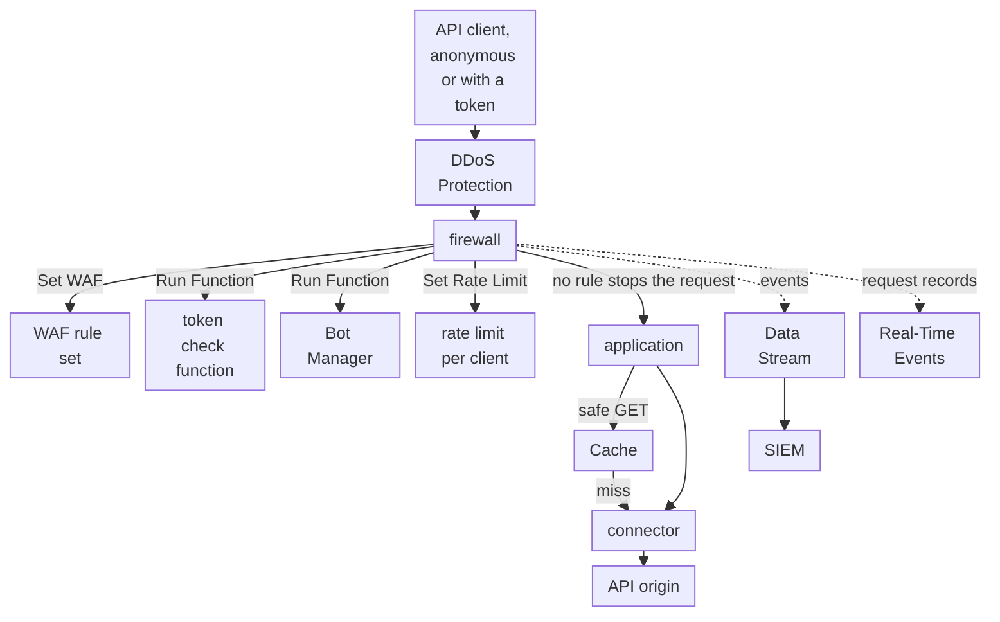

import FrameBox from '@aziontech/webkit/frame-box'
import ItemList from '@aziontech/webkit/item-list'
import DocItem from '@aziontech/webkit/doc-item'

This design serves teams whose APIs run on their own gateway, cloud, or data center. A firewall attached to the API's workload inspects every request: WAF rules and rate limits filter attacks and floods, Bot Manager scores automated clients, and a function validates tokens. The application then forwards the request through a connector to the API origin. Firewall and WAF events stream through Data Stream to the SIEM, and Real-Time Events explains each block. The design implements the use case [Protect public APIs from abuse](/en/documentation/use-cases/secure-applications-and-networks/protect-public-apis-from-abuse/).

## Architecture diagram

Read the diagram at the firewall. The connection is already accepted when a request reaches it, so every check acts on a request, not on a client's identity: rules, a token, a bot score, and a rate. Each check acts through the rule that calls it, so the order of the rules is the order of the checks. Only a request that passes them all reaches the application, which answers safe GET requests from Cache and sends the rest to the API origin. The dotted edges carry records, not requests.

### Dataflow

1. An API client's request reaches the workload. DDoS Protection assesses it before any firewall rule runs.
2. A rule's _Set WAF_ behavior scores the request against the rule set, its JSON body included, and refuses an attack pattern with `400` in _Blocking_.
3. A rule's _Run Function_ behavior runs the token check, which refuses a request whose token is invalid. Another runs Bot Manager, which scores the client for automation and acts at the threshold.
4. A rule's _Set Rate Limit_ behavior counts the requests of each client IP address, and refuses requests beyond the burst with `429`.
5. A request that no rule stops reaches the application. A cacheable GET response comes from Cache, and every other request reaches the API origin through the connector.
6. Data Stream sends the requests WAF analyzed to the SIEM, and Real-Time Events holds the record of each request, joined to a refusal by its `x-azion-request-id`.

## Components

- **firewall**: the Platform Resource that is the enforcement point. Its rules run WAF, the functions, and the rate limit per client in the order the rules set, and _Set Rate Limit_ is one of its built-in behaviors.
- **DDoS Protection**: the Feature that mitigates DoS and DDoS attacks on every workload, always on, before any firewall rule runs.
- **WAF**: scores each request against eight threat families and refuses attack patterns in _Blocking_. It parses JSON bodies, so it reads the fields an API receives.
- **Bot Manager**: scores each request for automation. Its `api` mode is documented for clients that carry no cookies, which is how most API clients behave.
- **Functions**: runs the token check on the firewall, such as the JWT function from Azion Marketplace, and any custom check the team writes in the `firewall` execution environment.
- **application**: the Platform Resource that routes the requests the firewall lets through, and decides which responses Cache can answer.
- **Cache**: answers safe GET responses, so repeated reads never reach the API origin.
- **connector**: the Platform Resource that reaches the API origin. Every request that passes the firewall and misses Cache ends at it.
- **Data Stream**: sends the requests WAF analyzed, with their score, matched rules, and action, to an endpoint the SIEM reads.
- **SIEM**: the integration that correlates the API's security events with the team's other sources.
- **Real-Time Events**: holds the record of each request, so a client's report of a refusal can be traced to the rule that decided it.

## Implementation

- [Protect public APIs from abuse](/en/documentation/use-cases/secure-applications-and-networks/protect-public-apis-from-abuse/) - builds this design end to end, with the WAF rule, the token check, Bot Manager, the rate limit, and the checks for each.
- [How to Install the JWT Integration](/en/documentation/guides/application-development/integrations/jwt/) - installs the JWT function and runs it on a firewall.
- [Stream WAF events to a SIEM](/en/documentation/guides/application-security/firewall-and-waf/integrate-siems/) - creates the stream that carries the WAF events to the SIEM.

## Related resources

<FrameBox>
<ItemList>
  <DocItem title="How Firewall works" href="/en/documentation/platform/firewall/how-it-works/">How rule order, rate limits, and function outcomes decide each request.</DocItem>
  <DocItem title="Rules Engine for Firewall" href="/en/documentation/platform/firewall/rules-engine/">Every criterion and behavior an API rule combines, with the attributes of Set Rate Limit.</DocItem>
  <DocItem title="Functions for Firewall" href="/en/documentation/platform/firewall/functions/">The firewall event and the methods a custom check calls to deny, drop, or answer a request.</DocItem>
  <DocItem title="Arguments" href="/en/documentation/platform/firewall/bot-manager/arguments/">The mode, threshold, and action a Bot Manager instance takes.</DocItem>
</ItemList>
</FrameBox>
