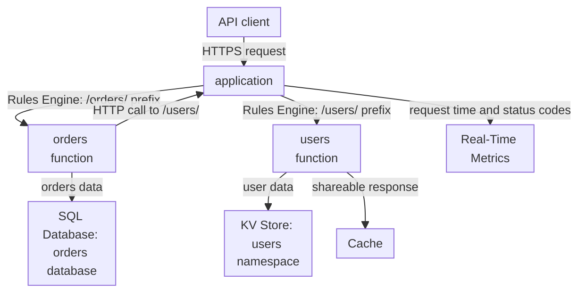

import FrameBox from '@aziontech/webkit/frame-box'
import ItemList from '@aziontech/webkit/item-list'
import DocItem from '@aziontech/webkit/doc-item'

This design serves teams that split an API into services owned by different teams. Each service is its own function with its own data, deployed and versioned on its own. The application's Rules Engine routes each path prefix to its service, and services call each other over HTTP when one needs another. Each service chooses its own store, in Azion or outside it. The design implements the use case [Build REST and GraphQL APIs](/en/documentation/use-cases/build-and-run-applications/build-rest-and-graphql-apis/).

## Architecture diagram

Read the diagram from the application's rules. Each rule matches one path prefix and runs the function instance of one service, so the rules are the map of the API: adding a service adds a rule, and nothing else in the application changes. Below the rules, each service reaches only its own store, which is what lets a team change a schema without coordinating with another team. The arrow from the orders function back to the application is a service-to-service call: it travels over HTTP like any client request, and the users service answers it through its own rule.

### Dataflow

1. A client's request reaches the application on the API's domain, and Rules Engine compares its path with the prefix of each service's rule.
2. The rule that matches runs the function instance of that service. `/orders/` reaches the orders function, and `/users/` reaches the users function.
3. Each function reads and writes only its own store, a database in SQL Database, a namespace in KV Store, or a store outside Azion.
4. When a service needs data another service owns, it calls that service's path over HTTP, and the call is routed by the same rules as a client request.
5. A response that every client may share is stored in Cache, so repeated calls skip the service's store.
6. Because each service is a separate function, a deploy changes one service's code and leaves the others running the version they had.

## Components

- **application**: the Platform Resource that receives the API's requests and holds one function instance and one rule per service.
- **Rules Engine**: the Feature of the application that routes each path prefix to its service. A rule's **Run Function** behavior names a function instance, and it requires Application Accelerator and Functions on the application.
- **Functions**: one function per service. A function instance binds a service's function to the application, and a change to a function's code reaches every instance that binds it.
- **SQL Database and KV Store**: per-service data. A service with relational records owns a database; a service whose data is read by key, such as profiles or sessions, owns a namespace. A namespace cannot be renamed or deleted, so a service's namespace outlives the service.
- **Cache**: stores the responses that every client may share, so a popular lookup does not reach the service each time.
- **Real-Time Metrics**: reports request time and status codes for the API's domain, and the number of times the functions ran. A service served on a host of its own can be read apart with the **Host** filter.

## Implementation

- [Instantiate a function on an application](/en/documentation/guides/application-development/getting-started/instantiate-functions/) - binds each service's function to the shared application and creates the rule that runs it.
- [Create request and response rules](/en/documentation/guides/application-development/getting-started/rules-engine/) - creates the path-prefix rule of each service in Azion Console.
- [Deploy a function with Azion CLI](/en/documentation/guides/application-development/functions-and-runtime/deploy-function-with-cli/) - deploys a service's function from its own project.

## Related resources

<FrameBox>
<ItemList>
  <DocItem title="How Functions works" href="/en/documentation/platform/functions/how-it-works/">Why a function runs only through an instance and a rule, and how one function serves several instances.</DocItem>
  <DocItem title="Rules Engine for Applications" href="/en/documentation/platform/applications/rules-engine/">The criteria, the operators, and the Run Function behavior that route a prefix to its service.</DocItem>
  <DocItem title="Functions limits" href="/en/documentation/platform/functions/limits/">The sub-request ceiling that bounds how many services one invocation can call.</DocItem>
  <DocItem title="How KV Store works" href="/en/documentation/platform/kv-store/how-it-works/">Eventual consistency and the last-write-wins rule a service's namespace follows.</DocItem>
</ItemList>
</FrameBox>
