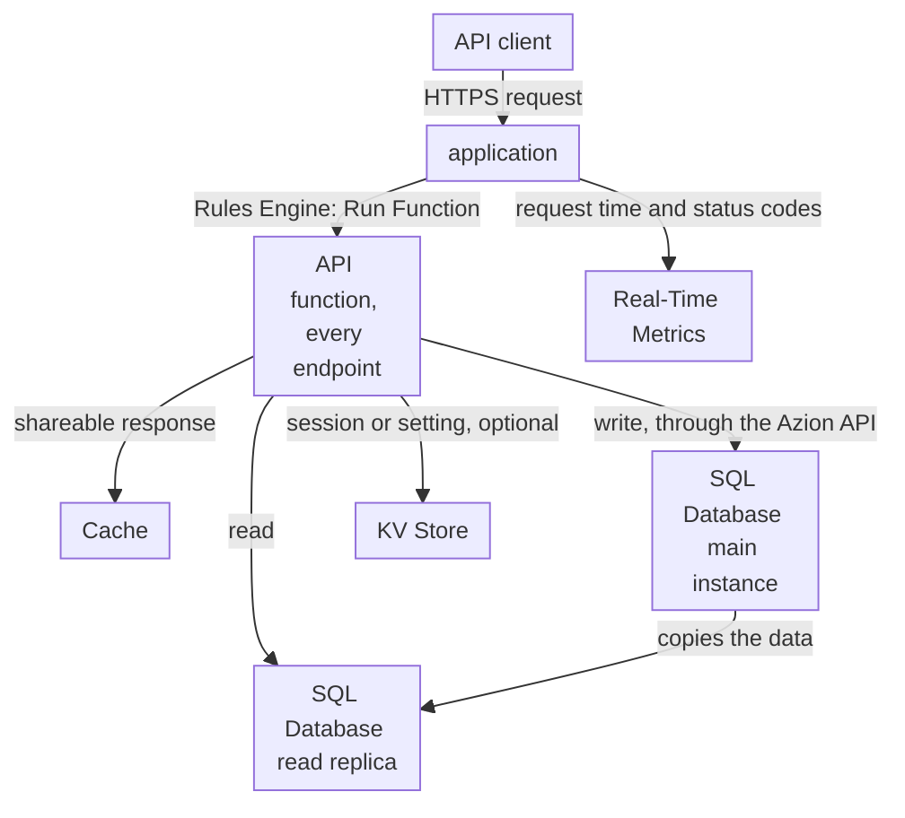

import FrameBox from '@aziontech/webkit/frame-box'
import ItemList from '@aziontech/webkit/item-list'
import DocItem from '@aziontech/webkit/doc-item'

This design serves teams that ship their API as one deployable unit. The application routes the API's paths to one function that implements every endpoint and reads and writes SQL Database, with KV Store for sessions or configuration, and Cache stores the responses that allow it. The design implements the use case [Build REST and GraphQL APIs](/en/documentation/use-cases/build-and-run-applications/build-rest-and-graphql-apis/).

## Architecture diagram

Read the diagram from the function outward. Every request the application receives runs the same function, so the function is the one place that knows every endpoint. From there, the paths split by what the endpoint does: a response that every client may share goes to Cache, a read goes to a replica of the database, and a write goes to the main instance. KV Store sits beside the database for values read by key, such as a session, and the design works without it. Real-Time Metrics reads what the application records and changes nothing on the request path.

### Dataflow

1. A client's request reaches the application on the API's domain, and a rule of the application runs the API function.
2. The function matches the method and the path to an endpoint, and answers a path it does not serve with an error.
3. A read opens a connection to a read replica of the database, which takes the database name and no token, so the data a read needs stays inside Azion.
4. A write goes to the main instance through the Azion API, because the main instance is the only one that applies writes. The replicas then hold the change.
5. A response that every client may share is stored in Cache, and later requests for it are answered from the stored copy until it expires or the function removes it.
6. One function and one database serve the whole API, so a deploy, a rollback, or a schema change reaches every endpoint at the same moment.

## Components

- **application**: the Platform Resource that receives the API's requests on its domain and routes them to the function with a Rules Engine rule.
- **Functions**: one function implements every endpoint. A deploy replaces the code of all the endpoints together, which is what makes the API one unit.
- **SQL Database**: holds the API's relational data. A function reads through a read replica with no token, and writes go to the main instance through the Azion API with a personal token.
- **KV Store**: holds sessions and configuration read by key, a design option. It is eventually consistent and has no compare-and-set, so it carries values that tolerate a short delay, not the API's records.
- **Cache**: stores the responses that every client may share, such as a list or a lookup, so a repeated call skips the database read.
- **Real-Time Metrics**: reports the API's request time and status codes by domain, and the number of times the function ran.

## Implementation

- [Build REST and GraphQL APIs](/en/documentation/use-cases/build-and-run-applications/build-rest-and-graphql-apis/) - builds this design end to end: the database, the function's write credentials, the API function with its cached list, and the checks for each.
- [Build a RESTful tasks API with Functions and SQL Database](/en/documentation/guides/application-development/functions-and-runtime/restful-tasks-api-functions/) - implements the endpoints of the function with the Hono router.
- [Deploy a function with Azion CLI](/en/documentation/guides/application-development/functions-and-runtime/deploy-function-with-cli/) - creates the project, the application, and the function instance that serve the API.
- [Create and manage databases](/en/documentation/guides/application-development/data/manage-sql-database/) - creates the database the function reads and writes.

## Related resources

<FrameBox>
<ItemList>
  <DocItem title="How SQL Database works" href="/en/documentation/platform/sql-database/how-it-works/">Why reads come from replicas and every write reaches one main instance.</DocItem>
  <DocItem title="SQL Database API" href="/en/documentation/devtools/runtime/api-reference/sql-database/">How a function opens a read replica, binds parameters, and reads rows.</DocItem>
  <DocItem title="How Functions works" href="/en/documentation/platform/functions/how-it-works/">The function, its instance, and the rule that runs it on a request.</DocItem>
  <DocItem title="Cache API" href="/en/documentation/devtools/runtime/api-reference/cache/">How a function stores a response and matches it on a later request.</DocItem>
</ItemList>
</FrameBox>
