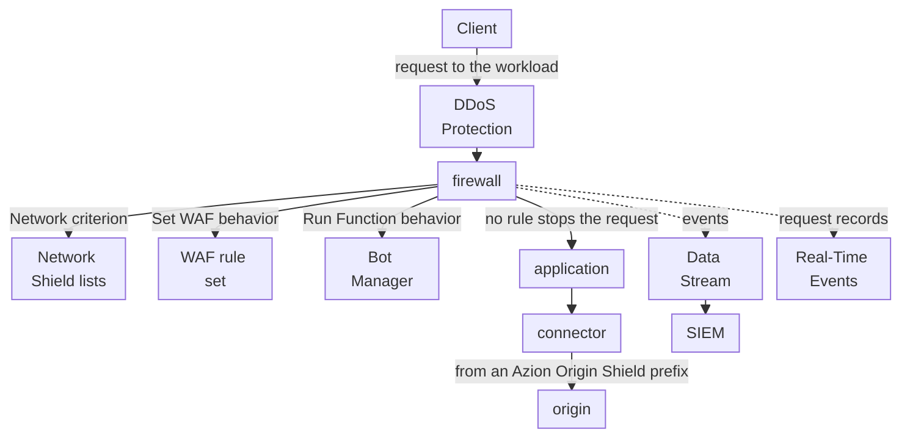

import FrameBox from '@aziontech/webkit/frame-box'
import ItemList from '@aziontech/webkit/item-list'
import DocItem from '@aziontech/webkit/doc-item'

This design serves teams that consolidate application security in front of an origin they run. A firewall on the application's workload runs Network Shield lists, WAF rules, and Bot Manager in one policy, with DDoS Protection always active. Clean requests reach the origin through a connector, and Origin Shield lets the origin drop traffic that does not come from Azion. Events stream through Data Stream to the SIEM. The design implements the use case [Protect web applications from OWASP Top 10 and zero-day attacks](/en/documentation/use-cases/secure-applications-and-networks/protect-web-applications-from-owasp-top-10-and-zero-day-attacks/).

## Architecture diagram

Read the diagram from the firewall outward. DDoS Protection acts before any rule, and the firewall's rules then decide each request in order. Network Shield, WAF, and Bot Manager each act only through the rule that calls them, so the order of those rules is the order of the policy. Every request that passes ends at one connector, and the origin's own firewall closes every other path to it. The dotted edges carry records, not requests: events leave for the SIEM, and Real-Time Events keeps each request for investigation.

### Dataflow

1. A client's request reaches the workload. DDoS Protection assesses it for a DoS or DDoS attack before any firewall rule runs.
2. The firewall bound to the workload's deployment runs its rules in order. A rule with the _Network_ criterion compares the client address with a network list and denies a listed source.
3. A rule with the _Set WAF_ behavior scores the request against the rule set's threat families. In _Blocking_, a score at a family's threshold refuses the request with `400`.
4. A rule with the _Run Function_ behavior runs a Bot Manager instance, which scores the request for automation and runs its action when the score reaches the threshold.
5. A request that no rule stops reaches the application, which forwards it to the origin through the connector. The origin accepts connections only from the prefixes of the `Azion Origin Shield` list.
6. Data Stream sends the requests WAF analyzed to the SIEM, and Real-Time Events holds the record of each request, joined to a refusal by its `x-azion-request-id`.

## Components

- **firewall**: the Platform Resource that enforces the policy. A workload's deployment names it, and it runs its rules on every request to that workload before the application sees it.
- **DDoS Protection**: the Feature that mitigates DoS and DDoS attacks on every workload, always on and with nothing to configure. It acts before any firewall rule.
- **WAF**: scores each request a _Set WAF_ rule hands it against eight threat families, and refuses the request in _Blocking_ mode when a score reaches its threshold. It filters OWASP Top 10 and other attack patterns.
- **Bot Manager**: scores each request a _Run Function_ rule hands it for signs of automation, and runs the action its instance sets once the score reaches the threshold.
- **Network Shield**: adds the _Network_ criterion, which matches the client address against a list of addresses, ASNs, or countries. It refuses known-bad sources before WAF and Bot Manager score them.
- **application**: the Platform Resource that delivers the requests the firewall lets through, and forwards them to the origin.
- **connector**: the Platform Resource that reaches the origin. Every request that passes the policy ends at it.
- **Origin Shield**: Origin IP ACL on the connector publishes the `Azion Origin Shield` list of Azion's prefixes, which the origin's firewall allows while it refuses every other source. No client can then reach the origin around the policy.
- **Data Stream**: sends the requests WAF analyzed, with their score, matched rules, and action, to an endpoint the SIEM reads.
- **SIEM**: the integration that correlates the firewall's events with the team's other security sources.
- **Real-Time Events**: holds the record of each request, with its WAF fields, so a block can be explained from the request ID its client reports.

## Implementation

- [Protect web applications from OWASP Top 10 and zero-day attacks](/en/documentation/use-cases/secure-applications-and-networks/protect-web-applications-from-owasp-top-10-and-zero-day-attacks/) - builds this design end to end, with the network rule, the WAF rule set, Bot Manager, Origin IP ACL, and the checks for each.
- [Bind a firewall to a workload](/en/documentation/guides/application-security/firewall-and-waf/firewall-protect-your-domain/) - names the firewall in the workload's deployment, which puts the policy in the request path.
- [Stream WAF events to a SIEM](/en/documentation/guides/application-security/firewall-and-waf/integrate-siems/) - creates the stream that carries the WAF events to the SIEM.
- [Allow Azion's IP ranges at your origin](/en/documentation/support/retrieve-azion-ip-ranges/) - reads the `Azion Origin Shield` list and allows it at the origin's firewall.

## Related resources

<FrameBox>
<ItemList>
  <DocItem title="How Firewall works" href="/en/documentation/platform/firewall/how-it-works/">How rule order sets the order in which Network Shield, WAF, and Bot Manager act on a request.</DocItem>
  <DocItem title="Scoring and modes" href="/en/documentation/platform/firewall/waf/scoring-and-modes/">How WAF scores a request, what Logging and Blocking do, and the body formats it parses.</DocItem>
  <DocItem title="Bot scoring" href="/en/documentation/platform/firewall/bot-manager/bot-scoring/">How Bot Manager builds a score from the rules a request matches, and when it acts.</DocItem>
  <DocItem title="Attack mitigation" href="/en/documentation/platform/workloads/ddos-protection/ddos-mitigation/">The attack types DDoS Protection mitigates, and the layers it acts at.</DocItem>
</ItemList>
</FrameBox>
