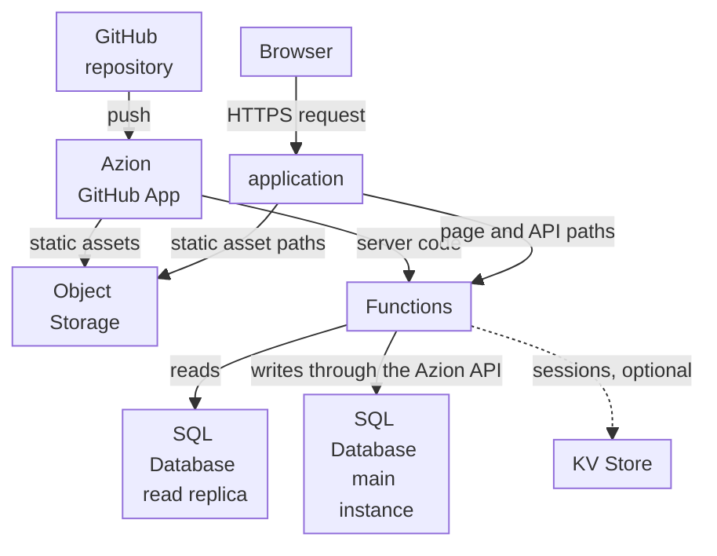

import FrameBox from '@aziontech/webkit/frame-box'
import ItemList from '@aziontech/webkit/item-list'
import DocItem from '@aziontech/webkit/doc-item'

This design serves teams that build a web application with a server-rendering framework such as Next.js. The framework build splits into static assets, stored in Object Storage, and server code, deployed as a function. The application routes page and API requests to the function, which reads and writes SQL Database, with KV Store for sessions as an option, and Cache keeps the responses that allow it. The design implements the use case [Deploy full-stack applications globally](/en/documentation/use-cases/build-and-run-applications/deploy-full-stack-applications-globally/).

## Architecture diagram

Read the diagram as two flows. The publish flow runs from the repository through the Azion GitHub App, which puts the build's static assets in Object Storage and its server code in a function. The request flow starts at the application, which sends static asset paths to the bucket and every other path to the function. Every page view therefore includes a function run and a data read, so the database sits inside both the request flow and the failure flow, while the static assets do not depend on either.

### Dataflow

1. A push to the repository makes the Azion GitHub App build the project. The static assets go to an Object Storage bucket, and the server code is deployed as a function.
2. A browser's request reaches the application. Its rules deliver the framework's static paths, such as `/_next/static/`, and static file types from the bucket without running the function.
3. A rule runs the function on every other path. The function renders the page, or answers the API route, on each request.
4. The function reads SQL Database through a read replica, which needs no token. A response that is the same for every visitor can be stored with the runtime Cache API and returned to later requests.
5. A write goes to the database's query endpoint of the Azion API, with a personal token kept in an environment variable, and the main instance applies it. A failed statement still answers `200`, with the error inside its entry.
6. When the database read or write fails, the function answers the error for that page or route. Requests for static assets keep answering from the bucket.

## Components

- **Functions**: run the server code of the build. They render each page on request, answer the API routes, and carry the only path to the data.
- **SQL Database**: holds the relational data. The main instance takes every write, and read replicas answer the reads a function sends with `Database.open`, which is read-only.
- **KV Store**: keeps sessions, a design option. It is eventually consistent, so a session written in one location can take up to 60 seconds to be visible in every other.
- **Object Storage**: holds the static assets of the build, in a bucket the application reads, so they are delivered without a function run.
- **application**: the Platform Resource whose rules split each request between the bucket and the function, by path.
- **Cache**: keeps the responses that are the same for every visitor, so a repeat request skips the render. A function stores a response with the runtime Cache API, and a `max-age` on it bounds how long later requests receive it.
- **Azion GitHub App**: the integration that builds the repository on every push and deploys the static assets and the function, so a commit reaches production with no manual step.

## Implementation

- [Deploy full-stack applications globally](/en/documentation/use-cases/build-and-run-applications/deploy-full-stack-applications-globally/) - builds this design end to end with a Next.js project, with the database, the credentials, the server code, the deploy, and the checks for each.
- [Build with Next.js](/en/documentation/guides/application-development/frameworks/next/) - deploys a Next.js project from a template, a repository, or the CLI, and lists the rules each preset generates.
- [Import a project from GitHub](/en/documentation/guides/application-development/automation/import-an-existing-project-from-github/) - connects a repository through the Azion GitHub App so every push deploys it.
- [Get Started With OpenNext](/en/documentation/guides/application-development/frameworks/get-started/) - adapts an existing Next.js project with the OpenNext adapter.

## Related resources

<FrameBox>
<ItemList>
  <DocItem title="How SQL Database works" href="/en/documentation/platform/sql-database/how-it-works/">Why reads come from a replica and every write reaches the main instance.</DocItem>
  <DocItem title="SQL Database API" href="/en/documentation/devtools/runtime/api-reference/sql-database/">The `Database` class a function opens a replica with, its parameters, and its errors.</DocItem>
  <DocItem title="Next.js versions" href="/en/documentation/devtools/runtime/frameworks/nextjs-compatibility/">The Next.js versions and features the build supports.</DocItem>
  <DocItem title="How Functions works" href="/en/documentation/platform/functions/how-it-works/">The function, the instance, and the rule that decide when the server code runs.</DocItem>
</ItemList>
</FrameBox>
