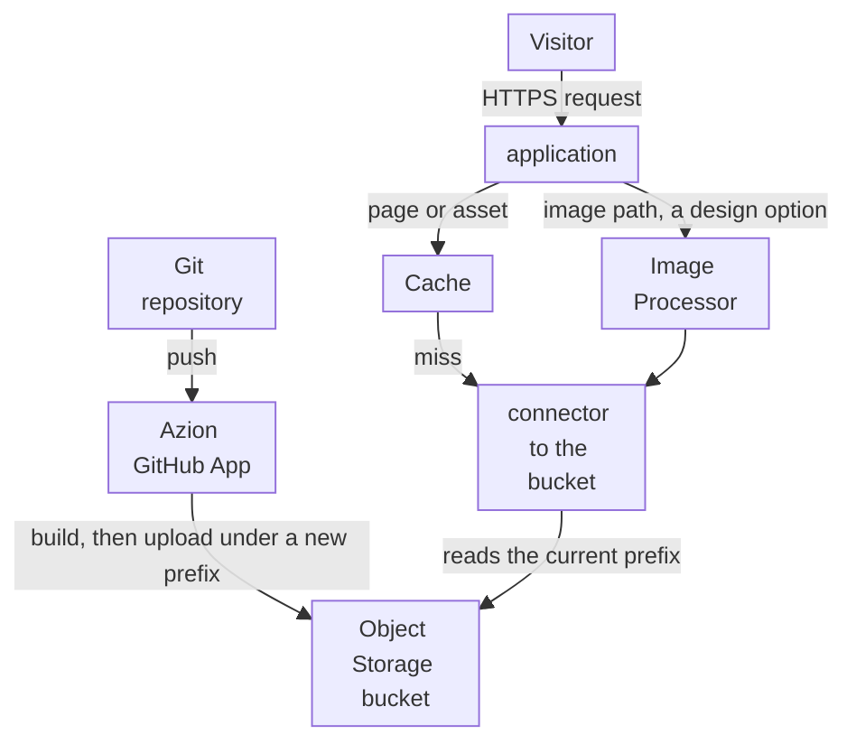

import FrameBox from '@aziontech/webkit/frame-box'
import ItemList from '@aziontech/webkit/item-list'
import DocItem from '@aziontech/webkit/doc-item'

This design serves teams that keep the pages and the content of a site in a Git repository. The Azion GitHub App builds the site on every push and deploys the output to Object Storage, an application serves it through Cache, and a previous build can be redeployed to roll back. The design implements the use case [Build and run marketing websites](/en/documentation/use-cases/build-and-run-applications/build-and-run-marketing-websites/).

## Architecture diagram

The diagram carries two flows that meet only at the bucket. The publish flow, at the top, runs from the repository through the Azion GitHub App and moves only when someone pushes. The request flow runs from the visitor through the application, where Cache answers from its copy and a miss reads a prebuilt file from the bucket. Nothing in the request flow builds or renders a page, so a visitor's request never waits on a build.

### Dataflow

1. A push to the connected repository starts a deploy, and the Azion GitHub App builds the site with the framework preset of the project.
2. The deploy uploads the build output to the project's Object Storage bucket under a new storage prefix, and points the connector at that prefix. The files of earlier deploys stay in the bucket under their own prefixes.
3. A visitor's request reaches the application, whose rules apply the cache setting of the project to the page or the asset.
4. Cache answers from its copy when it holds one. On a miss, the application reads the file from the bucket through the connector, and Cache stores it for its Max Age.
5. When Image Processor is on, an image request is resized or converted from the original in the bucket, and Cache keeps each variation.
6. To roll back, a push that reverts the change deploys the earlier content again. For a project deployed with the Azion CLI, the `rollback` command serves the files of an earlier deploy from the bucket.

## Components

- **Azion GitHub App**: the integration that connects the GitHub account to Azion. It deploys every push to a connected repository, so publishing a change is a push and nothing else.
- **Object Storage**: holds the build output. Each deploy writes its files under its own prefix, which is what keeps an earlier build available for a rollback.
- **application**: the Platform Resource that delivers the site. Its connector reads the bucket, and its rules apply the cache setting that the project's configuration declares.
- **Cache**: stores pages and assets, so repeated requests never reach the bucket. Its Max Age bounds how long a page stays stale after a deploy that no purge follows.
- **Image Processor**: a design option that resizes and converts images on request, so the repository keeps one original per image.

## Implementation

- [Build and run marketing websites](/en/documentation/use-cases/build-and-run-applications/build-and-run-marketing-websites/) - builds this design end to end, with the deploy on push, the cache values, the purge after each deploy, and the checks for each.
- [Import a project from GitHub](/en/documentation/guides/application-development/automation/import-an-existing-project-from-github/) - connects a repository and deploys it again on every push.
- [Build with Astro](/en/documentation/guides/application-development/frameworks/astro/) - creates and deploys an Astro site, which Azion runs as a static application.
- [Azion CLI rollback](/en/documentation/devtools/cli/rollback/) - serves the static files of an earlier deploy again, for a project deployed with the CLI.
- [Image Processor quickstart](/en/documentation/platform/applications/image-processor/quickstart/) - adds the image rule and the cache setting for processed images.

## Related resources

<FrameBox>
<ItemList>
  <DocItem title="How Azion CLI works" href="/en/documentation/devtools/cli/how-it-works/">The path from a project to a deployment, and why each deploy writes a new storage prefix.</DocItem>
  <DocItem title="Manage the Azion GitHub App" href="/en/documentation/guides/application-development/automation/azion-github-app/">What the app can read in your GitHub account, and how to suspend or remove it.</DocItem>
  <DocItem title="azion.config.js" href="/en/documentation/devtools/cli/azion-config-js/">The cache settings and rules a project declares, which each deploy applies.</DocItem>
  <DocItem title="Real-Time Purge" href="/en/documentation/platform/applications/cache/real-time-purge/">The purge types, and why a wildcard purge clears a whole site in one request.</DocItem>
</ItemList>
</FrameBox>
