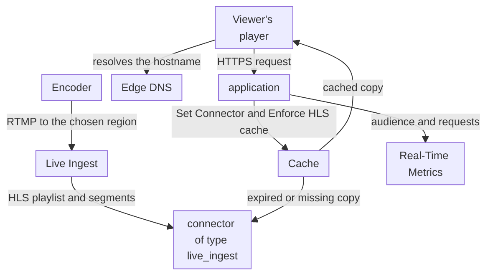

import FrameBox from '@aziontech/webkit/frame-box'
import ItemList from '@aziontech/webkit/item-list'
import DocItem from '@aziontech/webkit/doc-item'

This design serves teams that stream live events without a streaming origin of their own. The encoder pushes the stream over RTMP to Live Ingest in the region the team chooses, and Live Ingest produces the HLS output. An application delivers the stream to viewers under the live cache policy that Azion applies automatically, so one cached copy of each file answers every viewer. The design implements the use case [Stream live events to large audiences](/en/documentation/use-cases/deliver-media-and-streaming/stream-live-events-to-large-audiences/).

## Architecture diagram

Read the diagram as two flows that meet at the connector. The ingest flow starts at the encoder, not at an origin: ingestion and packaging happen on Azion, so no server of the team sits in the path. The request flow starts at the viewer's player and ends in Cache whenever a valid copy exists. Only an expired or missing copy travels through the connector to Live Ingest.

### Dataflow

1. The encoder pushes the stream over RTMP to Live Ingest, in the region of a connector of type `live_ingest`.
2. Live Ingest converts the stream to HLS: a playlist, `.m3u8`, and the segments it lists, `.ts`.
3. A viewer's player resolves the stream's hostname through Edge DNS and requests the playlist from the application.
4. A rule of the application names the connector with _Set Connector_, and Azion adds the _Enforce HLS cache_ behavior, which caches playlists for 5 seconds and segments for 60 seconds.
5. Cache answers every viewer from a valid copy, and an expired or missing copy is fetched through the connector.
6. Real-Time Metrics counts the connected users of the stream and the requests the application answered.

## Components

- **Live Ingest**: the Product that receives the encoder's RTMP stream in one region and converts it to HLS. The region is the attribute of a connector of type `live_ingest`, and it decides where the stream enters Azion, not where viewers connect.
- **application**: the Platform Resource that delivers the stream. Its rule with _Set Connector_ sends viewers' requests to the Live Ingest connector, and it is reached through the hostname of a workload.
- **Cache**: keeps the playlist and the segments under the live cache policy of _Enforce HLS cache_, which bypasses the application's own cache settings. The playlist changes as the stream advances, so its copy lives for seconds; a segment never changes, so its copy lives longer.
- **Edge DNS**: resolves the stream's hostname to the workload, including an apex domain through an `ANAME` record.
- **Real-Time Metrics**: carries the audience in the `connectedUsersMetrics` dataset and the share of requests answered from cache in the `httpMetrics` dataset.

## Implementation

- [Stream live events to large audiences](/en/documentation/use-cases/deliver-media-and-streaming/stream-live-events-to-large-audiences/) - builds this design end to end: the Live Ingest connector, the delivery rule, the encoder settings, and the checks for each.
- [Applications quickstart](/en/documentation/platform/applications/quickstart/) - creates the application and the workload that serve the stream.
- [Point a domain to a workload](/en/documentation/guides/platform/migration/point-domain-to-azion/) - creates the record that sends the stream's hostname to the workload, in Edge DNS or at another DNS provider.
- [Query Live Ingest connected users](/en/documentation/guides/platform/observability/query-connected-users-data-with-graphql/) - reads the audience of the stream from the GraphQL API.

## Related resources

<FrameBox>
<ItemList>
  <DocItem title="Ingestion and delivery" href="/en/documentation/platform/connectors/live-ingest/ingestion-and-delivery/">How Live Ingest takes the stream in a region, converts it to HLS, and how the application delivers it.</DocItem>
  <DocItem title="Enforce HLS cache" href="/en/documentation/platform/applications/rules-engine/#enforce-hls-cache">The behavior Azion adds to the rule, and the cache time of playlists and segments.</DocItem>
  <DocItem title="Connector settings" href="/en/documentation/platform/connectors/settings/#live-ingest">The region values of a connector of type live_ingest, and the errors a missing or unknown region returns.</DocItem>
  <DocItem title="Connectors best practices" href="/en/documentation/platform/connectors/best-practices/#live-ingest">Redundant endpoints, encoder settings, player fallback, and the load test before an event.</DocItem>
</ItemList>
</FrameBox>
