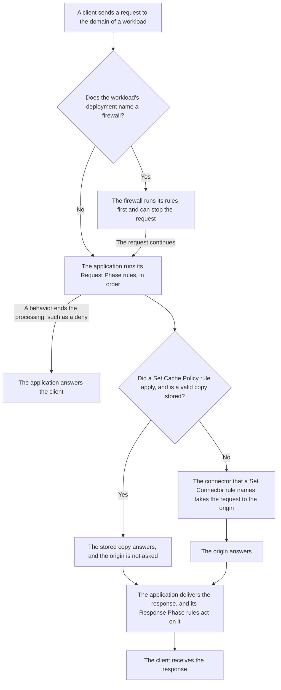
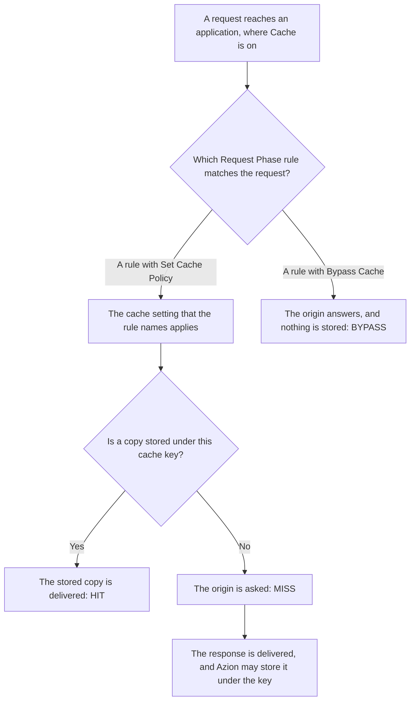
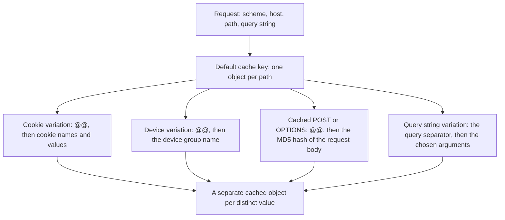
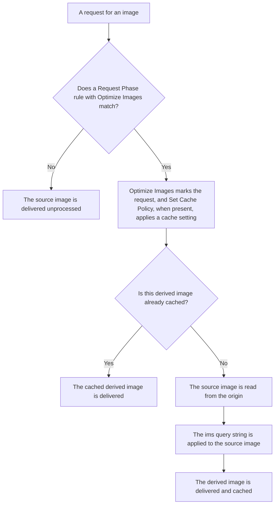

import FrameBox from '@aziontech/webkit/frame-box'
import ItemList from '@aziontech/webkit/item-list'
import DocItem from '@aziontech/webkit/doc-item'

A request for a page, a file, or an API route does not have to travel all the way to the server that holds the content. A layer in front of that server can read the request first and decide what happens to it. It can answer from a copy it stored earlier, add or remove a header, or choose which server receives the request. On the way back, the same layer can change the response before the client sees it.

On Azion, that layer is an [application](/en/documentation/platform/applications/), an instance of the Applications Platform Resource. A [workload](/en/documentation/platform/workloads/) receives the request on its domain, and the workload's deployment names the application that handles it. The application decides through its rules, written in [Rules Engine for Applications](/en/documentation/platform/applications/rules-engine/), in two phases. Request Phase rules act on the request, and Response Phase rules act on the response delivered to the user. A rule whose _Set Connector_ behavior names a [connector](/en/documentation/platform/connectors/) sends the request to the origin.

Three Products enabled on an application act along that path. Cache answers from a stored copy, and Application Accelerator puts more of the request into the key that finds it. Image Processor builds a resized or converted image from the one on the origin.

This page covers the mechanisms rather than the fields: every variable, operator, and behavior is on Rules Engine for Applications, and every bound is on [Applications limits](/en/documentation/platform/applications/limits/). The sections follow the path a request travels, the two phases, how rules run, what a new application has, and propagation. Cache, Application Accelerator, and Image Processor close the page, in that order. A WebSocket connection, which an application proxies to the origin, has a page of its own: [WebSocket Proxy](/en/documentation/platform/applications/websocket/).

---

## The path a request travels

An application handles no request until a workload names it. The binding lives on the workload's deployment, not on the application. In Azion Console it is the **Application** field of the workload's **Deployment Settings**, and `azion create workload-deployment` takes it as `--application-id`. The same deployment can name a [firewall](/en/documentation/platform/firewall/), and a request then crosses the firewall before it reaches the application. Domains, protocols, and certificates belong to the workload as well, so an application carries no delivery settings of its own.

The application record names no origin either. An application created through the API with only `name` and `active` returns its `modules`, `active`, and `debug` fields, and nothing that points to a server. A request reaches an origin because a rule sends it there: a Request Phase rule whose _Set Connector_ behavior names a connector. The connector holds the address of the origin. Azion Console states that origins have been redesigned as connectors.

This diagram follows one request, from the workload it reaches to the response the client receives:



1. A client sends a request to the domain of a workload. When the workload's deployment names a firewall, the firewall runs its rules first and can stop the request there.
2. The application that the deployment names runs its Request Phase rules, in order. A behavior that ends the processing, such as _Deny (403 Forbidden)_, answers the client, and nothing after it runs.
3. When a _Set Cache Policy_ rule applied a cache setting and a valid copy is stored, the copy answers, and the origin is not asked.
4. Otherwise, the connector that a _Set Connector_ rule names takes the request to the origin, and the origin answers.
5. The application delivers the response, its Response Phase rules act on it, and the client receives it.

Choosing the origin per request is what lets one application send `/api/` to one server and every other path to another, with two rules and two connectors. The price is that nothing reaches an origin by default. With no rule that names a connector, an application has no origin to send a request to, and a new application has no rules. For the first rule that sends an application's requests to an origin, refer to [Applications quickstart](/en/documentation/platform/applications/quickstart/).

---

## Request and response phases

Every rule of an application belongs to one of two phases, and the application runs them in a fixed sequence. Request Phase rules run when the request arrives, before the application has a response to work on. Response Phase rules run when the application delivers the response to the user, and each delivery is handled on its own. The phase is chosen in the **Phase** section when the rule is created, and it cannot be changed afterward. To run the same logic in the other phase, you create a new rule there.

What each phase can read follows from that sequence. A Request Phase rule reads what the request carries, such as its URI, its headers, and its cookies, but nothing about the response, which does not exist yet. A Response Phase rule can also read what came back, such as `${status}` and the headers the origin sent. Each phase offers its own set of behaviors as well: _Set Connector_, _Set Cache Policy_, _Bypass Cache_, and _Optimize Images_ run only in the Request Phase.

The cache is decided in the Request Phase. A _Set Cache Policy_ rule chooses the cache setting for the request, and a _Bypass Cache_ rule sends it past the cache. The response is unknown at that point, so a rule cannot choose a cache setting from the status code the origin returns: `${status}` is readable only in the Response Phase, and _Set Cache Policy_ runs only in the Request Phase.

Some behaviors work in both phases and change their target with the phase. _Add Request Header_ adds a header to the request sent to the origin, and the same behavior in a Response Phase rule adds it to the response sent to the user. _Redirect To_ in a Response Phase rule runs only when the origin returns `404`. For example, a Response Phase redirect can send a user to another page when the origin has nothing at the path, while a request for a path that exists passes untouched. _Run Function_ also works in both phases, and the function instance form in Azion Console states the limit for the second one: `Only Lua functions can be used in the Response phase.` For the variables and behaviors each phase accepts, refer to [Phases](/en/documentation/platform/applications/rules-engine/#phases).

---

## How rules run

Inside a phase, an application runs its rules in their order. Each rule compares its criteria with the request, and a rule whose criteria match runs its behaviors in the order they are arranged. A rule whose criteria do not match runs nothing, and the application moves to the next rule. The application continues until every rule of the phase has run or a behavior ends the processing. For the variables, operators, and conditionals that criteria combine, refer to [Rules Engine for Applications](/en/documentation/platform/applications/rules-engine/#criteria).

Each rule carries an `order`, which the platform assigns as rules are created, starting at `0` for the first rule of a phase. The **Rules Engine** list in Azion Console can be reordered, and the API reorders a phase with one call. Some behaviors cannot be added to the same rule together, or only under some conditions, and the Console refuses those combinations.

### Behaviors that repeat

Several matching rules can carry the same behavior, and the type of the behavior decides what happens. A behavior of the Set type, such as _Set Connector_, does not add up: only the one from the last rule whose criteria matched runs. For example, take a rule that names a connector for every path, followed by a rule that names another connector for `/api/`. A request to `/api/` matches both, and it goes through the connector of the second rule.

A behavior of the Add type adds up instead. _Add Cookie_ and _Add Request Header_ run once for every rule that carries them, so the same name and value added by two rules arrive as two identical entries.

Rule order therefore decides the outcome as much as the rules do. A broad rule early in the list sets a default, and a narrow rule later in the list overrides it for the requests it matches. The cost is that reordering the list can change which connector a path reaches, with no change to any rule.

### Behaviors that end the processing

Some behaviors finish the processing of the request, and no behavior or rule after them runs. _Deny (403 Forbidden)_ answers with a `403 Forbidden` page. _Deliver_ delivers the content to the user, and _Redirect To_ sends the user to another URL with `301` or `302`. _Finish Request Phase_ ends the Request Phase: the behaviors after it in its rule, and the rules after that rule, do not run.

A behavior that ends the processing is both a shortcut and a trap. Placed early, it settles the request before any later rule works on it. Placed before a rule you still need, it keeps that rule from running for every request the earlier rule matches. To see which rules ran on a request, turn on **Debug Rules** in **Main Settings**. For more information, refer to [Debug Rules](/en/documentation/platform/applications/main-settings/#debug-rules).

---

## What a new application has

A new application starts with two Products on and no rules. Created through the API with only `name` and `active`, an application returns these fields:

```json
{
  "modules": {
    "cache": { "enabled": true },
    "functions": { "enabled": true },
    "application_accelerator": { "enabled": false },
    "image_processor": { "enabled": false }
  },
  "active": true,
  "debug": false
}
```

The list of its request rules comes back empty, with `count` set to `0`. In Azion Console, the Products sit in the **Modules** section of **Main Settings**, whose **Default Modules** are **Application Accelerator**, **Cache**, **Functions**, and **Image Processor**. The **Cache** switch carries the note `Automatically enabled in all accounts.` Tiered Cache has no switch there, because it is a toggle inside each cache setting. For each switch and its API field, refer to [Main Settings](/en/documentation/platform/applications/main-settings/#products).

Cache being on does not mean that anything is cached. A cache setting reaches a request only when a rule applies it, and a new application has neither cache settings nor rules. Cache on a new application therefore stores nothing until you create a cache setting and a _Set Cache Policy_ rule that names it.

A Product that is off keeps its options out of reach. In the **Rules Engine** form, Azion Console marks an option that needs one with _- Required Application Accelerator_, _- Required Image Processor_, or _- Required Function_. The API refuses a rule that uses one. For example, a request rule whose criterion reads `${request_uri}`, on an application with Application Accelerator off, returns `400` with this body:

```json
{
  "errors": [
    {
      "code": "25047",
      "title": "Missing Required Modules",
      "detail": " It requires any of the following modules to be enabled: ['application_accelerator'].",
      "status": "400",
      "source": { "pointer": "/data/criteria/0/0/variable" },
      "meta": {
        "message_prefix": "",
        "owner_modules": "any",
        "missing_required_modules": ["application_accelerator"]
      }
    }
  ]
}
```

The same rule with `${uri}` in place of `${request_uri}` is accepted, because `${uri}` needs no Product. Gating keeps a rule from depending on a Product the application does not run. It costs a choice between two variables: `${uri}` holds the decoded URI without the query string, and `${request_uri}`, which keeps the query string, needs Application Accelerator. For the variables and behaviors each Product adds, refer to [Rules Engine for Applications](/en/documentation/platform/applications/rules-engine/#behaviors).

---

## Propagation

A change to an application does not reach traffic at once. It propagates across Azion's distributed infrastructure, and no duration is guaranteed. Applying a new rule to an application that already serves traffic can take a few minutes. A new workload answers with Azion's placeholder `404` until its binding to the application propagates, which can take several minutes.

During the rollout, the answers alternate. One request returns the placeholder `404`, and the next returns the application's response, depending on which data center answers. A single request after a change therefore proves little: a workload that answered once can return the placeholder on the next request. Send the request again until it answers as expected and the answers agree.

A firewall named by the same deployment can enter the path much later than the application. A domain that answers therefore does not mean the firewall is in the path yet. For more information, refer to [Firewall](/en/documentation/platform/firewall/).

---

## Cache

A cache keeps a copy of an origin response in the data center that fetched it. Later requests for the same object are answered from that copy, and the origin is not asked again. The copy is filed under a cache key built from the request, and it is kept for a time to live, the TTL. When the TTL ends, the copy expires, and the next request checks the origin.

On an application, Cache is the Product that keeps those copies, and it is on for every application you create. A cache setting, created with **+ Cache** on the **Cache Settings** tab, holds the TTLs and what makes two requests different. A Request Phase rule with _Set Cache Policy_ applies a cache setting to the requests it matches, and a rule with _Bypass Cache_ sends a request past the cache. Every field and its default are on [Cache settings](/en/documentation/platform/applications/cache/cache-settings/), and the full key format is on [Cache keys](/en/documentation/platform/applications/cache/cache-keys/). Cache variation by query string, cookie, device group, and method belongs to [Application Accelerator](/en/documentation/platform/applications/how-it-works/#application-accelerator). To create a first cache setting and the rule that applies it, refer to [Cache quickstart](/en/documentation/platform/applications/cache/quickstart/).

### The cache path

A request reaches a cached copy through a chain of objects. This diagram shows the chain, from the request to the stored copy or to the origin:



1. A Request Phase rule matches the request and applies a cache setting through _Set Cache Policy_.
2. Azion builds the cache key from the request and from every variation the setting names.
3. When a copy is stored under that key, the data center that received the request answers from it, and the response reports `HIT`.
4. Otherwise the request goes to the origin, the response reports `MISS`, and Azion may store the response for later requests.
5. The copy answers until its TTL ends, a purge removes it, or a rule sends the request past the cache.

A rule with _Bypass Cache_ sends its requests to the origin instead, nothing is stored, and the response reports `BYPASS`. The status comes back in the `x-cache` header of a response to a request sent with `Pragma: azion-debug-cache`. For every status and the debug headers, refer to [Cache keys](/en/documentation/platform/applications/cache/cache-keys/#cache-status).

On a miss, the platform limits what the origin has to do. When several requests for the same uncached object arrive at the same time, Azion opens one connection to the origin for all of them. Where possible, Azion also keeps its connections to the origin open between fetches, instead of opening a new one each time. Under a burst of requests for an uncached object, the origin therefore sees one fetch per data center, not one per visitor.

For TTL and expiration, stale cache, Large File Optimization, cache keys and variations, Tiered Cache, and purge, refer to [Expiration and freshness](/en/documentation/platform/applications/cache/expiration-and-freshness/).

---

## Application Accelerator

A cache finds a stored copy through a key built from the request, and a key built from the URL alone assumes that one URL has one correct response. Dynamic content breaks that assumption. Under a single URL, a signed-in visitor sees their own cart, a listing reorders on a filter, and a layout changes on a phone. A cache that keys by URL alone then serves one visitor's response to another, or the path stops being cached at all.

On an application, Application Accelerator is the Product that removes the assumption. One switch, **Application Accelerator** in **Main Settings** › **Modules**, turns it on for that application alone, and the switch is off on a new application. The variations it allows sit in the **Application Accelerator** section of a cache setting, which is the `modules.application_accelerator` object of the setting in the API. If you have written a `Vary` header or a cache-key rule before, the model transfers: you name the inputs that make two requests different. Field names, types, and defaults are on [Application Accelerator settings](/en/documentation/platform/applications/application-accelerator/settings/), and the TTL bounds are on [Applications limits](/en/documentation/platform/applications/limits/#application-accelerator). To turn the switch on and vary a first cache setting, refer to [Application Accelerator quickstart](/en/documentation/platform/applications/application-accelerator/quickstart/).

### How a variation changes the cache key

A cache key is the index entry for a cached object. By default, Azion builds it from the scheme, the host, and the path of the request, so each path is one object in cache. While the query-string control stays at its default, `ignore`, a query string does not split that object. Each variation a cache setting turns on adds one input to the key, and each kind appends its own marker:

- A cookie variation appends the `@@` separator, then the names and values of the cookies, each followed by `;`.
- A device variation appends `@@` and the name of the device group.
- A cached `POST` or `OPTIONS` response appends `@@` and the MD5 hash of the request body.
- A query-string variation appends the query separator and the chosen arguments, in the order the request submitted them. The arguments are already part of the URL, so this variation needs no `@@`.

A request that uses any method other than `GET` or `HEAD` is a complex request, and its key carries the method as a prefix. This diagram shows what the default key is built from and what each variation adds to it:



A cookie variation on a `user` cookie produces a key shaped like `httpwww.example.com/@@user=user;`. A cached `POST` produces one shaped like `httpsdynamic.example.com/path@@md5_of_post_arguments`. Two requests share a cached object when they produce the same key, and they get separate objects when they do not. For the full format and every input a key carries, refer to [Cache keys](/en/documentation/platform/applications/cache/cache-keys/#key-format).

For what the switch unlocks, the cost of a variation, purges, and how _Bypass Cache_ differs from a TTL of 0, refer to [Cache variation](/en/documentation/platform/applications/application-accelerator/cache-variation/).

---

## Image Processor

An image on a page often has to arrive in several sizes, crops, and formats, one for each layout and browser. Building every variant ahead of time means storing one file per variant and rebuilding them all when the original changes. A transformation applied when a request asks for it works from one original instead: the URL describes the variant, and the platform builds it on demand.

On an application, Image Processor is the Product that builds those variants. The URL carries the description in the `ims` query string. Image Processor applies it to the source image on the origin and returns the result, the derived image. The source is never modified, and the derived image is never stored as an asset of its own. One file therefore answers every size, crop, quality, and format a page asks for.

The switch, **Image Processor** in **Main Settings** › **Modules**, is off on a new application. The operations `ims` accepts are on [Image Processor URL parameters](/en/documentation/platform/applications/image-processor/url-parameters/), and the headers and behaviors are on [Image Processor settings](/en/documentation/platform/applications/image-processor/settings/). To request a first derived image, refer to [Image Processor quickstart](/en/documentation/platform/applications/image-processor/quickstart/).

### From source image to derived image

A transformation does not happen because an `ims` query string is present. It happens because a Request Phase rule ran and applied the [Optimize Images](/en/documentation/platform/applications/rules-engine/#optimize-images) behavior to the request. Turning Image Processor on makes that behavior available, and it processes nothing on its own.

This diagram shows the chain from a request for an image to the derived image:



1. A request arrives for a path that holds an image.
2. The application runs its Request Phase rules. A rule for images matches on `${uri}`, or on `${request_uri}` with Application Accelerator on, against an argument such as `\.(jpg|jpeg|gif|bmp|png|ico|webp|avif)`.
3. A matching rule applies its behaviors. _Optimize Images_ marks the request for Image Processor, and _Set Cache Policy_, when the rule carries it, chooses the cache setting that holds the derived image. _Optimize Images_ takes no argument, and a rule can carry it alone.
4. When the derived image is already cached, the cache delivers it, and no processing happens.
5. Otherwise, the source image is read from the origin, the `ims` query string is applied to it, and the result is delivered and stored.

Two consequences follow from step 2, and both surprise readers who expect the query string alone to do the work. A request that no rule matches is delivered unprocessed, `ims` and all. A rule that matches a path holding no image still runs, so the criteria decide which requests reach Image Processor. For the rule that sends image requests to Image Processor, refer to [Configure Image Processor on an application](/en/documentation/guides/application-performance/delivery-optimization/process-images/).

For how the delivered format is chosen, how the cache tells derived images apart, and where Image Processor stops, refer to [Image delivery](/en/documentation/platform/applications/image-processor/image-delivery/).

---

## Related resources

<FrameBox>
<ItemList>
  <DocItem title="Rules Engine for Applications" href="/en/documentation/platform/applications/rules-engine/">Every variable, operator, and behavior a rule combines, by phase, with the Product each one requires.</DocItem>
  <DocItem title="Main Settings" href="/en/documentation/platform/applications/main-settings/">The switch of each Product, Debug Rules, and the API fields behind the defaults of a new application.</DocItem>
  <DocItem title="Applications quickstart" href="/en/documentation/platform/applications/quickstart/">The shortest path from a new application to a rule that sends its requests to an origin.</DocItem>
  <DocItem title="Applications best practices" href="/en/documentation/platform/applications/best-practices/">The recommendations that follow from these mechanisms, for the application and for each Product enabled on it.</DocItem>
</ItemList>
</FrameBox>
