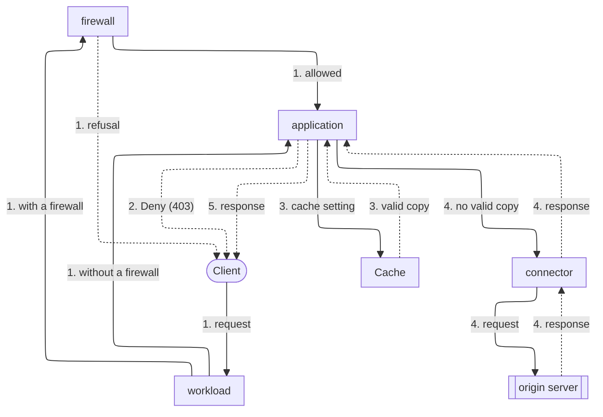
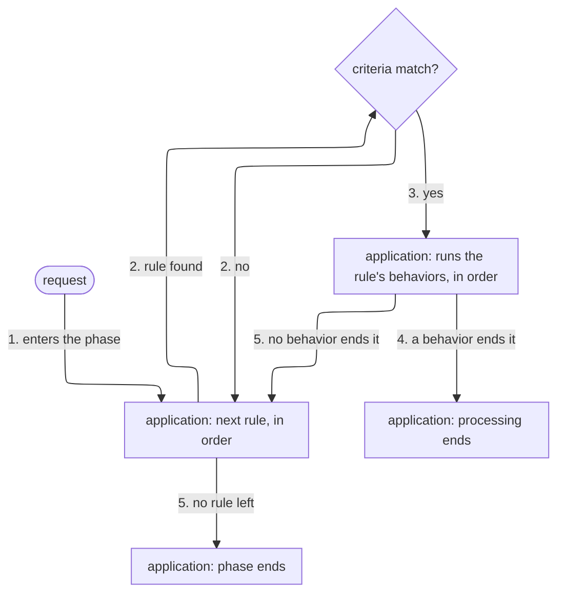

import FrameBox from '@aziontech/webkit/frame-box'
import ItemList from '@aziontech/webkit/item-list'
import DocItem from '@aziontech/webkit/doc-item'

Between a client and the server that holds your content, a layer can read each request before that server does, whether the request asks for a page, a file, or an API route. The layer then decides what happens to the request. It can answer with a copy of a response that the server sent earlier, add or remove a header, or choose the server that receives the request. When the response comes back, the same layer can change it before the client receives it.

On Azion, that layer is an application, the object you create in [Applications](/en/documentation/platform/applications/). Applications is a Platform Resource that runs each application on Azion's distributed infrastructure, from the data center nearest to your user. A [workload](/en/documentation/platform/workloads/) receives the request on one of its domains, and the workload's deployment sets the application that handles the request.

The application acts on the request through its rules, which you write in [Rules Engine for Applications](/en/documentation/platform/applications/rules-engine/). Each rule belongs to one of two phases: Request Phase rules act on the request, and Response Phase rules act on the response that the user receives. To reach the origin, a Request Phase rule uses the _Set Connector_ behavior, which sets the [connector](/en/documentation/platform/connectors/) that routes the request there.

Three Products of Applications act along the path from the workload to the origin, each with its own switch in the application. [Cache](/en/documentation/platform/applications/cache/) answers with a stored copy of an origin response. [Application Accelerator](/en/documentation/platform/applications/application-accelerator/) adds more of the request, such as a cookie or a query-string argument, to the cache key, the index under which Cache files each copy. [Image Processor](/en/documentation/platform/applications/image-processor/) builds a resized or converted image from an image on the origin.

This page explains the mechanisms, and two other pages hold the fields: Rules Engine for Applications lists every variable, operator, and behavior, and [Applications limits](/en/documentation/platform/applications/limits/) lists every bound. The sections follow a request along its path, then cover the two phases, how rules run, what a new application has, and propagation. After them, one section each covers Cache, Application Accelerator, and Image Processor. [WebSocket Proxy](/en/documentation/platform/applications/websocket/) covers, on its own page, the WebSocket connections that an application proxies to the origin.

---

## The path a request travels

Creating an application does not put it in the path of any request: a request reaches the application only after a workload's deployment sets it. The relation is stored on the deployment, not on the application, and in Azion Console you set it in the **Application** field of the workload's **Deployment Settings**. The deployment can also set a [firewall](/en/documentation/platform/firewall/), and the request then crosses the firewall before the application receives it. The domains, protocols, and certificates are on the workload too, so an application has no delivery settings of its own.

The application does not store an origin either. The API shows this: an application created with only `name` and `active` comes back with `modules`, `active`, and `debug`, and with no field that points to a server. A request reaches an origin only when a Request Phase rule sends it there with the _Set Connector_ behavior. That behavior sets a connector, and the connector holds the address of the origin. Connectors replace the origins that earlier versions of Applications configured on the application.

The diagram follows one request from the client to the response it receives. Solid arrows carry the request, and dotted arrows carry the response. Each label starts with the number of its step below.


```mermaid
%%{init: {"layout": "elk", "elk": {"cycleBreakingStrategy": "MODEL_ORDER"}, "themeVariables": {"fontSize": "13px"}, "flowchart": {"nodeSpacing": 24, "rankSpacing": 36, "padding": 8, "wrappingWidth": 150, "useMaxWidth": true}, "sequence": {"width": 120, "actorMargin": 30, "useMaxWidth": true}}}%%
flowchart TD
  Client(["Client"])
  WL["workload"]
  FW["firewall"]
  App["application"]
  Cache["Cache"]
  Conn["connector"]
  Origin[["origin server"]]
  Client -->|"1. request"| WL
  WL -->|"1. with a firewall"| FW
  WL -->|"1. without a firewall"| App
  FW -->|"1. allowed"| App
  FW -.->|"1. refusal"| Client
  App -.->|"2. Deny (403)"| Client
  App -->|"3. cache setting"| Cache
  Cache -.->|"3. valid copy"| App
  App -->|"4. no valid copy"| Conn
  Conn -->|"4. request"| Origin
  Origin -.->|"4. response"| Conn
  Conn -.->|"4. response"| App
  App -.->|"5. response"| Client
```

1. The client sends the request to one of the workload's domains. When the workload's deployment also sets a firewall, the firewall runs its rules first and can refuse the request.
2. The application that the deployment sets runs its Request Phase rules, in order. When a behavior ends the processing, as _Deny (403 Forbidden)_ does, the application answers the client, and no later behavior or rule runs.
3. When a _Set Cache Policy_ rule applied a cache setting, Cache looks for a valid copy of the origin response. If it finds one, that copy becomes the response, and the origin receives no request.
4. Otherwise, the connector set by a _Set Connector_ rule routes the request to the origin, and the origin's response returns through that connector.
5. The application runs its Response Phase rules on the response, and the client receives the result.

Because a rule chooses the origin of each request, one application can route `/api/` to one server and every other path to another, with two rules and two connectors. The cost is that no request reaches an origin by default: a new application has no rules, so no connector is set for its requests. To create the first rule that routes an application's requests to an origin, refer to [Applications quickstart](/en/documentation/platform/applications/quickstart/).

---

## Request and response phases

Each rule of an application belongs to one phase, and the two phases run in a fixed order: the Request Phase before a response exists, then the Response Phase on the response that the application delivers. You choose the phase in the **Phase** section when you create the rule, and you cannot change it later. To run the same logic in the other phase, add a second rule in that phase.

Solid arrows carry the request, and dotted arrows carry the response. Each label starts with the number of its step below.


```mermaid
%%{init: {"layout": "elk", "elk": {"cycleBreakingStrategy": "MODEL_ORDER"}, "themeVariables": {"fontSize": "13px"}, "flowchart": {"nodeSpacing": 24, "rankSpacing": 36, "padding": 8, "wrappingWidth": 150, "useMaxWidth": true}, "sequence": {"width": 120, "actorMargin": 30, "useMaxWidth": true}}}%%
flowchart TD
  Client(["Client"])
  ReqRules["application: Request Phase rules"]
  RespRules["application: Response Phase rules"]
  Cache["Cache"]
  Conn["connector"]
  Origin[["origin server"]]
  Client -->|"1. request"| ReqRules
  ReqRules -->|"2. Set Cache Policy"| Cache
  ReqRules -->|"2. Set Connector, Bypass Cache"| Conn
  Conn -->|"2. request"| Origin
  Cache -.->|"3. stored copy"| RespRules
  Origin -.->|"3. response"| Conn
  Conn -.->|"3. response"| RespRules
  RespRules -.->|"4. response"| Client
```

1. The request arrives, and the Request Phase rules run on it first. They can read what the request carries, such as its URI, its headers, and its cookies, but nothing about the response, which does not exist yet.
2. These rules decide the cache and the origin. _Set Cache Policy_ applies a cache setting, _Bypass Cache_ sends the request past the cache, and _Set Connector_ sets the connector that routes the request to the origin. These three behaviors and _Optimize Images_ run only in the Request Phase. In this phase, _Add Request Header_ adds a header to the request that the origin receives.
3. The response comes back: either a copy of an origin response that Cache stored, or the origin's response through the connector.
4. The Response Phase rules run on that response, once for each delivery to the user. They can also read what came back, such as `${status}` and the headers the origin sent. In this phase, _Add Response Header_ adds a header to the response that the user receives.

The cache is therefore decided before the response exists. No rule can apply a cache setting based on the status code that the origin returns, because `${status}` is readable only in the Response Phase, and _Set Cache Policy_ runs only in the Request Phase.

Some behaviors work in both phases, and the phase limits what they do. In a Response Phase rule, _Redirect To_ runs only when the origin returns `404`. A redirect in that phase can therefore send the user to another page when the origin has nothing at the path, and leave the requests for existing paths untouched. _Run Function_ also works in both phases, but the Response Phase accepts only Lua functions. The function instance form in Azion Console states this limit: `Only Lua functions can be used in the Response phase.` [Phases](/en/documentation/platform/applications/rules-engine/#phases) lists the variables and behaviors that each phase accepts.

---

## How rules run

Within one phase, the application takes its rules one at a time, in their order. It stops when every rule of the phase has run or when a behavior ends the processing.

Solid arrows follow one request through the rules of one phase. Each label starts with the number of its step below.


```mermaid
%%{init: {"layout": "elk", "elk": {"cycleBreakingStrategy": "MODEL_ORDER"}, "themeVariables": {"fontSize": "13px"}, "flowchart": {"nodeSpacing": 24, "rankSpacing": 36, "padding": 8, "wrappingWidth": 150, "useMaxWidth": true}, "sequence": {"width": 120, "actorMargin": 30, "useMaxWidth": true}}}%%
flowchart TD
  Req(["request"])
  Next["application: next rule, in order"]
  Match{"criteria match?"}
  Run["application: runs the rule's behaviors, in order"]
  Stop["application: processing ends"]
  Done["application: phase ends"]
  Req -->|"1. enters the phase"| Next
  Next -->|"2. rule found"| Match
  Match -->|"2. no"| Next
  Match -->|"3. yes"| Run
  Run -->|"4. a behavior ends it"| Stop
  Run -->|"5. no behavior ends it"| Next
  Next -->|"5. no rule left"| Done
```

1. The request enters a phase, and the application takes the first rule of that phase.
2. The application compares the criteria of the rule with the request. If they do not match, the rule runs nothing, and the application moves to the next rule.
3. If they match, the rule runs its behaviors one after another, in the order you arranged them.
4. When one of those behaviors ends the processing, nothing after it runs in the phase.
5. Otherwise, the application moves to the next rule, until no rule of the phase is left.

[Rules Engine for Applications](/en/documentation/platform/applications/rules-engine/#criteria) lists the variables, operators, and conditionals that criteria combine.

The position of a rule is its `order`. The platform assigns it when you create the rule, starting at `0` for the first rule of each phase. You can reorder the **Rules Engine** list in Azion Console, or reorder one phase with a single API call. Some behaviors cannot share a rule, or can share one only under some conditions, and the Console refuses those combinations.

### Behaviors that repeat

When several rules match a request and carry the same behavior, the type of the behavior decides the result. A Set behavior, such as _Set Connector_, does not accumulate: only the one in the last matching rule runs. For example, a first rule sets a connector for every path, and a second rule sets another connector for `/api/`. A request to `/api/` matches both rules, so the connector of the second rule routes it.

An Add behavior accumulates instead. _Add Request Cookie_ and _Add Request Header_ run once in each matching rule that carries them, so two rules that add the same name and value produce two identical entries.

The order of the rules thus shapes the result as much as their content does. A broad rule near the top sets a default, and a narrower rule further down overrides that default for the requests it matches. The same mechanism has a cost: moving a rule in the list can change the connector that a path reaches, even though no rule changed.

### Behaviors that end the processing

Some behaviors stop the processing of a request, and nothing after them runs: no later behavior in their rule, and no later rule. _Deny (403 Forbidden)_ answers with a `403 Forbidden` page, _Deliver_ delivers the content to the user, and _Redirect To_ sends the user to another URL with a `301` or `302` status. _Finish Request Phase_ ends the Request Phase at the point where it runs, so the rest of its rule and every later rule of that phase are skipped.

An ending behavior saves work, and it can also hide a rule. Early in the list, it settles the request before later rules spend time on it. Placed before a rule that you still need, it stops that rule for every request that the earlier rule matches. To see which rules ran on a request, turn on **Debug Rules** in **Main Settings**, as [Debug Rules](/en/documentation/platform/applications/main-settings/#debug-rules) explains.

---

## What a new application has

A new application has two switches on, Cache and Functions, and no rules. When you create an application through the API with only `name` and `active`, the response carries these fields:

```json
{
  "modules": {
    "cache": { "enabled": true },
    "functions": { "enabled": true },
    "application_accelerator": { "enabled": false },
    "image_processor": { "enabled": false }
  },
  "active": true,
  "debug": false
}
```

Its list of request rules is empty, with `count` at `0`. In Azion Console, the **Modules** section of **Main Settings** holds the switches, and its **Default Modules** are **Application Accelerator**, **Cache**, **Functions**, and **Image Processor**. The note under **Cache** reads `Automatically enabled in all accounts.` [Tiered Cache](/en/documentation/platform/applications/cache/tiered-cache/) has no switch in that section, because it is a Feature of Cache that you turn on inside each cache setting. [Main Settings](/en/documentation/platform/applications/main-settings/#products) maps each switch to its API field.

Cache is on, but it stores nothing yet. A cache setting acts on a request only when a rule applies it, and a new application has no cache settings and no rules. Cache starts storing copies once you create a cache setting and a _Set Cache Policy_ rule that applies it.

While a switch is off, the rule options that depend on it are unavailable. The **Rules Engine** form in Azion Console labels each of those options with _- Required Application Accelerator_, _- Required Image Processor_, or _- Required Function_, and the API refuses a rule that uses one. For example, on an application with Application Accelerator off, a request rule with a criterion on `${request_uri}` returns `400` with this body:

```json
{
  "errors": [
    {
      "code": "25047",
      "title": "Missing Required Modules",
      "detail": " It requires any of the following modules to be enabled: ['application_accelerator'].",
      "status": "400",
      "source": { "pointer": "/data/criteria/0/0/variable" },
      "meta": {
        "message_prefix": "",
        "owner_modules": "any",
        "missing_required_modules": ["application_accelerator"]
      }
    }
  ]
}
```

The API accepts the same rule with `${uri}` instead of `${request_uri}`, because `${uri}` depends on no Product. This check keeps a rule from relying on a Product that the application does not run. The trade-off is a choice between two variables: `${uri}` holds the decoded URI without the query string, while `${request_uri}` keeps the query string and needs Application Accelerator. [Rules Engine for Applications](/en/documentation/platform/applications/rules-engine/#behaviors) lists the variables and behaviors that each Product adds.

---

## Propagation

A change to an application reaches traffic only after it propagates across Azion's distributed infrastructure, and Azion guarantees no propagation time. A new rule on an application that already serves traffic can take a few minutes to apply. The deployment of a new workload can take several minutes to propagate, and until it does, the workload answers with Azion's placeholder `404`.

While a change propagates, the answers alternate, because each request can reach a different data center. One request returns the placeholder `404`, and the next returns the application's response. One correct answer after a change does not prove that the change is live, since the next request can still return the placeholder. Repeat the request until every answer is the one you expect.

A firewall that the same deployment sets can join the path much later than the application. A domain that already answers can therefore still serve requests that skip the firewall. To see how a firewall acts on requests, refer to [Firewall](/en/documentation/platform/firewall/).

---

## Cache

A cache stores a copy of an origin response in the data center that fetched it. Later requests for the same object get that copy, and the origin receives no request for them. Each copy is filed under a cache key, built from the request, and kept for its time to live (TTL). When the TTL ends, the copy expires, and the next request for that object checks with the origin.

In an application, Cache stores those copies, and it is on in every application you create. You create a cache setting with **+ Cache** on the application's **Cache Settings** tab, and it holds the TTLs and the inputs that make two requests different. A cache setting acts only through a Request Phase rule, which applies it with _Set Cache Policy_ to the requests that the rule matches. _Bypass Cache_ does the opposite and sends the request past the cache. [Cache settings](/en/documentation/platform/applications/cache/cache-settings/) lists every field and its default, and [Cache keys](/en/documentation/platform/applications/cache/cache-keys/) gives the full key format. To vary the cache by query string, cookie, device group, or method, you need [Application Accelerator](/en/documentation/platform/applications/application-accelerator/). [Cache quickstart](/en/documentation/platform/applications/cache/quickstart/) creates a first cache setting and the rule that applies it.

The [Cache overview](/en/documentation/platform/applications/cache/#request-path) shows where Cache acts on a request, and [Expiration and freshness](/en/documentation/platform/applications/cache/expiration-and-freshness/) explains how long a copy lives and what ends it.

---

## Application Accelerator

A cache key built from the URL alone assumes that each URL has one correct response. Dynamic content breaks that assumption: under a single URL, a signed-in visitor sees their own cart, a listing reorders when a filter changes, and the layout differs on a phone. With a key built from the URL alone, the cache either serves one visitor's response to another, or it cannot cache the path at all.

In an application, Application Accelerator removes that assumption. Its switch, **Application Accelerator** in **Main Settings** › **Modules**, turns it on for that application alone, and the switch is off in a new application. You configure the variations in the **Application Accelerator** section of a cache setting, which the API exposes as the `modules.application_accelerator` object of the setting. If you have written a `Vary` header or a cache-key rule, the model is the same: you list the inputs that make two requests different. [Application Accelerator settings](/en/documentation/platform/applications/application-accelerator/settings/) lists each field, its type, and its default, and [Applications limits](/en/documentation/platform/applications/limits/#application-accelerator) gives the TTL bounds. To turn the switch on and add a first variation to a cache setting, refer to [Application Accelerator quickstart](/en/documentation/platform/applications/application-accelerator/quickstart/).

The [Application Accelerator overview](/en/documentation/platform/applications/application-accelerator/#request-path) shows how a variation changes the cache key, and [Cache variation](/en/documentation/platform/applications/application-accelerator/cache-variation/) explains what the switch unlocks and what each variation costs.

---

## Image Processor

A page often needs the same image in several sizes, crops, and formats, one for each layout and browser. Preparing every variant in advance means one stored file per variant, and a rebuild of all of them whenever the original changes. Transforming the image at request time avoids both: the URL describes the variant, and the platform builds it from one original when a request asks for it.

In an application, Image Processor builds those variants. The request URL describes the variant in its `ims` query string, and Image Processor applies that description to the source image on the origin. The result, the derived image, is what the client receives. Image Processor never modifies the source and never saves the derived image as an asset of its own, so one file serves every size, crop, quality, and format that a page requests.

Its switch, **Image Processor** in **Main Settings** › **Modules**, is off in a new application. Even with the switch on, Image Processor acts only on the requests that a Request Phase rule with _Optimize Images_ matches. [Image Processor URL parameters](/en/documentation/platform/applications/image-processor/url-parameters/) lists the operations that `ims` accepts, and [Image Processor settings](/en/documentation/platform/applications/image-processor/settings/) covers the headers and behaviors. To request a first derived image, follow [Image Processor quickstart](/en/documentation/platform/applications/image-processor/quickstart/).

The [Image Processor overview](/en/documentation/platform/applications/image-processor/#request-path) shows where Image Processor acts on a request, and [Image delivery](/en/documentation/platform/applications/image-processor/image-delivery/) explains how the delivered format is chosen and where Image Processor stops.

---

## Related resources

<FrameBox>
<ItemList>
  <DocItem title="Rules Engine for Applications" href="/en/documentation/platform/applications/rules-engine/">The variables, operators, and behaviors of each phase, with the Product that each one needs.</DocItem>
  <DocItem title="Main Settings" href="/en/documentation/platform/applications/main-settings/">Each switch, Debug Rules, and the API fields behind the defaults of a new application.</DocItem>
  <DocItem title="Applications quickstart" href="/en/documentation/platform/applications/quickstart/">Create the first rule that routes the requests of a new application to your origin.</DocItem>
  <DocItem title="Applications best practices" href="/en/documentation/platform/applications/best-practices/">Recommendations that follow from these mechanisms, for the application and for each Product on it.</DocItem>
</ItemList>
</FrameBox>
