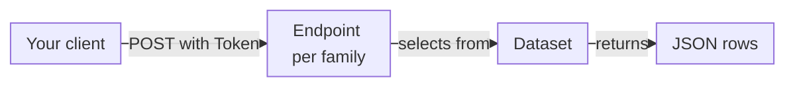

import FrameBox from '@aziontech/webkit/frame-box'
import ItemList from '@aziontech/webkit/item-list'
import DocItem from '@aziontech/webkit/doc-item'

A GraphQL API answers a query that names the data to read and the fields to return. The response is a JSON object that holds those fields and nothing else, so a client never downloads columns it does not use. To get different data, you change the fields or the filter in the query, and the request goes to the same endpoint.

The GraphQL API reads the metrics, events, billing, accounting, and consumption data of your Azion account. It answers queries only: it has no mutations, and no query changes your account. Any client that sends an HTTP `POST` with a JSON body can call it, whatever its programming language or framework.

The sections cover the five APIs and their endpoints, datasets, raw and aggregated data, time windows, time resolution, resampling, retention, and where to run queries.

---

## Five APIs, one per data family

The GraphQL API is five APIs, each with its own endpoint and its own schema. Each one serves one family of data:

| API | Endpoint | Data |
| --- | --- | --- |
| Metrics | `https://api.azion.com/v4/metrics/graphql` | Aggregated request data from [Real-Time Metrics](/en/documentation/platform/real-time-metrics/), grouped into time buckets |
| Events | `https://api.azion.com/v4/events/graphql` | Raw records from [Real-Time Events](/en/documentation/platform/real-time-events/), one per request or event |
| Billing | `https://api.azion.com/v4/billing/graphql` | [Bills](/en/documentation/fundamentals/billing-and-subscriptions/), financial entries, and payments |
| Accounting | `https://api.azion.com/v4/accounting/graphql` | The products and metrics accounted to the account |
| Consumption | `https://api.azion.com/v4/consumption/graphql` | Product usage, as accounted data |

This diagram follows one query from your client to the rows it returns:



1. Your client sends the query in a `POST` request to the endpoint of the data family it reads, with the header `Authorization: Token [TOKEN VALUE]`.
2. The endpoint checks the token. A `Bearer` token is refused like a missing header, with `401` and `Authentication credentials were not provided.`
3. The query names one dataset of that endpoint, the arguments that filter, group, and sort it, and the fields to return.
4. The endpoint answers with a JSON object whose `data` key holds one array per dataset, one object per row.

A query must go to the endpoint that serves its dataset. For example, a query on `workloadEvents` sent to the metrics endpoint returns `400`, because `workloadEvents` is an events dataset. For the token and a first request, refer to [GraphQL API quickstart](/en/documentation/devtools/graphql/first-steps/).

---

## Datasets

A dataset is a table that a GraphQL API query selects from. Each endpoint serves its own datasets, and a query names one of them, such as `workloadMetrics` or `workloadEvents`. Every dataset takes the same arguments: `filter`, `aggregate`, `groupBy`, `orderBy`, `offset`, and `limit`.

The metrics endpoint serves 17 current datasets, all of aggregated data, such as `workloadMetrics` for requests to your workloads and `dnsQueriesMetrics` for DNS queries. The events endpoint serves 19 current datasets of raw records, such as `workloadEvents` and `activityHistoryEvents`. The billing endpoint serves `balanceFinancialEntry`, `paymentsClientDebt`, and `billDetail`; the accounting endpoint, `accountingDetail`; and the consumption endpoint, `workloadConsumptionMetrics`.

The schema keeps some former dataset names as deprecated aliases that return the same rows as their replacements. `httpMetrics` is deprecated; use `workloadMetrics`. `httpBreakdownMetrics` is deprecated; use `workloadBreakdownMetrics`. `httpEvents` is deprecated; use `workloadEvents`. `edgeFunctionsMetrics` is deprecated; use `functionsMetrics`. `edgeDnsQueriesMetrics` and `edgeDnsQueriesEvents` are deprecated; use `dnsQueriesMetrics` and `dnsQueriesEvents`.

For every dataset and the arguments it accepts, refer to [Datasets and query arguments](/en/documentation/devtools/graphql/features/). The fields of each dataset are on [Real-Time Metrics fields](/en/documentation/devtools/graphql/gql-real-time-metrics-fields/), [Real-Time Events fields](/en/documentation/devtools/graphql/gql-real-time-events-fields/), [Billing fields](/en/documentation/devtools/graphql/gql-billing-fields/), [Accounting fields](/en/documentation/devtools/graphql/gql-accounting-fields/), and [Consumption fields](/en/documentation/devtools/graphql/gql-consumption-fields/).

---

## Raw and aggregated data

The GraphQL API returns request data in two models. Raw data comes from the Events datasets: each record is one request or event as Azion logged it, with no further processing. Aggregated data comes from the Metrics datasets: the records are already clustered into time buckets of a minute, an hour, or a day.

The two models suit different questions. Raw data answers deep-dive investigations into individual requests, such as the top IP addresses, URIs, or user agents, requests blocked by IP address or country, and the top IP addresses per request method. Aggregated data answers totals and trends, such as the requests per HTTP method, the hosts or domains with the most or the fewest requests, where threat requests come from, bot traffic included when the account uses Bot Manager, and the users connected to your live streams. To rank client IP addresses with aggregated data, use `workloadBreakdownMetrics`, which carries `remoteAddress`; `workloadMetrics` has no client IP address field.

The tradeoff is detail against reach. A raw record carries every field of one request, but Events datasets such as `workloadEvents` keep records for about seven days. An aggregated row carries a count or a total for a bucket, so it loses the individual request, but it covers windows of many days at once.

A Metrics query does not need `groupBy`. This query selects the time, country, and region of the rows in a seven-day window, with no `groupBy`:

```graphql
query {
  workloadMetrics(
    limit: 5
    filter: { tsRange: {begin: "2026-09-26T14:00:00", end: "2026-10-03T14:00:00"} }
  ) {
    ts
    geolocCountryName
    geolocRegionName
  }
}
```

The response holds five rows, cut here after the third:

```json
{
  "data": {
    "workloadMetrics": [
      {
        "ts": "2026-10-02T19:00:00Z",
        "geolocCountryName": "Brazil",
        "geolocRegionName": "Parana"
      },
      {
        "ts": "2026-09-30T18:00:00Z",
        "geolocCountryName": "United States",
        "geolocRegionName": "Virginia"
      },
      {
        "ts": "2026-09-30T18:00:00Z",
        "geolocCountryName": "United States",
        "geolocRegionName": "Virginia"
      },
      …
    ]
  }
}
```

A measure field, such as `requests`, works differently: it is selected through `aggregate`, such as `aggregate: { sum: requests }`. Selected directly, it returns `400` with `The query includes fields that require grouping. Please ensure all non-aggregated fields are included in groupBy argument.` An `aggregate` with no `groupBy` returns one row with the total of the window. For each query shape with its response, refer to [Queries](/en/documentation/devtools/graphql/queries/).

---

## Time windows

A query on the Metrics, Events, or Consumption datasets must name a time window in its `filter`. The window is `tsRange`, with a `begin` and an `end`, or the bounds `tsGt` and `tsLt`. `tsGt` alone is accepted and reads everything after that time. Without any of them, the query returns `400` with `To execute queries it is mandatory to provide the desired time interval.`

Both bounds of `tsRange` must carry the same timezone. A `begin` in UTC with an `end` without an offset returns `400` with `The start and end dates must have the same timezone.` Two bounds with the same offset, such as `-03:00`, are accepted, and the response gives each `ts` in UTC. A `begin` later than the `end` returns an empty array, not an error.

Financial datasets have no `ts` field, so a time window does not apply to them. `balanceFinancialEntry`, `paymentsClientDebt`, and `accountingDetail` return rows with no filter at all. To read one period, filter `accountingDetail` or `billDetail` on `periodFrom` and `periodTo`, or on a range form such as `periodFromRange`.

---

## Time resolution

The Metrics datasets choose their bucket size from the length of the time window, through an adaptive resolver. A short window returns minute buckets, a longer one hour buckets, and a long one day buckets. The query does not set the bucket size: it follows the window.

The thresholds, as the API applies them to `workloadMetrics`:

| Window | Bucket |
| --- | --- |
| Up to about 2 days (48 hours or less) | Minute |
| From 60 hours to about 60 days (up to 59 days) | Hour |
| Past about 60 days (61 days or more) | Day |

The tradeoff is precision against span. A 72-hour window already returns hour buckets, so a spike that lasted a few minutes merges into its hour. To see minute detail, query a window of 48 hours or less.

Some datasets keep one bucket size, which their schema description states. `workloadBreakdownMetrics` returns hour buckets, even for a window of one hour. `workloadConsumptionMetrics` is described by hour, `objectStorageMetrics` by day, and `connectedUsersMetrics` and the Bot Manager datasets by minute.

---

## Resampling

Resampling sets the number of data points a Metrics query returns, so that a chart shows the number of points you want. It complements `limit`: `limit` caps the rows, and `resample` sets how many time points the window is divided into. Resampling works on most Metrics datasets: `objectStorageMetrics` and `connectedUsersMetrics` have no `resample` argument, and no Events, Billing, Accounting, or Consumption dataset takes one. On an Events dataset, `resample` returns `400` as an unknown argument.

A resample takes a `function` and a number of `points`, and the query must carry `ts` in `groupBy`. Without `ts` in `groupBy`, the query returns `400` with a `Query syntax error` message that asks for the timestamp (ts) field in the group_by parameter. The `function` decides how the values of each interval combine:

| `function` | Value of each point |
| --- | --- |
| `sum` | The total of the values in the interval |
| `mean` | The average of the values in the interval |
| `max` | The highest value in the interval |
| `min` | The lowest value in the interval |

The API divides the window by `points` and rounds the interval down to a whole number, so the count of points returned can exceed the count requested. For example, a seven-day window with `points: 10` divides 168 hours into intervals of 16.8 hours, rounded down to 16, and returns 11 points.

When the data holds fewer points than requested, the API does not ignore the resample: it fills the empty intervals. For example, a seven-day window queried with `points: 100` returns one point per hour, empty hours included.

---

## Retention

Each kind of data stays available to the GraphQL API for its own period. A window older than the period returns no rows for that part of the window, without an error.

| Data | Available for |
| --- | --- |
| Events datasets | About 7 days; a 30-day window on `workloadEvents` returns no record older than that |
| `activityHistoryEvents` | 2 years, with data from September 22, 2023 |
| `connectedUsersMetrics` | 2 years |
| `workloadBreakdownMetrics` | 90 days |
| `workloadConsumptionMetrics` | 24 months |

Because raw records expire after about a week, an investigation into older traffic reads aggregated data instead. For example, to find the client IP addresses behind last month's requests, query `workloadBreakdownMetrics`, which keeps its hourly rows for 90 days after `workloadEvents` has dropped the individual records. For the other bounds a query runs within, refer to [GraphQL API limits](/en/documentation/devtools/graphql/limits/).

---

## Where to run queries

The GraphQL API runs a query from any client that sends an HTTP `POST`, so you need no specific database, framework, or programming language. Three routes cover most work:

- The [GraphiQL Playground](/en/documentation/devtools/graphql/graphql-playground/) serves the same endpoint URLs in a browser. It validates the query as you type and runs it after you log in to [Azion Console](https://console.azion.com/).
- `curl`, or any HTTP client, sends the query as a JSON body, `{"query": "..."}`, with `Content-Type: application/json` and the `Authorization` header.
- The [aziontech/azion-queries](https://github.com/aziontech/azion-queries) repository on GitHub holds query examples to adapt, grouped by [Data Stream](/en/documentation/platform/data-stream/), [Applications](/en/documentation/platform/applications/), Top X queries, and [Functions](/en/documentation/platform/functions/). You can submit changes to the repository.

---

## Related resources

<FrameBox>
<ItemList>
  <DocItem title="GraphQL API quickstart" href="/en/documentation/devtools/graphql/first-steps/">Create a token and run a first query against one of the five endpoints.</DocItem>
  <DocItem title="Queries" href="/en/documentation/devtools/graphql/queries/">The raw, aggregated, financial, and usage query shapes, each with its response.</DocItem>
  <DocItem title="Datasets and query arguments" href="/en/documentation/devtools/graphql/features/">The datasets of each endpoint and the filter, sort, and pagination arguments a query accepts.</DocItem>
  <DocItem title="GraphQL API limits" href="/en/documentation/devtools/graphql/limits/">The row, field, and time-window bounds a query runs within.</DocItem>
</ItemList>
</FrameBox>
