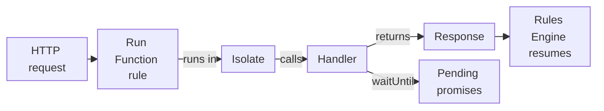

import FrameBox from '@aziontech/webkit/frame-box'
import ItemList from '@aziontech/webkit/item-list'
import DocItem from '@aziontech/webkit/doc-item'

A serverless JavaScript runtime runs your code once per request, inside a sandbox that keeps it apart from the code of other tenants. The code receives the request, builds a response, and returns it, and the sandbox decides which language features and system calls the code may use.

Azion Runtime is that environment for [Functions](/en/documentation/platform/functions/). It runs JavaScript built on Web standards, calls the handler your function exports, and gives the handler the APIs of the platform. Your project reaches it through Azion Bundler, which builds the code and resolves Node.js APIs with polyfills at build time.

The sections cover the execution model, the request lifecycle, handler shapes, the bundler and polyfills, strict mode, time inside a request, environment variables and secrets, and how `azion dev` differs from a deployed function. What decides when a function runs, the rule and the function instance, is on [How Functions works](/en/documentation/platform/functions/how-it-works/).

---

## Execution model

Each invocation of a function runs in an isolate, a V8 execution context. Functions run inside Cells, an isolation environment based on V8 isolates. Each Cell is a lightweight execution context with no direct access to the underlying operating system. The memory limit of a function applies per isolate, and a function that exceeds its CPU time is terminated. For the values, refer to [Functions limits](/en/documentation/platform/functions/limits/).

For multi-tenant security and infrastructure integrity, a Cell keeps three things from the code:

- The properties of the host operating system. `node:os` returns empty strings or zeros for the hostname, the release, and the memory fields, while its `platform()` and `type()` calls return the generic values `linux` and `Linux`.
- DNS resolution through native system calls. A call such as `dns.lookup()` from `node:dns` throws `Error: [unenv] dns.lookup is not implemented yet!`.
- Low-level TCP and UDP sockets, which require direct system calls.

The language and its global objects are the ones you know from the browser and from server environments. Standard built-ins such as `Math`, `JSON`, `Date`, `String`, `Array`, `Map`, `Set`, and the `Promise`-based async model are available. On top of them, the runtime exposes Web APIs such as `fetch`, `Request`, `Response`, the Web Crypto interfaces, streams, and event handling. Most portable JavaScript therefore runs without changes. For the full list, refer to [Web APIs](/en/documentation/devtools/runtime/api-reference/javascript/).

Azion participates in WinterTC (TC55), the Ecma International committee that standardizes a minimum common API for server-side JavaScript runtimes. Code written for Azion Runtime follows the same standards as other major runtimes, and Azion works with WHATWG, W3C, and other standards bodies on them. A function built only on these APIs ports to other platforms that implement the same standards.

The global `EdgeRuntime` property tells your code where it runs. It holds the string `"azion"` in a deployed function and `"edge-runtime"` under `azion dev`. You can read it in three ways, and each check below skips its branch in both environments, because the property is a string in both:

```javascript
if (typeof EdgeRuntime !== 'string') {
  // Runs only outside Azion Runtime and azion dev.
}

if (typeof globalThis.EdgeRuntime !== 'string') {
  // Runs only outside Azion Runtime and azion dev.
}

if (typeof self.EdgeRuntime !== 'string') {
  // Runs only outside Azion Runtime and azion dev.
}
```

Building on Web standards rather than on Node.js is the trade this model makes. Code that uses standard APIs moves between runtimes, while code that depends on Node.js modules or on the host system needs polyfills, or does not run at all. For every global the runtime defines, refer to [Globals](/en/documentation/devtools/runtime/api-reference/azion-runtime-globals/).

---

## Request lifecycle

A request reaches a function only when a [Rules Engine](/en/documentation/platform/applications/rules-engine/) rule with the **Run Function** behavior matches it. From that point, Azion Runtime runs the function on Azion's distributed infrastructure, close to the user who sent the request. The runtime calls the handler, waits for the response it returns, and hands control back to the rule.

This diagram follows one request through the runtime:



1. A request arrives, and a Rules Engine rule whose criteria match runs its **Run Function** behavior, which names a function instance.
2. Azion Runtime runs the function of that instance in an isolate.
3. The runtime calls the handler. In the ES Modules pattern it calls the `fetch` method of the default export with `request`, `env`, and `ctx`. In the Service Worker pattern it dispatches a `fetch` event: it creates a `FetchEvent` that carries the original `request` and hands it to the listener you registered with `addEventListener`.
4. The handler returns a `Response`, or a promise that resolves to one. A Service Worker listener passes the same value to `event.respondWith()`, which tells the runtime what to send back to the client.
5. `ctx.waitUntil(promise)`, or `event.waitUntil()` in the Service Worker pattern, extends the execution until the promise settles, so work started in the handler can finish after the handler returns.
6. Control returns to Rules Engine, which continues with the behaviors that follow.

The `request` gives the handler the URL, the method, the headers, and the body of the incoming traffic, and `request.metadata` adds data such as the geolocation and the TLS protocol of the client. Its properties are read-only: assigning `request.url` throws `TypeError: Cannot set property url of [object Request] which has only a getter`. A function usually registers a single `fetch` listener, and a listener that never calls `event.respondWith()` produces no response. The global `addEventListener` comes from `EventTarget`: in a deployed function, `globalThis instanceof EventTarget` is `true`, and the same class can back your own objects that emit and listen for custom events.

---

## Handler shapes

A handler is the code Azion Runtime calls when the function runs. The runtime accepts three shapes, and each one receives the request differently:

| Shape | Pattern | What the handler receives |
| --- | --- | --- |
| `export default { fetch(request, env, ctx) }` | ES Modules, recommended | `request`, `env`, and `ctx` as three arguments. |
| `addEventListener('fetch', (event) => {})` | Service Worker | A `FetchEvent` with `request`, `args`, `console`, `respondWith()`, and `waitUntil()`. |
| `export default main`, where `main` takes `event` | Deprecated | The same `FetchEvent` that the Service Worker pattern receives. |

A function whose default export is a function still runs, deployed and under `azion dev`. `azion build` prints this deprecation line for it:

```text
[Azion] [Build] › ⚠  warning   DEPRECATED: Migrate handler to → export default { fetch: (request, env, ctx) => {...} }
```

The shapes differ in where the context lives. The ES Modules handler gets the Args of the function instance as `ctx.args`, while the event-based shapes read them from `event.args`. A named export, `export async function fetch(request, env, ctx)`, is not one of the three shapes. `azion build` wraps it with the warning `Unsupported handler pattern detected. Generating Service Worker wrapper as fallback.`, and `azion dev` cannot run it.

A function instance on a firewall exports a `firewall` handler in place of `fetch`. For how it decides the request, refer to [Functions on a firewall](/en/documentation/platform/functions/how-it-works/#functions-on-a-firewall). For the parameters of each shape, refer to [Handlers](/en/documentation/devtools/runtime/api-reference/handlers/). To move an older function to the ES Modules shape, refer to [Migrate handler patterns in Functions](/en/documentation/guides/application-development/functions-and-runtime/migrate-handler-patterns/).

---

## Bundler and polyfills

A polyfill is code that supplies an API to an environment that lacks it. Azion Runtime implements Web standards, yet projects built with web frameworks typically call Node.js APIs. [Azion Bundler](https://github.com/aziontech/bundler), the open-source framework adapter that the [Azion CLI](/en/documentation/devtools/cli/) runs, resolves those APIs with polyfills during the build, not while the function runs.

`azion build` runs Azion Bundler with the preset of the project, and the bundler writes the bundle that the deploy reads. The `build.polyfills` key of the project's `azion.config` file, `true` or `false`, controls whether the build applies polyfills. For example, `azion init` writes `build: { preset: 'javascript', polyfills: true }` into the configuration of a JavaScript project. During a deploy, the Azion CLI builds the project, applies the configured polyfills, publishes the function, and prints the URL of the application. For every key of the file, refer to [azion.config.js](/en/documentation/devtools/cli/azion-config-js/).

A module that resolves at build time is not always a module that works at run time. Every module the Node.js compatibility table lists resolves when the bundle is built. Modules marked build-only are stubs, so that npm packages with static dependencies on them still compile. At run time, a call into a stub returns empty or default values, or throws an error such as `[unenv] dns.lookup is not implemented yet!`. The list of APIs that Azion Bundler resolves through polyfills is in its repository, which also accepts contributions.

The cost of resolving at build time is where a gap surfaces. The build succeeds whether a module is complete or a stub, so a missing implementation shows up only when a request reaches the call. For the status of each module, refer to [Node.js APIs](/en/documentation/devtools/runtime/node/). For a worked project, refer to [Use Node.js APIs through polyfills](/en/documentation/guides/application-development/functions-and-runtime/use-polyfills/).

---

## Strict mode

Azion makes strict mode the default and required mode for the JavaScript code a function runs. Strict mode carries JavaScript behaviors that the language could not turn on by default, because they would have broken code written before them. Azion treats it as the sensible default for that reason.

Strict mode changes the normal semantics of JavaScript in three ways:

- It turns some silent errors into thrown errors.
- It removes mistakes that keep JavaScript engines from optimizing code, so strict-mode code can sometimes run faster than the same code outside strict mode.
- It prohibits some syntax that later versions of ECMAScript are likely to define.

The first change has a cost for code written without strict mode. A mistake that JavaScript outside strict mode ignores throws in a function, and the error surfaces on the request, so an older library that relies on silent failures needs a test before you deploy it.

---

## Time inside a request

A deployed function sees the clock stand still for the length of a request. `Date.now()` does not advance during a request: two calls separated by a loop, a 50 ms timer, and a `fetch()` return the same value. `performance.now()` does advance, and it starts at 0 when the request starts.

For example, a function that stamps the start and the end of an origin call with `Date.now()` logs the same timestamp twice. The same measurement with `performance.now()` returns the elapsed milliseconds. In the same way, the nanoseconds field that `process.hrtime()` returns is 0 in a deployed function, so a duration measured with it is 0.

The frozen clock is a deployed behavior only. Under `azion dev`, `Date.now()` advances across the same loop, timer, and call, so a duration measured with it works locally and reads 0 after the deploy. Measure durations with `performance.now()`. For the timing globals the runtime defines, refer to [Globals](/en/documentation/devtools/runtime/api-reference/azion-runtime-globals/).

---

## Environment variables and secrets

A function reads the environment variables and secrets stored on your account through the runtime, not through its arguments. In a deployed function, the `env` argument of `fetch(request, env, ctx)` is an empty object. You read a variable with `Azion.env.get('<name>')` or as a property of `process.env`, and both return its value.

A variable created as a secret returns its value through `Azion.env.get()` in the same way. When the key matches no variable on your account, `Azion.env.get()` returns `undefined` and throws no error. The values stay out of the function code, so a credential changes without an edit to the code.

Under `azion dev`, the variables come from your machine, not from your account. With a `.env` file in the project folder, `env` and `process.env` hold the keys of that file. Without one, they hold the whole shell environment of the machine that runs `azion dev`, tokens included, so the function code can read every credential set in that shell. For the API and an example, refer to [Environment variables API](/en/documentation/devtools/runtime/api-reference/environment-variables/).

---

## Local and deployed behavior

`azion dev` runs a function on your machine through a local server that emulates Azion Runtime. It serves at `http://localhost:3333` by default, and `--port` changes the port. The emulation is not exact: several APIs exist only in a deployed function, and a few behave differently on each side. A page in this tree describes the deployed behavior, and the table below collects the differences.

| API or behavior | Deployed function | `azion dev` |
| --- | --- | --- |
| `env` argument of the handler | An empty object | `process.env` of your machine: the `.env` keys, or the whole shell environment without a `.env` file |
| `ctx` argument of the handler | `Context` with `args` and `waitUntil` | `waitUntil` only |
| `request.metadata` | An object with the request metadata | `undefined` |
| `EdgeRuntime` | `"azion"` | `"edge-runtime"` |
| `Date.now()` during a request | Does not advance | Advances |
| `caches` (Cache API) | Available | `ReferenceError: caches is not defined` |
| `Azion.Sql`, `Azion.AI`, `WebSocket`, `upgradeWebSocket` | Available | `undefined` |
| `Azion.networkList.contains()` | Returns `true` or `false` | `TypeError: Cannot read properties of undefined (reading 'find')` |
| `CustomEvent` and the global `dispatchEvent` | Available | `CustomEvent is not defined`; `dispatchEvent` is not a function |
| `queueMicrotask` | `ReferenceError: queueMicrotask is not defined` | Available |
| `process.nextTick()` callbacks | Not run when the handler builds its response | Run before the response |
| `setTimeout()` with a string | `EvalError: eval not allowed on setTimeout/setInterval parameter` | `TypeError` on the `callback` argument |
| Named export `export async function fetch` | Runs, with three arguments | Exits with `SyntaxError: Unexpected token 'export'` |
| `pipeline` from `node:stream`; `timingSafeEqual` and `generateKeyPairSync` from `node:crypto` | Work | The build fails, or the call is not a function |
| Assigning a `Request` property | Throws a `TypeError` | Ignored |
| `structuredClone()` with `transfer` | Detaches the source buffer | Leaves the source attached |
| Time zone of `Intl` | `UTC` | The time zone of your machine |
| `node:fs` | `fs.promises.*` throws `missing storage annotation` | Paths resolve under `.edge/storage/` |
| Object Storage `get()` of a missing key | `StorageError: Object not found` | `ENOENT` from the local disk |
| KV Store constructor `new Azion.KV(name)` | `KvError: KV constructor is private, use KV.open(name) instead` | Constructs |

Three more `azion dev` behaviors change what you see locally. A bundle that contains `addEventListener("firewall", …)` anywhere switches the whole local server into firewall emulation, and every request then fails with HTTP 500. Hot reload cannot switch handler shapes: changing the entry from `export default main` to `addEventListener('fetch')` stops the server, and a fresh `azion dev` serves the changed entry. And under `azion dev`, a firewall event has no `console`, so code that calls `event.console.error()` throws.

A local run shows a change without a deploy. A function that uses the Cache API, the metadata, a SQL database, or the frozen clock still needs a deployed test before it serves traffic. For the local workflow, refer to [Develop and test a function locally](/en/documentation/platform/functions/local-development/) and [Azion CLI dev](/en/documentation/devtools/cli/dev-command/).

---

## Related resources

<FrameBox>
<ItemList>
  <DocItem title="Handlers" href="/en/documentation/devtools/runtime/api-reference/handlers/">The parameters of the fetch handler and the three handler shapes, in reference form.</DocItem>
  <DocItem title="Globals" href="/en/documentation/devtools/runtime/api-reference/azion-runtime-globals/">Every global object and function the runtime defines, including the clock.</DocItem>
  <DocItem title="Node.js APIs" href="/en/documentation/devtools/runtime/node/">The status of each Node.js module and what its polyfill does at run time.</DocItem>
  <DocItem title="Develop and test a function locally" href="/en/documentation/platform/functions/local-development/">Run a function with `azion dev` and supply variables from a local file.</DocItem>
</ItemList>
</FrameBox>
