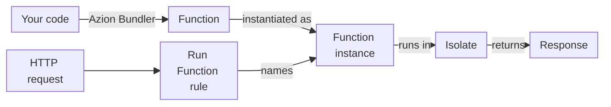

import DocButton from '~/components/webkit/DocButton.vue'
import DocCardGroup from '@aziontech/webkit/doc-card-group'
import DocCard from '@aziontech/webkit/doc-card'

A JavaScript runtime is the environment that executes code: it supplies the language engine, the global objects, and the APIs the code can call. In a serverless runtime, you write a handler that receives one request and returns a response. The platform starts the handler when a request arrives, so there is no server for you to provision or scale.

**Azion Runtime** is the JavaScript runtime of [Functions](/en/documentation/platform/functions/). It runs your handler on Azion's distributed infrastructure, close to the users who send the requests, and Azion provisions what the code needs to run. The code is built on Web standards and runs in strict mode. It calls Web APIs, a part of the Node.js APIs through polyfills, and Azion APIs for variables, request metadata, storage, and databases. Use Azion Runtime to put business logic in front of an application, build serverless applications, change responses as they stream, or store and query data from a function.

<DocButton href="/en/documentation/devtools/runtime/quickstart/" label="Get started" size="medium" />
<DocButton href="/en/documentation/devtools/runtime/api-reference/javascript/" label="Browse the Web APIs" kind="secondary" size="medium" />

---

## Function structure

A function for Azion Runtime is a JavaScript module whose default export holds a `fetch` handler. The smallest complete function answers every request with the same text:

```javascript
export default {
  async fetch(request, env, ctx) {
    return new Response('Hello World!');
  },
};
```

Deployed, the function returns this response:

```json
{
 "status": 200,
 "statusText": "",
 "headers": {
  "content-type": "text/plain;charset=UTF-8"
 },
 "body": "Hello World!"
}
```

- `export default { fetch }` is the ES Modules shape, the one Azion recommends. Azion Runtime also runs the Service Worker pattern, `addEventListener('fetch', …)`, and a deprecated default-export function.
- `request` is a standard `Request`. Its `metadata` property adds data about the client, such as the geolocation and the TLS protocol.
- `env` is an empty object in a deployed function. A function reads its variables with `Azion.env.get()` or `process.env`.
- `ctx` carries `args`, the Args of the function instance, and `waitUntil()`, which extends the execution until a promise settles.

Code written for the Web `Request` and `Response` objects, in a browser or in another standards-based runtime, follows the same model on Azion Runtime. For every parameter and handler shape, refer to [Handlers](/en/documentation/devtools/runtime/api-reference/handlers/).

---

## Invocation path

Writing a function does not run it. Your code reaches Azion Runtime through a build, and a request reaches your code only when a rule on an application runs an instance of the function.



1. `azion build` runs Azion Bundler, which bundles your code and resolves the Node.js APIs it calls with polyfills, at build time. `azion deploy` publishes the result as a function.
2. A [function instance](/en/documentation/platform/applications/functions-instances/#instance-fields) places the function on an application. Its `active` field stops the instance from running without deleting it. The application must have **Functions** turned on in the **Modules** section of its [Main Settings](/en/documentation/platform/applications/main-settings/#products).
3. A request arrives, and a [Rules Engine](/en/documentation/platform/applications/rules-engine/) rule whose criteria match runs its **Run Function** behavior, which names the instance.
4. Azion Runtime runs the function in an isolate, a V8 execution context, in the [data center that serves the request](/en/documentation/fundamentals/how-it-works/#distributed-infrastructure).
5. The runtime calls the handler, and the handler returns a `Response`. Work passed to `ctx.waitUntil()` can finish after the handler returns.
6. Control returns to Rules Engine, which continues with the behaviors that follow.

For the request lifecycle, the bundler, and time inside a request, refer to [How Azion Runtime works](/en/documentation/devtools/runtime/how-it-works/).

---

## Capabilities and limits

A function on Azion Runtime calls standard APIs, a part of Node.js, and the APIs of the platform, inside an isolate with fixed ceilings:

- **Language**: JavaScript. Azion makes strict mode the default and required mode for every function, so some silent errors become thrown errors. For more information, refer to [Strict mode](/en/documentation/devtools/runtime/how-it-works/#strict-mode) and to the [MDN strict mode reference](https://developer.mozilla.org/en-US/docs/Web/JavaScript/Reference/Strict_mode).
- **Web APIs**: the runtime groups its Web APIs into network, encoding and decoding, Web Streams, Web standards, V8 primitives, Web Crypto, and EventTarget. Azion participates in WinterTC (TC55), the Ecma International committee that standardizes a minimum common API for server-side JavaScript runtimes. A function built only on those APIs ports to other runtimes that implement them. For every API, refer to [Web APIs](/en/documentation/devtools/runtime/api-reference/javascript/). [Globals](/en/documentation/devtools/runtime/api-reference/azion-runtime-globals/) lists the names a function uses without an import.
- **Node.js APIs**: a function can import 68 Node.js modules, and each one resolves when the build bundles the function. A module that builds does not always work at run time: some are partially supported, and build-only modules are stubs whose calls return empty values or throw. For the status of each module, refer to [Node.js APIs](/en/documentation/devtools/runtime/node/).
- **Azion APIs**: a function reads [environment variables and secrets](/en/documentation/devtools/runtime/api-reference/environment-variables/), the [metadata of a request](/en/documentation/devtools/runtime/api-reference/metadata/), and [network lists](/en/documentation/devtools/runtime/api-reference/network-list/). It stores data with the [Object Storage API](/en/documentation/devtools/runtime/api-reference/storage/) and the [KV Store API](/en/documentation/devtools/runtime/api-reference/kv-store/), and queries a database with the [SQL Database API](/en/documentation/devtools/runtime/api-reference/sql-database/). It also runs models with the [AI Inference API](/en/documentation/devtools/runtime/api-reference/ai/), and uses the [Cache API](/en/documentation/devtools/runtime/api-reference/cache/) and [WebSocket](/en/documentation/devtools/runtime/api-reference/websocket/).
- **Isolation**: an isolate gives the code no access to the host operating system, no DNS resolution through native system calls, and no low-level TCP or UDP sockets. Each invocation runs inside the memory and CPU time ceilings on [Functions limits](/en/documentation/platform/functions/limits/#default-limits).
- **Invocation**: Azion Runtime runs the code but does not decide when it runs. The rule and the function instance decide, as [How Functions works](/en/documentation/platform/functions/how-it-works/) describes.
- **Interfaces**: the [Azion CLI](/en/documentation/devtools/cli/) runs a function locally with `azion dev`, and builds and deploys it with `azion build` and `azion deploy`. `azion dev` emulates the runtime, and several APIs behave differently there. For the differences, refer to [Local and deployed behavior](/en/documentation/devtools/runtime/how-it-works/#local-and-deployed-behavior).
- **Frameworks**: projects built with web frameworks deploy through Azion Bundler. For the support of each framework, refer to [Frameworks compatibility](/en/documentation/devtools/runtime/frameworks/frameworks-compatibility/).
- **Terms and help**: the [Glossary](/en/documentation/devtools/runtime/glossary/) defines the terms of Azion Runtime, and [Get help](/en/documentation/support/get-help/) lists the support and community channels.

---

## Next steps

<DocCardGroup cols={2}>
  <DocCard title="Azion Runtime quickstart" href="/en/documentation/devtools/runtime/quickstart/" label="Write a function, run it with azion dev, and deploy it." />
  <DocCard title="How Azion Runtime works" href="/en/documentation/devtools/runtime/how-it-works/" label="Follow a request from the rule to your handler and back." />
  <DocCard title="Web APIs" href="/en/documentation/devtools/runtime/api-reference/javascript/" label="Look up a standard API that a function can call." />
  <DocCard title="Node.js APIs" href="/en/documentation/devtools/runtime/node/" label="Check whether a Node.js module works at run time." />
</DocCardGroup>
