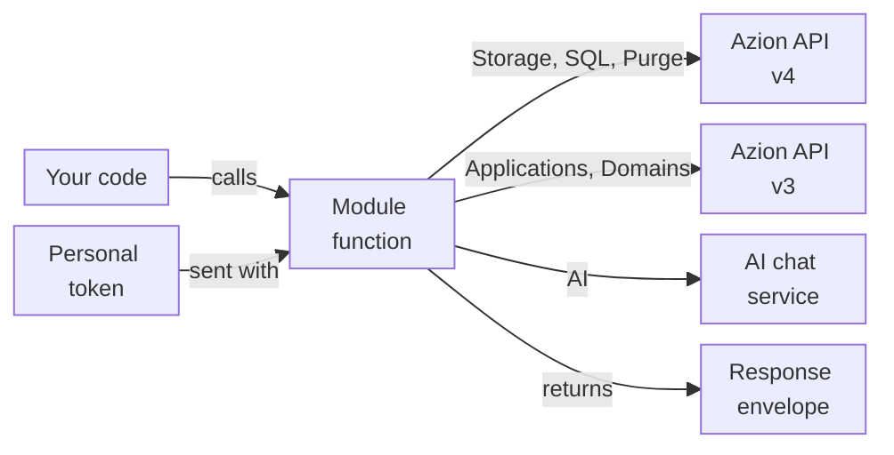

import FrameBox from '@aziontech/webkit/frame-box'
import ItemList from '@aziontech/webkit/item-list'
import DocItem from '@aziontech/webkit/doc-item'

A client library turns the API of a platform into functions of your programming language. You call a function with plain values, and the library sends the request with your token. Your code gets back a value it can check instead of a raw HTTP response. Some modules of a library send no request at all and only package helpers that run inside your code.

Azion Lib is a set of JavaScript and TypeScript packages that does both for the Azion Platform. Six of its modules call an Azion service: Storage, SQL, Purge, Domains, Applications, and AI, and the Client groups those six behind one object. The other seven make no API call: Cookies, JWT, WASM Image Processor, Utils, Config, Types, and unenv preset. The functions and parameters of each module are on its own page, and the APIs that a function reaches through the runtime itself are in [Azion Runtime](/en/documentation/devtools/runtime/).

The sections cover the packages that carry the modules, the token and debug settings, the response envelopes, the API versions the modules call, and where the functions run: Node.js or a function.

---

## Packages and modules

Azion Lib ships in two kinds of npm package. Seven modules have their own scoped package under `@aziontech`, such as `@aziontech/storage`, and the Azion Lib pages document those packages. The other seven modules exist only as subpaths of the `azion` package, such as `azion/purge`, and the Client is the root of that package.

This table gives the package that each module comes from and the specifier your code imports it with:

| Module | Package | Import from |
| --- | --- | --- |
| [Storage](/en/documentation/devtools/azion-lib/storage/) | `@aziontech/storage` | `@aziontech/storage` |
| [SQL](/en/documentation/devtools/azion-lib/sql/) | `@aziontech/sql` | `@aziontech/sql` |
| [JWT](/en/documentation/devtools/azion-lib/jwt/) | `@aziontech/jwt` | `@aziontech/jwt` |
| [Utils](/en/documentation/devtools/azion-lib/utils/) | `@aziontech/utils` | `@aziontech/utils/edge` |
| [Config](/en/documentation/devtools/azion-lib/config/) | `@aziontech/config` | `@aziontech/config` |
| [Types](/en/documentation/devtools/azion-lib/types/) | `@aziontech/types` | `@aziontech/types` |
| [unenv preset](/en/documentation/devtools/azion-lib/unenv/) | `@aziontech/unenv-preset` | `@aziontech/unenv-preset` |
| [Client](/en/documentation/devtools/azion-lib/client/) | `azion` | `azion` |
| [Applications](/en/documentation/devtools/azion-lib/application/) | `azion` | `azion/applications` |
| [Domains](/en/documentation/devtools/azion-lib/domains/) | `azion` | `azion/domains` |
| [Purge](/en/documentation/devtools/azion-lib/purge/) | `azion` | `azion/purge` |
| [AI client](/en/documentation/devtools/azion-lib/ai-client/) | `azion` | `azion/ai` |
| [Cookies](/en/documentation/devtools/azion-lib/cookies/) | `azion` | `azion/cookies` |
| [WASM Image Processor](/en/documentation/devtools/azion-lib/wasm-image-processor/) | `azion` | `azion/wasm-image-processor` |

The `azion` package receives bug fixes only, and its maintenance ends in December 2026. Features are added to the scoped packages only. The seven scoped modules are also still subpaths of `azion`, such as `azion/storage`. The scoped Storage and SQL packages call the same API endpoints as those subpaths. The other seven modules have no scoped package, so `azion` is the only package that carries them.

The split means that a project often installs both kinds. For example, a script that purges a URL after it uploads an object installs `azion` for Purge and `@aziontech/storage` for Storage. Two specifiers also differ from the module name. There is no `azion/client` subpath, because the Client is the package root. Utils functions import from `@aziontech/utils/edge`, because the bare `@aziontech/utils` exports only its `edge` and `node` entries.

---

## Token and debug settings

A module that calls an Azion service sends your [personal token](/en/documentation/fundamentals/personal-tokens/) with every request, and it gets the token in one of two ways. Each API module can create a client: `createClient` in Storage, SQL, Purge, Domains, and AI, and `createAzionApplicationClient` in Applications. A client holds the token you pass in its `token` field. A function that you import and call directly, without a client, reads the token from the `AZION_TOKEN` environment variable instead.

Two environment variables configure the six API modules. `AZION_TOKEN` holds your personal token, and `AZION_DEBUG` set to `true` turns on debug mode. Set them in the environment of the process that runs your code, for example from a `.env` file:

```bash
AZION_TOKEN=[TOKEN VALUE]
AZION_DEBUG=true
```

In debug mode, Storage, SQL, Purge, and AI log the body of each API response, and Storage prints an error response after `Error response body`. SQL also logs each statement it sends to a database. The logs never show the request URL or its headers. A single call can also turn on debug mode with `debug: true` in the options the function takes.

The two ways trade convenience for control. The environment variable keeps the token out of your code, and every direct call in the process picks it up. For example, a script that calls `purgeURL` where `AZION_TOKEN` is unset sends its request with no token, and the API refuses it. A client carries its own token, so one process can hold clients for different tokens.

The seven modules that make no API call read neither variable. For how the Client takes the token for all six modules at once, refer to [Client](/en/documentation/devtools/azion-lib/client/).

---

## Response envelopes

Most Azion Lib functions that call an API do not throw when a request fails. They return a response envelope instead: an object that holds either the result or the error, which your code checks before it uses the result.

Storage, SQL, Purge, and Domains return `{ data?, error? }`, and so do `deleteApplication` and the Applications functions for origins, cache settings, device groups, function instances, and rules. On success, `data` holds the result. On failure, `error` holds `{ message, operation }`, where `operation` names the call that failed, such as `get bucket`.

Two modules depart from that shape:

- The application-level functions of Applications, `createApplication`, `getApplication`, `getApplications`, `putApplication`, and `patchApplication`, return `{ data }` on success. When the API answers with an error status, they throw `Error: HTTP error! Status: <code> - <TEXT>`, so call them inside `try`/`catch`.
- AI returns `{ data, error }`. A failed call sets `data` to `null` and `error` to an `Error` object, which prints as `{}` through `JSON.stringify`, so log `error.message` instead.

Some successful calls return no `data`, so a check on `data` alone reports a failure that did not happen. A successful Storage `deleteBucket` or `deleteObject` returns an envelope whose only field is `error`, set to `undefined`, so check `error` after a Storage delete. SQL `deleteDatabase` returns `data: { state: 'pending' }`, with no database ID. SQL `getDatabase` with a name that does not exist returns an empty object, with neither `data` nor `error`.

Every Applications delete returns `{ error: { message: 'Expected JSON response, but got: ', operation } }` on success, because the API answers a delete with an empty body. Neither field tells success from failure there, so read the resource back to confirm the delete.

The modules that make no API call return their values directly. JWT and Cookies throw when a call fails, and JWT errors are told apart by their `name` property. For the envelope and the errors of one module, refer to its page in the [Packages and modules](#packages-and-modules) table.

---

## API versions

Each API module calls one service, and that service decides the shape of the payloads the module sends. Three modules call Azion API v4, two call Azion API v3, and AI calls a chat service of its own.

This diagram follows a call from your code to the service that answers it:



1. Your code calls a function of an API module, directly or through a client.
2. The function takes your personal token from the `token` field of its client or from the `AZION_TOKEN` environment variable.
3. Storage, SQL, and Purge call Azion API v4, under `https://api.azion.com/v4/workspace/storage`, `https://api.azion.com/v4/workspace/sql`, and `https://api.azion.com/v4/workspace/purge`.
4. Applications and Domains call Azion API v3.
5. AI sends its requests to a chat service outside the Azion API.
6. The function hands the answer back in its response envelope, or throws, as [Response envelopes](#response-envelopes) describes.

The API version decides which objects a module manages and how its payloads look. Applications and Domains send API v3 payloads, such as `origin_type` and `addresses` for an origin or `edge_function_id` for a function instance. Their pages show the payloads that API v3 accepts. Storage, SQL, and Purge send API v4 payloads, such as `workloads_access` for a bucket.

The seven other modules make no API call: Cookies, JWT, WASM Image Processor, Utils, Config, Types, and unenv preset. For the API itself, refer to [Azion API](/en/documentation/devtools/api/).

---

## Node.js and functions

An Azion Lib module can run in two places: in Node.js on your machine or server, or inside a [function](/en/documentation/platform/functions/) that the Azion Runtime executes. The two places expose different globals, so a module that works in one place does not always work in the other.

In Node.js, the six API modules run and call their services over REST. Cookies, JWT, Config, and the Utils `parseRequest` function run in Node.js too. WASM Image Processor runs in Node.js when it loads an image from a URL that ends in an image extension, and it refuses a local file path.

Inside a function served locally with [azion dev](/en/documentation/devtools/cli/dev-command/), these behaviors hold:

- `mountSPA` and `mountMPA` from Utils serve the files that `build.memoryFS` embeds in the build. A request for a missing file makes the function answer with status 500. Neither function runs in Node.js.
- `parseRequest` runs and reports the client IP as `Unknown`, because the local runtime has no `request.metadata`.
- Cookies and WASM Image Processor behave as they do in Node.js.
- Fetch handlers typed with Types run, in the module form and in the listener form.
- A function reaches the Node.js polyfills that the unenv preset configures by importing `node:*` modules, such as `node:crypto` and `node:fs`. The `node:fs` read calls `readFileSync`, `readdirSync`, `statSync`, `existsSync`, `openSync`, and `closeSync` work, while `writeFileSync`, `mkdirSync`, and `readSync` are undefined. The polyfill files themselves cannot be imported, in Node.js or in a function.

Storage also checks where it runs. It looks for `globalThis.Azion.Storage`, which exists inside a function, and when that interface is present, Storage calls it instead of the REST API. Set `external: true` in the options of a call to force the REST API, and SQL declares the same `external` option.

The split has a cost when you test. A script that runs in Node.js proves nothing about `mountSPA`, `mountMPA`, or the `node:fs` polyfill, which need a function built by the Azion CLI. For the request metadata a deployed function receives, refer to [Metadata](/en/documentation/devtools/runtime/api-reference/metadata/). For the file system calls of the runtime, refer to [node:fs](/en/documentation/devtools/runtime/node/fs/).

---

## Related resources

<FrameBox>
<ItemList>
  <DocItem title="Azion Lib" href="/en/documentation/devtools/azion-lib/">The modules of Azion Lib and what each one is for.</DocItem>
  <DocItem title="Azion Lib quickstart" href="/en/documentation/devtools/azion-lib/quickstart/">Install a package and make a first call with your token.</DocItem>
  <DocItem title="Client" href="/en/documentation/devtools/azion-lib/client/">One object that reaches the six API modules with one token.</DocItem>
  <DocItem title="Storage" href="/en/documentation/devtools/azion-lib/storage/">The functions, envelope, and options of a scoped API module.</DocItem>
</ItemList>
</FrameBox>
