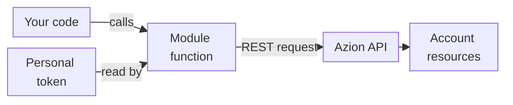

import DocButton from '~/components/webkit/DocButton.vue'
import DocCardGroup from '@aziontech/webkit/doc-card-group'
import DocCard from '@aziontech/webkit/doc-card'

A client library is a package of functions that stands in for the HTTP API of a platform. Your code imports a function, passes it plain values, and reads the object it returns. The library builds the request, attaches your credentials, and parses the answer, so your code writes no HTTP calls of its own.

**Azion Lib** is that library for the Azion Platform: a set of npm packages for JavaScript and TypeScript. Six of its modules call an Azion service, such as [Object Storage](/en/documentation/platform/object-storage/) or [SQL Database](/en/documentation/platform/sql-database/). Seven more, such as JWT, Cookies, and WASM Image Processor, run entirely inside your code and make no API call. Use Azion Lib to manage buckets and objects from a script, run SQL statements on a database, purge cached URLs, sign and verify JSON Web Tokens (JWTs), or set cookies on a response.

<DocButton href="/en/documentation/devtools/azion-lib/quickstart/" label="Get started" size="medium" />
<DocButton href="/en/documentation/devtools/azion-lib/how-it-works/" label="See how it works" kind="secondary" size="medium" />

---

## Code model

Each module ships in an npm package, and your code imports only the functions it calls. This Node.js script creates an Object Storage bucket with the `@aziontech/storage` package:

```javascript
import { createBucket } from '@aziontech/storage';

const { data, error } = await createBucket({
  name: 'my-bucket',
  workloads_access: 'read_only',
});
if (data) {
  console.log(`Bucket created with name: ${data.name}`);
} else {
  console.error('Failed to create bucket', error);
}
```

Saved as `create-bucket.mjs` and run with `node create-bucket.mjs`, the script prints the name of the bucket it created:

```text
Bucket created with name: my-bucket
```

- The `import` line loads one function from the module's package. No client object is needed for a direct call.
- `createBucket` reads your personal token from the `AZION_TOKEN` environment variable and sends the request to Azion API v4.
- The function takes one object argument, with the bucket `name` and its `workloads_access` level.
- The call returns a response envelope, `{ data, error }`, instead of throwing. `data` holds the bucket on success, and `error` holds `message` and `operation` on failure.

If you know `async` and `await` in JavaScript, you know how to call the Storage functions. To run this script against your account, follow the [Azion Lib quickstart](/en/documentation/devtools/azion-lib/quickstart/).

---

## Call path

Installing a package gives your code no access to your account. The token comes with each call, from a client or from the environment.



1. Your code calls a function of an API module directly, or through a client that `createClient` returns.
2. The function takes your [personal token](/en/documentation/fundamentals/personal-tokens/) from the `token` field of its client, or from the `AZION_TOKEN` environment variable on a direct call.
3. The function sends the request to the [Azion API](/en/documentation/devtools/api/). Storage, SQL, and Purge call Azion API v4, and Applications and Domains call Azion API v3. AI calls a chat service of its own.
4. The API acts on the resources of your account, such as a bucket or a database, and the function hands the answer back to your code.

Only the six API modules read `AZION_TOKEN`, and `AZION_DEBUG` set to `true` turns on their debug logs. The seven other modules read neither variable. For the token settings, the response envelopes, and the API version of each module, refer to [How Azion Lib works](/en/documentation/devtools/azion-lib/how-it-works/).

---

## Packages and boundaries

Azion Lib ships in two kinds of npm package, and a project often installs both. This table gives the package that carries each module:

| Module | Package |
| --- | --- |
| [Storage](/en/documentation/devtools/azion-lib/storage/) | `@aziontech/storage` |
| [SQL](/en/documentation/devtools/azion-lib/sql/) | `@aziontech/sql` |
| [JWT](/en/documentation/devtools/azion-lib/jwt/) | `@aziontech/jwt` |
| [Utils](/en/documentation/devtools/azion-lib/utils/) | `@aziontech/utils` |
| [Config](/en/documentation/devtools/azion-lib/config/) | `@aziontech/config` |
| [Types](/en/documentation/devtools/azion-lib/types/) | `@aziontech/types` |
| [unenv preset](/en/documentation/devtools/azion-lib/unenv/) | `@aziontech/unenv-preset` |
| [Client](/en/documentation/devtools/azion-lib/client/) | `azion` |
| [Applications](/en/documentation/devtools/azion-lib/application/) | `azion` |
| [Domains](/en/documentation/devtools/azion-lib/domains/) | `azion` |
| [Purge](/en/documentation/devtools/azion-lib/purge/) | `azion` |
| [AI client](/en/documentation/devtools/azion-lib/ai-client/) | `azion` |
| [Cookies](/en/documentation/devtools/azion-lib/cookies/) | `azion` |
| [WASM Image Processor](/en/documentation/devtools/azion-lib/wasm-image-processor/) | `azion` |

The `azion` package receives bug fixes only, and its maintenance ends in December 2026. The seven modules in the `@aziontech` scope each have a package of their own. The other seven have no scoped package, so `azion` is the only package that carries them. Each module page names its package and its install command.

- **Where the functions run**: in Node.js, the six API modules call their services over REST, and Cookies, JWT, Config, and the Utils `parseRequest` function run too. The Utils `mountSPA` and `mountMPA` functions and the `node:fs` polyfill of the unenv preset do not run in Node.js. They run inside a [function](/en/documentation/platform/functions/), including a function served locally with [azion dev](/en/documentation/devtools/cli/dev-command/), and handlers typed with Types run there too. Storage calls the `Azion.Storage` interface of [Azion Runtime](/en/documentation/devtools/runtime/) instead of the REST API when that interface is present.
- **What it does not do**: Azion Lib has no KV Store module. A function reads and writes KV Store through `Azion.KV`, a global of Azion Runtime. For more information, refer to [KV Store API](/en/documentation/devtools/runtime/api-reference/kv-store/). WASM Image Processor resizes an image inside your code with WebAssembly. It is separate from [Image Processor](/en/documentation/platform/applications/image-processor/quickstart/), which builds derived images on an application.
- **Interfaces**: the API modules call the Azion API for you. To call it directly, refer to [Azion API](/en/documentation/devtools/api/). To manage resources from a terminal, use the [Azion CLI](/en/documentation/devtools/cli/), and to manage them as code, use the [Azion Terraform Provider](/en/documentation/devtools/terraform/).
- **Help**: [Troubleshoot Azion Lib](/en/documentation/devtools/azion-lib/troubleshooting/) lists errors a call can return and how to fix them, and the [Glossary](/en/documentation/devtools/azion-lib/glossary/) defines the terms of Azion Lib.

---

## Next steps

<DocCardGroup cols={2}>
  <DocCard title="Azion Lib quickstart" href="/en/documentation/devtools/azion-lib/quickstart/" label="Install a package and create your first bucket from Node.js." />
  <DocCard title="How Azion Lib works" href="/en/documentation/devtools/azion-lib/how-it-works/" label="Find out how each module reads your token and reports a failure." />
  <DocCard title="Storage" href="/en/documentation/devtools/azion-lib/storage/" label="Look up every bucket and object function, with its parameters and errors." />
  <DocCard title="Troubleshoot Azion Lib" href="/en/documentation/devtools/azion-lib/troubleshooting/" label="Fix a call that fails, throws, or returns an error." />
</DocCardGroup>
