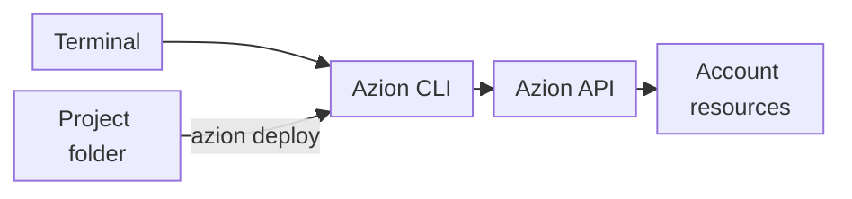

import DocButton from '~/components/webkit/DocButton.vue'
import DocCardGroup from '@aziontech/webkit/doc-card-group'
import DocCard from '@aziontech/webkit/doc-card'
import Tabs from '~/components/webkit/Tabs.vue'

A command-line interface (CLI) for a cloud platform is a program you run in a terminal. You act on your account with typed commands instead of a web interface, and a token saved on your machine authorizes each command. Because every action is a command, the same steps run by hand, in a script, or in a CI/CD pipeline.

**Azion CLI** puts the Azion Platform behind one terminal command, `azion`, an [open-source](https://github.com/aziontech/azion-cli/) binary written in Go. It has two command families. Project commands set up the project in the current folder, run it locally, and build and deploy it. Resource commands create, list, describe, update, and delete one platform resource at a time, with the form `azion <verb> <noun>`. Use the Azion CLI to deploy a site or a function, test it locally, manage resources as code, or automate deploys in CI/CD pipelines.

A build runs in [Azion Bundler](https://github.com/aziontech/bundler), an open-source framework adapter. `azion build` and `azion deploy` run the bundler with the preset of the project, and the bundler adapts the output of a web framework to run on the Azion Platform. For how the two command families reach the platform, refer to [How Azion CLI works](/en/documentation/devtools/cli/how-it-works/).

You can also manage the same resources through the [Azion API](/en/documentation/devtools/api/) or with the [Azion Terraform Provider](/en/documentation/devtools/terraform/).

<DocButton href="/en/documentation/devtools/cli/quickstart/" label="Get started" size="medium" />
<DocButton href="/en/documentation/devtools/cli/resources/" label="Browse the commands" kind="secondary" size="medium" />

---

## How the CLI works with your account

The Azion CLI is a client: the resources it creates and changes live in your account, and every command reaches them through the Azion API.



1. You run `azion` in a terminal. The CLI authorizes each command with the personal token that it saved on your machine at login.
2. A project command, such as `azion deploy`, runs inside the project folder and reads the `azion/azion.json` file and the `azion.config` file there.
3. The CLI, a Go binary, calls the Azion API.
4. The API creates or updates the resources of your account, such as an application and a workload. After a deploy, the CLI writes the ID of each resource into `azion/azion.json`.

For the build, the project files, and the profiles in detail, refer to [How Azion CLI works](/en/documentation/devtools/cli/how-it-works/).

---

## Project deploy

One command deploys a project. From the folder of a static site, `azion deploy` deploys it:

```bash
azion deploy
```

The command uploads the source files, and the build runs on Azion. The output ends with the domain that serves the site:

```text
Running deploy command
Uploading source files

Upload completed successfully!
Please visit https://console.azion.com/create/deploy/9241bdbc-fe9f-4fbb-803a-0ca3b15911d3 in case it did not open automatically, to follow up the full deploy process
Your Application was deployed successfully

To visualize your application access the Domain: https://mz0kbijeiw0.map.azionedge.net
Your application is being deployed to all Azion Locations and it might take a few minutes.
```

- `Uploading source files` sends the project to Azion, so the build needs no toolchain on your machine. With `--local`, the build runs on your machine instead.
- The Azion Console link opens **Deploy Log**, which shows the progress of the remote build.
- The last lines give the URL of the workload, a `map.azionedge.net` domain.
- The command writes the ID of each resource it created into `azion/azion.json`, so the next deploy updates the same resources.

The first deploy can take several minutes to answer from every location; later deploys take about two minutes. For every flag of the command, refer to [Azion CLI deploy](/en/documentation/devtools/cli/deploy/).

---

## Install the CLI

The install script is the recommended way to install the Azion CLI. It puts the `azion` binary on your path:

```bash
curl -fsSL https://cli.azion.app/install.sh | bash
```

The Azion CLI is also published for package managers. Homebrew, Chocolatey, and Windows Package Manager download the package for you. For RPM, dpkg, APK, and APT, first download the package for your system from the [releases page](https://github.com/aziontech/azion-cli/releases), then install the downloaded file. Each tab shows the command that installs the CLI and the command that updates it:

<Tabs client:visible sharedStore="package-manager">
<Fragment slot="tab.brew">Homebrew</Fragment>
<Fragment slot="tab.windows">Windows</Fragment>
<Fragment slot="tab.rpm">RPM</Fragment>
<Fragment slot="tab.dpkg">dpkg</Fragment>
<Fragment slot="tab.apk">APK</Fragment>
<Fragment slot="tab.apt">APT</Fragment>

<Fragment slot="panel.brew">

Install the `azion` formula:

```bash
brew install azion
```

Update it to the latest version:

```bash
brew upgrade azion
```

</Fragment>

<Fragment slot="panel.windows">

Install the CLI with Chocolatey:

```shell
choco install azion
```

Or install it with Windows Package Manager:

```shell
winget install aziontech.azion
```

To update, run the command for the manager you installed with:

```shell
choco upgrade azion
```

```shell
winget upgrade aziontech.azion
```

</Fragment>

<Fragment slot="panel.rpm">

Install the RPM package you downloaded from the releases page:

```bash
sudo rpm -i <downloaded_file>
```

To update, download the latest package from the releases page and run the same command on it.

</Fragment>

<Fragment slot="panel.dpkg">

Install the Debian package you downloaded from the releases page:

```bash
sudo dpkg -i <downloaded_file>
```

To update, download the latest package from the releases page and run the same command on it.

</Fragment>

<Fragment slot="panel.apk">

Install the APK package you downloaded from the releases page:

```bash
apk add <downloaded_file>
```

To update, download the latest package from the releases page and run the same command on it.

</Fragment>

<Fragment slot="panel.apt">

Install the Debian package you downloaded from the releases page:

```bash
sudo apt install ./<downloaded_file>
```

To update, download the latest package from the releases page and run the same command on it.

</Fragment>
</Tabs>

`azion version` confirms the install:

```bash
azion version
```

The command prints the version of the CLI:

```text
Azion CLI 4.23.0
```

The CLI then needs a personal token to act on your account. To save one, refer to [Azion CLI login](/en/documentation/devtools/cli/login/).

---

## What the CLI covers

The Azion CLI covers the life of a project, the resources of an account, and the configuration of the CLI itself:

- **Project commands**: [`azion init`](/en/documentation/devtools/cli/init/) creates a project from a template, and [`azion link`](/en/documentation/devtools/cli/link-command/) sets up an existing folder. [`azion dev`](/en/documentation/devtools/cli/dev-command/) runs the project on a local development server, and [`azion build`](/en/documentation/devtools/cli/build/) and [`azion deploy`](/en/documentation/devtools/cli/deploy/) build and deploy it. [`azion sync`](/en/documentation/devtools/cli/sync/) writes the remote resources back into the project files, [`azion unlink`](/en/documentation/devtools/cli/unlink-command/) detaches the folder, and [`azion rollback`](/en/documentation/devtools/cli/rollback/) serves an earlier deploy of a static site again.
- **Resource commands**: `azion <verb> <noun>` manages applications, functions, workloads, connectors, firewalls, DNS zones, certificates, storage buckets, and tokens, across 28 nouns. [Resource commands](/en/documentation/devtools/cli/resources/) lists each noun and the verbs it takes. [`azion clone`](/en/documentation/devtools/cli/clone/) copies an application under a new name, and [`azion config`](/en/documentation/devtools/cli/config/) manages resources from manifest files.
- **Project configuration**: [azion.config.js](/en/documentation/devtools/cli/azion-config-js/) declares the build settings of a project and the resources it needs on Azion, as code.
- **Account and settings**: [`azion login`](/en/documentation/devtools/cli/login/), [`azion logout`](/en/documentation/devtools/cli/logout/), and [`azion whoami`](/en/documentation/devtools/cli/whoami/) manage the session. [`azion profiles`](/en/documentation/devtools/cli/profiles/) switches between accounts, and [`azion reset`](/en/documentation/devtools/cli/reset/) returns the stored settings to their defaults. The flags every command accepts are on [Global options](/en/documentation/devtools/cli/globals/).
- **Cache**: [`azion purge`](/en/documentation/devtools/cli/purge/) removes cached objects before their TTL ends, and [`azion warmup`](/en/documentation/devtools/cli/warmup/) requests the pages of a site so that they are cached before visitors ask for them.
- **Logs**: [`azion logs`](/en/documentation/devtools/cli/logs/) prints the console logs of your functions and the HTTP event logs of your applications.
- **Frameworks**: projects built with Next.js, React, Vue, Angular, Astro, and other frameworks deploy through Azion Bundler. [Azion CLI guides and tutorials](/en/documentation/devtools/cli/guides/) carries one guide per framework, and [Frameworks compatibility](/en/documentation/devtools/runtime/frameworks/frameworks-compatibility/) describes how each framework runs on [Azion Runtime](/en/documentation/devtools/runtime/). To deploy a repository from Azion Console instead of the terminal, refer to [Import a project from GitHub](/en/documentation/guides/application-development/automation/import-an-existing-project-from-github/).
- **Help**: [Troubleshoot Azion CLI](/en/documentation/devtools/cli/troubleshooting/) lists the errors a command can return and how to fix each one, and the [Glossary](/en/documentation/devtools/cli/glossary/) defines the terms of the CLI.

---

## Next steps

<DocCardGroup cols={2}>
  <DocCard title="Azion CLI quickstart" href="/en/documentation/devtools/cli/quickstart/" label="Install the CLI and deploy your first function." />
  <DocCard title="How Azion CLI works" href="/en/documentation/devtools/cli/how-it-works/" label="Follow a project from its folder to a deployed workload." />
  <DocCard title="Resource commands" href="/en/documentation/devtools/cli/resources/" label="Manage a platform resource from the terminal." />
  <DocCard title="Azion CLI guides and tutorials" href="/en/documentation/devtools/cli/guides/" label="Deploy a framework project, or complete another task." />
</DocCardGroup>
