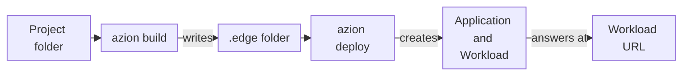

import FrameBox from '@aziontech/webkit/frame-box'
import ItemList from '@aziontech/webkit/item-list'
import DocItem from '@aziontech/webkit/doc-item'

A command-line tool for a hosting platform does two jobs from your shell. It turns a folder of code into a running deployment, and it changes the resources of your account one at a time. Both jobs reach the platform through its API, authorized by a token that the tool saves on your machine.

The Azion CLI is an open-source Go binary, `azion`, that does both jobs for the Azion Platform. It sets up projects from presets and runs them locally with `azion dev`. It builds and deploys them with `azion build` and `azion deploy`, and it manages platform resources with `azion <verb> <noun>`. The flags of each command are on its own page, and the options every command accepts are on [Global options](/en/documentation/devtools/cli/globals/).

The sections cover the two command families, the path from a project to a deployment, presets and the bundler, the project files, and accounts, profiles, and tokens.

---

## Commands and nouns

The Azion CLI has two command families, and they differ in what they act on. Project commands act on the project in the current directory: `init`, `link`, `dev`, `build`, `deploy`, `sync`, `unlink`, `rollback`, and `config`. `azion clone application` belongs with them and copies an existing application, rules included, under a new name. Resource commands act on one platform resource at a time, with the form `azion <verb> <noun>`, such as `azion list application` or `azion delete workload`.

A project command reads the project settings from the folder you run it in. You must therefore run `azion dev`, `azion build`, and `azion deploy` inside the project folder. For example, `azion build` reads the `azion` folder of the current directory, so it must run in the folder that holds `azion/azion.json`. Running `azion` with no command starts the same flow as `azion init`.

A resource command calls the Azion API for one resource and needs no project folder. The CLI calls the API through the [Go SDK](/en/documentation/devtools/sdk/). The verbs are `create`, `list`, `describe`, `update`, and `delete`, and each noun accepts the verbs that its resource supports. A resource command asks for any value it needs that you did not pass in a flag, such as a name or an ID.

The two families can reach the same resource. A deploy creates an application and a workload, and `azion describe application` then reads that application by its ID. For the nouns and the verbs each one takes, refer to [Resource commands](/en/documentation/devtools/cli/resources/).

---

## From a project to a deployment

A deployment starts as a folder of source files and ends as a workload that answers at a URL. The Azion CLI moves the project through a build, which produces a bundle, and a deploy, which creates the resources that serve the bundle.

This diagram follows a project from its folder to the URL:



1. The project folder holds your source files and the project settings that `azion init` or `azion link` wrote: an `azion` folder and an `azion.config` file.
2. `azion build` runs the build of the project's preset through Azion Bundler on your machine. The build writes the bundle into the `.edge` folder: a `manifest.json` file, the function code, and the static files for storage.
3. `azion deploy` sends the project to Azion. By default, the CLI uploads the source files, the build runs on Azion, and the command prints a link to Azion Console, where the deploy log is. With `--local`, the CLI builds on your machine, and it runs the build itself when the project has no `.edge` folder.
4. The deploy creates the resources that serve the project: an [application](/en/documentation/platform/applications/), a [workload](/en/documentation/platform/workloads/), and a workload deployment. A static site also gets an [Object Storage](/en/documentation/platform/object-storage/) bucket, a connector that reads it, a cache setting, and rules. A JavaScript project gets a [function](/en/documentation/platform/functions/) and a function instance instead.
5. The deploy writes the ID of each resource into `azion/azion.json`. A later deploy reads these IDs and updates the same resources instead of creating new ones.
6. The workload answers at its URL, a `map.azionedge.net` domain that the command prints. The first deploy can take several minutes to answer from every location; later deploys take about two minutes.

The static files of a site go to the Object Storage bucket under a storage prefix. Each deploy writes a new prefix into the `azion.config` file, uploads the files under it, and updates the connector. The files of earlier deploys stay in the bucket under their own prefixes. The CLI manages the storage credentials it uses for the upload and keeps them in `~/.azion/<profile>/credentials.toml`, so the upload needs no credential from you.

The two build routes cost different things. A remote build needs no build toolchain on your machine, but its log is in Azion Console, not in your terminal. A local build runs in your own environment and prints every build step, so a missing toolchain fails on your machine before anything is uploaded. For the flags of each route, refer to [Azion CLI deploy](/en/documentation/devtools/cli/deploy/).

---

## Presets and the bundler

A preset is the set of default build settings for one framework or language, such as `html`, `javascript`, `next`, or `vue`. Each preset provides default settings, and you can replace any of them in the project's `azion.config` file. For example, the `html` preset builds with the built-in handler of that preset and serves the files of the `./www` folder.

The build itself runs in Azion Bundler, an open-source framework adapter at [github.com/aziontech/bundler](https://github.com/aziontech/bundler). Azion Bundler and the Azion CLI together make the adaptations that a framework needs to run on the Azion Platform. `azion build` calls the bundler with the project's preset, and the bundler writes the `.edge` folder and the manifest that the deploy reads.

The preset list depends on the command that shows it. `azion init` offers templates per preset, such as *Hello World* for *Javascript*, from a picker that includes *AI Studio* and *Hono* but no `html` or `nitro` entry. `azion list presets` and `azion link` show a different list that includes `html` and `nitro`. A plain HTML site is therefore set up with `azion link --preset html`.

A preset's defaults carry a cost when your project does not follow them. With `azion link --preset html`, files at the project root are not uploaded, because the preset serves `./www` only. For the names that `azion link` and `azion build` accept, refer to [Azion CLI presets](/en/documentation/devtools/cli/resources/presets/).

---

## Project files

The Azion CLI keeps the state of a project in files inside the project folder. These files decide what a build produces and which resources a deploy updates.

- `azion/azion.json` records the project: its name, preset, bucket, storage prefix, and the ID of every resource the deploy created. `azion init` and `azion link` write it, and `azion deploy` fills in the IDs. An `azion/args.json` file appears after the first deploy.
- `azion.config.cjs` or `azion.config.mjs` is the configuration of the project's resources, written in JavaScript, and the source of truth for them. `azion init` and `azion link` write it from the preset, and the extension depends on the template: `azion link --preset html` writes `azion.config.cjs`. `azion sync --iac` writes `azion.config.mjs`, and when a project has both files, the deploy updates the `.mjs` file.
- `.edge/` holds the build output: `manifest.json`, the function code under `functions`, and the static files under `storage`. The CLI adds `.edge/` to the project's `.gitignore` file.
- `.edge/.env` holds environment variables for the project, and `azion deploy` and `azion sync` read it there by default. Variables whose names contain `password`, `pwd`, `secret`, `key`, `hash`, `encrypted`, `passcode`, `auth`, or `token` are sent to Azion as secrets.

The Azion CLI detects the `azion.config` file in the project folder by itself. If you delete the file, the next build recreates the default configuration of the preset. The generated file suggests `defineConfig` from `@aziontech/config`, which checks the configuration, reports clear errors, and gives type checking in TypeScript.

The configuration file also selects the build tools. `build.bundler` picks `esbuild` or `webpack`, and `build.extend` hooks into the bundler configuration. A custom preset is an object of the `AzionBuildPreset` type. It carries its own `config`, an optional `handler`, `prebuild` and `postbuild` functions that run around the build, and `metadata` that names the preset. You pass it as `build.preset` in `defineConfig`. For every key the file takes, refer to [azion.config.js](/en/documentation/devtools/cli/azion-config-js/).

Keeping the state in files has a cost: the IDs in `azion/azion.json` are what tie the folder to its resources. For example, `azion delete application --cascade` deletes the resources listed in the `azion/azion.json` of the current directory. To write the resources on Azion back into the project files, refer to [Azion CLI sync](/en/documentation/devtools/cli/sync/).

---

## Accounts, profiles, and tokens

Every command that calls the Azion API authorizes the call with a personal token saved on your machine. `azion login` saves the token for you, and you run it before any other command. The global option `-t` saves a token you already have. The CLI prints where it saved the token, and every later command uses it:

```text
Token saved in ~/.azion/default/settings.toml
This token will be used by default with all commands
```

The CLI keeps its configuration in `~/.azion`, with one folder per profile. A profile is a separate set of settings with its own token, so one machine can hold several accounts or tokens. `~/.azion/<profile>/settings.toml` holds the profile's settings, and `~/.azion/profiles.json` names the active profile. `azion profiles` picks the active profile. Each profile folder also holds the storage credentials that a deploy uses.

After `azion reset`, the settings file holds every key at its reset value:

```text
Token = ''
UUID = ''
LastCheck = 0001-01-01T00:00:00Z
LastVulcanVersion = ''
AuthorizeMetricsCollection = 0
ClientId = ''
Email = ''
ContinuationToken = ''
S3AccessKey = ''
S3SecretKey = ''
S3Bucket = ''
```

`Token` is the personal token, and `UUID` is the UUID of that token. `ClientId` and `Email` identify the account. With `AuthorizeMetricsCollection` at `0`, the next command first asks whether you agree to share anonymous usage data.

A profile persists until you switch it; the global option `-c` changes the configuration for one command only. `-c` takes the path of a `.toml` file and uses the folder that holds that path as the configuration root. The file does not need to exist, and a folder path is refused. For example, `-c ~/work/.azion/settings.toml` reads the profiles under `~/work/.azion` for that one command.

The CLI also detects which Azion API version your account uses, with no setting from you. Accounts created after January 1, 2026 use API v4, and older accounts may use API v3. To check which account the CLI uses, run `azion whoami`:

```text
 Client ID: 1234u
 Email: you@example.com
 Active Profile: default
```

For the login methods, refer to [Azion CLI login](/en/documentation/devtools/cli/login/). For switching profiles, refer to [Azion CLI profiles](/en/documentation/devtools/cli/profiles/).

---

## Related resources

<FrameBox>
<ItemList>
  <DocItem title="Azion CLI quickstart" href="/en/documentation/devtools/cli/quickstart/">Set up a project and deploy it, the path this page explains.</DocItem>
  <DocItem title="Global options" href="/en/documentation/devtools/cli/globals/">The options every command accepts, such as `-c`, `-t`, and `-y`.</DocItem>
  <DocItem title="azion.config.js" href="/en/documentation/devtools/cli/azion-config-js/">Every key of the configuration file that a build and a deploy read.</DocItem>
  <DocItem title="Resource commands" href="/en/documentation/devtools/cli/resources/">The nouns and verbs that manage one platform resource at a time.</DocItem>
</ItemList>
</FrameBox>
