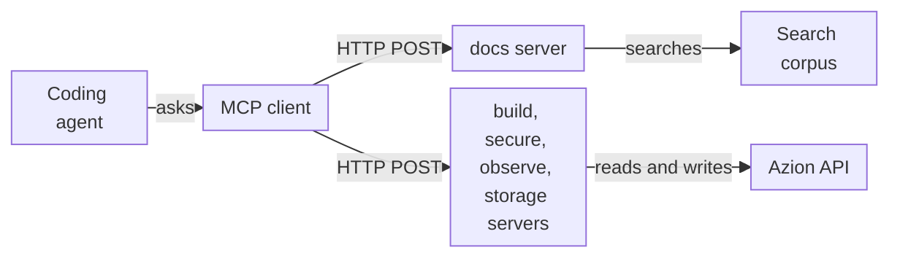

import FrameBox from '@aziontech/webkit/frame-box'
import ItemList from '@aziontech/webkit/item-list'
import DocItem from '@aziontech/webkit/doc-item'

A coding agent answers questions about a platform more reliably when it can look facts up instead of recalling them, and it changes the platform more safely when it acts through an API rather than through guesses. The Model Context Protocol (MCP) is an open specification for both. It uses JSON-RPC to standardize how an application lists and calls the tools of a server, reads its resources, and fetches its prompts. The agent's MCP client sends each request to the server, and the agent reads the answer as context.

[Azion MCP Servers](/en/documentation/devtools/mcp/) are five hosted MCP servers, one per area of the platform: docs, build, secure, observe, and storage, each at `https://<area>-mcp.azion.com/mcp`. Each server authenticates every request with your Azion [personal token](/en/documentation/fundamentals/personal-tokens/). The docs server answers with text drawn from the Azion documentation, code samples, and the references of the CLI, the API, and the Terraform provider. The other four servers read and change the resources of your account through the Azion API. To connect an agent, refer to [MCP server quickstart](/en/documentation/devtools/mcp/quickstart/). For the terms, refer to [Glossary](/en/documentation/devtools/mcp/glossary/).

The sections cover the request path, the connection and its transport, authentication, tools and resources, and tool execution.

---

## The request path

Azion MCP Servers follow the client-server model of the protocol. Your agent decides when it needs a fact or an action, its MCP client turns that decision into a JSON-RPC request to the server that owns the area, and the server does the work and returns text.

This diagram follows one tool call from the agent to the systems the servers reach:



1. You ask the agent a question or give it a task in natural language, and the agent decides that a tool can serve it.
2. The MCP client connects over HTTP to the URL of the server that owns the tool, such as `https://docs-mcp.azion.com/mcp`, and sends your personal token in the `Authorization` header of the request.
3. The server validates the token.
4. The client lists the tools and resources, and then calls a tool by name with JSON arguments.
5. The server runs the tool. A docs server tool searches a document corpus or returns guide text. A tool of the other four servers sends a request to the Azion API with your token, or, with `dry_run`, returns that request without sending it.
6. The server returns the result as text, and the agent uses that text to answer you.

To run an MCP server of your own on Azion, refer to [Run an MCP server on Azion](/en/documentation/guides/application-development/automation/run-mcp-server/).

---

## Connection and transport

A transport is the way MCP messages travel between a client and a server. Azion MCP Servers use streamable HTTP: the client sends every message as an HTTP `POST` to the `/mcp` path of the server, with the headers `Authorization: Token [TOKEN VALUE]`, `Content-Type: application/json`, and `Accept: application/json, text/event-stream`.

The first request of a connection is `initialize`. A client sends it as a `POST` to the server URL, such as `https://docs-mcp.azion.com/mcp`, with this body:

```json
{
  "jsonrpc": "2.0",
  "method": "initialize",
  "id": 1,
  "params": {
    "protocolVersion": "2025-03-26",
    "capabilities": {},
    "clientInfo": {
      "name": "my-client",
      "version": "0.1"
    }
  }
}
```

The server answers with the protocol version and its capabilities, and the client then sends `notifications/initialized`. Every later request, such as `tools/list` or `tools/call`, is a `POST` that carries its own `Authorization` header.

The servers accept only TLS 1.3. A client built on an older TLS library fails the handshake before its request reaches the server.

Some clients start every MCP server as a local process and talk to it over standard input and output instead of HTTP. Those clients reach Azion MCP Servers through `mcp-remote`, a package that `npx` downloads and runs as a local bridge to the server URL. Claude Desktop and Windsurf use it. For their configurations, refer to [Agent Setup](/en/documentation/agent-setup/).

---

## Authentication

Each Azion MCP server authenticates each request on its own, from the `Authorization` header. The header carries a personal token in the `Token` scheme: `Authorization: Token [TOKEN VALUE]`. A personal token is `azion` followed by 35 letters and digits, 40 characters in all.

A request that fails authentication gets a JSON-RPC error object with the code `-32001`. A request with no `Authorization` header gets HTTP `401` and this body:

```json
{
  "jsonrpc": "2.0",
  "error": {
    "code": -32001,
    "message": "No authentication provided"
  },
  "id": null
}
```

A `Token` value that is not a valid personal token gets HTTP `403` with the message `Authentication failed`. A personal token sent with the `Bearer` scheme gets HTTP `401` with the message `OAuth validation failed`. The servers check authentication before they route the request, so a request to the wrong path also gets one of these errors when its header fails. What to do about each one is on [Troubleshoot the MCP server](/en/documentation/devtools/mcp/troubleshooting/).

---

## Tools and resources

The protocol defines three kinds of capability a server can expose: tools, which a client calls to get an answer or take an action; resources, which a client reads like files; and prompts, which are message templates. All five Azion MCP Servers expose tools, and the docs server also exposes resources.

A tool is a function the server runs on request. The `tools/list` answer describes each tool with a `name`, a `description` the agent reads to decide when to call it, and an `inputSchema` written in JSON Schema. The agent then sends `tools/call` with the tool name and arguments that match the schema. For example, a call to `search_azion_docs_and_site` carries a `query` such as `how to configure cache`.

A resource is a document the client reads by its URI with `resources/read`, without calling a tool. The URIs of the docs server take the form `azion://<category>/<resource>/<item>`, as in `azion://guides/deploy/step-0-preparation`, with the type `text/markdown`. The server generates the text of a guide when the client reads it, so the text carries the date of the request.

The static site guides are reachable by two routes. A client that supports resources lists and reads them directly; a client that does not can call `deploy_azion_static_site` for the same text. For the tools of each server, and every resource URI, refer to [Tools and resources](/en/documentation/devtools/mcp/tools/).

---

## Tool execution

The tools of Azion MCP Servers differ in what they do with a request, and the difference decides how long a call takes, how far to trust its answer, and whether it changes your account.

- The search tools of the docs server, whose names start with `search_azion_`, run your `query` against a corpus of documents and return the closest matches as a JSON object with a `results` array. Each document carries its `title`, `content`, and `source`, with the `similarity`, `search_type`, and `relevance_score` of the match.
- `deploy_azion_static_site`, on the docs server, returns guide text.
- The list and get tools of the build, secure, observe, and storage servers read resources through the Azion API, with your token.
- The create, update, patch, delete, clone, reorder, and purge tools of those servers change your account through the Azion API, with your token. With `dry_run` set to `true`, a write tool returns the method, URL, headers, and body of the request instead of sending it. The headers include your personal token, so remove it before you share a preview.
- `create_graphql_query`, on the observe server, has a language model write a query for your goal, runs it against the selected [GraphQL API](/en/documentation/devtools/graphql/) endpoint of your account, with your token, and corrects it through GraphQL introspection for up to six attempts.

The search tools rank documents by how close they are to the words of the query, not by what the query means. A broad query can rank a document about another product or operation first, so read the `title` of each match before you act on it.

A `create_graphql_query` call takes longer than a search, because it generates and runs each query against your account. Its answer is not guaranteed. When no attempt produces a valid query, the tool returns a fallback text that says the information could not be retrieved and points to the GraphQL API documentation. The failure arrives as text inside a successful result, so the text, not the status, tells the agent whether the call worked.

A write tool acts with the permissions of the personal token. Scope the token to the resources the agent needs, and ask the agent for a `dry_run` preview before every write you have not reviewed.

---

## Related resources

<FrameBox>
<ItemList>
  <DocItem title="Tools and resources" href="/en/documentation/devtools/mcp/tools/">The tools of each server with their inputs, and every resource URI the docs server serves.</DocItem>
  <DocItem title="MCP server quickstart" href="/en/documentation/devtools/mcp/quickstart/">Connect a coding agent to a server with a personal token and make a first call.</DocItem>
  <DocItem title="Troubleshoot the MCP server" href="/en/documentation/devtools/mcp/troubleshooting/">Fix a refused token, a missing tool, or a client that cannot connect.</DocItem>
  <DocItem title="Run an MCP server on Azion" href="/en/documentation/guides/application-development/automation/run-mcp-server/">Build and deploy a server of your own as a function on Azion.</DocItem>
</ItemList>
</FrameBox>
