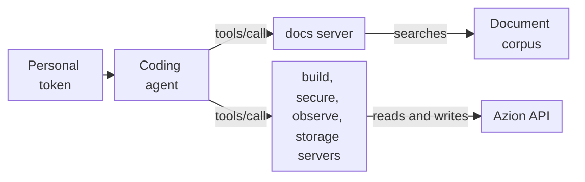

import SetupPromptBlock from '~/components/webkit/SetupPromptBlock.vue'
import DocButton from '~/components/webkit/DocButton.vue'
import DocCardGroup from '@aziontech/webkit/doc-card-group'
import DocCard from '@aziontech/webkit/doc-card'

An MCP server gives a coding agent tools it can call to look facts up instead of recalling them from training, and to act on a system on your behalf. The [Model Context Protocol](https://modelcontextprotocol.io) (MCP) is an open standard, developed by Anthropic, that uses JSON-RPC to define how an agent lists the tools of a server, calls them, and reads its resources. The agent asks the server when a question needs a fact or a task needs an action, and reads the answer as context, so you do not paste documentation into the conversation yourself.

**Azion MCP servers** are five hosted MCP servers, one per area of the Azion Platform, each at its own URL. They authenticate every request with your Azion [personal token](/en/documentation/fundamentals/personal-tokens/). The docs server answers questions from the Azion documentation, code samples, and the references of the [Azion CLI](/en/documentation/devtools/cli/), the [Azion API](/en/documentation/devtools/api/), and the [Azion Terraform Provider](/en/documentation/devtools/terraform/). The build, secure, observe, and storage servers read and change the resources of your account through the Azion API. Use the Azion MCP servers to find a CLI command or an API operation, pull a code sample, create a [Rules Engine](/en/documentation/platform/applications/rules-engine/) rule, purge cache, or write a GraphQL query for the metrics of your account.

| Server | URL | What it covers |
| --- | --- | --- |
| docs | `https://docs-mcp.azion.com/mcp` | Search of the documentation, code samples, CLI, API, and Terraform references; static site deploy and cache test guides |
| build | `https://build-mcp.azion.com/mcp` | Applications, cache settings, connectors, functions, rules, workloads, deployments, and cache purge |
| secure | `https://secure-mcp.azion.com/mcp` | Firewalls, WAF, DNS, certificates, network lists, custom pages, account policies, and authentication |
| observe | `https://observe-mcp.azion.com/mcp` | Data streams, dashboards, reports, data sources, GraphQL queries, and invoices |
| storage | `https://storage-mcp.azion.com/mcp` | Object Storage buckets, objects, and credentials; SQL databases and queries |

<DocButton href="/en/documentation/devtools/mcp/quickstart/" label="Get started" size="medium" />
<DocButton href="/en/documentation/devtools/mcp/tools/" label="Browse the tools" kind="secondary" size="medium" />

---

## Connect your agent to the MCP servers

Hand the setup to your coding agent, or follow the steps for your client yourself.

<SetupPromptBlock client:visible prompt="mcp" lang="en" />

---

## Tool call

A coding agent reaches a tool with a JSON-RPC `tools/call` request. The request below asks `search_azion_docs_and_site` on the docs server for two documents about cache. It is a `POST` to `https://docs-mcp.azion.com/mcp` with the headers `Authorization: Token [TOKEN VALUE]`, `Content-Type: application/json`, and `Accept: application/json, text/event-stream`, and this body:

```json
{
  "jsonrpc": "2.0",
  "method": "tools/call",
  "id": 1,
  "params": {
    "name": "search_azion_docs_and_site",
    "arguments": {
      "query": "how to configure cache",
      "docsAmount": 2
    }
  }
}
```

The result holds one `text` item, cut below at `…`; the full value holds the two documents that `docsAmount` asks for:

```json
{
  "result": {
    "content": [
      {
        "type": "text",
        "text": "{\"results\":[{\"title\":\"application-acceleration\",\"content\":\"Title: application-acceleration\\nDescription: Application Accelerator speeds up web applications and APIs through protocol optimizations and manages dynamic content requirements.…"
      }
    ]
  },
  "jsonrpc": "2.0",
  "id": 1
}
```

- `params.name` selects the tool, and `params.arguments` carries its inputs: the `query`, and `docsAmount` for the number of documents.
- `result.content` holds one item of type `text`. For a search tool, that text is a JSON object whose `results` array holds the documents, each with its `title`, `content`, and `source`, and the `similarity`, `search_type`, and `relevance_score` of the match.
- The `Authorization` header travels with every request.

If you know JSON-RPC 2.0, you know the message format. You rarely write these requests by hand: the MCP client of your agent writes them when you ask in natural language, such as with one of these prompts:

- `Configure Rules Engine to cache static assets for 1 year and API responses for 5 minutes.`
- `Optimize my site's Core Web Vitals scores`

---

## Request path

The docs server only reads. The build, secure, observe, and storage servers can create, change, and delete resources, within what your personal token allows. Each of their write tools takes `dry_run`, which returns the API request without sending it.



1. You add each server you need to the configuration of your coding agent, with your personal token in the `Authorization` header.
2. When a question needs a fact or a task needs an action, the MCP client of the agent sends a JSON-RPC request to the URL of the server that owns it, as an HTTP `POST`.
3. The server checks the token.
4. A search tool of the docs server runs the `query` against a corpus of Azion documents.
5. A tool of the other four servers sends a request to the Azion API with your token. A write tool called with `dry_run` returns that request instead of sending it. `create_graphql_query`, on the observe server, asks a language model to write a query from the goal you state, and runs it against the [GraphQL API](/en/documentation/devtools/graphql/) of your account.
6. The server returns the result as text, and the agent uses it to answer you.

For the transport and the authentication schemes, refer to [How the MCP server works](/en/documentation/devtools/mcp/how-it-works/).

---

## What the servers cover

The Azion MCP servers answer questions and act on your account. These are their tools, their limits, and the ways to reach them:

- **Tools**: the docs server exposes seven tools. Six search the Azion documentation and website, code samples, Azion CLI commands, the Azion API v4 and v3 references, and the Azion Terraform Provider documentation, and `deploy_azion_static_site` returns guides to deploy a static site and test its cache. The other four servers expose tools to list, read, create, change, and delete the resources of their area. [Tools and resources](/en/documentation/devtools/mcp/tools/) lists them by server.
- **Resources**: the docs server serves seven Markdown resources under `azion://guides/deploy/` and `azion://guides/test-cache/`, the same guides that `deploy_azion_static_site` returns.
- **Writes**: the build, secure, observe, and storage tools change your account through the Azion API, with your token. Ask the agent to call a write tool with `dry_run` first, and review the request it returns. The preview shows your token in the `Authorization` header, so remove it before you share a preview. The docs server does not deploy: the static site guides name the Azion CLI commands that you or your agent run.
- **Answers**: search ranking is loose, so the top match can miss the topic. Each search document carries its `source`, the page to check it against. `create_graphql_query` reports a failure as text inside a successful result.
- **Credential**: every request carries a personal token as `Authorization: Token [TOKEN VALUE]`. A personal token sent with the `Bearer` scheme fails with `401`. A request without the header gets `401` with the message `No authentication provided`. You create the token in [Azion Console](https://console.azion.com/).
- **Connection**: each server uses the streamable HTTP transport at the `/mcp` path of its host, and accepts only TLS 1.3.
- **Clients**: [Agent Setup](/en/documentation/agent-setup/) connects Claude Code, Cursor, GitHub Copilot, Windsurf, Codex, Gemini CLI, OpenCode, Claude Desktop, Warp, and Kiro. Claude Desktop and Windsurf reach the servers through the `mcp-remote` bridge. [MCP server quickstart](/en/documentation/devtools/mcp/quickstart/) connects Claude Code with one command.
- **Your own server**: to build and deploy an MCP server of your own as an Azion [function](/en/documentation/platform/functions/), refer to [Run an MCP server on Azion](/en/documentation/guides/application-development/automation/run-mcp-server/).
- **Help**: [Troubleshoot the MCP server](/en/documentation/devtools/mcp/troubleshooting/) lists each error with its cause and fix, [Test cache behavior with the MCP server](/en/documentation/guides/application-performance/cache-and-purge/test-cache-with-mcp/) uses the cache guides on a deployed site, and the [Glossary](/en/documentation/devtools/mcp/glossary/) defines the terms of the servers.

---

## Next steps

<DocCardGroup cols={2}>
  <DocCard title="MCP server quickstart" href="/en/documentation/devtools/mcp/quickstart/" label="Connect Claude Code to the docs server and ask your first question." />
  <DocCard title="How the MCP server works" href="/en/documentation/devtools/mcp/how-it-works/" label="Follow a tool call from your agent through authentication to the answer." />
  <DocCard title="Tools and resources" href="/en/documentation/devtools/mcp/tools/" label="Look up the tools of each server, the inputs they share, and every resource URI." />
  <DocCard title="MCP server guides and tutorials" href="/en/documentation/devtools/mcp/guides/" label="Search the documentation, create rules, deploy a static site, or test cache behavior." />
</DocCardGroup>
