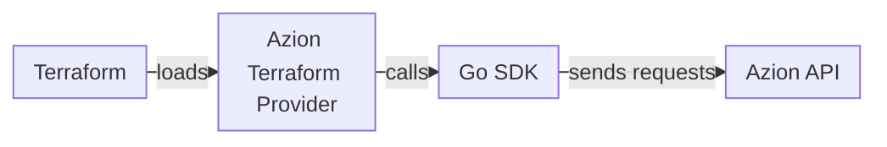

import FrameBox from '@aziontech/webkit/frame-box'
import ItemList from '@aziontech/webkit/item-list'
import DocItem from '@aziontech/webkit/doc-item'

An infrastructure as code tool keeps the description of your infrastructure in files that you can reuse, version, and share. Terraform is such a tool, and it does not call any platform by itself. It works through providers: plugins, each responsible for the lifecycle of specific resource types. A provider is a separate executable file that Terraform loads at runtime.

The [Azion Terraform Provider](https://github.com/aziontech/terraform-provider-azion) is the open-source provider for the Azion Platform, published in the [Terraform Registry](https://registry.terraform.io/providers/aziontech/azion/latest/docs) under the source `aziontech/azion`. With it, you manage the resources of your account locally, as code. Version 2.0 of the provider works only with [Azion API](/en/documentation/devtools/api/) v4. For accounts on API v3, refer to [Azion Terraform Provider v1.x (API v3)](/en/documentation/devtools/terraform/terraform-provider-v3/).

The sections cover the chain from Terraform to the API, state, the plan and apply cycle, and the names of resources and data sources.

---

## From Terraform to Azion API

A change you write in a Terraform configuration passes through three layers before it reaches your account. Each layer talks only to the next one.

This diagram follows a change from Terraform to the API:



1. Terraform reads your `.tf` files and works out which changes to make. It hands each change to the Azion Terraform Provider, which the configuration declares in its `required_providers` block.
2. The provider, built in Go, passes the change to the [Go SDK](/en/documentation/devtools/sdk/).
3. The Go SDK sends the requests to Azion API, which creates, updates, deletes, or reads the resources of your account.

A configuration declares the provider with its Registry source and a pinned version. The provider reads your [personal token](/en/documentation/fundamentals/personal-tokens/) from the `AZION_API_TOKEN` environment variable or from its `api_token` argument:

```hcl
terraform {
  required_providers {
    azion = {
      source  = "aziontech/azion"
      version = "2.0.0"
    }
  }
}

provider "azion" {
  # Recommended: use AZION_API_TOKEN environment variable
  # api_token = var.api_token
}
```

Because every call goes through the API, the provider follows the API version it targets. Version 2.0 moved the provider from API v3 to API v4, and some resources were removed or renamed on the way. For example, a configuration that still declares `azion_domain` fails, because version 2.0 replaces it with `azion_workload` and `azion_workload_deployment`. For every removed and renamed resource, refer to [Migrate from provider v1.x to v2.0](/en/documentation/devtools/terraform/terraform-migration-v3-to-v4/).

---

## State

Terraform records the objects it manages in a state. Each entry links a resource address in your configuration, such as `azion_workload.my_workload`, to the object that exists on your account. With local state, Terraform keeps the state in the `terraform.tfstate` file of the project folder, with a backup copy in `terraform.tfstate.backup`.

Terraform reads and changes the state with its own commands:

- `terraform state list` lists every resource in the state.
- `terraform state show` prints one resource, such as `terraform state show azion_workload.my_workload`.
- `terraform state pull` downloads a remote state as a local copy.
- `terraform state rm` removes a resource from the state.
- `terraform import` adds an existing object to the state, in the form `terraform import <type>.<name> <id>`.

For example, the migration to version 2.0 removes retired resources such as `azion_domain.example` from the state with `terraform state rm`. It then brings the existing objects under their v2.0 resource types with `terraform import azion_workload.example <workload_id>`.

A local state file serves one person on one machine, which is its cost. The [Terraform Provider best practices](/en/documentation/devtools/terraform/best-practices/) store the state in a remote backend with locking, so that concurrent runs do not conflict. They also keep `*.tfstate` files out of version control, with the other files that hold secrets.

---

## Plan and apply

Terraform changes your account in a cycle of three commands, each with its own job:

- `terraform init` installs the provider that the configuration declares, pulled from the Terraform Registry source `aziontech/azion`.
- `terraform plan` shows the changes that `terraform apply` would make, without making them.
- `terraform apply` makes the changes through the provider, after you type `yes` at its prompt.

Terraform reads the order of the changes from the configuration itself. A reference to another resource, such as `azion_workload.example.id`, makes one resource depend on the other, so Terraform creates the workload before the deployment that uses its ID:

```hcl
resource "azion_workload" "example" {
  name = "my-workload"
}

resource "azion_workload_deployment" "example" {
  workload_id = azion_workload.example.id

  # Deployment configuration
}
```

The `depends_on` argument declares a dependency by name instead. A hardcoded ID, such as `application_id = "12345"`, carries no dependency at all, so references are the safer choice.

Splitting plan from apply costs one extra step and buys a review before anything changes. For example, a pipeline can run `terraform plan` on every change and run `terraform apply -auto-approve` only on the `main` branch. To run the cycle for the first time, refer to [Azion Terraform Provider quickstart](/en/documentation/devtools/terraform/getting-started/).

---

## Resource and data source names

The Azion Terraform Provider offers two kinds of blocks, and they differ in ownership. A `resource` block creates, updates, and deletes an object on Azion, so its lifecycle belongs to the configuration. A `data` block is a data source: it queries objects that already exist and changes nothing.

Data source names follow a pattern. The plural name lists objects, and the singular name queries one specific object. For example, `azion_workloads` lists workloads, and `azion_workload` queries one workload. The plural can sit inside the name: `azion_application_rules_engine` lists, and `azion_application_rule_engine` queries one.

The singular name is often a resource and a data source at once. `azion_workload` is both, so the block keyword decides whether Terraform manages the object or only reads it. A configuration that reads every workload declares `data "azion_workloads" "all" {}`.

The application main settings break the pattern. The resource is `azion_application_main_setting`, and the data source that queries main settings is `azion_application_main_settings`, with a plural spelling. Check each name on its reference page, such as [Applications resources](/en/documentation/devtools/terraform/applications/), before you use it.

A data source lets a configuration use an object it does not own, such as a workload that another configuration manages. The cost is that Terraform cannot change that object. To manage it, you import it into the state as a resource.

---

## Related resources

<FrameBox>
<ItemList>
  <DocItem title="Azion Terraform Provider quickstart" href="/en/documentation/devtools/terraform/getting-started/">Run the init, plan, and apply cycle on your account for the first time.</DocItem>
  <DocItem title="Resources and data sources" href="/en/documentation/devtools/terraform/examples/">Every resource and data source name the provider offers, grouped by product.</DocItem>
  <DocItem title="Terraform Provider best practices" href="/en/documentation/devtools/terraform/best-practices/">Remote state, locking, modules, and pipelines for a configuration you share.</DocItem>
  <DocItem title="Troubleshoot the Terraform Provider" href="/en/documentation/devtools/terraform/troubleshooting/">Fixes for authentication, version, state, and import errors.</DocItem>
</ItemList>
</FrameBox>
