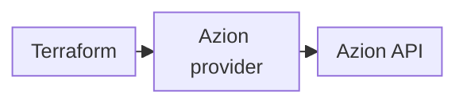

import DocButton from '~/components/webkit/DocButton.vue'
import DocCardGroup from '@aziontech/webkit/doc-card-group'
import DocCard from '@aziontech/webkit/doc-card'

With infrastructure as code, you describe the resources of an account in text files instead of creating them one by one in a web interface. A tool compares those files with what exists and makes the changes for you. Because the description is a set of files, you can reuse it, keep it under version control, and share it. One workflow then provisions and manages the infrastructure through its whole lifecycle. [Terraform](https://developer.hashicorp.com/terraform/docs) is a tool of this kind.

**Azion Terraform Provider** connects Terraform to the Azion Platform, so that your `.tf` files create, change, and delete the resources of your Azion account. It is an [open-source](https://github.com/aziontech/terraform-provider-azion) provider published in the [Terraform Registry](https://registry.terraform.io/providers/aziontech/azion/latest/docs), and version 2.0 works through [Azion API](/en/documentation/devtools/api/) v4. Use the Azion Terraform Provider to manage workloads, connectors, applications, DNS zones, firewalls, and certificates from your machine, review every change before it reaches the account, or apply the same configuration from a CI/CD pipeline.

:::caution
Version 2.0 of the provider works only with Azion API v4. If your account uses API v3, refer to [Azion Terraform Provider v1.x (API v3)](/en/documentation/devtools/terraform/terraform-provider-v3/).
:::

<DocButton href="/en/documentation/devtools/terraform/getting-started/" label="Get started" size="medium" />
<DocButton href="/en/documentation/devtools/terraform/examples/" label="Browse resources and data sources" kind="secondary" size="medium" />

---

## Provider configuration

A Terraform project for Azion declares the provider once and then one block per resource. This configuration pins provider version 2.0.0 and declares a workload:

```hcl
terraform {
  required_providers {
    azion = {
      source  = "aziontech/azion"
      version = "2.0.0"
    }
  }
}

provider "azion" {
  # Recommended: use AZION_API_TOKEN environment variable
  # api_token = var.api_token
}

# Create a workload
resource "azion_workload" "my_workload" {
  name = "my-first-workload"
}
```

- The `required_providers` block names the Registry source, `aziontech/azion`, and a fixed provider version. `terraform init` installs that version.
- The `provider "azion"` block configures the provider. It stays empty when your personal token is in the `AZION_API_TOKEN` environment variable; otherwise the `api_token` argument passes the token.
- Each `resource` block declares one object of your account. Its type, such as `azion_workload`, names the kind of object, and its label, such as `my_workload`, names it inside the configuration.

The blocks follow the standard Terraform language, so a configuration written for another provider has the same shape. Only the `azion_*` types change.

---

## Provider architecture

Terraform does not call Azion by itself. It hands each change to the provider, and the provider sends it to Azion API:



1. Terraform Core, the program behind the `terraform` commands, reads your `.tf` files and works out the changes to make. It passes each change to the Azion Terraform Provider.
2. The provider sends the requests to Azion API, which creates, updates, deletes, or reads the resources of your account.

Because every change ends as an API request, the provider follows the API version it targets. For the state, the plan and apply cycle, and resource names in detail, refer to [How the Terraform Provider works](/en/documentation/devtools/terraform/how-it-works/).

---

## Scope and terms

The first four entries define the Terraform terms that every page of this section uses. The rest set the scope of the Azion Terraform Provider:

- **Provider**: a plugin that manages the lifecycle of specific resource types. A [Terraform provider](https://developer.hashicorp.com/terraform/registry/providers) is a separate executable file that Terraform loads at runtime, and `terraform init` installs it from the Registry source the configuration names.
- **Resource**: a `resource` block that creates, updates, and deletes one object on Azion. The configuration owns the lifecycle of that object.
- **Data source**: a `data` block that queries objects that already exist on your account and changes nothing. For example, a configuration reads a workload that another configuration manages through a data source, and Terraform never modifies that workload.
- **State**: the record Terraform keeps of every object it manages, which links each resource address to the object on your account. With local state, the record is the `terraform.tfstate` file of the project folder; the [Terraform Provider best practices](/en/documentation/devtools/terraform/best-practices/) keep it in a remote backend.
- **Coverage**: the provider manages [workloads](/en/documentation/devtools/terraform/workloads/), [connectors](/en/documentation/devtools/terraform/connectors/), [applications](/en/documentation/devtools/terraform/applications/), [Edge DNS](/en/documentation/devtools/terraform/dns/) zones and records, [security](/en/documentation/devtools/terraform/security/) resources such as firewalls and network lists, and [certificates](/en/documentation/devtools/terraform/certificates/). [Resources and data sources](/en/documentation/devtools/terraform/examples/) lists every name.
- **Requirements**: Terraform 1.0 or later, and an Azion [personal token](/en/documentation/fundamentals/personal-tokens/) with the permissions your resources need.
- **Versions**: provider version 2.0 pairs with Azion API v4, and version 1.x pairs with API v3. Version 1.x receives no more updates. To move a v1.x configuration to version 2.0, refer to [Migrate from provider v1.x to v2.0](/en/documentation/devtools/terraform/terraform-migration-v3-to-v4/).
- **Other interfaces**: you can also manage the same resources with the [Azion CLI](/en/documentation/devtools/cli/) or directly through Azion API.
- **Errors**: [Troubleshoot the Terraform Provider](/en/documentation/devtools/terraform/troubleshooting/) lists fixes for authentication, version, state, and import errors.

---

## Next steps

<DocCardGroup cols={2}>
  <DocCard title="Azion Terraform Provider quickstart" href="/en/documentation/devtools/terraform/getting-started/" label="Configure the provider and create your first resources as code." />
  <DocCard title="How the Terraform Provider works" href="/en/documentation/devtools/terraform/how-it-works/" label="Follow a change from your configuration to Azion API." />
  <DocCard title="Resources and data sources" href="/en/documentation/devtools/terraform/examples/" label="Find the resource or data source for the object you manage." />
  <DocCard title="Terraform Provider guides and tutorials" href="/en/documentation/devtools/terraform/guides/" label="Find a guide for a task, such as moving a v1.x configuration to version 2.0." />
</DocCardGroup>
