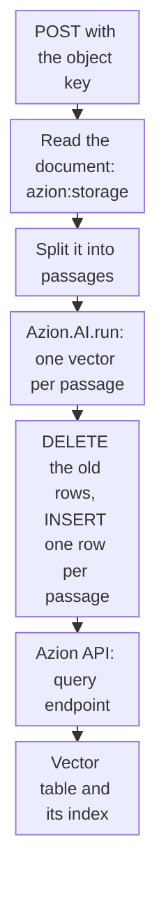

import DocCardGroup from '@aziontech/webkit/doc-card-group'
import DocCard from '@aziontech/webkit/doc-card'

You turn a document stored in Object Storage into passages, embed each passage with a model on AI Inference, and store the passages and their vectors in a SQL Database table, from a function and the Azion API. To query the table by meaning once it holds vectors, refer to [Vector search](/en/documentation/platform/sql-database/vector-search/).

A retrieval step finds passages by comparing vectors, so every passage needs one, produced by the same model and at the same width as the vector of each later question. The function reads one document per request, embeds all of its passages in one model call, and writes them in one call to the Azion API.



1. A request names the object key of one document, and the function reads that document from the bucket.
2. The function splits the text into passages.
3. One call to the embedding model returns a vector for every passage.
4. The function builds a `DELETE` for the document's earlier rows and one `INSERT` per passage, and sends them to the query endpoint of the Azion API.
5. The rows land in the vector table, and the vector index covers them.

---

## Prerequisites

- SQL Database enabled on your account. The product is in Preview and is not enabled by default, so request access through [Technical Support](/en/documentation/support/).
- A database, its identifier, and a personal token, stored as the `SQL_DATABASE_ID` and `SQL_TOKEN` environment variables, as [Write rows to SQL Database from a function](/en/documentation/guides/application-development/data/write-sql-database-rows-from-a-function/) describes. A function writes a database only through the Azion API, because its own connection is read-only.
- A bucket that holds the documents as UTF-8 text or Markdown files. To create one and upload the files, refer to [Object Storage quickstart](/en/documentation/platform/object-storage/quickstart/).
- The [Azion CLI](/en/documentation/devtools/cli/quickstart/) installed and authorized, and a function project to add the code to. To create and deploy one, refer to [Deploy a function with Azion CLI](/en/documentation/guides/application-development/functions-and-runtime/deploy-function-with-cli/).

The examples read the bucket `my-bucket`, embed with `Qwen/Qwen3-Embedding-4B` at 1,024 dimensions, write to a table named `passages`, and answer on `www.example.com`. Replace them, `<database-id>`, `<personal-token>`, and `<object-key>` with your own values.

---

## Create the vector table

The vector column declares the width of the vectors it holds, and the embedding request asks for the same width. `Qwen/Qwen3-Embedding-4B` returns one of five widths, `256`, `512`, `1024`, `2048`, or `4096`, through the `dimensions` field, so a `F32_BLOB(1024)` column matches a request for `1024`. A vector index needs a table with a `ROWID` or a single-column primary key, and its second argument sets the distance metric.

To create the table and its index, send both statements to the query endpoint:

```bash
curl --request POST \
  --url https://api.azion.com/v4/workspace/sql/databases/<database-id>/query \
  --header 'Accept: application/json' \
  --header 'Authorization: Token <personal-token>' \
  --header 'Content-Type: application/json' \
  --data '{"statements":[
    "CREATE TABLE passages (id INTEGER PRIMARY KEY AUTOINCREMENT, source TEXT NOT NULL, content TEXT NOT NULL, embedding F32_BLOB(1024));",
    "CREATE INDEX passages_idx ON passages (libsql_vector_idx(embedding, '\''metric=cosine'\''));"
  ]}'
```

The API answers `200` with `"state": "executed"` and one entry per statement. A statement that fails still answers `200`, with `error` in place of `results` in its entry, so read both entries:

```json
{"state":"executed","data":[{"results":{"columns":[],"rows":[],...}},{"results":{"columns":[],"rows":[],...}}]}
```

The database holds an empty `passages` table and the `passages_idx` index. The index adds a shadow table, `passages_idx_shadow`, that a table listing shows beside `passages`.

The [Build and run customer support AI assistants](/en/documentation/use-cases/build-and-run-ai-workloads/build-and-run-customer-support-ai-assistants/) use case uses the values of this example.

---

## Embed a document into the table

The function reads the document with the `Storage` class of the `azion:storage` module, which takes the bucket name and no token. It sends every passage in one `input` array, and the model answers with one entry per input in `data`, where `data[].index` is the position of the passage and `data[].embedding` its vector. Each vector goes into its statement as text inside `vector('[...]')`.

The route writes to the database, so it refuses a request that does not carry a secret. To store that secret with the Azion CLI:

```bash
azion create variables --key INGEST_SECRET --value <ingest-secret> --secret true
```

The command prints the UUID of the variable it created:

```text
Created variable with UUID 00000000-0000-0000-0000-000000000005
```

To embed one document per request, use this code as the function's entrypoint:

```javascript
import Storage from 'azion:storage';

const BUCKET = 'my-bucket';
const EMBEDDING_MODEL = 'Qwen/Qwen3-Embedding-4B';
const DIMENSIONS = 1024;
const MAX_PASSAGE = 1500;
const MAX_PASSAGES = 99;

// A passage is a run of paragraphs up to MAX_PASSAGE characters.
function split(text) {
  const passages = [];
  let current = '';
  for (const paragraph of text.split(/\n\s*\n/)) {
    const p = paragraph.trim();
    if (!p) continue;
    if (current && current.length + p.length > MAX_PASSAGE) {
      passages.push(current);
      current = '';
    }
    current = current ? `${current}\n\n${p}` : p;
  }
  if (current) passages.push(current);
  return passages;
}

function sqlText(value) {
  return `'${String(value).replaceAll("'", "''")}'`;
}

async function writeRows(statements) {
  const response = await fetch(
    `https://api.azion.com/v4/workspace/sql/databases/${Azion.env.get('SQL_DATABASE_ID')}/query`,
    {
      method: 'POST',
      headers: {
        Accept: 'application/json',
        Authorization: `Token ${Azion.env.get('SQL_TOKEN')}`,
        'Content-Type': 'application/json',
      },
      body: JSON.stringify({ statements }),
    },
  );
  if (!response.ok) {
    throw new Error(`Azion API answered ${response.status}`);
  }
  const failed = (await response.json()).data.find((entry) => entry.error);
  if (failed) {
    throw new Error(failed.error);
  }
}

export default {
  async fetch(request, env, ctx) {
    if (request.method !== 'POST') {
      return new Response('Method not allowed', { status: 405 });
    }
    if (request.headers.get('Authorization') !== `Bearer ${Azion.env.get('INGEST_SECRET')}`) {
      return new Response('Unauthorized', { status: 401 });
    }
    const key = new URL(request.url).searchParams.get('key');
    if (!key) {
      return Response.json({ error: 'key is required' }, { status: 400 });
    }

    let text;
    try {
      const object = await new Storage(BUCKET).get(key);
      text = new TextDecoder().decode(await object.arrayBuffer());
    } catch (error) {
      return Response.json({ error: String(error) }, { status: 404 });
    }
    const passages = split(text);
    if (passages.length === 0 || passages.length > MAX_PASSAGES) {
      return Response.json({ error: `${passages.length} passages; split the document` }, { status: 413 });
    }

    const embedded = await Azion.AI.run(EMBEDDING_MODEL, {
      input: passages,
      encoding_format: 'float',
      dimensions: DIMENSIONS,
    });

    // The DELETE makes a second run for the same key replace its rows instead of adding to them.
    const statements = [`DELETE FROM passages WHERE source = ${sqlText(key)};`];
    for (const item of embedded.data) {
      statements.push(
        `INSERT INTO passages (source, content, embedding) VALUES (${sqlText(key)}, ${sqlText(passages[item.index])}, vector('[${item.embedding.join(',')}]'));`,
      );
    }
    try {
      await writeRows(statements);
    } catch (error) {
      console.log(error.message);
      return Response.json({ error: 'The passages were not stored' }, { status: 502 });
    }
    return Response.json({ key, passages: passages.length });
  },
};
```

The code applies four decisions:

- **One document per request.** One read, one model call, and one write bound the work of each invocation. A function may use 2 seconds of CPU time and 50 outbound `fetch()` calls per invocation.
- **At most 99 passages per document.** The `DELETE` and 99 `INSERT` statements make 100 statements, and a call carrying 100 statements succeeds. A longer document answers `413`, so split it into two files.
- **The width is one constant.** `DIMENSIONS` sets the request, and it must equal the `F32_BLOB` width of the column. A question is comparable with a passage only when the same model produced both vectors at the same width.
- **A missing key answers `404`.** `get` throws `StorageError: Object not found` for a key that holds no object, and `Bucket not found` for a bucket the account does not have.

Under `azion dev`, `Azion.AI` is `undefined` and `azion:storage` reads the local disk, so deploy the function, as [Deploy a function with Azion CLI](/en/documentation/guides/application-development/functions-and-runtime/deploy-function-with-cli/) shows, and test it there. Then send one document:

```bash
curl -X POST 'https://www.example.com/?key=<object-key>' \
  -H 'Authorization: Bearer <ingest-secret>'
```

The function answers with the key and the number of passages it stored, such as `{"key":"<object-key>","passages":3}`. A request without the `Authorization` header answers `401`. The table holds one row per passage of the document, each with its vector.

---

## Confirm the passages carry vectors

To count the rows of the document that hold a vector, send a `SELECT` to the query endpoint:

```bash
curl --request POST \
  --url https://api.azion.com/v4/workspace/sql/databases/<database-id>/query \
  --header 'Accept: application/json' \
  --header 'Authorization: Token <personal-token>' \
  --header 'Content-Type: application/json' \
  --data '{"statements":["SELECT COUNT(*) AS passages FROM passages WHERE source = '\''<object-key>'\'' AND embedding IS NOT NULL;"]}'
```

The single entry in `data` carries `results`, whose one row holds the number the function returned:

```json
{"state":"executed","data":[{"results":{"columns":["passages"],"rows":[[3]],...}}]}
```

Every passage of the document carries a vector, and `vector_top_k` on `passages_idx` can return it. A query vector must come from `Qwen/Qwen3-Embedding-4B` at 1,024 dimensions too.

---

## Next steps

<DocCardGroup cols={2}>
  <DocCard title="Vector search" href="/en/documentation/platform/sql-database/vector-search/" label="Query the passages with vector_top_k, and read the distance functions and index bounds." />
  <DocCard title="Qwen3 Embedding 4B" href="/en/documentation/platform/ai-inference/qwen3-embedding-4b/" label="The model id, the widths it returns, and its context length." />
  <DocCard title="Write rows to SQL Database from a function" href="/en/documentation/guides/application-development/data/write-sql-database-rows-from-a-function/" label="Store the database credentials and check the result of every statement a function sends." />
  <DocCard title="Build and run customer support AI assistants" href="/en/documentation/use-cases/build-and-run-ai-workloads/build-and-run-customer-support-ai-assistants/" label="An assistant that ingests a documentation bucket this way and answers questions from the passages." />
</DocCardGroup>
