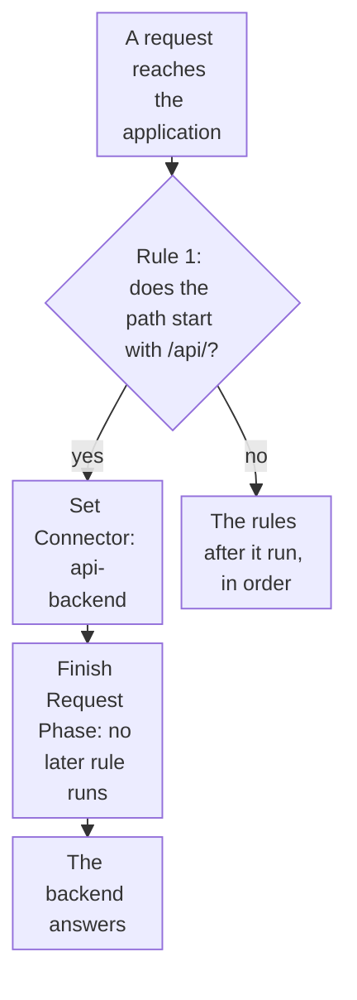

import DocCardGroup from '@aziontech/webkit/doc-card-group'
import DocCard from '@aziontech/webkit/doc-card'

You send every request under a path prefix, such as `/api/`, to a backend that runs outside Azion from the `azion.config` file of a project, which the Azion CLI applies with `azion deploy`. To set the `Host` header and the path prefix of a connector in Azion Console or the API instead, refer to [Set the Host header and path prefix for an origin](/en/documentation/guides/application-development/getting-started/set-the-host-header-and-path-prefix/).

The route is two entries of the file: a connector that reaches the backend, and a request rule that sends the path to that connector. `azion deploy` applies the rules the file declares to the application, so the route goes out with every deploy of the project.



1. The application runs its request rules in order, and the first rule checks whether the path starts with `/api/`.
2. A matching request gets the `api-backend` connector, and _Finish Request Phase_ ends the phase, so no later rule changes its connector, its path, or its cache setting.
3. The backend answers the request.
4. Any other request skips the first rule, and the rules after it run as before.

---

## Prerequisites

- A project folder with a configuration file that `azion deploy` reads, such as the `azion.config.cjs` or `azion.config.mjs` file that `azion link` or `azion init` writes. For the file names the CLI reads, refer to [azion.config.js](/en/documentation/devtools/cli/azion-config-js/#file-names-and-where-the-cli-reads-them).
- The [Azion CLI](/en/documentation/devtools/cli/quickstart/), installed and logged in, in that project folder.
- A backend that answers HTTPS on port `443` under its own hostname.

The examples send `/api/` to the backend `api.example.com` through a connector named `api-backend`, and request `/api/health` on `<workload-domain>`, the domain the deploy prints. Replace them with your values.

---

## Declare the backend connector

The connector holds the backend's address and how Azion connects to it. `transportPolicy: 'force_https'` connects to the backend over HTTPS only. `host` sends the backend's own name in the `Host` header: the default, `${host}`, sends the host the client requested, which a backend that routes requests by name may not answer for.

To declare the connector, add this entry to the `connectors` array of the file:

```javascript
{
  name: 'api-backend',
  active: true,
  type: 'http',
  attributes: {
    addresses: [{ address: 'api.example.com' }],
    connectionOptions: {
      transportPolicy: 'force_https',
      host: 'api.example.com'
    },
    modules: {
      loadBalancer: { enabled: false, config: null },
      originShield: { enabled: false, config: null }
    }
  }
}
```

The build refuses an `http` connector without the `modules` object, so the entry carries it with both features off. The file now declares the `api-backend` connector that the rule in the next section names.

The [Deploy frontend applications](/en/documentation/use-cases/build-and-run-applications/deploy-frontend-applications/) use case uses the values of this example.

---

## Send the path to the connector first

The rule matches the path with `${uri}`, which needs no Product on the application. Its behaviors run in order: `set_connector` names the connector by the `name` the file declares, and `finish_request_phase` ends the Request Phase.

The rule goes first because an application runs the rules of a phase in order, and only the last matching _Set Connector_ runs. Without the stop, a later rule that names another connector for every path would take `/api/` requests away from the backend. With it, the rules after this one never see an `/api/` request.

To declare the rule, add this entry as the first item of the application's `rules.request` array, before any rule already there:

```javascript
{
  name: 'Send /api/ to the backend',
  active: true,
  criteria: [
    [
      {
        variable: '${uri}',
        conditional: 'if',
        operator: 'starts_with',
        argument: '/api/'
      }
    ]
  ],
  behaviors: [
    { type: 'set_connector', attributes: { value: 'api-backend' } },
    { type: 'finish_request_phase' }
  ]
}
```

The order of the array is the order the rules run in on the application: after it updates the rules, `azion deploy --local` orders the request phase and prints `Rules Engine of Application with id <application-id> successfully ordered (request phase)`. The file now sends `/api/` to the backend before any other rule runs.

The [Deploy frontend applications](/en/documentation/use-cases/build-and-run-applications/deploy-frontend-applications/) use case uses the values of this example.

---

## Deploy the route

`azion deploy` applies the file to the application, the connector and the rule included. To deploy, run this command in the project folder:

```bash
azion deploy
```

The command opens the Console page that follows the deploy and ends with the domain:

```text
Your Application was deployed successfully

To visualize your application access the Domain: https://<workload-domain>
Your application is being deployed to all Azion Locations and it might take a few minutes.
```

Requests under `/api/` reach `api.example.com` with their own path, and every other request keeps the rules that follow. A rule change takes a few minutes to reach every data center.

---

## Check that the path reaches the backend

A request under the prefix must return the backend's answer, not a response of the rules that follow. To check it, request a backend path:

```bash
curl -s -D - https://<workload-domain>/api/health
```

The response is the backend's own answer for `/api/health`. When it is not, the rule may still be propagating, or another rule ran first. To see which rules ran on the request, turn on [Debug Rules](/en/documentation/platform/applications/main-settings/#debug-rules).

These checks confirm the [Deploy frontend applications](/en/documentation/use-cases/build-and-run-applications/deploy-frontend-applications/) use case.

---

## Check that a client-side route still loads the interface

In a single-page application, the preset's `Redirect to index.html` rule rewrites a route request to `/index.html`, and it must keep doing so for every path outside the prefix. To check it, request a route the interface handles, such as `/orders/42`:

```bash
curl -s https://<workload-domain>/orders/42
```

The body is the same entry HTML that `/` returns. The router in the browser then renders the route.

These checks confirm the [Deploy frontend applications](/en/documentation/use-cases/build-and-run-applications/deploy-frontend-applications/) use case.

---

## Next steps

<DocCardGroup cols={2}>
  <DocCard title="azion.config.js" href="/en/documentation/devtools/cli/azion-config-js/" label="Every connector, rule, and behavior field the configuration file accepts." />
  <DocCard title="How Applications works" href="/en/documentation/platform/applications/how-it-works/#how-rules-run" label="How rules run in order, why the last Set Connector wins, and which behaviors stop the rest." />
  <DocCard title="Connector settings" href="/en/documentation/platform/connectors/settings/" label="Every connection option of a connector, with its default and its bounds." />
  <DocCard title="Deploy frontend applications" href="/en/documentation/use-cases/build-and-run-applications/deploy-frontend-applications/" label="A single-page application whose API calls reach an existing backend under the same domain." />
</DocCardGroup>
