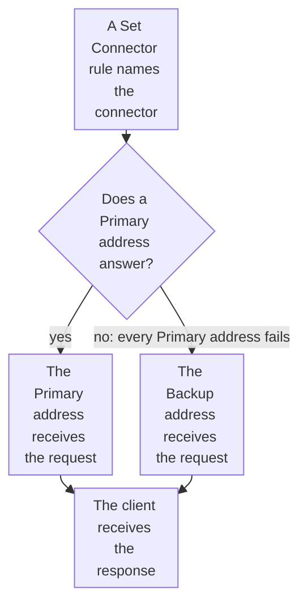

import DocCardGroup from '@aziontech/webkit/doc-card-group'
import DocCard from '@aziontech/webkit/doc-card'
import DocSteps from '@aziontech/webkit/doc-steps'
import DocStep from '@aziontech/webkit/doc-step'
import Tabs from '~/components/webkit/Tabs.vue'

You add a standby origin to a [connector](/en/documentation/platform/connectors/) as a _Backup_ address of [Load Balancer](/en/documentation/platform/connectors/#load-balancer), from Azion Console, the API, or the Azion CLI. To spread live traffic across several origins with weights instead, refer to [Balance traffic across multiple origins](/en/documentation/guides/application-performance/availability/multiple-origins/).

A _Backup_ address stands by out of daily traffic, and it receives requests only when every _Primary_ address fails. _Primary_ addresses are always preferred, so the standby carries no traffic while the primary answers. Load Balancer has no health check: no probe and no interval, so nothing tests an address between requests.



1. A rule's _Set Connector_ behavior sends the request to the connector, which has Load Balancer on.
2. While a _Primary_ address answers, it receives every request, and the _Backup_ address receives none.
3. When every _Primary_ address fails, the _Backup_ address receives the request.
4. The client receives the response from the address that served it, with no DNS change.

---

## Prerequisites

- A connector of type `http` that reaches your primary origin, and a rule whose _Set Connector_ behavior sends requests to it. To create both, refer to [Connectors quickstart](/en/documentation/platform/connectors/quickstart/).
- A standby origin that holds the same content as the primary and is set up the same way for the application.
- Access to Azion Console, for the Console procedure. Refer to [Access Azion Console](/en/documentation/guides/platform/account-and-billing/how-to-access-azion-console/).
- A [personal token](/en/documentation/guides/platform/account-and-billing/personal-tokens/) and the ID of the connector, for the API procedure.
- The [Azion CLI](/en/documentation/devtools/cli/) installed and authorized, and the ID of the connector, for the CLI procedure.

The examples use `primary.example.com` for the primary origin, `standby.example.com` for the standby, and `www.example.com` for the domain. Replace them with yours.

---

## Add the standby as a backup address

A connector holds one address until Load Balancer is on, and up to 15 addresses with it on. The method is _Round Robin_ or _Least Connections_, because _IP Hash_ refuses a _Backup_ address with `28005`. Every address is _Primary_ unless you set it otherwise.

**Max Retries** sets the retry attempts when a connection to the origin fails, from 0 to 20. **Connection Timeout** limits the wait for that connection, from 1 to 300 seconds, and **Read/Write Timeout** limits the wait for data on an open connection, from 1 to 600 seconds. The client waits through every retry before it receives an answer. The Console fills in `3`, `30`, and `60`. The API and the CLI give a key the body leaves out `0`, `60`, and `120`, so a connector without `max_retries` does not retry a failed connection. The examples set the Console values in every interface.

<Tabs client:visible sharedStore="interface">
<Fragment slot="tab.console">Console</Fragment>
<Fragment slot="tab.api">API</Fragment>
<Fragment slot="tab.cli">CLI</Fragment>

<Fragment slot="panel.console">

To add the backup address in Azion Console:

<DocSteps>
  <DocStep title="Open the connector">

  Access [Azion Console](https://console.azion.com/) > **Connectors**, and select the connector of your primary origin.

  </DocStep>
  <DocStep title="Turn on Load Balancer">

  In **Modules**, turn on **Load Balancer**. The form fills in **Max Retries**, **Connection Timeout**, and **Read/Write Timeout**.

  </DocStep>
  <DocStep title="Select the method">

  In **Load Balancer Configuration**, set **Method** to _Round Robin_.

  </DocStep>
  <DocStep title="Set the retries and timeouts">

  Enter `3` in **Max Retries**, `30` in **Connection Timeout**, and `60` in **Read/Write Timeout**.

  </DocStep>
  <DocStep title="Keep the primary origin as primary">

  Under **Address Management**, on `primary.example.com`, set **Server Role** to _Primary_.

  </DocStep>
  <DocStep title="Select Add Address" />
  <DocStep title="Enter the standby">

  In the new **Address**, enter `standby.example.com`, without a protocol or a port.

  </DocStep>
  <DocStep title="Set the backup role">

  Set **Server Role** to _Backup_, and keep **Active** turned on.

  </DocStep>
  <DocStep title="Select Save" />
</DocSteps>

The Console shows `Connector has been updated`.

</Fragment>

<Fragment slot="panel.api">

To add the backup address with the API, send a `PATCH` request to the connector. `addresses` replaces the list of addresses, so the body carries both:

```bash
curl --request PATCH \
  --url https://api.azion.com/v4/workspace/connectors/<connector-id> \
  --header 'Accept: application/json' \
  --header 'Authorization: Token <personal-token>' \
  --header 'Content-Type: application/json' \
  --data '{
  "attributes": {
    "addresses": [
      {
        "address": "primary.example.com",
        "modules": { "load_balancer": { "server_role": "primary", "weight": 1 } }
      },
      {
        "address": "standby.example.com",
        "modules": { "load_balancer": { "server_role": "backup", "weight": 1 } }
      }
    ],
    "modules": {
      "load_balancer": {
        "enabled": true,
        "config": { "method": "round_robin", "max_retries": 3, "connection_timeout": 30, "read_write_timeout": 60 }
      }
    }
  }
}'
```

The API answers `202` with `"state": "pending"`. A `PATCH` keeps the connection options the body leaves out.

</Fragment>

<Fragment slot="panel.cli">

The update command takes the whole connector from a file, with every field the connector keeps. To read the current settings of the connector:

```bash
azion describe connector --connector-id <connector-id> --format json
```

The command prints the full object. On a connector of type `http`, `attributes` holds `addresses`, `connection_options`, and `modules`.

Save the connector as `connector.json`, with the standby added and Load Balancer on. Replace `name` and `connection_options` with the values the command printed:

```json
{
  "name": "<connector-name>",
  "active": true,
  "type": "http",
  "attributes": {
    "addresses": [
      {
        "address": "primary.example.com",
        "modules": { "load_balancer": { "server_role": "primary", "weight": 1 } }
      },
      {
        "address": "standby.example.com",
        "modules": { "load_balancer": { "server_role": "backup", "weight": 1 } }
      }
    ],
    "connection_options": {
      "dns_resolution": "both",
      "transport_policy": "preserve",
      "host": "${host}"
    },
    "modules": {
      "load_balancer": {
        "enabled": true,
        "config": { "method": "round_robin", "max_retries": 3, "connection_timeout": 30, "read_write_timeout": 60 }
      }
    }
  }
}
```

Update the connector from the file. The command needs `--type` even though the file names the type:

```bash
azion update connector --connector-id <connector-id> --type http --file connector.json
```

The output confirms the update:

```text
Updated Connector with ID <connector-id>
```

</Fragment>
</Tabs>

The connector holds the primary origin and the standby, and the rule that names it needs no change. A connector change reaches Azion's distributed infrastructure over several minutes, and data centers apply it at different times.

Both addresses receive the same `Host` header, path prefix, and protocol from the connector. When the standby answers under another name than the primary, set **Host** to `${host}`, which sends the host the client requested. For the connection options, refer to [Connector settings](/en/documentation/platform/connectors/settings/#connection-options).

In the [Keep an application online when an origin fails](/en/documentation/use-cases/improve-performance-and-reliability/keep-an-application-online-when-an-origin-fails/) use case, this section takes these values:

| Setting | API key in `config` | Value |
| --- | --- | --- |
| **Method** | `method` | `round_robin` |
| **Max Retries** | `max_retries` | `1` |
| **Connection Timeout** | `connection_timeout` | `10` |
| **Read/Write Timeout** | `read_write_timeout` | `60` |

The connector holds the primary origin and the standby, and the rule that names `app-origin` needs no change.

In the [Route users to regional origins](/en/documentation/use-cases/improve-performance-and-reliability/route-users-to-regional-origins/) use case, this section takes these values:

| Setting | Value |
| --- | --- |
| **Addresses** | `us.origin.example.com` with **Server Role** _Primary_, and `eu.origin.example.com` with _Backup_ |
| **Method** | _Round Robin_ |
| **Max Retries** | `1`. One retry bounds how long a user waits through a failing connection |
| **Connection Timeout** | `10` seconds. It stops a request from waiting the 60-second API default on an origin that accepts no connection |
| **Read/Write Timeout** | `60` seconds |

`origin-us` holds the default region's origin and a backup in Europe, and `origin-eu` holds only its European origin.

---

## Confirm the standby takes over

The check takes the primary out of service, so run it in a maintenance window. It reads **Upstream Addr** in the _HTTP Requests_ data source of Real-Time Events, which holds the IP address and port of the server a request was sent to.

To confirm the failover:

<DocSteps>
  <DocStep title="Stop the primary origin">

  Stop the web server on `primary.example.com`, or block the connections from Azion at its firewall.

  </DocStep>
  <DocStep title="Send requests through your domain">

  ```bash
  curl -s -o /dev/null -w '%{http_code}\n' https://www.example.com/
  ```

  The command prints the status code of each response. Send it several times.

  </DocStep>
  <DocStep title="Open Real-Time Events">

  Access [Azion Console](https://console.azion.com/) > **Products menu** > **Observe** > **Real-Time Events**, and select _HTTP Requests_ in **Data Sources**.

  </DocStep>
  <DocStep title="Filter by your domain">

  In **Filter by**, enter `host='www.example.com'`, and select **Refresh**.

  </DocStep>
  <DocStep title="Read the upstream address">

  The newest records carry the IP address of `standby.example.com` in **Upstream Addr**.

  </DocStep>
  <DocStep title="Start the primary origin again" />
</DocSteps>

The standby serves the requests while the primary is down. Once the primary answers again, it takes the requests back, because _Primary_ addresses are always preferred over _Backup_ addresses. A data center that has not received a change yet can still answer as before, so repeat the search until the records agree. For the filter syntax, refer to [Filter events](/en/documentation/guides/platform/observability/add-filters-events/).

When your origins set a response header that names them, a second method reads that header in the response instead of Upstream Addr in Real-Time Events. Send several requests through your domain:

```bash
curl -s -D - -o /dev/null https://www.example.com/
```

In the [Keep an application online when an origin fails](/en/documentation/use-cases/improve-performance-and-reliability/keep-an-application-online-when-an-origin-fails/) use case, expect:

- **The primary serves while it answers.** Every response to several requests for `https://www.example.com/` carries `x-origin-site: primary`. Under HTTP/2, header names arrive in lower case.
- **The standby takes over when the primary fails.** Stop the web server on `primary.example.com`, or block the connections from Azion at its firewall. Send the request again, several times. The responses carry `x-origin-site: standby`, with no DNS change on your side.
- **The primary takes the traffic back.** Start the web server on `primary.example.com` again, and send the request several times. The responses carry `x-origin-site: primary` again, because _Primary_ addresses are always preferred over _Backup_ addresses.

In the [Route users to regional origins](/en/documentation/use-cases/improve-performance-and-reliability/route-users-to-regional-origins/) use case, expect:

- **The default region falls back, and Europe does not.** In a maintenance window, stop the web server on `us.origin.example.com` and repeat the request from outside Europe. The responses carry `x-origin-region: eu`. Start it again. A European origin outage, by design, shows the European users an error instead of a response from another region.

---

## Next steps

<DocCardGroup cols={2}>
  <DocCard title="Balancing methods" href="/en/documentation/platform/connectors/load-balancer/balancing-methods/#server-role" label="How the server role, the retries, and the timeouts decide where a request goes." />
  <DocCard title="Show your own page when no origin answers" href="/en/documentation/guides/application-performance/availability/show-your-own-page-when-no-origin-answers/" label="Replace Azion's error with your page when neither the primary nor the standby answers." />
  <DocCard title="Keep an application online when an origin fails" href="/en/documentation/use-cases/improve-performance-and-reliability/keep-an-application-online-when-an-origin-fails/" label="A primary and a standby origin in one pool, with an error page when both fail." />
  <DocCard title="Route users to regional origins" href="/en/documentation/use-cases/improve-performance-and-reliability/route-users-to-regional-origins/" label="A default region with a backup in another region, only where residency rules allow it." />
</DocCardGroup>
