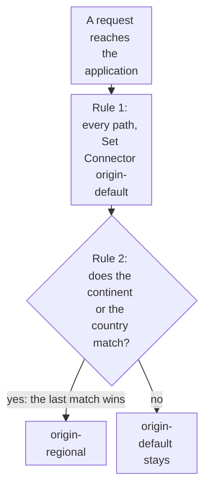

import DocCardGroup from '@aziontech/webkit/doc-card-group'
import DocCard from '@aziontech/webkit/doc-card'
import DocSteps from '@aziontech/webkit/doc-steps'
import DocStep from '@aziontech/webkit/doc-step'
import Tabs from '~/components/webkit/Tabs.vue'

You send the requests of one continent, or of a list of countries, to a regional connector with a geolocation rule, from Azion Console, the API, or the Azion CLI. To give a connector a backup origin that takes requests when its primary origin fails, refer to [Add a backup origin to a connector](/en/documentation/guides/application-performance/availability/add-a-backup-origin-to-a-connector/).

A geolocation rule reads the location of the client's IP address in the Request Phase and names a connector with _Set Connector_. _Set Connector_ does not add up across rules: when several matching rules carry it, only the one from the last matching rule runs. A default rule that sends every path to one connector therefore comes first, and each geolocation rule comes after it and overrides the default for the requests it matches.



1. Every request matches the first rule, which sets `origin-default`.
2. A request from the continent or the countries of the second rule also matches it, which sets `origin-regional`, and the later rule wins.
3. Any other request keeps `origin-default`.

---

## Prerequisites

- An application served by a workload, with a first rule whose _Set Connector_ behavior sends every request, `${uri}` _starts with_ `/`, to the default connector. To create them, refer to [Applications quickstart](/en/documentation/platform/applications/quickstart/).
- A second connector, for the region. To create one, refer to [Connectors quickstart](/en/documentation/platform/connectors/quickstart/).
- A [personal token](/en/documentation/guides/platform/account-and-billing/personal-tokens/), for the API procedures.
- The [Azion CLI](/en/documentation/devtools/cli/) installed and authorized, for the CLI procedures.

The examples use `origin-default` for the default connector, `origin-regional` with the ID `<connector-id>` for the regional one, and the application `<application-id>`. Replace them with your values.

---

## Create the geolocation rule

The criterion names the location to match. Rules Engine reads it from the client's IP address, and the variables and operators below need no Product on the application:

| To match | Variable | Operator | Argument |
| --- | --- | --- | --- |
| One continent | `${geoip_continent_code}`, the two-letter continent code | _is equal_, `is_equal` | A code such as `NA`, for North America |
| One country | `${geoip_country_code}`, the two-letter country code | _is equal_, `is_equal` | A code such as `RU`, for Russia |
| A list of countries | `${geoip_country_code}` | _matches_, `matches` | A regular expression of country codes, such as `^(BR\|AR)$` |

A continent code is geography, not a jurisdiction. When a rule must follow the countries a law or a contract names, match the country list. The `${geoip_city_*}` variables read a different geolocation base, `geoip_city`. For every geolocation variable, refer to [Variables](/en/documentation/platform/applications/rules-engine/#variables).

The procedures match the continent `NA`. For a country list, change the criterion to the one in the table.

<Tabs client:visible sharedStore="interface">
<Fragment slot="tab.console">Console</Fragment>
<Fragment slot="tab.api">API</Fragment>
<Fragment slot="tab.cli">CLI</Fragment>

<Fragment slot="panel.console">

To create the rule in Azion Console:

<DocSteps>
  <DocStep title="Go to the Rules Engine tab">

  Access [Azion Console](https://console.azion.com/) > **Applications** > **your application**, then go to the **Rules Engine** tab.

  </DocStep>
  <DocStep title="Select + Rule" />
  <DocStep title="Name the rule">

  Enter a name that identifies the region. For example: `geo - north america`.

  </DocStep>
  <DocStep title="Select Request Phase" />
  <DocStep title="Match the continent">

  In the **Criteria** section, set the criterion to `${geoip_continent_code}` _is equal_ `NA`.

  </DocStep>
  <DocStep title="Set the connector">

  In the **Behaviors** section, select **Set Connector**, then select `origin-regional`.

  </DocStep>
  <DocStep title="Select Save" />
</DocSteps>

The rule appears in the **Request** list of the **Rules Engine** tab.

</Fragment>

<Fragment slot="panel.api">

The criteria carry `${geoip_continent_code}`, which a shell expands, so the body is sent from a file. To create the rule:

<DocSteps>
  <DocStep title="Write the rule to a file">

  Save the following as `rule.json`, with the ID of `origin-regional` in `attributes.value`:

  ```json
  {
    "name": "geo - north america",
    "active": true,
    "criteria": [[{ "variable": "${geoip_continent_code}", "conditional": "if", "operator": "is_equal", "argument": "NA" }]],
    "behaviors": [{ "type": "set_connector", "attributes": { "value": <connector-id> } }]
  }
  ```

  </DocStep>
  <DocStep title="Send the create request">

  ```bash
  curl --request POST \
    --url https://api.azion.com/v4/workspace/applications/<application-id>/request_rules \
    --header 'Accept: application/json' \
    --header 'Authorization: Token <personal-token>' \
    --header 'Content-Type: application/json' \
    --data @rule.json
  ```

  </DocStep>
</DocSteps>

The API answers `202` with `"state": "pending"` and the rule as it was stored, with its `id` and its `order` in the phase.

</Fragment>

<Fragment slot="panel.cli">

The CLI reads the rule from a JSON file. To create the rule:

<DocSteps>
  <DocStep title="Write the rule to a file">

  Save the following as `rule.json`, with the ID of `origin-regional` in `attributes.value`:

  ```json
  {
    "name": "geo - north america",
    "active": true,
    "criteria": [[{ "variable": "${geoip_continent_code}", "conditional": "if", "operator": "is_equal", "argument": "NA" }]],
    "behaviors": [{ "type": "set_connector", "attributes": { "value": <connector-id> } }]
  }
  ```

  </DocStep>
  <DocStep title="Create the rule">

  ```bash
  azion create rules-engine --application-id <application-id> --phase request --file rule.json
  ```

  The command prints the ID of the rule:

  ```text
  Created Rules Engine with ID <rule-id>
  ```

  </DocStep>
</DocSteps>

</Fragment>
</Tabs>

Requests from North America go to `origin-regional` once the rule propagates, and every other request keeps `origin-default`. A new rule takes a few minutes to reach every data center.

---

## Keep the geolocation rule after the default rule

The platform creates a new rule at the end of its phase, which is the position a geolocation rule needs. A reordered list can put the default rule last, and it then sends every request to `origin-default` again, with no change to any rule. Check the order after every change to the list.

<Tabs client:visible sharedStore="interface">
<Fragment slot="tab.console">Console</Fragment>
<Fragment slot="tab.api">API</Fragment>
<Fragment slot="tab.cli">CLI</Fragment>

<Fragment slot="panel.console">

To check the order in Azion Console:

<DocSteps>
  <DocStep title="Go to the Rules Engine tab">

  Access [Azion Console](https://console.azion.com/) > **Applications** > **your application**, then go to the **Rules Engine** tab.

  </DocStep>
  <DocStep title="Find the geolocation rule in the Request list">

  `geo - north america` sits after the default rule. If it does not, move it below the default rule.

  </DocStep>
</DocSteps>

</Fragment>

<Fragment slot="panel.api">

To set the order, send the rule IDs of the phase in their new order, the default rule first, in the `order` array:

```bash
curl --request PUT \
  --url https://api.azion.com/v4/workspace/applications/<application-id>/request_rules/order \
  --header 'Accept: application/json' \
  --header 'Authorization: Token <personal-token>' \
  --header 'Content-Type: application/json' \
  --data '{ "order": [<default-rule-id>, <geo-rule-id>] }'
```

The list must name every rule of the phase. Each rule's `order` field then holds its new position, starting at `0`.

</Fragment>

<Fragment slot="panel.cli">

To read the order, list the rules of the phase with their position:

```bash
azion list rules-engine --application-id <application-id> --phase request --details
```

The output adds the `ORDER`, `PHASE`, and `ACTIVE` columns to the `ID` and `NAME` columns. `ORDER` starts at `0`, and the geolocation rule must carry a higher number than the default rule.

To set the order, pass every rule ID of the phase, the default rule first:

```bash
azion update rules-engine-order --application-id <application-id> --phase request --rule-ids "<default-rule-id>,<geo-rule-id>"
```

The command confirms the new order:

```text
Ordered Rules Engine of Application with ID <application-id>
```

</Fragment>
</Tabs>

The geolocation rule runs after the default rule, so its connector wins for the requests it matches.

:::note
The default cache key holds the scheme, the host, and the path, and no location. When the regional origins answer the same path with different content, a cache setting applied to that path can serve one region's copy to another. For the key format, refer to [Cache keys](/en/documentation/platform/applications/cache/cache-keys/).
:::

To test the rule, send a request from a machine in the region it matches, because the rule reads the location of the client's IP address. To see which rules ran on a request, turn on [Debug Rules](/en/documentation/platform/applications/main-settings/#debug-rules).

---

## Next steps

<DocCardGroup cols={2}>
  <DocCard title="Rules Engine for Applications" href="/en/documentation/platform/applications/rules-engine/#variables" label="Every geolocation variable a rule can read, from the continent to the region." />
  <DocCard title="How Applications works" href="/en/documentation/platform/applications/how-it-works/#behaviors-that-repeat" label="Why the last matching Set Connector wins, and how rule order sets a default." />
  <DocCard title="Balancing methods" href="/en/documentation/platform/connectors/load-balancer/balancing-methods/#server-role" label="Give a regional connector a backup origin with the Primary and Backup roles." />
  <DocCard title="Route users to regional origins" href="/en/documentation/use-cases/improve-performance-and-reliability/route-users-to-regional-origins/" label="Send European users to a European origin, with a backup region only where residency allows it." />
</DocCardGroup>
