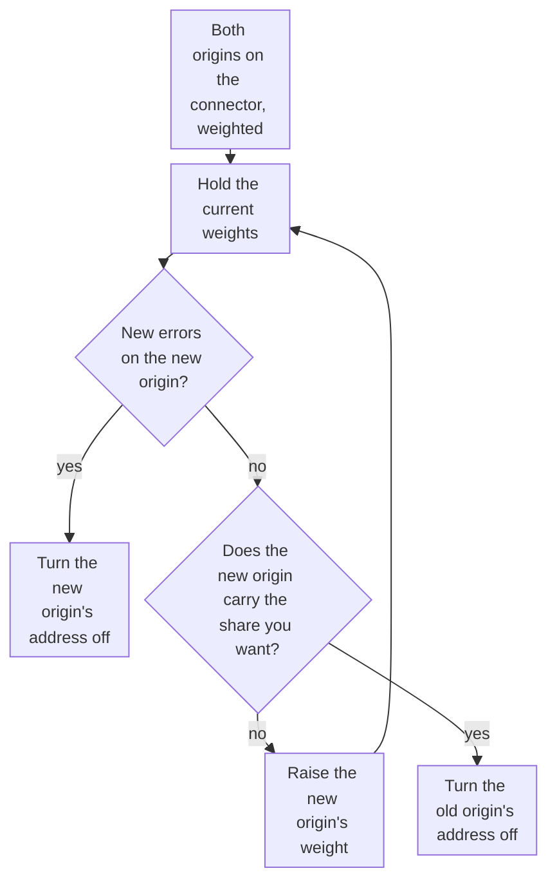

import DocCardGroup from '@aziontech/webkit/doc-card-group'
import DocCard from '@aziontech/webkit/doc-card'
import DocSteps from '@aziontech/webkit/doc-steps'
import DocStep from '@aziontech/webkit/doc-step'
import Tabs from '~/components/webkit/Tabs.vue'

You shift requests from one origin to another in steps, with the weights of the addresses of a [Load Balancer](/en/documentation/platform/connectors/#load-balancer) connector, from Azion Console, the API, or the Azion CLI. To keep a standby out of traffic until the primary fails instead, refer to [Add a backup origin to a connector](/en/documentation/guides/application-performance/availability/add-a-backup-origin-to-a-connector/).

Under _Round Robin_, each address receives a share of the requests in proportion to its weight, a whole number from 1 to 100. The weight sets a proportion, not an exact split: each data center balances on its own, so the share an address receives varies around the one its weight asks for. A weight cannot be `0`, so an origin leaves the rotation through its **Active** switch, not through its weight.



1. Both origins sit on one connector as _Primary_ addresses, and the new origin starts with a small weight.
2. Hold each set of weights until the new origin has served enough requests to show its errors.
3. When new errors appear, turn the new origin's address off to roll back.
4. When no new error appears, raise the new origin's weight, and hold again.
5. When the new origin carries the share you want, turn the old origin's address off to cut over.

---

## Prerequisites

- A connector of type `http` that reaches the current origin, and a rule whose _Set Connector_ behavior sends requests to it. To create both, refer to [Connectors quickstart](/en/documentation/platform/connectors/quickstart/).
- A new origin that holds the same application as the current one. Every address of a connector receives the same `Host` header, so both origins must answer for the same name.
- Access to Azion Console, for the Console procedure. Refer to [Access Azion Console](/en/documentation/guides/platform/account-and-billing/how-to-access-azion-console/).
- A [personal token](/en/documentation/guides/platform/account-and-billing/personal-tokens/) and the ID of the connector, for the API procedure.
- The [Azion CLI](/en/documentation/devtools/cli/) installed and authorized, and the ID of the connector, for the CLI procedure.

The examples use `old-origin.example.com` for the current origin and `new-origin.example.com` for the new one. Replace them with yours.

---

## Put both origins on the connector

The connector gets Load Balancer with _Round Robin_, and the new origin joins as a second _Primary_ address. A weight of `9` on the current origin and `1` on the new one sends about one request in ten to the new origin. A connector holds up to 15 addresses with Load Balancer on.

**Host** takes a name both origins answer for, such as `${host}`, which sends the host the client requested. A literal name of the current origin would reach the new origin under a name it may not answer for. The examples set **Max Retries**, **Connection Timeout**, and **Read/Write Timeout** to `3`, `30`, and `60`, the values the Console fills in. The API and the CLI give a key the body leaves out `0`, `60`, and `120`.

<Tabs client:visible sharedStore="interface">
<Fragment slot="tab.console">Console</Fragment>
<Fragment slot="tab.api">API</Fragment>
<Fragment slot="tab.cli">CLI</Fragment>

<Fragment slot="panel.console">

To put both origins on the connector in Azion Console:

<DocSteps>
  <DocStep title="Open the connector">

  Access [Azion Console](https://console.azion.com/) > **Connectors**, and select the connector of the current origin.

  </DocStep>
  <DocStep title="Send a host both origins answer for">

  In **Host**, enter `${host}`.

  </DocStep>
  <DocStep title="Turn on Load Balancer">

  In **Modules**, turn on **Load Balancer**. The form fills in **Max Retries**, **Connection Timeout**, and **Read/Write Timeout**.

  </DocStep>
  <DocStep title="Select Round Robin">

  In **Load Balancer Configuration**, set **Method** to _Round Robin_.

  </DocStep>
  <DocStep title="Weight the current origin">

  Under **Address Management**, on `old-origin.example.com`, set **Server Role** to _Primary_ and enter `9` in **Weight**.

  </DocStep>
  <DocStep title="Select Add Address" />
  <DocStep title="Enter the new origin">

  In the new **Address**, enter `new-origin.example.com`, without a protocol or a port.

  </DocStep>
  <DocStep title="Weight the new origin">

  Set **Server Role** to _Primary_ and enter `1` in **Weight**.

  </DocStep>
  <DocStep title="Select Save" />
</DocSteps>

The Console shows `Connector has been updated`.

</Fragment>

<Fragment slot="panel.api">

To put both origins on the connector with the API, send a `PATCH` request. `addresses` replaces the list of addresses, so the body carries the current origin as well:

```bash
curl --request PATCH \
  --url https://api.azion.com/v4/workspace/connectors/<connector-id> \
  --header 'Accept: application/json' \
  --header 'Authorization: Token <personal-token>' \
  --header 'Content-Type: application/json' \
  --data '{
  "attributes": {
    "addresses": [
      {
        "address": "old-origin.example.com",
        "modules": { "load_balancer": { "server_role": "primary", "weight": 9 } }
      },
      {
        "address": "new-origin.example.com",
        "modules": { "load_balancer": { "server_role": "primary", "weight": 1 } }
      }
    ],
    "connection_options": { "host": "${host}" },
    "modules": {
      "load_balancer": {
        "enabled": true,
        "config": { "method": "round_robin", "max_retries": 3, "connection_timeout": 30, "read_write_timeout": 60 }
      }
    }
  }
}'
```

The API answers `202` with `"state": "pending"`. A `PATCH` keeps the connection options the body leaves out.

</Fragment>

<Fragment slot="panel.cli">

The update command takes the whole connector from a file, with every field the connector keeps. To read the current settings of the connector:

```bash
azion describe connector --connector-id <connector-id> --format json
```

The command prints the full object. On a connector of type `http`, `attributes` holds `addresses`, `connection_options`, and `modules`.

Save the connector as `connector.json`, with both origins and Load Balancer on. Replace `name` and the other `connection_options` with the values the command printed:

```json
{
  "name": "<connector-name>",
  "active": true,
  "type": "http",
  "attributes": {
    "addresses": [
      {
        "address": "old-origin.example.com",
        "modules": { "load_balancer": { "server_role": "primary", "weight": 9 } }
      },
      {
        "address": "new-origin.example.com",
        "modules": { "load_balancer": { "server_role": "primary", "weight": 1 } }
      }
    ],
    "connection_options": {
      "dns_resolution": "both",
      "transport_policy": "preserve",
      "host": "${host}"
    },
    "modules": {
      "load_balancer": {
        "enabled": true,
        "config": { "method": "round_robin", "max_retries": 3, "connection_timeout": 30, "read_write_timeout": 60 }
      }
    }
  }
}
```

Update the connector from the file. The command needs `--type` even though the file names the type:

```bash
azion update connector --connector-id <connector-id> --type http --file connector.json
```

The output confirms the update:

```text
Updated Connector with ID <connector-id>
```

</Fragment>
</Tabs>

The connector holds two active addresses and sends about one request in ten to the new origin. A connector change reaches Azion's distributed infrastructure over several minutes, and until every data center holds it, some requests reach the current origin alone.

In the [Migrate an application to a new origin without downtime](/en/documentation/use-cases/build-and-run-applications/migrate-an-application-to-a-new-origin-without-downtime/) use case, this section takes these values:

| Setting | Value |
| --- | --- |
| **Host** | `${host}` |
| **Transport Protocol Policy** | _Force HTTPS_, because both origins answer HTTPS on port `443` |
| **Method** | _Round Robin_ |
| **Max Retries**, **Connection Timeout**, **Read/Write Timeout** | `3`, `30`, and `60` |
| `old-origin.example.com` | **Server Role** _Primary_, **Weight** `99` |
| `new-origin.example.com` | **Server Role** _Primary_, **Weight** `1` |

The connector holds two active addresses and sends about one request in a hundred to the new origin. A connector change takes several minutes to reach every data center, and until then some requests reach the old origin alone.

---

## Change the weights

Each step changes only the weights. Hold a step long enough for the new origin to serve the requests that expose its faults before you take the next one. Each record of the _HTTP Requests_ data source of [Real-Time Events](/en/documentation/platform/real-time-events/data-sources/#http-requests) carries **Upstream Status** and **Upstream Addr**, the status and the address of the origin that answered, so a filter on the new origin's address shows its errors.

<Tabs client:visible sharedStore="interface">
<Fragment slot="tab.console">Console</Fragment>
<Fragment slot="tab.api">API</Fragment>
<Fragment slot="tab.cli">CLI</Fragment>

<Fragment slot="panel.console">

To change the weights in Azion Console:

<DocSteps>
  <DocStep title="Open the connector">

  Access [Azion Console](https://console.azion.com/) > **Connectors**, and select the connector.

  </DocStep>
  <DocStep title="Set the current origin's weight">

  Under **Address Management**, on `old-origin.example.com`, enter the new weight in **Weight**, such as `5`.

  </DocStep>
  <DocStep title="Set the new origin's weight">

  On `new-origin.example.com`, enter the new weight in **Weight**, such as `5`.

  </DocStep>
  <DocStep title="Select Save" />
</DocSteps>

The Console shows `Connector has been updated`.

</Fragment>

<Fragment slot="panel.api">

To change the weights with the API, send both addresses with their new weights. A `PATCH` with only `addresses` keeps the Load Balancer configuration of the connector:

```bash
curl --request PATCH \
  --url https://api.azion.com/v4/workspace/connectors/<connector-id> \
  --header 'Accept: application/json' \
  --header 'Authorization: Token <personal-token>' \
  --header 'Content-Type: application/json' \
  --data '{
  "attributes": {
    "addresses": [
      {
        "address": "old-origin.example.com",
        "modules": { "load_balancer": { "server_role": "primary", "weight": 5 } }
      },
      {
        "address": "new-origin.example.com",
        "modules": { "load_balancer": { "server_role": "primary", "weight": 5 } }
      }
    ]
  }
}'
```

The API answers `202` with `"state": "pending"`. A weight of `0` is refused with `10050`, and a weight above `100` with `10068`.

</Fragment>

<Fragment slot="panel.cli">

To change the weights with the Azion CLI, edit the `weight` of both addresses in `connector.json`, such as `5` and `5`, and update the connector from the file:

```bash
azion update connector --connector-id <connector-id> --type http --file connector.json
```

The output confirms the update:

```text
Updated Connector with ID <connector-id>
```

</Fragment>
</Tabs>

The new origin receives the share of the new weights once the change reaches each data center. During the spread, some data centers still apply the previous weights, so judge a step only after it has spread.

In the [Migrate an application to a new origin without downtime](/en/documentation/use-cases/build-and-run-applications/migrate-an-application-to-a-new-origin-without-downtime/) use case, this section takes these values:

| Step | Old origin weight | New origin weight | Share on the new origin |
| --- | --- | --- | --- |
| 1 | `99` | `1` | About 1 in 100 |
| 2 | `90` | `10` | About 1 in 10 |
| 3 | `50` | `50` | About half |
| 4 | `10` | `90` | About 9 in 10 |

The new origin receives the share of the step once the change reaches each data center. During the spread, some data centers still apply the previous weights.

---

## Take an origin out of rotation

The **Active** switch of an address takes it out of rotation without deleting it. The address keeps its ports, role, and weight, so turning it back on restores the step it left. Turning the new origin's address off rolls back, and turning the current origin's address off cuts over.

<Tabs client:visible sharedStore="interface">
<Fragment slot="tab.console">Console</Fragment>
<Fragment slot="tab.api">API</Fragment>
<Fragment slot="tab.cli">CLI</Fragment>

<Fragment slot="panel.console">

To take the new origin out in Azion Console:

<DocSteps>
  <DocStep title="Open the connector">

  Access [Azion Console](https://console.azion.com/) > **Connectors**, and select the connector.

  </DocStep>
  <DocStep title="Turn the address off">

  Under **Address Management**, on `new-origin.example.com`, turn off **Active**.

  </DocStep>
  <DocStep title="Select Save" />
</DocSteps>

The Console shows `Connector has been updated`. To cut over instead, turn off **Active** on `old-origin.example.com`.

</Fragment>

<Fragment slot="panel.api">

To take the new origin out with the API, send both addresses with `"active": false` on the new one:

```bash
curl --request PATCH \
  --url https://api.azion.com/v4/workspace/connectors/<connector-id> \
  --header 'Accept: application/json' \
  --header 'Authorization: Token <personal-token>' \
  --header 'Content-Type: application/json' \
  --data '{
  "attributes": {
    "addresses": [
      {
        "address": "old-origin.example.com",
        "modules": { "load_balancer": { "server_role": "primary", "weight": 5 } }
      },
      {
        "address": "new-origin.example.com",
        "active": false,
        "modules": { "load_balancer": { "server_role": "primary", "weight": 5 } }
      }
    ]
  }
}'
```

The API answers `202` with `"state": "pending"`. To cut over instead, move `"active": false` to the current origin's address.

</Fragment>

<Fragment slot="panel.cli">

To take the new origin out with the Azion CLI, add `"active": false` to the `new-origin.example.com` address in `connector.json`, and update the connector from the file:

```bash
azion update connector --connector-id <connector-id> --type http --file connector.json
```

The output confirms the update:

```text
Updated Connector with ID <connector-id>
```

To cut over instead, move `"active": false` to the current origin's address.

</Fragment>
</Tabs>

The address that is off receives no request once every data center holds the change. The change takes several minutes to spread, so keep the origin you turned off answering until no request reaches it.

The [Migrate an application to a new origin without downtime](/en/documentation/use-cases/build-and-run-applications/migrate-an-application-to-a-new-origin-without-downtime/) use case uses the values of this example.

---

## Measure the share and the errors of each origin

Each step is judged on what each origin received and how it answered. The checks below read a response header that tells the two origins apart, such as the `server` header each one sends, the requests of one hour grouped by upstream address in Real-Time Metrics, and the failing requests of the new origin in Real-Time Events. The examples use `www.example.com` for the site and `<new-origin-ip>` for the IP address that `new-origin.example.com` resolves to, which the event filters match on.

- **Both origins answer.** Send the same request several times and read the header that tells the origins apart:

  ```bash
  curl -s -D - -o /dev/null https://www.example.com/
  ```

  At equal weights, about half of the answers carry the new origin's header. At weights of `99` and `1`, most runs show only the old origin's header, because one request in a hundred goes to the new one. The answers come in no fixed order.

- **The new origin receives its share.** Query the requests of one hour grouped by upstream address. Replace the token, the hour, and the hostname:

  ```bash
  curl -X POST 'https://api.azion.com/v4/metrics/graphql' \
    -H 'Content-Type: application/json' \
    -H 'Authorization: Token [TOKEN VALUE]' \
    -d '{"query":"query OriginShare { workloadBreakdownMetrics(aggregate: { sum: requests }, groupBy: [upstreamAddr], orderBy: [sum_DESC], limit: 10, filter: { tsGte: \"2026-10-05T13:00:00\", tsLt: \"2026-10-05T14:00:00\", hostEq: \"www.example.com\" }) { upstreamAddr total: sum } }"}'
  ```

  The API answers `200` with one row per upstream address, in the form `{"data":{"workloadBreakdownMetrics":[{"upstreamAddr":"<new-origin-ip>:443","total":<requests>}, …]}}`. The new origin's total against the sum of all rows tracks the share of the weights.

- **No new errors on the new origin.** In [Azion Console](https://console.azion.com/) > **Real-Time Events**, select the _HTTP Requests_ data source and a period that covers the step, and enter this filter in **Filter by**:

  ```text
  upstream_addr like '%<new-origin-ip>%' AND upstream_status='502'
  ```

  An empty result means that no request to the new origin ended with `502`. Repeat the filter with the other `5xx` codes your origin can return.

- **The rollback holds.** After a rollback, run the filter `upstream_addr like '%<new-origin-ip>%'` over the minutes after the change. The newest records stop once every data center holds the change.

A step that seems to have no effect may still be propagating. Repeat the check after a few minutes before you change the weights again.

These checks confirm the [Migrate an application to a new origin without downtime](/en/documentation/use-cases/build-and-run-applications/migrate-an-application-to-a-new-origin-without-downtime/) use case.

---

## Next steps

<DocCardGroup cols={2}>
  <DocCard title="Balancing methods" href="/en/documentation/platform/connectors/load-balancer/balancing-methods/#weight" label="How the weight, the method, and active addresses decide where each request goes." />
  <DocCard title="Add a backup origin to a connector" href="/en/documentation/guides/application-performance/availability/add-a-backup-origin-to-a-connector/" label="Keep the old origin as a standby after the cutover, out of daily traffic." />
  <DocCard title="Migrate an application to a new origin without downtime" href="/en/documentation/use-cases/build-and-run-applications/migrate-an-application-to-a-new-origin-without-downtime/" label="A weight schedule from one request in a hundred to the cutover, with the checks of each step." />
  <DocCard title="Load Balancer quickstart" href="/en/documentation/platform/connectors/load-balancer/quickstart/" label="Enable Load Balancer on a first connector and see both addresses answer." />
</DocCardGroup>
