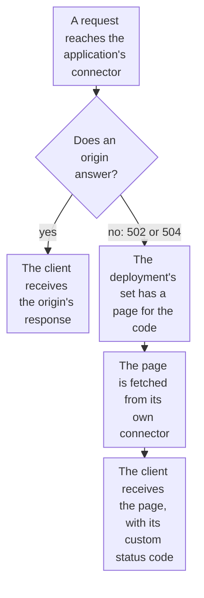

import DocCardGroup from '@aziontech/webkit/doc-card-group'
import DocCard from '@aziontech/webkit/doc-card'
import DocSteps from '@aziontech/webkit/doc-steps'
import DocStep from '@aziontech/webkit/doc-step'
import Tabs from '~/components/webkit/Tabs.vue'

You replace the error a [workload](/en/documentation/platform/workloads/) returns when no origin answers with a page of your own, from Azion Console or the API. To replace other status codes, such as a `404`, refer to [Customize an error page](/en/documentation/guides/application-development/getting-started/customizing-error-response-page/).

When no origin server can be selected, a request carries the upstream status `502`. When an HTTPS origin refuses the TLS handshake, the client receives `502` with the page titled `Azion - Default error page`. A custom page set binds a status code to a page that a [connector](/en/documentation/platform/connectors/) serves. A page for a code tagged Azion in the Console replaces the default Azion page.



1. A request reaches the connector that the application's _Set Connector_ rule names.
2. When an origin answers, the client receives its response.
3. When no origin answers, the response carries a `502` or a `504`, and the custom page set of the workload's deployment holds a page for that code.
4. Azion fetches the page from the page's own connector, at the page's path.
5. The client receives the page in place, with no redirect, and with the page's custom status code.

---

## Prerequisites

- A workload whose deployment names an application. To create one, refer to [Workloads quickstart](/en/documentation/platform/workloads/quickstart/).
- A connector that serves your error page at a path and reaches none of your origins, such as a connector of type `storage` that reads an [Object Storage](/en/documentation/platform/object-storage/) bucket. For its fields, refer to [Connector settings](/en/documentation/platform/connectors/settings/#storage).
- Access to Azion Console, for the Console procedure. Refer to [Access Azion Console](/en/documentation/guides/platform/account-and-billing/how-to-access-azion-console/).
- A [personal token](/en/documentation/guides/platform/account-and-billing/personal-tokens/) for the API procedure, with the ID of the page's connector, of the workload, of its deployment, and of the application the deployment names. If the deployment names a firewall, its ID too.

The examples serve the page at `/errors/503.html` on a connector named `error-pages`, for the domain `www.example.com`. Replace them with yours.

---

## Create a set with a page for each code

The set binds `502`, `503`, and `504` to the same page. In the [Custom page settings](/en/documentation/platform/workloads/custom-pages/settings/#status-codes), `502` is a gateway that received an invalid response, `503` a server that is not ready, and `504` a gateway that received no response in time. Each page answers with `503`, which marks a temporary condition.

The page comes from a connector that reaches none of your origins, because a page fetched from a failing origin fails with it. **Response TTL** sets how many seconds the page stays in cache, from 0 to 31,536,000. An error page is static and rarely changes, so a high value, such as `86400`, one day, keeps requests away from the page's connector.

<Tabs client:visible sharedStore="interface">
<Fragment slot="tab.console">Console</Fragment>
<Fragment slot="tab.api">API</Fragment>

<Fragment slot="panel.console">

To create the set in Azion Console:

<DocSteps>
  <DocStep title="Open the Custom Pages page">

  Access [Azion Console](https://console.azion.com/) > **Custom Pages**.

  </DocStep>
  <DocStep title="Start the set">

  Select **Create Custom Page**.

  </DocStep>
  <DocStep title="Name the set">

  In **Name**, enter a name that identifies the set, such as `origin-down`.

  </DocStep>
  <DocStep title="Select Create Custom Page Code" />
  <DocStep title="Select the status code">

  In **Page Code**, select `502`.

  </DocStep>
  <DocStep title="Keep the connector page type">

  In **Type**, keep _Page Connector_.

  </DocStep>
  <DocStep title="Select the page's connector">

  In **Connector**, select `error-pages`.

  </DocStep>
  <DocStep title="Enter the page path">

  In **Page Path (URI)**, enter `/errors/503.html`.

  </DocStep>
  <DocStep title="Set the cache time and the status">

  Enter `86400` in **Response TTL** and `503` in **Response Custom Status Code**.

  </DocStep>
  <DocStep title="Add the 503 and 504 codes">

  Select **Create Custom Page Code** again for **Page Code** `503` and `504`, with the same connector, path, **Response TTL**, and **Response Custom Status Code**.

  </DocStep>
  <DocStep title="Select Create" />
</DocSteps>

The **Page Codes** table lists one row per page, with its **Page Status Code**, **Page Path (URI)**, **Custom Status Code**, and **Response TTL**.

</Fragment>

<Fragment slot="panel.api">

To create the set with the API, send a `POST` request to the custom pages endpoint, with one entry in `pages` per status code. Replace `<connector-id>` with the ID of `error-pages`:

```bash
curl --request POST \
  --url https://api.azion.com/v4/workspace/custom_pages \
  --header 'Accept: application/json' \
  --header 'Authorization: Token <personal-token>' \
  --header 'Content-Type: application/json' \
  --data '{"name": "origin-down", "active": true, "pages": [
  {"code": "502", "page": {"type": "page_connector", "attributes": {"connector": <connector-id>, "ttl": 86400, "uri": "/errors/503.html", "custom_status_code": 503}}},
  {"code": "503", "page": {"type": "page_connector", "attributes": {"connector": <connector-id>, "ttl": 86400, "uri": "/errors/503.html", "custom_status_code": 503}}},
  {"code": "504", "page": {"type": "page_connector", "attributes": {"connector": <connector-id>, "ttl": 86400, "uri": "/errors/503.html", "custom_status_code": 503}}}
]}'
```

The API answers `201` with the new set, its `id` included. Record the `id` for the next task.

</Fragment>
</Tabs>

The set holds one page for each of the three codes. It serves nothing until a workload's deployment names it.

---

## Assign the set in the workload's deployment

The deployment of a workload names its application, its firewall, and its custom page set. Only the custom page set changes here, so the application and the firewall keep the values the workload uses today. The Azion CLI sets the custom page set only when it creates a deployment, and a workload holds one deployment, so this task uses Azion Console or the API.

<Tabs client:visible sharedStore="interface">
<Fragment slot="tab.console">Console</Fragment>
<Fragment slot="tab.api">API</Fragment>

<Fragment slot="panel.console">

To assign the set in Azion Console:

<DocSteps>
  <DocStep title="Open the Workloads page">

  Access [Azion Console](https://console.azion.com/) > **Workloads**.

  </DocStep>
  <DocStep title="Open the workload">

  Select the workload that serves `www.example.com`.

  </DocStep>
  <DocStep title="Select the set">

  In **Deployment Settings**, select `origin-down` in **Custom Page**. Keep **Application** and **Firewall** as they are.

  </DocStep>
  <DocStep title="Select Save" />
</DocSteps>

Azion Console shows `Your workload has been updated`.

</Fragment>

<Fragment slot="panel.api">

To assign the set with the API, send a `PATCH` request to the deployment of the workload, with the application the deployment names today and the ID of the set in `custom_page`. Leave out `firewall` if the deployment has no firewall:

```bash
curl --request PATCH \
  --url https://api.azion.com/v4/workspace/workloads/<workload-id>/deployments/<deployment-id> \
  --header 'Accept: application/json' \
  --header 'Authorization: Token <personal-token>' \
  --header 'Content-Type: application/json' \
  --data '{
  "strategy": {
    "type": "default",
    "attributes": {
      "application": <application-id>,
      "firewall": <firewall-id>,
      "custom_page": <custom-page-id>
    }
  }
}'
```

The API answers `202`.

</Fragment>
</Tabs>

The deployment of the workload names the set. A deployment change takes several minutes to reach Azion's distributed infrastructure, and requests can receive Azion's default page until it does.

---

## Confirm the page replaces the error

The check takes your origins out of service, so run it in a maintenance window.

To confirm the page:

<DocSteps>
  <DocStep title="Stop every origin of the application's connector">

  Stop the web server on each origin, or block the connections from Azion at its firewall.

  </DocStep>
  <DocStep title="Request your domain">

  ```bash
  curl -s -D - https://www.example.com/
  ```

  </DocStep>
  <DocStep title="Start the origins again" />
</DocSteps>

The response carries status `503`, from the page's **Response Custom Status Code**, and the body of `/errors/503.html`, not the page titled `Azion - Default error page`. It carries no `Location` header, so the client is not redirected. If the default page still arrives after the deployment change has spread, refer to [Troubleshoot Workloads](/en/documentation/platform/workloads/troubleshooting/#custom-pages).

---

## Next steps

<DocCardGroup cols={2}>
  <DocCard title="Custom page settings" href="/en/documentation/platform/workloads/custom-pages/settings/" label="Every field of a set and its pages, and the 22 status codes a page can replace." />
  <DocCard title="Add a backup origin to a connector" href="/en/documentation/guides/application-performance/availability/add-a-backup-origin-to-a-connector/" label="Keep a standby origin answering before the error page is needed." />
  <DocCard title="Customize an error page" href="/en/documentation/guides/application-development/getting-started/customizing-error-response-page/" label="Replace the error responses of other status codes, each page with its own cache time." />
  <DocCard title="Keep an application online when an origin fails" href="/en/documentation/use-cases/improve-performance-and-reliability/keep-an-application-online-when-an-origin-fails/" label="A primary and a standby origin in one pool, with this page when both fail." />
</DocCardGroup>
