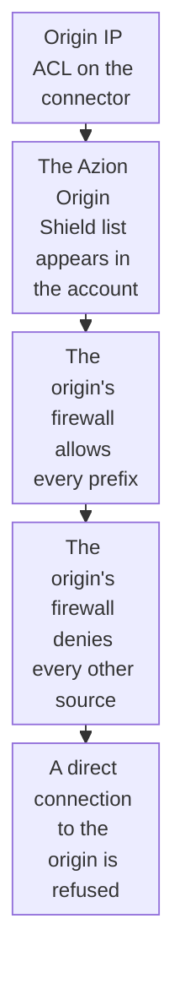

import DocCardGroup from '@aziontech/webkit/doc-card-group'
import DocCard from '@aziontech/webkit/doc-card'
import DocSteps from '@aziontech/webkit/doc-steps'
import DocStep from '@aziontech/webkit/doc-step'
import Tabs from '~/components/webkit/Tabs.vue'

You restrict an origin to Azion's addresses by turning on Origin IP ACL on its [connector](/en/documentation/platform/connectors/) from Azion Console or the API, then allowing the `Azion Origin Shield` list at the origin's firewall. To read that list from Azion Console, the Azion CLI, or the API, refer to [Allow Azion's IP ranges at your origin](/en/documentation/guides/application-security/bots-and-network/retrieve-azion-ip-ranges/).

An origin on the public internet answers anyone who finds its address, so a client can reach it around the application and every protection in front of it. Origin IP ACL is part of [Origin Shield](/en/documentation/platform/connectors/#origin-shield) on a connector of type `http`. It makes the `Azion Origin Shield` network list available to your account, with every IPv4 and IPv6 prefix that Azion's infrastructure uses to connect to origins. Your origin's firewall enforces the allowlist, not Azion.



1. You turn on Origin Shield and Origin IP ACL on the connector.
2. The `Azion Origin Shield` list appears in your account.
3. Your origin's firewall allows inbound traffic from each prefix of the list.
4. Only after every prefix is allowed, the firewall denies every other source.
5. A client that connects to the origin's address directly is refused, while requests through your domain keep reaching the origin.

---

## Prerequisites

- A connector of type `http` that reaches your origin. Origin Shield applies to that type alone. To create one, refer to [Connectors quickstart](/en/documentation/platform/connectors/quickstart/).
- Access to the firewall that protects your origin server, where the allowlist goes.
- The **View Network Lists** permission, to read the list. For more information, refer to [Network Lists](/en/documentation/platform/firewall/network-shield/network-lists/#permissions).
- Access to Azion Console, for the Console procedure. Refer to [Access Azion Console](/en/documentation/guides/platform/account-and-billing/how-to-access-azion-console/).
- A [personal token](/en/documentation/guides/platform/account-and-billing/personal-tokens/) and the ID of the connector, for the API procedure.

The examples use `www.example.com` for the domain the application serves. Replace it with yours.

---

## Turn on Origin IP ACL on the connector

Origin Shield turns on at two levels. One switch enables Origin Shield on the connector, and inside it the Origin IP ACL switch stays off until you turn it on. Origin Shield and Load Balancer can both be on for the same connector.

<Tabs client:visible sharedStore="interface">
<Fragment slot="tab.console">Console</Fragment>
<Fragment slot="tab.api">API</Fragment>

<Fragment slot="panel.console">

To turn on Origin IP ACL in Azion Console:

<DocSteps>
  <DocStep title="Open the connector">

  Access [Azion Console](https://console.azion.com/) > **Connectors**, and select the connector that reaches your origin.

  </DocStep>
  <DocStep title="Turn on Origin Shield">

  In **Modules**, turn on **Origin Shield**. The **Origin IP ACL** switch and the **HMAC** section appear.

  </DocStep>
  <DocStep title="Turn on Origin IP ACL">

  Turn on **Origin IP ACL**.

  </DocStep>
  <DocStep title="Select Save" />
</DocSteps>

The connector has Origin IP ACL on.

</Fragment>

<Fragment slot="panel.api">

To turn on Origin IP ACL with the API, send a `PATCH` request with the keys that change. A `PATCH` merges them into the stored connector:

```bash
curl --request PATCH \
  --url https://api.azion.com/v4/workspace/connectors/<connector-id> \
  --header 'Accept: application/json' \
  --header 'Authorization: Token <personal-token>' \
  --header 'Content-Type: application/json' \
  --data '{"attributes":{"modules":{"origin_shield":{"enabled":true,"config":{"origin_ip_acl":{"enabled":true}}}}}}'
```

The API answers `202` with `"state": "pending"`. With `enabled` set to `true` and no `config`, the API refuses the request with `28014`.

</Fragment>
</Tabs>

The connector has Origin IP ACL on, and the `Azion Origin Shield` list appears in your account once at least one connector has Origin IP ACL on. The switch reaches traffic over several minutes, and data centers apply it at different times.

---

## Allow the list at your origin's firewall

The allowlist filters on the source address of each connection, at layers 3 and 4, so it acts before your server reads a request. The list carries IPv6 prefixes for all of Azion's data centers beside its IPv4 prefixes, and an allowlist with only the IPv4 prefixes refuses the connections Azion opens over IPv6.

Read the prefixes of the list as [Find the Azion Origin Shield list](/en/documentation/guides/application-security/bots-and-network/retrieve-azion-ip-ranges/#find-the-azion-origin-shield-list) describes. Then, to apply them at your origin:

<DocSteps>
  <DocStep title="Allow every prefix in the list">

  In your origin's firewall, allow inbound traffic from each IPv4 and IPv6 prefix of the list.

  </DocStep>
  <DocStep title="Deny every other source">

  Deny inbound traffic from all other addresses. Make this change only after every prefix is allowed, or requests from Azion are refused until the allowlist is complete.

  </DocStep>
</DocSteps>

Only Azion's infrastructure can connect to your origin. Traffic that reaches the origin without Azion, such as your own administrative access, is refused too unless you allow it separately.

Azion updates the list and emails every account with Origin Shield each time it changes. The servers behind an added prefix go into production 7 days after Azion publishes the list, so a job that reads the list on a schedule shorter than 7 days keeps your allowlist current. For that job, refer to [Keep the allowlist current](/en/documentation/guides/application-security/bots-and-network/retrieve-azion-ip-ranges/#keep-the-allowlist-current).

:::note
A source address on the list proves that a connection came from Azion's infrastructure, not from your connector, because the list holds the addresses Azion uses for every account. For an origin that must also accept only requests signed with your credentials, refer to [Sign origin requests with HMAC](/en/documentation/guides/application-development/getting-started/sign-origin-requests-with-hmac/).
:::

---

## Confirm the origin refuses direct connections

The check compares a request through your domain with a connection to the origin's own address.

To confirm the restriction:

<DocSteps>
  <DocStep title="Request your domain">

  ```bash
  curl -sI https://www.example.com/
  ```

  The application answers as before, because the request reaches the origin from an Azion address.

  </DocStep>
  <DocStep title="Connect to the origin directly">

  From a host outside Azion, such as your own machine, send a request to the origin's own address.

  </DocStep>
</DocSteps>

The origin's firewall refuses the direct connection or lets it time out, while requests through `www.example.com` keep answering. Your origin accepts connections from Azion only.

---

## Next steps

<DocCardGroup cols={2}>
  <DocCard title="Origin IP ACL and HMAC" href="/en/documentation/platform/connectors/origin-shield/origin-ip-acl-and-hmac/" label="What the allowlist and the signature each prove, and how Azion updates the list." />
  <DocCard title="Allow Azion's IP ranges at your origin" href="/en/documentation/guides/application-security/bots-and-network/retrieve-azion-ip-ranges/" label="Read the Azion Origin Shield list from Azion Console, the Azion CLI, or the API." />
  <DocCard title="Accelerate websites and APIs with a CDN" href="/en/documentation/use-cases/improve-performance-and-reliability/accelerate-websites-and-apis-with-a-cdn/" label="A cached site in front of an origin that accepts connections from Azion only." />
  <DocCard title="Protect web applications from OWASP Top 10 and zero-day attacks" href="/en/documentation/use-cases/secure-applications-and-networks/protect-web-applications-from-owasp-top-10-and-zero-day-attacks/" label="A firewall policy that no client can bypass by reaching the origin directly." />
</DocCardGroup>
