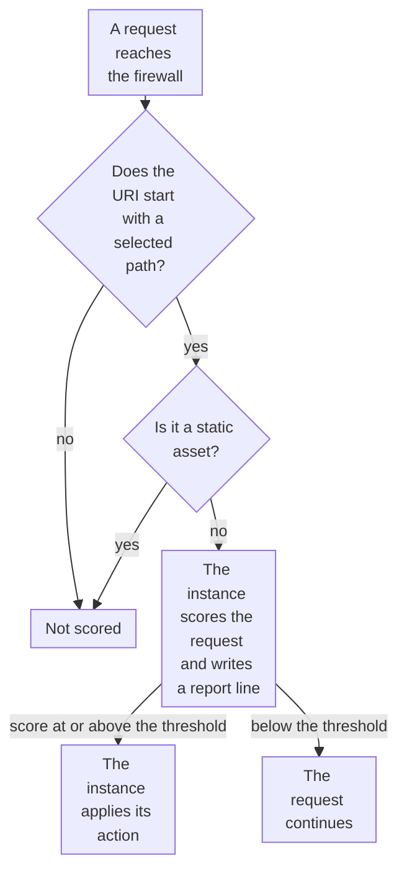

import DocCardGroup from '@aziontech/webkit/doc-card-group'
import DocCard from '@aziontech/webkit/doc-card'
import DocSteps from '@aziontech/webkit/doc-steps'
import DocStep from '@aziontech/webkit/doc-step'
import Tabs from '~/components/webkit/Tabs.vue'

You run a Bot Manager instance on the paths you choose, such as `/account/` and `/checkout/`, from Azion Console, the Azion CLI, or the API. To run one instance on every request a firewall receives, refer to [Run Bot Manager on every request](/en/documentation/guides/application-security/bots-and-network/run-on-every-request/).

Bot Manager bills each request it scores, and a path that no rule matches is not scored. One instance carries one threshold and one action, so paths that differ in value, such as a catalog and a checkout, take an instance each, with its own rule.



1. The rule compares the request URI with the selected paths. A request to any other path is not scored.
2. A request for an image, a stylesheet, a script, or another static asset on those paths is not scored either.
3. The instance scores every other request and writes a report line tagged with its `log_tag`.
4. A request whose score reaches the threshold receives the instance's action, and a request below it continues.

---

## Prerequisites

- A firewall bound to the workload that serves the paths, with Functions turned on in its main settings. Refer to the [Bot Manager quickstart](/en/documentation/platform/firewall/bot-manager/quickstart/).
- Bot Manager enabled on the account, or Bot Manager Lite installed from Azion Marketplace, and the ID of the installed function for the CLI and the API. To install Bot Manager Lite, refer to [Install Bot Manager Lite](/en/documentation/guides/application-development/integrations/bot-manager-lite/).
- A [personal token](/en/documentation/guides/platform/account-and-billing/personal-tokens/), for the API and the CLI.
- The [Azion CLI](/en/documentation/devtools/cli/) installed and authorized, for the CLI procedure.
- Access to Azion Console, for the Console procedure. Refer to [Access Azion Console](/en/documentation/guides/platform/account-and-billing/how-to-access-azion-console/).

The examples score `/account/` and `/checkout/` on `www.example.com`, with the instance `checkout-bots` on the firewall `<firewall-id>`. Replace them with your paths, names, and firewall.

---

## Create an instance for the paths

The instance takes one JSON arguments object, and nothing validates it: a misspelled key such as `thresold` is stored, and the function never reads it. Write `threshold` and `action` on every instance. Bot Manager Lite ships `deny` at `30`, and Bot Manager documents `allow` at `Infinity`, so an instance that sets neither refuses requests on one edition and passes them on the other. The object below starts in observation mode: `action` is `allow`, so nothing is refused, and `internal_logs` is `2`, so every request writes a report line. `log_tag` names this instance in those lines.

```json
{ "threshold": 15, "action": "allow", "internal_logs": 2, "log_tag": "checkout-bots" }
```

Run it for 24 to 72 hours, then set `threshold` in the gap between the scores of the clients you recognize and the automated ones, and choose one of the seven actions:

| `action` | What the function does at the threshold |
| --- | --- |
| `allow` | Lets the request continue, whatever its score |
| `custom_html` | Returns the HTML in `custom_html`, with the status code in `custom_status_code` |
| `deny` | Returns `403` with Azion's default error page |
| `drop` | Terminates the request without a response |
| `hold_connection` | Holds the connection open for 1 minute, then drops the request |
| `random_delay` | Waits a random period between 1 and 10 seconds, then lets the request continue |
| `redirect` | Redirects the request to the location in `redirect_to` |

A value outside the seven is read as `allow`, and so are `custom_html` and `redirect` without their second argument. On Bot Manager, `mode` set to `api` scores web services and API traffic that carries no cookies. For the starting threshold per kind of path, refer to [Run a stricter Bot Manager instance on a high-value path](/en/documentation/platform/firewall/best-practices/#run-a-stricter-bot-manager-instance-on-a-high-value-path).

<Tabs client:visible sharedStore="interface">
<Fragment slot="tab.console">Console</Fragment>
<Fragment slot="tab.cli">CLI</Fragment>
<Fragment slot="tab.api">API</Fragment>

<Fragment slot="panel.console">

To create the instance in Azion Console:

<DocSteps>
  <DocStep title="Open the firewall bound to your workload">

  Access [Azion Console](https://console.azion.com/) > **Firewalls**, then select the firewall.

  </DocStep>
  <DocStep title="Select the Functions Instances tab" />
  <DocStep title="Select + Function">

  On a firewall that carries no instance yet, the button reads **+ Function Instance**.

  </DocStep>
  <DocStep title="Name the instance">

  In the **General** section, enter `checkout-bots` as the **Name**.

  </DocStep>
  <DocStep title="Select the Bot Manager function">

  In the **Function** section, select the installed Bot Manager or Bot Manager Lite function.

  </DocStep>
  <DocStep title="Enter the arguments">

  In the **Arguments** section, enter the object.

  </DocStep>
  <DocStep title="Select Save" />
</DocSteps>

The instance appears in the **Functions Instances** list, which shows its **Name**, **Function**, **Last Editor**, and **Last Modified**.

</Fragment>

<Fragment slot="panel.cli">

To create the instance with the Azion CLI, save the object as `bmargs.json`. The `--args` flag takes the path to that file, not inline JSON:

```bash
azion create firewall-instance --name checkout-bots --firewall-id <firewall-id> \
  --function-id <function-id> --args bmargs.json --active true
```

The command prints the ID of the instance:

```text
Created Firewall Function Instance with ID <instance-id>
```

Keep that ID. The rule names the instance by it, never by the ID of the function.

</Fragment>

<Fragment slot="panel.api">

To create the instance with the API, send the ID of the installed function and the arguments:

```bash
curl --request POST \
  --url https://api.azion.com/v4/workspace/firewalls/<firewall-id>/functions \
  --header 'Authorization: Token <personal-token>' \
  --header 'Content-Type: application/json' \
  --data '{
  "name": "checkout-bots",
  "function": <function-id>,
  "active": true,
  "args": { "threshold": 15, "action": "allow", "internal_logs": 2, "log_tag": "checkout-bots" }
}'
```

The API answers `202` with a `state` of `pending`, and echoes `args` unchanged. Keep the instance's `id`:

```json
{"state":"pending","data":{"id":<instance-id>,"name":"checkout-bots","args":{"threshold":15,"action":"allow","internal_logs":2,"log_tag":"checkout-bots"},...}}
```

</Fragment>
</Tabs>

The instance exists on the firewall and scores nothing until a rule runs it.

---

## Create the rule that runs it on the paths

The rule holds two blocks of criteria, and a request matches it only when it matches both. The first block names the paths, each joined by `or`: `Request Uri` _starts with_ `/account/`, or _starts with_ `/checkout/`. The second block keeps static assets out, because none is a client and each is a request Bot Manager bills: `Request Uri` _does not match_ this expression, which also matches an asset requested with a query string:

```text
\.(png|jpg|jpeg|gif|ico|css|js|svg|woff|woff2|ttf|eot|otf|webp|avif|mp4|webm|pdf)(\?.*)?$
```

The _Run Function_ behavior names the instance, and a rule carries at most one, so a second instance on other paths takes a second rule.

<Tabs client:visible sharedStore="interface">
<Fragment slot="tab.console">Console</Fragment>
<Fragment slot="tab.cli">CLI</Fragment>
<Fragment slot="tab.api">API</Fragment>

<Fragment slot="panel.console">

To create the rule in Azion Console:

<DocSteps>
  <DocStep title="Open the firewall's Rules Engine tab">

  Access [Azion Console](https://console.azion.com/) > **Firewalls**, select the firewall, then select the **Rules Engine** tab.

  </DocStep>
  <DocStep title="Select + Rule" />
  <DocStep title="Name the rule">

  Enter `checkout - score clients`.

  </DocStep>
  <DocStep title="Set the first path">

  In the **Criteria** section, select the `Request Uri` variable, the _starts with_ operator, and `/account/` as the argument.

  </DocStep>
  <DocStep title="Add the second path">

  Select **Or**, then `Request Uri`, _starts with_, and `/checkout/`.

  </DocStep>
  <DocStep title="Exclude static assets">

  Select **Add Criteria**. In the new block, select `Request Uri`, _does not match_, and the expression above.

  </DocStep>
  <DocStep title="Add the Run Function behavior">

  In the **Behaviors** section, select **Run Function**, then `checkout-bots`.

  </DocStep>
  <DocStep title="Select Save" />
</DocSteps>

</Fragment>

<Fragment slot="panel.cli">

To create the rule with the Azion CLI, save it as `rule.json`, with the ID of the instance in `value`. Inside the JSON string, each backslash of the expression is escaped once more:

```json
{
  "name": "checkout - score clients",
  "active": true,
  "criteria": [
    [
      { "variable": "${request_uri}", "conditional": "if", "operator": "starts_with", "argument": "/account/" },
      { "variable": "${request_uri}", "conditional": "or", "operator": "starts_with", "argument": "/checkout/" }
    ],
    [
      { "variable": "${request_uri}", "conditional": "if", "operator": "does_not_match", "argument": "\\.(png|jpg|jpeg|gif|ico|css|js|svg|woff|woff2|ttf|eot|otf|webp|avif|mp4|webm|pdf)(\\?.*)?$" }
    ]
  ],
  "behaviors": [
    { "type": "run_function", "attributes": { "value": <instance-id> } }
  ]
}
```

Then create the rule from the file:

```bash
azion create firewall-rule --firewall-id <firewall-id> --file rule.json
```

The command prints the ID of the new rule:

```text
Created Firewall Rule with ID <rule-id>
```

</Fragment>

<Fragment slot="panel.api">

To create the rule with the API, send both blocks, with the ID of the instance in `value`. Inside the JSON string, each backslash of the expression is escaped once more:

```bash
curl --request POST \
  --url https://api.azion.com/v4/workspace/firewalls/<firewall-id>/request_rules \
  --header 'Authorization: Token <personal-token>' \
  --header 'Content-Type: application/json' \
  --data '{
  "name": "checkout - score clients",
  "active": true,
  "criteria": [
    [
      { "variable": "${request_uri}", "conditional": "if", "operator": "starts_with", "argument": "/account/" },
      { "variable": "${request_uri}", "conditional": "or", "operator": "starts_with", "argument": "/checkout/" }
    ],
    [
      { "variable": "${request_uri}", "conditional": "if", "operator": "does_not_match", "argument": "\\.(png|jpg|jpeg|gif|ico|css|js|svg|woff|woff2|ttf|eot|otf|webp|avif|mp4|webm|pdf)(\\?.*)?$" }
    ]
  ],
  "behaviors": [{ "type": "run_function", "attributes": { "value": <instance-id> } }]
}'
```

The API answers `202` with a `state` of `pending`, and adds the `order` the rule holds among the rules of the firewall.

</Fragment>
</Tabs>

The instance scores every request to `/account/` and `/checkout/` except static assets, and no request to any other path. A format added to your site later is scored until you add it to the expression.

---

## Confirm the instance scores only the paths

A new rule reaches traffic 6 minutes 29 seconds to 9 minutes 18 seconds after you save it, and a change to an instance's arguments about 105 seconds after. Repeat each check until the answers agree.

To confirm what the instance scores:

1. Send one request with no user agent to a selected path, and one to a path outside them:

   ```bash
   curl -A "" https://www.example.com/checkout/
   curl -A "" https://www.example.com/
   ```

2. Query the `functionConsoleEvents` dataset for the report lines, with a `tsRange` that covers the requests:

   ```bash
   curl --request POST \
     --url https://api.azion.com/v4/events/graphql \
     --header 'Authorization: Token <personal-token>' \
     --header 'Content-Type: application/json' \
     --data '{"query":"{ functionConsoleEvents(limit: 200, filter: { tsRange: { begin: \"2030-01-01T10:00:00\", end: \"2030-01-01T11:00:00\" } }, orderBy: [ts_ASC]) { ts line } }"}'
   ```

3. Read the lines. The request to `/checkout/` has one, which opens with the instance's tag and carries `request_uri`, `score`, `matched_rules`, and `action`:

   ```text
   [Bot-Protection][checkout-bots] Report:  {"request_id":"<request-id>",…,"request_uri":"/checkout/",…,"score":<score>,…,"action":"allow","matched_rules":[…]}
   ```

   The request to `/` has no line, because the rule does not match it.

The instance scores the selected paths and nothing else. Read `score` and `matched_rules` rather than `classified`, which depends on the threshold in force. For every field of a line, refer to [Logs](/en/documentation/platform/firewall/bot-manager/logs/), and to raise the action once the window closes, refer to [Refuse requests above the threshold](/en/documentation/guides/application-security/bots-and-network/refuse-above-threshold/).

---

## Next steps

<DocCardGroup cols={2}>
  <DocCard title="Refuse requests above the threshold" href="/en/documentation/guides/application-security/bots-and-network/refuse-above-threshold/" label="Move the instance from allow to an action that refuses automated clients." />
  <DocCard title="Read the report log for one instance" href="/en/documentation/guides/application-security/bots-and-network/read-the-report-log/" label="Query the lines one instance wrote, with their scores and matched rules." />
  <DocCard title="Arguments" href="/en/documentation/platform/firewall/bot-manager/arguments/" label="Every argument an instance accepts, with its type, its default, and the values it takes." />
  <DocCard title="Firewall best practices" href="/en/documentation/platform/firewall/best-practices/#bot-manager" label="Thresholds per kind of path, observation windows, and static asset exclusion." />
  <DocCard title="Protect web applications from OWASP Top 10 and zero-day attacks" href="/en/documentation/use-cases/secure-applications-and-networks/protect-web-applications-from-owasp-top-10-and-zero-day-attacks/" label="An instance that scores every page request of a web application, static assets excluded." />
  <DocCard title="Protect public APIs from abuse" href="/en/documentation/use-cases/secure-applications-and-networks/protect-public-apis-from-abuse/" label="An instance in api mode that scores the clients of an API path." />
  <DocCard title="Block account takeover on login and checkout flows" href="/en/documentation/use-cases/secure-applications-and-networks/block-account-takeover-on-login-and-checkout-flows/" label="One observation instance on login, signup, and checkout, then stricter instances per path." />
  <DocCard title="Run Bot Manager on every request" href="/en/documentation/guides/application-security/bots-and-network/run-on-every-request/" label="The rule that hands every request a firewall receives to one instance." />
</DocCardGroup>
