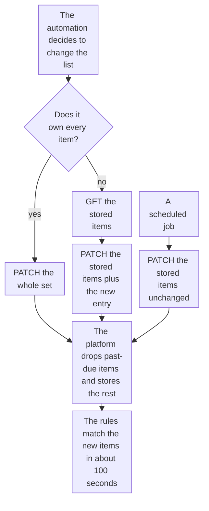

import DocCardGroup from '@aziontech/webkit/doc-card-group'
import DocCard from '@aziontech/webkit/doc-card'
import DocSteps from '@aziontech/webkit/doc-steps'
import DocStep from '@aziontech/webkit/doc-step'
import Tabs from '~/components/webkit/Tabs.vue'

You make an automation, such as a SIEM or SOAR playbook or a scheduled script, write the items of a network list through the Azion API or the Azion CLI, and make the same change by hand from Azion Console. To create a list with a dated entry and the rule that denies it, refer to [Block addresses until a date](/en/documentation/guides/application-security/bots-and-network/temporary-block/).

A firewall rule names its network list by ID, so a change to the items changes what every rule that reads the list matches, with no change to any rule. The automation that already tracks the addresses is the one that writes them, and the platform applies each due date at the next write.



1. An automation that owns every item of the list sends the whole set in one write.
2. An automation that shares the list reads the stored items first, then writes them back with its new entry.
3. A scheduled job writes the stored items back unchanged, so the entries past their due date leave the list.
4. On each write, the platform drops the items already past due and stores the rest as sent. The rules match the new items once the change reaches traffic.

---

## Prerequisites

- A network list of the `ip_cidr` type, and the firewall rule that reads it. To create both, refer to [Block addresses until a date](/en/documentation/guides/application-security/bots-and-network/temporary-block/).
- A [personal token](/en/documentation/guides/platform/account-and-billing/personal-tokens/) for the automation, created by a user whose team holds the **Edit Network Lists** permission. For the permission, refer to [Permissions](/en/documentation/platform/firewall/network-shield/network-lists/#permissions).
- The [Azion CLI](/en/documentation/devtools/cli/) installed and authorized, for the CLI procedure.
- Access to Azion Console, for the Console procedure. Refer to [Access Azion Console](/en/documentation/guides/platform/account-and-billing/how-to-access-azion-console/).

The examples write the list `<network-list-id>`, which holds the permanent entry `192.0.2.10 #permanent block`, and add `198.51.100.7` until `2030-01-01T00:00:00Z`. Replace them with your list, entries, and dates.

---

## Add an entry to the list

A `PATCH` that sends `items` replaces the whole array, so an automation that sends only its new entry removes every other one. It reads the stored items, adds its entry, and writes the array back. An entry can carry a due date, `--LT` and a UTC date and time in whole seconds ending in `Z`, and a comment after `#`, last on the line. The comment can name the detection or the ticket behind the entry. The API reports only the first invalid entry of a write, in `meta.index` and `meta.value`, so validate the whole array before you send it.

<Tabs client:visible sharedStore="interface">
<Fragment slot="tab.console">Console</Fragment>
<Fragment slot="tab.cli">CLI</Fragment>
<Fragment slot="tab.api">API</Fragment>

<Fragment slot="panel.console">

To add the entry by hand:

<DocSteps>
  <DocStep title="Open the list">

  Access [Azion Console](https://console.azion.com/) > **Edge Libraries** > **Network Lists**, and select the list.

  </DocStep>
  <DocStep title="Add the entry">

  In the **List** field, add `198.51.100.7 --LT2030-01-01T00:00:00Z #<detection-id>` on its own line.

  </DocStep>
  <DocStep title="Select Save" />
</DocSteps>

Azion Console confirms with the message `Your Network List has been updated.`

</Fragment>

<Fragment slot="panel.cli">

To add the entry from a script, pass it to `--add-item`, which reads the list first and keeps the items already there:

```bash
azion update network-list --network-list-id <network-list-id> --add-item "198.51.100.7 --LT2030-01-01T00:00:00Z #<detection-id>"
```

The command prints the ID of the list:

```text
Updated Network List with ID <network-list-id>
```

`--add-item` takes comma-separated values, so a comment in it carries no comma.

</Fragment>

<Fragment slot="panel.api">

To add the entry from the automation, read the stored items first:

```bash
curl --request GET \
  --url https://api.azion.com/v4/workspace/network_lists/<network-list-id> \
  --header 'Authorization: Token <personal-token>' \
  --header 'Accept: application/json'
```

The API answers `200` with the list and its `items`:

```json
{"data":{"id":<network-list-id>,"type":"ip_cidr","items":["192.0.2.10 #permanent block"],...}}
```

Then send every stored item plus the new entry:

```bash
curl --request PATCH \
  --url https://api.azion.com/v4/workspace/network_lists/<network-list-id> \
  --header 'Authorization: Token <personal-token>' \
  --header 'Content-Type: application/json' \
  --data '{"items":["192.0.2.10 #permanent block","198.51.100.7 --LT2030-01-01T00:00:00Z #<detection-id>"]}'
```

The API answers `200` and stores the items exactly as sent, annotations included:

```json
{"state":"executed","data":{"id":<network-list-id>,"type":"ip_cidr","items":["192.0.2.10 #permanent block","198.51.100.7 --LT2030-01-01T00:00:00Z #<detection-id>"],...}}
```

</Fragment>
</Tabs>

The list holds the new entry beside every entry it held before. The rules that read it match `198.51.100.7` once the change reaches traffic, 46 seconds to about 100 seconds after the write.

In the [Block attackers automatically from SIEM detections](/en/documentation/use-cases/secure-applications-and-networks/block-attackers-automatically-from-siem-detections/) use case, this section takes these values:

| Setting | Value |
| --- | --- |
| List | `siem-blocklist`, which holds the permanent entry `192.0.2.10 #permanent block` |
| New entry | The detected address, a due date 24 hours after the detection, and the detection's ID as the comment, such as `198.51.100.23 --LT2030-01-01T00:00:00Z #DET-4471`, with `2030-01-01T00:00:00Z` standing for the detection time plus 24 hours |
| Write | `PATCH /v4/workspace/network_lists/<network-list-id>`, whose `items` hold every current entry and the new one: `192.0.2.10 #permanent block` and `198.51.100.23 --LT2030-01-01T00:00:00Z #DET-4471` for `DET-4471` |

The API answers `200` and stores the items exactly as sent. The playbook validates every entry before it sends the array, because a refused write names only the first invalid entry.

In the [Block attackers automatically from SIEM detections](/en/documentation/use-cases/secure-applications-and-networks/block-attackers-automatically-from-siem-detections/) use case, expect:

- **The write kept every other entry.** The list's `items` hold the permanent entry, every earlier detection still in force, and the new entry.

In the [Screen file uploads for malicious content](/en/documentation/use-cases/secure-applications-and-networks/screen-file-uploads-for-malicious-content/) use case, this section takes these values:

| Setting | Value |
| --- | --- |
| Later senders | `<sender-address> --LT<upload-date-plus-7-days> #<request-id>`, added by reading `upload-senders` and writing it back with the new entry |

---

## Replace the list from your source of truth

When another system already tracks every address, such as a SIEM or an inventory, let it own the list and send the whole set on each write. Each write then leaves exactly what was sent, and the next write repairs one that failed. Each write also overwrites every other editor, so give the list one owner, and keep manual blocks in a list of their own, with its own rule. A list holds 1 to 20,000 items of up to 250 characters each, annotations included.

<Tabs client:visible sharedStore="interface">
<Fragment slot="tab.console">Console</Fragment>
<Fragment slot="tab.cli">CLI</Fragment>
<Fragment slot="tab.api">API</Fragment>

<Fragment slot="panel.console">

To replace the items by hand:

<DocSteps>
  <DocStep title="Open the list">

  Access [Azion Console](https://console.azion.com/) > **Edge Libraries** > **Network Lists**, and select the list.

  </DocStep>
  <DocStep title="Replace the entries">

  In the **List** field, replace every line with the set from your source of truth, one entry per line.

  </DocStep>
  <DocStep title="Select Save" />
</DocSteps>

Azion Console confirms with the message `Your Network List has been updated.`

</Fragment>

<Fragment slot="panel.cli">

To replace the items from a script, pass the whole set to `--items`, which replaces every item, as a `PATCH` does:

```bash
azion update network-list --network-list-id <network-list-id> --items "192.0.2.10,203.0.113.0/24"
```

The command prints the ID of the list:

```text
Updated Network List with ID <network-list-id>
```

</Fragment>

<Fragment slot="panel.api">

To replace the items from the automation, send the whole set in one `PATCH`, with no read first:

```bash
curl --request PATCH \
  --url https://api.azion.com/v4/workspace/network_lists/<network-list-id> \
  --header 'Authorization: Token <personal-token>' \
  --header 'Content-Type: application/json' \
  --data '{"items":["192.0.2.10 #permanent block","203.0.113.0/24 #partner abuse"]}'
```

The API answers `200` with `state` set to `executed`, and `items` holds exactly the set you sent, without exact duplicates.

</Fragment>
</Tabs>

The list holds the set from your source of truth and nothing else. An entry the source dropped stops matching once the change reaches traffic.

---

## Remove expired entries on a schedule

A due date never removes an entry by itself. The platform reads due dates only when the items are written: each write drops the entries already past due, and an entry whose date passes after the write keeps matching. A scheduled job that writes the stored items back is what ends each block, and how often it runs sets how long an expired entry keeps matching. When every item is past due, the write is refused with `22019`, so keep one entry with no due date in the list.

<Tabs client:visible sharedStore="interface">
<Fragment slot="tab.console">Console</Fragment>
<Fragment slot="tab.cli">CLI</Fragment>
<Fragment slot="tab.api">API</Fragment>

<Fragment slot="panel.console">

To remove an expired entry by hand:

<DocSteps>
  <DocStep title="Open the list">

  Access [Azion Console](https://console.azion.com/) > **Edge Libraries** > **Network Lists**, and select the list.

  </DocStep>
  <DocStep title="Delete the expired line">

  In the **List** field, delete the line whose due date has passed. The form flags that line with `the --LT date must be in the future`.

  </DocStep>
  <DocStep title="Select Save" />
</DocSteps>

Azion Console confirms with the message `Your Network List has been updated.`

</Fragment>

<Fragment slot="panel.cli">

`--remove-item` matches an entry exactly as the list stores it, with its due date and comment. Given the address alone, it removes nothing and still prints the same line. To read the stored entries:

```bash
azion describe network-list --network-list-id <network-list-id>
```

The `Items` row lists them:

```text
Items:           ["192.0.2.10 #permanent block","198.51.100.7 --LT2030-01-01T00:00:00Z #<detection-id>"]
```

Pass the expired entry exactly as the row shows it:

```bash
azion update network-list --network-list-id <network-list-id> --remove-item "198.51.100.7 --LT2030-01-01T00:00:00Z #<detection-id>"
```

```text
Updated Network List with ID <network-list-id>
```

</Fragment>

<Fragment slot="panel.api">

To drop every expired entry from the job, read the stored items with the `GET` from the first task, then send them back unchanged. After the due date of `198.51.100.7`, written below as `<past-due-date>`, the write is:

```bash
curl --request PATCH \
  --url https://api.azion.com/v4/workspace/network_lists/<network-list-id> \
  --header 'Authorization: Token <personal-token>' \
  --header 'Content-Type: application/json' \
  --data '{"items":["192.0.2.10 #permanent block","198.51.100.7 --LT<past-due-date> #<detection-id>"]}'
```

The API answers `200` and stores only the entries still in force:

```json
{"state":"executed","data":{"id":<network-list-id>,"type":"ip_cidr","items":["192.0.2.10 #permanent block"],...}}
```

</Fragment>
</Tabs>

The list holds only the entries still in force, and the rules stop matching the expired address once the change reaches traffic. A `PATCH` that carries only a `name` drops nothing, because it writes no items.

:::note
These errors stop a write and store nothing. `22005`: an entry that is not an address or a range, including a line that starts with `#`. `22007`: a due date with no time or with fractional seconds. `22019`: every entry is past due. `22004`: a write to an Azion-maintained list, such as `Azion IP Tor Exit Nodes`. `10065`: more than 20,000 entries. For every code, refer to [Network Lists errors](/en/documentation/platform/firewall/network-shield/network-lists/#errors).
:::

In the [Block attackers automatically from SIEM detections](/en/documentation/use-cases/secure-applications-and-networks/block-attackers-automatically-from-siem-detections/) use case, this section takes these values:

| Setting | Value |
| --- | --- |
| List | `siem-blocklist`. The permanent entry `192.0.2.10 #permanent block` carries no due date, so the job's write is never refused for holding only expired entries |
| Schedule | Every hour, from the SIEM or SOAR platform's scheduler |
| Write | The same items sent back with a `PATCH`. After the due date of `DET-4471`, written as `<past-due-date>`, the `items` are `192.0.2.10 #permanent block` and `198.51.100.23 --LT<past-due-date> #DET-4471` |

The API answers `200` and stores `192.0.2.10 #permanent block` alone. The address receives the application's answers again once the change reaches traffic.

---

## Confirm the block

Run the playbook for a test detection on an address you control, then request the application from that address:

```bash
curl -s -o /dev/null -w '%{http_code}\n' https://www.example.com/
```

In the [Block attackers automatically from SIEM detections](/en/documentation/use-cases/secure-applications-and-networks/block-attackers-automatically-from-siem-detections/) use case, expect:

- **A detection becomes a block.** After the playbook runs for a test detection on an address you control, a request to `https://www.example.com/` from that address answers `403` within about 100 seconds of the playbook's write.
- **An expired block ends.** Once a test entry's due date has passed and the expiry job has run, the job's write returns the items without that entry, and a request from that address answers with the application's status again.

---

## Next steps

<DocCardGroup cols={2}>
  <DocCard title="Network Lists" href="/en/documentation/platform/firewall/network-shield/network-lists/" label="Every field, operation, annotation, and error code an automation meets." />
  <DocCard title="Block addresses until a date" href="/en/documentation/guides/application-security/bots-and-network/temporary-block/" label="Create the list with a dated entry and the rule that denies it." />
  <DocCard title="List matching" href="/en/documentation/platform/firewall/network-shield/list-matching/" label="How a list matches a client address, and how a change reaches traffic." />
  <DocCard title="Firewall best practices" href="/en/documentation/platform/firewall/best-practices/#replace-a-network-list-from-your-own-source-of-truth" label="Why one owner per list, and why a write is what removes an expired entry." />
  <DocCard title="Block attackers automatically from SIEM detections" href="/en/documentation/use-cases/secure-applications-and-networks/block-attackers-automatically-from-siem-detections/" label="A playbook that adds each detected address with a due date, and an hourly expiry job." />
  <DocCard title="Screen file uploads for malicious content" href="/en/documentation/use-cases/secure-applications-and-networks/screen-file-uploads-for-malicious-content/" label="A sender list that blocks the addresses whose files a model flagged." />
</DocCardGroup>
