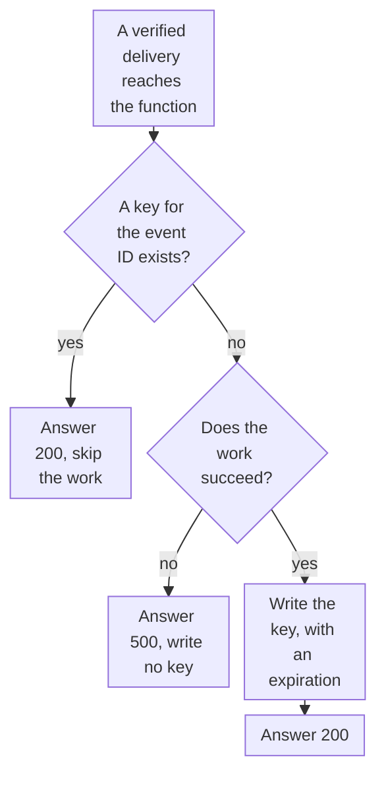

import DocCardGroup from '@aziontech/webkit/doc-card-group'
import DocCard from '@aziontech/webkit/doc-card'

You mark each webhook event that a function handled with a key in KV Store, and the function skips an event whose key already exists, from the Azion API and the function's code. To read and write keys for other purposes, refer to [Manage key-value data from a function](/en/documentation/guides/application-development/data/manage-with-functions/).

A provider that does not see a delivery acknowledged sends the same event again, so one event can reach the function more than once. A key per event ID lets the function recognize a repeat and answer it without doing the work twice.



1. The function reads the key for the event ID. A value means an earlier delivery of the event was handled, so the function answers `200` and does nothing else.
2. Without a key, the function does the work the event triggers.
3. When the work fails, the function answers `500` and writes no key, so the provider's next delivery runs the work again.
4. When the work succeeds, the function writes the key with an expiration and answers `200`.

---

## Prerequisites

- KV Store enabled on your account. The product is in Preview and is not enabled by default, so request access through [Technical Support](/en/documentation/support/).
- A [personal token](/en/documentation/guides/platform/account-and-billing/personal-tokens/) for the API call that creates the namespace.
- A function that receives the provider's webhook and verifies its signature, such as the handler that [Build a Stripe webhook handler with Functions](/en/documentation/guides/application-development/functions-and-runtime/stripe-webhooks-functions/) builds. Each event the provider sends carries an ID that stays the same across its deliveries.

The examples use the namespace `webhook-events`, keys of the form `event:<event-id>`, and an expiration of `86400` seconds. Replace them with your own values.

---

## Create the namespace

A namespace is created through the Azion API, and a function only opens one that already exists. A namespace cannot be renamed or deleted, and two names that differ only in case are two namespaces, so create it once, in lowercase. A name runs 3 to 63 characters of letters, numbers, the hyphen, and the underscore.

To create the namespace, send its name to the KV Store API:

```bash
curl --request POST \
  --url https://api.azion.com/v4/workspace/kv/namespaces \
  --header 'Accept: application/json' \
  --header 'Authorization: Token <personal-token>' \
  --header 'Content-Type: application/json' \
  --data '{"name": "webhook-events"}'
```

The API answers `201` with the namespace. The request is synchronous, and there is no provisioning state to poll:

```json
{"name":"webhook-events","created_at":"...","last_modified":"..."}
```

The `webhook-events` namespace exists and is empty. For every field and error of the namespace API, refer to [Namespaces](/en/documentation/platform/kv-store/namespaces/).

In the [Build event-driven APIs](/en/documentation/use-cases/build-and-run-applications/build-event-driven-apis/) use case, this section takes these values:

| Setting | Value |
| --- | --- |
| Namespace | `events-idempotency` |

A namespace cannot be renamed or deleted, and names are case-sensitive, so create it once, in lowercase. The `events-idempotency` namespace exists and is empty.

In the [Build AI agents](/en/documentation/use-cases/build-and-run-ai-workloads/build-ai-agents/) use case, this section takes these values:

| Setting | Value |
| --- | --- |
| KV Store namespace | `agent-state` |

---

## Skip a delivery the function already handled

`kv.get` returns `null` for a key the namespace does not hold, so a `null` means the event is new. The function writes the key only after the work succeeds: a key written before a failed attempt marks the event as handled, and the provider's retry is then skipped. `expirationTtl` removes the key after the seconds it names, so the namespace does not keep a key per event forever. Its minimum is 60 seconds.

To deduplicate deliveries, add this code to the function, after the signature check:

```javascript
const NAMESPACE = 'webhook-events';
const KEY_TTL_SECONDS = 86400;

// Replace with the work the event triggers, such as a publish to a queue.
async function handleEvent(event) {
  console.log(`Handling ${event.id}`);
}

export default {
  async fetch(request, env, ctx) {
    // Read the ID from where your provider puts it, once the signature is verified.
    const event = await request.json();
    const key = `event:${event.id}`;
    const kv = await Azion.KV.open(NAMESPACE);

    // A key for this event means an earlier delivery was already handled.
    if ((await kv.get(key, 'text')) !== null) {
      return Response.json({ received: true, duplicate: true });
    }

    try {
      await handleEvent(event);
    } catch (error) {
      console.log(error.message);
      return Response.json({ error: 'Event not handled' }, { status: 500 });
    }

    // Written only after the work succeeds, so a failed attempt is never marked as handled.
    await kv.put(key, 'handled', { expirationTtl: KEY_TTL_SECONDS });
    return Response.json({ received: true });
  },
};
```

`Azion.KV` is a global of the runtime, reached with no import line and no credential. `Azion.KV.open` throws `NotFound: KV namespace "webhook-events" does not exist` when the account holds no namespace with that name. Under `azion dev`, `open` accepts a name that belongs to no namespace, so test the function once it is deployed.

The first delivery of an event runs `handleEvent` and writes `event:<event-id>`. A later delivery of the same event, within one day, answers `{"received":true,"duplicate":true}` and does not run the work. A repeat that arrives after the key expires runs the work again, so set `expirationTtl` longer than the time your provider keeps retrying an event.

:::caution
The key filters repeats; it does not guarantee that the work runs once. KV Store is eventually consistent: a write becomes visible everywhere within 60 seconds, and the client has no compare-and-set. Two deliveries of one event that arrive close together can both read no key and both run the work. Make the work itself tolerate a repeat, such as a table whose primary key is the event ID.
:::

Each delivery reads one key, and each new event writes one. KV Store includes 100,000 keys read and 1,000 keys written per day before a charge applies, and it accepts 1 write per second to the same key. For every bound, refer to [KV Store limits](/en/documentation/platform/kv-store/limits/).

---

## Publish each event to Upstash QStash once

When the work an event triggers is a publish to a queue, the key is written only after the queue accepts the message. The route in this section replaces the `POST /webhook` route of the handler that [Build a Stripe webhook handler with Functions](/en/documentation/guides/application-development/functions-and-runtime/stripe-webhooks-functions/) builds, through its step 4, and keeps its `verifyStripeWebhook` middleware. It reads the namespace `events-idempotency`, created as [Create the namespace](#create-the-namespace) shows, and the QStash token and the consumer's domain from the `QSTASH_TOKEN` and `CONSUMER_DOMAIN` environment variables, stored as [Store the token and the destination](/en/documentation/guides/application-development/integrations/publish-a-message-to-upstash-qstash-from-a-function/#store-the-token-and-the-destination) shows.

In the entry file of the project, replace the `app.post("/webhook", ...)` route with this one:

```typescript
const IDEMPOTENCY_NAMESPACE = "events-idempotency";
const KEY_TTL_SECONDS = 86400;

app.post("/webhook", verifyStripeWebhook, async (c) => {
  const event = c.get("stripeEvent");
  const kv = await Azion.KV.open(IDEMPOTENCY_NAMESPACE);

  // A key for this event means an earlier delivery was already queued.
  if ((await kv.get(event.id, "text")) !== null) {
    return c.json({ received: true, duplicate: true });
  }

  // QStash delivers the message to the consumer's domain.
  const published = await fetch(`https://qstash.upstash.io/v1/publish/${Azion.env.get("CONSUMER_DOMAIN")}`, {
    method: "POST",
    headers: {
      Authorization: `Bearer ${Azion.env.get("QSTASH_TOKEN")}`,
      "Content-Type": "application/json",
    },
    body: JSON.stringify({
      event_id: event.id,
      type: event.type,
      object_id: (event.data.object as { id: string }).id,
      received_ms: Date.now(),
    }),
  });
  if (!published.ok) {
    console.error(`QStash answered ${published.status}`);
    return c.json({ error: "Event not queued" }, 500);
  }

  // Written only after the publish, so a failed publish is never marked as queued.
  await kv.put(event.id, "queued", { expirationTtl: KEY_TTL_SECONDS });
  return c.json({ received: true });
});
```

Deploy the project from its directory:

```bash
azion deploy
```

Azion CLI builds the project, deploys it, and opens Azion Console on the page that carries the deployment logs. The webhook endpoint registered with the provider stays `https://api.example.com/webhook`. Propagation takes a few minutes.

The route answers the provider as soon as the event is queued. A repeated delivery answers `{"received":true,"duplicate":true}` and publishes nothing, and a publish that QStash does not accept answers `500`, so the provider retries the event.

To confirm the route, send a test event with the Stripe CLI, then read what the function logged:

```bash
stripe trigger payment_intent.succeeded
azion logs cells --tail
```

The handler answers `{ "received": true }`, and the Stripe Dashboard lists the delivery and its response code for the endpoint. The terminal prints the console messages of the last 5 minutes. No `QStash answered` line appears, so QStash accepted every publish.

The [Build event-driven APIs](/en/documentation/use-cases/build-and-run-applications/build-event-driven-apis/) use case uses the values of this example.

These checks confirm the [Build event-driven APIs](/en/documentation/use-cases/build-and-run-applications/build-event-driven-apis/) use case.

---

## Next steps

<DocCardGroup cols={2}>
  <DocCard title="How KV Store works" href="/en/documentation/platform/kv-store/how-it-works/#consistency" label="Why a key written in one place can be missing elsewhere for up to 60 seconds." />
  <DocCard title="KV Store API" href="/en/documentation/devtools/runtime/api-reference/kv-store/" label="Every method, option, and error of the client that reads and writes the keys." />
  <DocCard title="Build event-driven APIs" href="/en/documentation/use-cases/build-and-run-applications/build-event-driven-apis/" label="A webhook producer that filters repeated events before it publishes them to a queue." />
  <DocCard title="Publish a message to Upstash QStash from a function" href="/en/documentation/guides/application-development/integrations/publish-a-message-to-upstash-qstash-from-a-function/" label="Hand each new event to a queue as the work the function does." />
  <DocCard title="Build AI agents" href="/en/documentation/use-cases/build-and-run-ai-workloads/build-ai-agents/" label="An agent whose state between steps lives in a KV Store namespace." />
</DocCardGroup>
