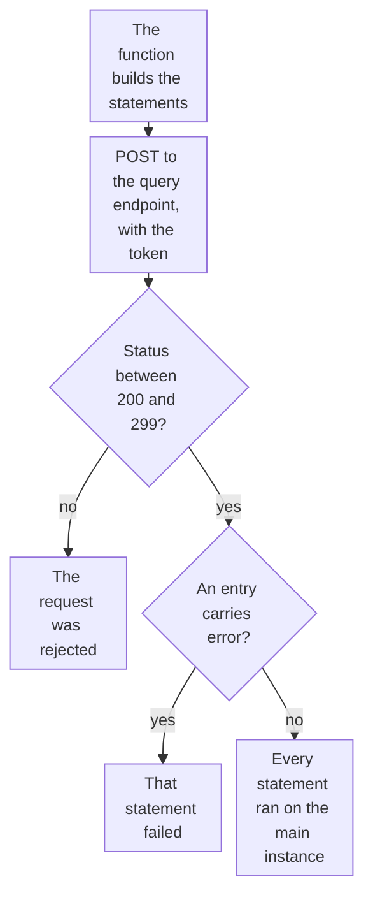

import DocCardGroup from '@aziontech/webkit/doc-card-group'
import DocCard from '@aziontech/webkit/doc-card'

You write rows to a database in SQL Database from a function through the Azion API, with a personal token that the function reads from an environment variable. To read rows inside a function, refer to [Query a database from a function](/en/documentation/guides/application-development/data/retrieve-data-with-functions/).

A function opens a database through a read replica, and that connection is read-only: a statement that writes fails with ``Error: SQLite failure: `attempt to write a readonly database` ``. The main instance takes every write, so the function sends its write statements to the query endpoint of the Azion API, which reaches it.



1. The function reads the database identifier and the token from environment variables, and sends the statements to the query endpoint.
2. A status outside 200 to 299 means the API rejected the whole request, and no statement ran.
3. A `200` carries one entry per statement. An entry with `error` is a failed statement, even though the request succeeded.
4. When no entry carries `error`, each statement ran, and its `results` report the rows it wrote.

---

## Prerequisites

- SQL Database enabled on your account. The product is in Preview and is not enabled by default, so request access through [Technical Support](/en/documentation/support/).
- A database, its identifier, and the table the function writes to. The identifier is the `id` the create response returns. To create them, refer to [Create and manage databases](/en/documentation/guides/application-development/data/manage-sql-database/) and [Create tables and query data](/en/documentation/guides/application-development/data/create-tables-sql-database/).
- A [personal token](/en/documentation/guides/platform/account-and-billing/personal-tokens/) for the function, separate from the one the Azion CLI uses. The account that owns it needs the **Edit SQL Database** permission. A token expires 1 day after it is created unless you choose a longer expiration, and every write fails once it expires, so set an expiration that covers the time the function runs.
- The [Azion CLI](/en/documentation/devtools/cli/quickstart/) installed and authorized, to store the environment variables.
- A function project to add the code to. To create and deploy one, refer to [Deploy a function with Azion CLI](/en/documentation/guides/application-development/functions-and-runtime/deploy-function-with-cli/).

The examples write to a table created with `CREATE TABLE items (id INTEGER PRIMARY KEY AUTOINCREMENT, name TEXT NOT NULL);`, and store the identifier and the token as `SQL_DATABASE_ID` and `SQL_TOKEN`. Replace them, `<database-id>`, and `<personal-token>` with your own values.

---

## Store the database identifier and the token

The function reads both values at run time, so neither enters the code or its repository. The identifier is not confidential, and the token is: a secret variable is never printed back by the CLI. A key that contains `token` is sent as a secret by default.

To create the two variables with the Azion CLI:

```bash
azion create variables --key SQL_DATABASE_ID --value <database-id> --secret false
azion create variables --key SQL_TOKEN --value <personal-token> --secret true
```

Each command prints the UUID of the variable it created:

```text
Created variable with UUID 00000000-0000-0000-0000-000000000005
```

A change to a variable reaches a function only after the function is deployed again, so create both before you deploy the code in the next section. The account holds both variables, and the function reads each one with `Azion.env.get()`. For the limits on variables, refer to [Environment variables](/en/documentation/platform/functions/environment-variables/).

---

## Send the statements from the function

The query endpoint takes a `statements` array of SQL strings, runs them in order, and returns one entry per statement in `data`. A call carrying 100 statements succeeds, so a set of related writes travels in one call. The body carries SQL text and no parameters, so a text value goes inside the statement: quote it, double each single quote it holds, and validate it before it reaches a statement.

To write a row, add this code to the function's entrypoint:

```javascript
// The query endpoint takes SQL strings, so a text value is quoted and its quotes doubled.
function sqlText(value) {
  return `'${String(value).replaceAll("'", "''")}'`;
}

// Writes go to the main instance through the Azion API. A failed statement still answers 200.
async function writeRows(statements) {
  const response = await fetch(
    `https://api.azion.com/v4/workspace/sql/databases/${Azion.env.get('SQL_DATABASE_ID')}/query`,
    {
      method: 'POST',
      headers: {
        Accept: 'application/json',
        Authorization: `Token ${Azion.env.get('SQL_TOKEN')}`,
        'Content-Type': 'application/json',
      },
      body: JSON.stringify({ statements }),
    },
  );
  if (!response.ok) {
    throw new Error(`Azion API answered ${response.status}`);
  }
  const { data } = await response.json();
  const failed = data.find((entry) => entry.error);
  if (failed) {
    throw new Error(failed.error);
  }
  return data.map((entry) => entry.results);
}

export default {
  async fetch(request, env, ctx) {
    if (request.method !== 'POST') {
      return new Response('Method not allowed', { status: 405 });
    }
    const { name } = await request.json();
    if (typeof name !== 'string' || name.length === 0) {
      return Response.json({ error: 'name is required' }, { status: 400 });
    }
    try {
      const [results] = await writeRows([`INSERT INTO items (name) VALUES (${sqlText(name)});`]);
      return Response.json({ rows_written: results.rows_written }, { status: 201 });
    } catch (error) {
      console.log(error.message);
      return Response.json({ error: 'The write failed' }, { status: 500 });
    }
  },
};
```

`writeRows` checks the result in two places, because a write fails in two places:

- **The request.** A status outside 200 to 299 means the API rejected the whole call. When the statements cannot be executed at all, the API answers `422` with code `14005` `Execute SQL Exception`.
- **Each statement.** A statement that fails does not fail the request. The call answers `200`, and that statement's entry carries `error` in place of `results`:

  ```json
  {"state":"executed","data":[{"error":"no such table: items"}]}
  ```

A client that reads only the HTTP status reports that write as a success, and the row is never written. For every error code and error string, refer to [Databases and queries](/en/documentation/platform/sql-database/databases-and-queries/#errors).

Deploy the function, as [Deploy a function with Azion CLI](/en/documentation/guides/application-development/functions-and-runtime/deploy-function-with-cli/) shows. A successful statement returns an entry whose `results` carries `rows_written`, the rows that statement wrote:

```json
{"state":"executed","data":[{"results":{"columns":[],"rows":[],"rows_written":1,...}}]}
```

A `POST` to the function with a `name` adds one row to `items`, and the function answers `201` with `rows_written` set to `1`. A failed write answers `500`, and the function logs the status or the error string. To read that log line, refer to [Query function console logs](/en/documentation/guides/platform/observability/query-function-console-events/).

---

## Confirm the rows were written

The function's answer reports what the API returned. To read the rows back from the table, send a `SELECT` to the same query endpoint:

```bash
curl --request POST \
  --url https://api.azion.com/v4/workspace/sql/databases/<database-id>/query \
  --header 'Accept: application/json' \
  --header 'Authorization: Token <personal-token>' \
  --header 'Content-Type: application/json' \
  --data '{"statements": ["SELECT id, name FROM items;"]}'
```

The API answers `200`, and the entry's `results` carries one array per row in `rows`, with the values in the order of `columns`:

```json
{"state":"executed","data":[{"results":{"columns":["id","name"],"rows":[[1,"<name>"]],"rows_read":1,"rows_written":0,...}}]}
```

The table holds the rows the function wrote. A function reading the same table through `Database.open` reads them from a read replica. For how the main instance and the replicas split the work, refer to [How SQL Database works](/en/documentation/platform/sql-database/how-it-works/).

---

## Next steps

<DocCardGroup cols={2}>
  <DocCard title="Databases and queries" href="/en/documentation/platform/sql-database/databases-and-queries/" label="The query body, the fields each statement returns, and every error code of the database API." />
  <DocCard title="Query a database from a function" href="/en/documentation/guides/application-development/data/retrieve-data-with-functions/" label="Read the rows back inside a function, through a read replica and with no token." />
  <DocCard title="Build REST and GraphQL APIs" href="/en/documentation/use-cases/build-and-run-applications/build-rest-and-graphql-apis/" label="An API function that reads through a replica and writes every task through the Azion API." />
  <DocCard title="Deploy full-stack applications globally" href="/en/documentation/use-cases/build-and-run-applications/deploy-full-stack-applications-globally/" label="A Next.js route handler that writes the portal's records through the Azion API." />
  <DocCard title="Build and run customer support AI assistants" href="/en/documentation/use-cases/build-and-run-ai-workloads/build-and-run-customer-support-ai-assistants/" label="An ingestion function that writes each passage and its vector through the Azion API." />
  <DocCard title="Build AI agents" href="/en/documentation/use-cases/build-and-run-ai-workloads/build-ai-agents/" label="An agent function that records every task event in a history table." />
</DocCardGroup>
