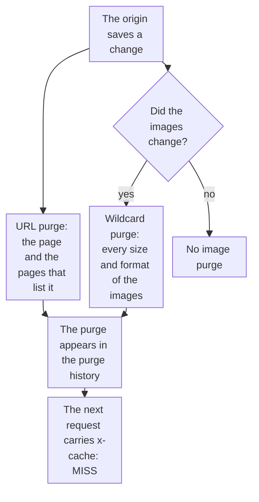

import DocCardGroup from '@aziontech/webkit/doc-card-group'
import DocCard from '@aziontech/webkit/doc-card'
import DocSteps from '@aziontech/webkit/doc-steps'
import DocStep from '@aziontech/webkit/doc-step'
import Tabs from '~/components/webkit/Tabs.vue'

You make a publishing system, such as a CMS, a commerce platform, or a build pipeline, purge the pages it changes through the Azion API or the Azion CLI, and send the same purge by hand from Azion Console. For a one-off purge of any type, refer to [Purge cached content](/en/documentation/guides/application-performance/cache-and-purge/purge-cached-content/).

A published change reaches visitors only after the cached copy leaves the cache. The publishing system knows which pages changed, so it sends the purge the moment it saves them, and the cache TTL stays a safety bound for a purge that is missed.



1. On every save, the publishing system sends a URL purge for the changed page and the pages that list it.
2. Only when the save changes images, it also sends a wildcard purge for every size and format of those images.
3. Each purge appears in the purge history when it is complete, and the next request for each object reaches the origin.

---

## Prerequisites

- A domain that belongs to your account, served by an application. A purge of any other domain is rejected with error `30003`.
- A [personal token](/en/documentation/guides/platform/account-and-billing/personal-tokens/) for the API and the CLI. A token expires 1 day after it is created unless you choose a longer expiration, so set one that covers the time the publishing system runs, and replace the token before it expires.
- The [Azion CLI](/en/documentation/devtools/cli/) installed and authorized, for the CLI procedure.
- Access to Azion Console, for the Console procedure. Refer to [Access Azion Console](/en/documentation/guides/platform/account-and-billing/how-to-access-azion-console/).

The examples purge the product page `https://www.example.com/products/blue-shirt`, its category page `https://www.example.com/category/shirts`, and the images under `www.example.com/media/blue-shirt`. Replace them with the objects your save changes.

---

## Purge the changed pages on every save

A URL purge removes the exact URLs it lists. It is not recursive, so list each page the change affects: the page itself and every page that shows the changed content, such as a category page or a home page. One request carries up to 50 URLs. A URL without a scheme purges both the HTTP and the HTTPS copies.

<Tabs client:visible sharedStore="interface">
<Fragment slot="tab.console">Console</Fragment>
<Fragment slot="tab.api">API</Fragment>
<Fragment slot="tab.cli">CLI</Fragment>

<Fragment slot="panel.console">

To send the URL purge by hand:

<DocSteps>
  <DocStep title="Open Real-Time Purge">

  Access [Azion Console](https://console.azion.com/) > **Products Menu** > **Real-Time Purge**.

  </DocStep>
  <DocStep title="Select New Purge" />
  <DocStep title="Choose the URL purge type and the Cache layer" />
  <DocStep title="Enter the URLs">

  Enter one URL per item: `https://www.example.com/products/blue-shirt` and `https://www.example.com/category/shirts`.

  </DocStep>
  <DocStep title="Select Purge" />
</DocSteps>

A message confirms the creation, and Azion queues the purge.

</Fragment>

<Fragment slot="panel.api">

To send the URL purge from the publishing system, call the `url` purge path with the token:

```bash
curl --request POST \
  --url https://api.azion.com/v4/workspace/purge/url \
  --header 'Authorization: Token <personal-token>' \
  --header 'Content-Type: application/json' \
  --data '{"items":["https://www.example.com/products/blue-shirt","https://www.example.com/category/shirts"],"layer":"cache"}'
```

The API answers with HTTP `201` and `state` set to `executed`:

```json
{"state":"executed","data":{"items":["https://www.example.com/products/blue-shirt","https://www.example.com/category/shirts"],"layer":"cache"}}
```

</Fragment>

<Fragment slot="panel.cli">

To send the URL purge from a script, pass the URLs as one comma-separated list:

```bash
azion purge --urls "https://www.example.com/products/blue-shirt,https://www.example.com/category/shirts"
```

The command prints one line:

```text
Purge carried out successfully
```

</Fragment>
</Tabs>

The listed pages leave the cache once the purge propagates. A URL purge does not reach the copies that vary by cookie, device group, or image format, which the next section covers for images.

---

## Purge image variants when an image changes

Image Processor caches one copy of an image per size and per format, and a URL purge reaches none of those copies. A wildcard purge ending in `*` reaches all of them. Send it only when the save changes an image: Azion accepts 2,000 wildcard purge requests in a 24-hour interval, and a wildcard on every save of a large catalog can reach that bound. One request carries one expression of up to 256 characters.

<Tabs client:visible sharedStore="interface">
<Fragment slot="tab.console">Console</Fragment>
<Fragment slot="tab.api">API</Fragment>
<Fragment slot="tab.cli">CLI</Fragment>

<Fragment slot="panel.console">

To send the wildcard purge by hand:

<DocSteps>
  <DocStep title="Open Real-Time Purge">

  Access [Azion Console](https://console.azion.com/) > **Products Menu** > **Real-Time Purge**.

  </DocStep>
  <DocStep title="Select New Purge" />
  <DocStep title="Choose the wildcard purge type and the Cache layer" />
  <DocStep title="Enter the expression">

  Enter `www.example.com/media/blue-shirt*`.

  </DocStep>
  <DocStep title="Select Purge" />
</DocSteps>

A message confirms the creation, and Azion queues the purge.

</Fragment>

<Fragment slot="panel.api">

To send the wildcard purge, call the `wildcard` purge path with one expression:

```bash
curl --request POST \
  --url https://api.azion.com/v4/workspace/purge/wildcard \
  --header 'Authorization: Token <personal-token>' \
  --header 'Content-Type: application/json' \
  --data '{"items":["www.example.com/media/blue-shirt*"]}'
```

The API answers with HTTP `201`, and without `layer` it purges `cache`:

```json
{"state":"executed","data":{"items":["www.example.com/media/blue-shirt*"],"layer":"cache"}}
```

</Fragment>

<Fragment slot="panel.cli">

To send the wildcard purge from a script:

```bash
azion purge --wildcard "www.example.com/media/blue-shirt*"
```

The command prints one line:

```text
Purge carried out successfully
```

</Fragment>
</Tabs>

Every size and format of the changed images leaves the cache. When the publishing system knows the exact variants it serves, a cache key purge that lists each key does the same work without counting against the wildcard bound. A key carries the processing arguments after `?` and the format after `@@`, as in `httpswww.example.com/media/blue-shirt.jpg?ims=400x@@webp`. For the format, refer to [Cache keys](/en/documentation/platform/applications/cache/cache-keys/).

:::caution
URL and wildcard purges clear the Cache layer only. On an application whose cache setting has [Tiered Cache](/en/documentation/platform/applications/cache/tiered-cache/) on, purge the Tiered Cache layer first with a cache key purge, then the Cache layer, so the cache is not refilled from a stale copy. For the steps, refer to [Purge cached content](/en/documentation/guides/application-performance/cache-and-purge/purge-cached-content/#choose-the-purge-type).
:::

---

## Confirm the purge completed

A `201` from the API means the purge was accepted, not that it has propagated. Azion lists a purge in the purge history when it is complete. To confirm it:

<DocSteps>
  <DocStep title="Open Real-Time Purge">

  Access [Azion Console](https://console.azion.com/) > **Products Menu** > **Real-Time Purge**.

  </DocStep>
  <DocStep title="Find the purge in the history">

  The history lists each completed purge, and it can be filtered by the user who made it, the time, the argument list, the purge type, and the method. Filter by the argument list to find the URL or the expression you sent.

  </DocStep>
  <DocStep title="Request the page with the debug header">

  ```bash
  curl -sI -H "Pragma: azion-debug-cache" https://www.example.com/products/blue-shirt
  ```

  </DocStep>
  <DocStep title="Read the cache status">

  The response carries `MISS`, because Azion fetched the page from the origin again:

  ```http
  x-cache: MISS from 192.0.2.10 with HTTP/2.0
  ```

  </DocStep>
</DocSteps>

The purge is in the history, and the page served after it is the version the origin published. The request after it carries `HIT` again.

:::note
A publishing system that saves many objects at once, such as a catalog import, sends URLs in batches of 50 or fewer. Azion accepts 10,000 URL and cache key objects every 60 seconds. For every purge bound, refer to [Real-Time Purge limits](/en/documentation/platform/applications/cache/real-time-purge/#limits).
:::

---

## Next steps

<DocCardGroup cols={2}>
  <DocCard title="Purge cached content" href="/en/documentation/guides/application-performance/cache-and-purge/purge-cached-content/" label="Purge by cache key, purge the Tiered Cache layer, and purge objects that vary." />
  <DocCard title="Real-Time Purge" href="/en/documentation/platform/applications/cache/real-time-purge/" label="Every purge type, the variations each one reaches, the errors, and the limits." />
  <DocCard title="Build e-commerce storefronts" href="/en/documentation/use-cases/build-and-run-applications/build-e-commerce-storefronts/" label="A storefront that purges product pages from the commerce platform on every save." />
  <DocCard title="Azion CLI purge" href="/en/documentation/devtools/cli/purge/" label="Every flag of the azion purge command." />
</DocCardGroup>
