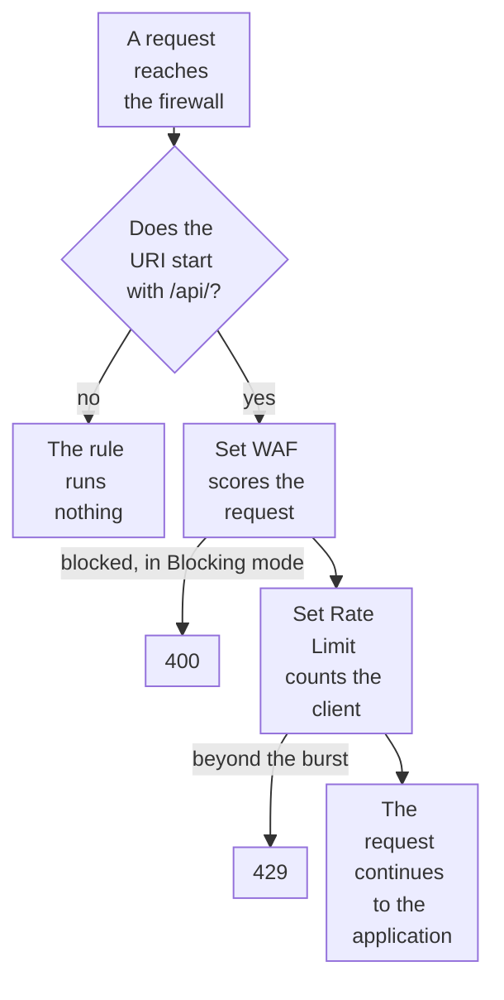

import DocCardGroup from '@aziontech/webkit/doc-card-group'
import DocCard from '@aziontech/webkit/doc-card'
import DocSteps from '@aziontech/webkit/doc-steps'
import DocStep from '@aziontech/webkit/doc-step'
import Tabs from '~/components/webkit/Tabs.vue'

You apply a WAF rule set and a rate limit to one path of a workload, such as `/api/`, with one firewall rule, from Azion Console, the Azion CLI, or the API. To apply a rule set to every request, refer to [Apply a rule set to every request](/en/documentation/guides/application-security/firewall-and-waf/apply-rule-set/), and to rate-limit the clients in a network list, refer to [Rate-limit the addresses in a list](/en/documentation/guides/application-security/bots-and-network/rate-limit-list/).

A path such as an API or a login form needs protections the rest of the domain does not. WAF is billed on the requests it scores, so a rule scoped to the path scores only that traffic, and its rate limit counts only the requests to that path.



1. The firewall compares the request URI with the path. A request to any other path does not match, and the rule runs nothing on it.
2. On a match, _Set WAF_ scores the request against the rule set. In _Blocking_ mode, a request the rule set blocks receives `400`.
3. _Set Rate Limit_ then counts the request against the rate of its client IP address. A request beyond the burst receives `429`.
4. A request that passes both continues to the application.

---

## Prerequisites

- A firewall bound to the workload that serves the path, with WAF turned on in its main settings. To bind it, refer to [Bind a firewall to a workload](/en/documentation/guides/application-security/firewall-and-waf/firewall-protect-your-domain/), and to turn on WAF, refer to [Set a firewall's main settings](/en/documentation/guides/application-security/firewall-and-waf/firewall-configure-main-settings/).
- A WAF rule set, and its ID for the CLI and the API. To create one, refer to [Create a rule set at medium sensitivity](/en/documentation/guides/application-security/firewall-and-waf/rule-set-medium/).
- A [personal token](/en/documentation/guides/platform/account-and-billing/personal-tokens/), for the API and the CLI.
- The [Azion CLI](/en/documentation/devtools/cli/) installed and authorized, for the CLI procedure.
- Access to Azion Console, for the Console procedure. Refer to [Access Azion Console](/en/documentation/guides/platform/account-and-billing/how-to-access-azion-console/).

The examples protect `/api/` on `www.example.com` with the rule set `<waf-id>`, on the firewall `<firewall-id>`. Replace them with your path, rule set, and firewall.

---

## Create the rule for the path

The criterion is `Request Uri` _starts with_ `/api/`, which also matches deeper paths such as `/api/v1/orders`. Match the URI, not the query string: an empty variable does not match, so `Request Args` _matches_ `.*` skips every `POST` whose payload sits in the body. The behaviors go in a fixed order. _Set WAF_ is one of the two behaviors that another behavior can follow, and choosing _Set Rate Limit_ removes every behavior after it, so _Set WAF_ comes first.

_Set WAF_ starts in _Logging_, which scores, records, and serves each request, because its records show what the rule set flags on your own traffic. The rate is `10` requests per second per client IP address, with a burst of `10`. Requests over the rate are queued and released at the rate, and only simultaneous requests beyond the burst receive `429`. Keep the burst within ten times the rate, so the queue holds at most 10 seconds of traffic.

<Tabs client:visible sharedStore="interface">
<Fragment slot="tab.console">Console</Fragment>
<Fragment slot="tab.cli">CLI</Fragment>
<Fragment slot="tab.api">API</Fragment>

<Fragment slot="panel.console">

To create the rule in Azion Console:

<DocSteps>
  <DocStep title="Open the firewall bound to your workload">

  Access [Azion Console](https://console.azion.com/) > **Firewalls**, then select the firewall.

  </DocStep>
  <DocStep title="Select the Rules Engine tab" />
  <DocStep title="Select + Rule" />
  <DocStep title="Name the rule">

  Enter `api - waf and rate limit`.

  </DocStep>
  <DocStep title="Set the criterion">

  In the **Criteria** section, select the `Request Uri` variable, the _starts with_ operator, and `/api/` as the argument.

  </DocStep>
  <DocStep title="Add the Set WAF behavior">

  In the **Behaviors** section, select **Set WAF**, then your rule set and _Logging_ as the mode.

  </DocStep>
  <DocStep title="Add the Set Rate Limit behavior">

  Select **Add Behavior**, then **Set Rate Limit**. Set **Rate Limit Type** to _Req/s_ and **Limit By** to _Client IP address_. Enter `10` in **Average Rate Limit** and `10` in **Maximum Burst Size**.

  </DocStep>
  <DocStep title="Select Save" />
</DocSteps>

The rule appears in the **Rules Engine** tab, below the rules created before it.

</Fragment>

<Fragment slot="panel.cli">

To create the rule with the Azion CLI, save it as `rule.json`, with the ID of your rule set in `waf_id`:

```json
{
  "name": "api - waf and rate limit",
  "active": true,
  "criteria": [
    [
      { "variable": "${request_uri}", "conditional": "if", "operator": "starts_with", "argument": "/api/" }
    ]
  ],
  "behaviors": [
    { "type": "set_waf", "attributes": { "waf_id": <waf-id>, "mode": "logging" } },
    { "type": "set_rate_limit", "attributes": { "type": "second", "limit_by": "client_ip", "average_rate_limit": 10, "maximum_burst_size": 10 } }
  ]
}
```

Then create the rule from the file:

```bash
azion create firewall-rule --firewall-id <firewall-id> --file rule.json
```

The command prints the ID of the new rule:

```text
Created Firewall Rule with ID <rule-id>
```

</Fragment>

<Fragment slot="panel.api">

To create the rule with the API, send both behaviors in order, with the ID of your rule set in `waf_id`:

```bash
curl --request POST \
  --url https://api.azion.com/v4/workspace/firewalls/<firewall-id>/request_rules \
  --header 'Authorization: Token <personal-token>' \
  --header 'Content-Type: application/json' \
  --data '{
  "name": "api - waf and rate limit",
  "active": true,
  "criteria": [
    [{ "variable": "${request_uri}", "conditional": "if", "operator": "starts_with", "argument": "/api/" }]
  ],
  "behaviors": [
    { "type": "set_waf", "attributes": { "waf_id": <waf-id>, "mode": "logging" } },
    { "type": "set_rate_limit", "attributes": { "type": "second", "limit_by": "client_ip", "average_rate_limit": 10, "maximum_burst_size": 10 } }
  ]
}'
```

The API answers `202` with a `state` of `pending`, and adds the `order` the rule holds among the rules of the firewall:

```text
{"state":"pending","data":{"id":<rule-id>,…,"description":"","order":<order>}}
```

A `set_waf` behavior sent without `mode` is refused with `400` and `10059 Required Field`, and a `waf_id` that names no rule set with `25036 Invalid Informed WAF`.

</Fragment>
</Tabs>

Every request to `/api/` is scored by the rule set and counted against the rate before it reaches the application. This rule neither scores nor counts the requests to any other path. To refuse what the rule set flags, move the mode to _Blocking_ once 3 days of **Tuning** hold no request that should have been served, as [Switch a rule set to blocking](/en/documentation/guides/application-security/firewall-and-waf/switch-to-blocking/) describes.

:::note
A rule holds one rate limit for everything its criteria match, so a rule that matches two paths through `or` shares one limit across them, and a separate limit per path takes one rule per path. When the path already has a rule with _Set WAF_, or another rule must run before the limit, put _Set Rate Limit_ in a rule of its own with the same criterion, in the last position. A firewall runs its rules in order, the API assigns `order` in creation order, and the **Rules Engine** list in Azion Console can be reordered.
:::

In the [Deploy remote MCP servers](/en/documentation/use-cases/build-and-run-ai-workloads/deploy-remote-mcp-servers/) use case, this section takes these values:

| Setting | Value |
| --- | --- |
| Name | `mcp - waf and rate limit` |
| Criterion | `Request Uri` _starts with_ `/mcp` |
| Set WAF | The `mcp-waf` rule set in _Blocking_ mode |
| Set Rate Limit | _Req/s_, _Client IP address_, an **Average Rate Limit** of `10`, and a **Maximum Burst Size** of `20` |
| Behavior order in the API | `set_waf` first, then `set_rate_limit` |

Every request to `/mcp` is scored by `mcp-waf` and counted against the rate before it reaches the function. A request the rule set blocks answers `400` with the default Bad Request page, and a request over the rate answers `429` with the default Too Many Requests page. Neither response carries a header that names the firewall or a retry time.

In the [Protect public APIs from abuse](/en/documentation/use-cases/secure-applications-and-networks/protect-public-apis-from-abuse/) use case, this section takes these values:

| Setting | Value |
| --- | --- |
| Name | `api - rate limit per client` |
| Criterion | `Request Uri` _starts with_ `/v1/` |
| Behavior | _Set Rate Limit_ alone, with _Req/s_, _Client IP address_, an **Average Rate Limit** of `10`, and a **Maximum Burst Size** of `10`. In the API, `set_rate_limit` with `type` `second`, `limit_by` `client_ip`, `average_rate_limit` `10`, and `maximum_burst_size` `10` |

Each client IP address can send 10 requests per second to `/v1/`, with a peak of 10 more queued. The rate applies in each data center, and no response carries a rate-limit header, so a client has no signal of how long to wait.

---

## Confirm the rule acts on the path

A rule you add reaches traffic 6 minutes 29 seconds to 9 minutes 18 seconds after you save it, and until then requests alternate between the previous answer and the new one. Repeat each check until the answers agree.

To confirm both behaviors:

1. Send 30 simultaneous requests to the path from one address:

   ```bash
   seq 30 | xargs -P 30 -I{} curl -s -o /dev/null -w '%{http_code}\n' https://www.example.com/api/
   ```

   Some of the answers print `429`: the simultaneous requests beyond the burst of `10`. A refused request receives Azion's default error page, and no rate-limit header:

   ```text
   HTTP/2 429
   content-type: text/html; charset=utf-8
   x-azion-request-id: <request-id>

   <title>Azion - Default error page</title> ... Too Many Requests ... Status Code 429
   ```

2. Send the same 30 requests to a path outside `/api/`. None of them prints `429`, because the rule does not match that path.

3. Send a request with an injection-shaped query string to the path:

   ```bash
   curl -i "https://www.example.com/api/?q=1%27%20OR%20%271%27%3D%271"
   ```

   In _Logging_, the application answers as usual, and the request's `x-azion-request-id` finds its WAF record. After the move to _Blocking_, the same request receives:

   ```text
   HTTP/2 400
   ```

The rule refuses the requests to `/api/` beyond the burst with `429`, and records what the rule set flags on the path. No response names the firewall or carries a retry time, so the `x-azion-request-id` of a refused request is what leads to its record. To read it, refer to [Find the WAF score of a blocked request](/en/documentation/guides/application-security/firewall-and-waf/how-to-find-waf-score/).

In the [Deploy remote MCP servers](/en/documentation/use-cases/build-and-run-ai-workloads/deploy-remote-mcp-servers/) use case, expect:

- **The rate limit refuses a loop.** Sixty `tools/list` requests sent 30 at a time, so they arrive faster than 10 per second, answer with both `200` and `429`: the rate and the burst admit some of the requests, and the firewall refuses the others.

These checks confirm the [Protect public APIs from abuse](/en/documentation/use-cases/secure-applications-and-networks/protect-public-apis-from-abuse/) use case.

---

## Next steps

<DocCardGroup cols={2}>
  <DocCard title="Switch a rule set to blocking" href="/en/documentation/guides/application-security/firewall-and-waf/switch-to-blocking/" label="Move the Set WAF behavior of this rule from Logging to Blocking." />
  <DocCard title="Rules Engine for Firewall" href="/en/documentation/platform/firewall/rules-engine/#set-rate-limit" label="Every attribute of Set Rate Limit and Set WAF, and the errors a rule returns." />
  <DocCard title="Firewall best practices" href="/en/documentation/platform/firewall/best-practices/#keep-a-rate-limits-burst-within-ten-times-its-average-rate" label="Size the burst against the average rate before the rule reaches traffic." />
  <DocCard title="Rate-limit the addresses in a list" href="/en/documentation/guides/application-security/bots-and-network/rate-limit-list/" label="Hold the clients in a network list to a rate, whatever path they request." />
  <DocCard title="Protect public APIs from abuse" href="/en/documentation/use-cases/secure-applications-and-networks/protect-public-apis-from-abuse/" label="An API whose rate limit runs last, after WAF, a token check, and Bot Manager." />
  <DocCard title="Deploy remote MCP servers" href="/en/documentation/use-cases/build-and-run-ai-workloads/deploy-remote-mcp-servers/" label="An MCP server whose one rule applies WAF and a rate limit to /mcp." />
</DocCardGroup>
