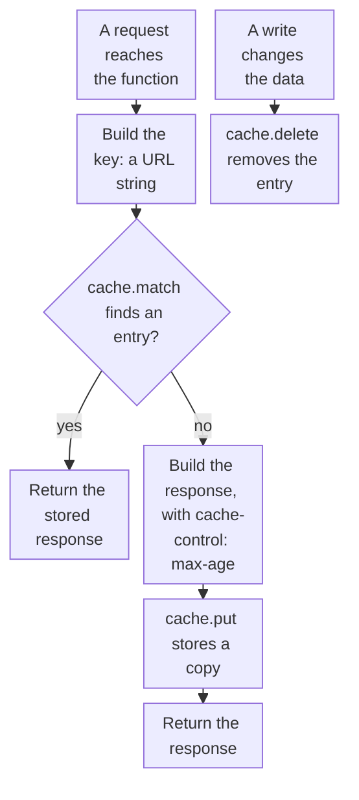

import DocCardGroup from '@aziontech/webkit/doc-card-group'
import DocCard from '@aziontech/webkit/doc-card'

You store a response that a function builds with the runtime Cache API, return the stored copy on later requests, and delete it when the data behind it changes. To cache responses without a function, with a rule on an application, refer to [Cache settings](/en/documentation/platform/applications/cache/cache-settings/).

A function that builds the same response for the same input, such as a list read from a database or the output of a model call, can keep that response and skip the work on the next request. The key decides which requests share one stored copy, and a write that changes the data deletes the copy, so the next request builds it again.



1. The function builds a key for the request: the request URL, or a URL string that carries a hash of the input.
2. When the cache holds an entry under the key, the function returns it and does no other work.
3. Otherwise the function builds the response with a `cache-control: max-age` header, stores a copy, and returns the response.
4. When a write changes the data a stored response was built from, the function deletes the entry under that key.

---

## Prerequisites

- A function to add the code to, deployed and instantiated on an application. To create one, refer to [Functions quickstart](/en/documentation/platform/functions/quickstart/).

The Cache API runs only on a deployed function. Under `azion dev`, `caches` is not defined, and any call throws `ReferenceError: caches is not defined`. Test the code once the function runs on the application.

The examples open a cache named `my-cache`, store responses for `3600` seconds, and answer on `www.example.com`. Replace them with your own values.

---

## Build the key for the request

A `Cache` stores each response under a key, which is a `Request` object or a URL string, and `put` accepts only a `GET` request. A `GET` request can be its own key. A request whose input travels in the body, such as a `POST`, needs a URL string instead, or `put` throws `TypeError: Request method must be GET`. Build that string from a SHA-256 hash of the input, so the same input always yields the same key and a different input yields a different one.

To build the key, add these two helpers to the function:

```javascript
// SHA-256 of a string, as 64 hexadecimal characters.
async function sha256(text) {
  const digest = await crypto.subtle.digest('SHA-256', new TextEncoder().encode(text));
  return Array.from(new Uint8Array(digest), (byte) => byte.toString(16).padStart(2, '0')).join('');
}

// A GET request keys on its own URL. Any other request keys on a hash of its input.
async function cacheKey(request, input) {
  const url = new URL(request.url);
  if (request.method === 'GET') {
    return `${url.origin}${url.pathname}${url.search}`;
  }
  return `${url.origin}/cache/${await sha256(input)}`;
}
```

`crypto.subtle.digest` with `SHA-256` returns 32 bytes, which the helper writes as 64 hexadecimal characters. Two `POST` requests carrying the same input get the same key.

---

## Store the response and return it on a match

`match` returns the response stored under the key, or no response when the key has no entry. A stored response is matched by later requests only when it carries `cache-control: max-age`. A response stored without that header is not matched by a later request, so every request rebuilds it. Store a clone of the response with `put`, and return the original.

To cache the response of a `POST` request keyed by its body, use this handler with the two helpers:

```javascript
const CACHE_NAME = 'my-cache';
const MAX_AGE = 3600;

// Replace with the work whose result the function caches.
async function buildBody(input) {
  return { input, length: input.length };
}

export default {
  async fetch(request, env, ctx) {
    if (request.method !== 'POST') {
      return new Response('Method not allowed', { status: 405 });
    }
    const input = await request.text();
    const cache = await caches.open(CACHE_NAME);
    const key = await cacheKey(request, input);

    const cached = await cache.match(key);
    if (cached) {
      return cached;
    }

    const response = new Response(JSON.stringify(await buildBody(input)), {
      headers: {
        'content-type': 'application/json',
        'cache-control': `max-age=${MAX_AGE}`,
        'x-stored-at': new Date().toISOString(),
      },
    });
    await cache.put(key, response.clone());
    return response;
  },
};
```

The `x-stored-at` header is set once, when the function stores the response, so two responses that carry the same value came from the same stored copy.

Deploy the function, then send the same body twice:

```bash
curl -i -X POST https://www.example.com/ -d 'the same input'
```

The second response carries the same `x-stored-at` value as the first, and `buildBody` does not run for it. A different body gets a new key and a new value. Every client that sends the same input receives the stored copy, so cache only responses that are the same for every client, and never one built from a client's credentials.

---

## Delete the entry after a write

A stored response does not follow the data it was built from. When a write changes that data, delete the entry in the same code path, with the key the read builds. `delete` removes the entry and returns `true`, and a later `match` for that key returns no response.

In a function that also serves a list on `GET /api/items`, call `delete` once a write to the list succeeds:

```javascript
const cache = await caches.open(CACHE_NAME);
await cache.delete(`${new URL(request.url).origin}/api/items`);
```

The key must match the one the read stores, character for character: here, the list that `GET /api/items` stores under its own URL. The next request for the list finds no entry, builds the response from the changed data, and stores it again. Delete the entry only after the write succeeds, so a failed write leaves the stored copy in place.

---

## Next steps

<DocCardGroup cols={2}>
  <DocCard title="Cache API" href="/en/documentation/devtools/runtime/api-reference/cache/" label="Every method of CacheStorage and Cache, how stored responses are matched, and the errors to expect." />
  <DocCard title="SubtleCrypto" href="/en/documentation/devtools/runtime/api-reference/subtle-crypto/" label="The digest algorithms crypto.subtle supports, and the size of each hash." />
  <DocCard title="Build REST and GraphQL APIs" href="/en/documentation/use-cases/build-and-run-applications/build-rest-and-graphql-apis/" label="An API function that caches its list response and deletes it after every write." />
  <DocCard title="Add AI features to existing applications" href="/en/documentation/use-cases/build-and-run-ai-workloads/add-ai-features-to-existing-applications/" label="A summarization route that caches each summary under a hash of the text." />
  <DocCard title="Govern access to multiple AI models" href="/en/documentation/use-cases/build-and-run-ai-workloads/govern-access-to-multiple-ai-models/" label="An AI gateway that caches a model response when the caller allows it." />
</DocCardGroup>
