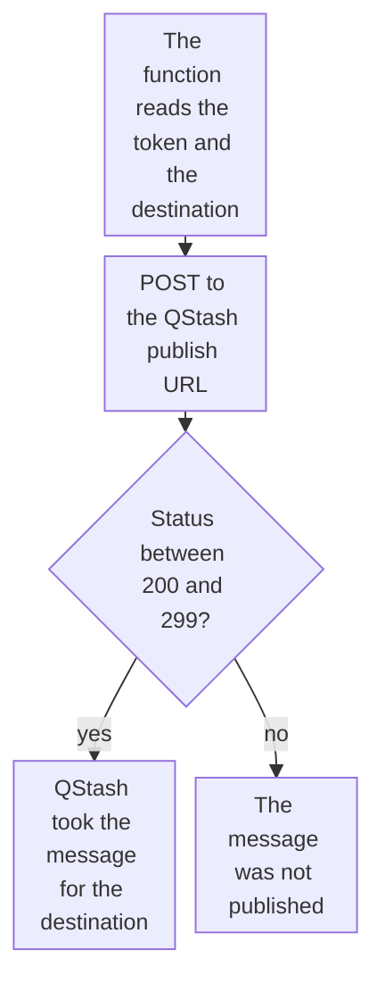

import DocCardGroup from '@aziontech/webkit/doc-card-group'
import DocCard from '@aziontech/webkit/doc-card'

You publish a message to Upstash QStash from a function, with the QStash token that the function reads from an environment variable, and QStash takes the message for the destination domain you name. To deploy the template that receives scheduled messages from QStash, refer to [Use the QStash Function Scheduler](/en/documentation/guides/application-development/frameworks/qstash-function-scheduler/).

QStash is a message queue and task scheduler for serverless runtimes. A function that hands work to it answers its caller without waiting for that work, and it answers only after QStash accepts the message, so a failed publish is never reported as a success.



1. The function reads the QStash token and the destination domain from environment variables.
2. It sends the message as a `POST` to the QStash publish URL, which ends in the destination domain.
3. A status between 200 and 299 means QStash took the message. Any other status means the message was not published, and the function reports a failure.

---

## Prerequisites

- An [Upstash account](https://console.upstash.com/) and its **QStash Token**, from the **QStash** tab of the [Upstash Console](https://console.upstash.com/qstash). QStash usage is processed and billed separately on the Upstash platform.
- The domain that receives the messages, such as the domain of a consumer function.
- The [Azion CLI](/en/documentation/devtools/cli/quickstart/) installed and authorized, to store the environment variables.
- A function project to add the code to. To create and deploy one, refer to [Deploy a function with Azion CLI](/en/documentation/guides/application-development/functions-and-runtime/deploy-function-with-cli/).

The examples store the token and the destination as `QSTASH_TOKEN` and `QSTASH_DESTINATION`, and publish to `consumer.example.com`. Replace them and `<qstash-token>` with your own values.

---

## Store the token and the destination

The function reads both values at run time, so the token never enters the code, and the destination changes without a code edit. The token is confidential, and the destination is not. A key that contains `token` is sent as a secret by default.

To create the two variables with the Azion CLI:

```bash
azion create variables --key QSTASH_TOKEN --value <qstash-token> --secret true
azion create variables --key QSTASH_DESTINATION --value consumer.example.com --secret false
```

Each command prints the UUID of the variable it created:

```text
Created variable with UUID d6f142ad-b817-4cd2-ae8e-00d832b8a68e
```

A change to a variable reaches a function only after the function is deployed again, so create both before you deploy the code in the next section. The account holds both variables, and the function reads each one with `Azion.env.get()`.

---

## Publish the message from the function

The publish is a `POST` to `https://qstash.upstash.io/v1/publish/` followed by the destination domain, with the QStash token as a `Bearer` token and the message as the body. A function sends it with `fetch()`, and `response.ok` is `true` when the status is in the range 200 to 299.

To publish the JSON body of each request, add this code to the function's entrypoint:

```javascript
async function publish(message) {
  const response = await fetch(
    `https://qstash.upstash.io/v1/publish/${Azion.env.get('QSTASH_DESTINATION')}`,
    {
      method: 'POST',
      headers: {
        Authorization: `Bearer ${Azion.env.get('QSTASH_TOKEN')}`,
        'Content-Type': 'application/json',
      },
      body: JSON.stringify(message),
    },
  );
  if (!response.ok) {
    throw new Error(`QStash answered ${response.status}`);
  }
}

export default {
  async fetch(request, env, ctx) {
    if (request.method !== 'POST') {
      return new Response('Method not allowed', { status: 405 });
    }
    try {
      await publish(await request.json());
      return Response.json({ published: true });
    } catch (error) {
      console.log(error.message);
      return Response.json({ error: 'Message not published' }, { status: 500 });
    }
  },
};
```

The message can be in any format an HTTP request carries, such as JSON, XML, or binary, and this example sends JSON. Deploy the function, as [Deploy a function with Azion CLI](/en/documentation/guides/application-development/functions-and-runtime/deploy-function-with-cli/) shows.

A `POST` to the function publishes its body to QStash for `consumer.example.com`, and the function answers `{"published":true}`. When QStash does not take the message, the function logs `QStash answered` with the status and answers `500`, so a caller that retries on an error sends the message again. To read that log line, refer to [Query function console logs](/en/documentation/guides/platform/observability/query-function-console-events/).

---

## Publish on a schedule

A message can also repeat on a schedule. The `Upstash-Cron` header on the same publish request takes a cron expression, such as `* * * * *` for every minute or `0 * * * *` for every hour.

To publish on a schedule, add the header to the request in `publish`:

```javascript
headers: {
  Authorization: `Bearer ${Azion.env.get('QSTASH_TOKEN')}`,
  'Content-Type': 'application/json',
  'Upstash-Cron': '0 * * * *',
},
```

QStash runs the message on the schedule you set, and the schedule is visible in the **QStash** tab of the [Upstash Console](https://console.upstash.com/qstash) for review and monitoring. Every request that reaches the function creates one schedule, so send this request once per schedule, not on every request a function serves.

---

## Next steps

<DocCardGroup cols={2}>
  <DocCard title="Use the QStash Function Scheduler" href="/en/documentation/guides/application-development/frameworks/qstash-function-scheduler/" label="Deploy a function that receives scheduled messages from QStash, with the signing keys it needs." />
  <DocCard title="fetch" href="/en/documentation/devtools/runtime/api-reference/fetch/" label="The request options fetch accepts, the timeout signal, and the errors it rejects with." />
  <DocCard title="Build event-driven APIs" href="/en/documentation/use-cases/build-and-run-applications/build-event-driven-apis/" label="A webhook producer that publishes every event to QStash before it answers the provider." />
  <DocCard title="Deduplicate webhook deliveries with KV Store" href="/en/documentation/guides/application-development/data/deduplicate-webhook-deliveries-with-kv-store/" label="Skip the publish for an event a webhook provider delivers twice." />
</DocCardGroup>
