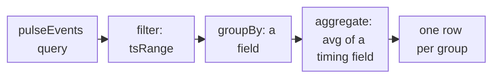

import DocCardGroup from '@aziontech/webkit/doc-card-group'
import DocCard from '@aziontech/webkit/doc-card'

You read the measurements that [Edge Pulse](/en/documentation/platform/edge-pulse/) collects from the browsers of real visitors with GraphQL queries on the `pulseEvents` dataset, through the Azion API. No page of Azion Console charts them, and the REST API carries no Edge Pulse endpoint. To put the tag on your pages first, refer to [Edge Pulse quickstart](/en/documentation/platform/edge-pulse/quickstart/).

The Real-Time Events GraphQL endpoint, `https://api.azion.com/v4/events/graphql`, serves `pulseEvents`. Each record is one measurement, with the address of the page it was taken on and the timings of that page load. A query bounds a time window, groups the records, and applies one aggregate function to a field in each group.



1. The query selects the measurements of a time window with `tsRange`.
2. It groups them by a field, such as `locationhref`, the address of the page.
3. It averages one timing field, such as `pageloadtime`, inside each group.
4. The API returns one row per group.

---

## Prerequisites

- Pages that carry the Edge Pulse tag and receive visits. Nothing is collected until a visitor loads a tagged page. For the steps, refer to [Edge Pulse quickstart](/en/documentation/platform/edge-pulse/quickstart/).
- A [personal token](/en/documentation/guides/platform/account-and-billing/personal-tokens/), sent in the `Authorization` header under the `Token` scheme. A `Bearer` header returns `401`.
- `curl`, or another HTTP client. To run the same queries in GraphiQL, the editor the endpoint serves to a browser signed in to Azion Console, refer to [GraphQL API first steps](/en/documentation/devtools/graphql/first-steps/).

The examples read the day from `2026-10-04T00:00:00` to `2026-10-05T00:00:00` on the site `https://www.example.com/`. Replace the dates with a window inside the last 7 days, and the address with a page of yours.

---

## Average a timing field per page

A query on `pulseEvents` needs a time window inside `filter`, and both bounds use the same timezone. Real-Time Events keeps a record for 7 days, so the window reaches back 7 days at most. Without `limit`, the API returns 10 rows, so `limit: 100` keeps every page of a site with up to 100 tagged addresses. `orderBy: [avg_DESC]` puts the slowest page first.

To average `pageloadtime`, the time until the page finished loading, for every tagged page, send the query to the events endpoint:

```bash
curl -X POST https://api.azion.com/v4/events/graphql \
  -H "Authorization: Token [TOKEN VALUE]" \
  -H "Content-Type: application/json" \
  -d '{"query": "query { pulseEvents(limit: 100, filter: { tsRange: {begin: \"2026-10-04T00:00:00\", end: \"2026-10-05T00:00:00\"} }, aggregate: { avg: pageloadtime }, groupBy: [locationhref], orderBy: [avg_DESC]) { locationhref avg } }"}'
```

The endpoint returns HTTP `200`. The response carries `data.pulseEvents`, an array with one object per page address that reported measurements in the window, and each object holds only the fields the query selected: `locationhref` and `avg`. A window with no measurements returns an empty array, not an error.

A query without a time window is refused with HTTP `400`:

```json
{
  "detail": "To execute queries it is mandatory to provide the desired time interval."
}
```

Each tagged page with visits in the window has a row, with the average load time of its measurements. A tagged page with visits and no row is a page where the tag does not run, because the tag reports no error of its own.

---

## Split the load time into its parts

The `aggregate` argument takes each function at most once per query, and each function takes one field. One query therefore averages one timing field, and each part of the load time is its own query. Add `count: rows` to the same query to return how many measurements each average covers.

These timing fields take the same query in place of `pageloadtime`:

| Field | What it holds |
| --- | --- |
| `dns` | Time spent resolving the name |
| `tcp` | Time spent opening the connection |
| `ssl` | Time spent on the TLS handshake |
| `ttfb` | Time until the first byte of the response arrived |
| `contentdownload` | Time spent downloading the content |
| `networkduration` | Total time the network part of the visit took |
| `rendertime` | Time the browser spent rendering |

To average `ttfb` per page, with the number of measurements behind each average:

```bash
curl -X POST https://api.azion.com/v4/events/graphql \
  -H "Authorization: Token [TOKEN VALUE]" \
  -H "Content-Type: application/json" \
  -d '{"query": "query { pulseEvents(limit: 100, filter: { tsRange: {begin: \"2026-10-04T00:00:00\", end: \"2026-10-05T00:00:00\"} }, aggregate: { avg: ttfb, count: rows }, groupBy: [locationhref], orderBy: [avg_DESC]) { locationhref avg count } }"}'
```

Each object of `data.pulseEvents` carries `locationhref`, `avg`, and `count`. Run the query once per field to compare the parts of each page's load time.

---

## Compare visitors by connection or browser

The same query can group the measurements by another field in place of the page. `effectivetype` holds the connection class the browser reported, such as `4g`, and `browser` the browser that performed the measurement. A field in `filter` with no suffix compares for equality, so `locationhref` in `filter` keeps the measurements of one page.

To average the load time of the home page per connection class:

```bash
curl -X POST https://api.azion.com/v4/events/graphql \
  -H "Authorization: Token [TOKEN VALUE]" \
  -H "Content-Type: application/json" \
  -d '{"query": "query { pulseEvents(limit: 100, filter: { tsRange: {begin: \"2026-10-04T00:00:00\", end: \"2026-10-05T00:00:00\"}, locationhref: \"https://www.example.com/\" }, aggregate: { avg: pageloadtime, count: rows }, groupBy: [effectivetype], orderBy: [avg_DESC]) { effectivetype avg count } }"}'
```

Each object of `data.pulseEvents` carries one connection class, with the average load time of the home page and the number of measurements in that class. Group by `browser` in place of `effectivetype` to compare browsers.

The dataset carries no Core Web Vitals field, such as LCP, CLS, or INP, and no field for the region or country of the visitor. For every field a query can select, refer to [Real-Time Events fields](/en/documentation/devtools/graphql/gql-real-time-events-fields/#pulseevents-edge-pulse).

:::note
One query selects up to 37 fields and returns up to 10,000 rows, and the API accepts 120 requests per minute, past which it answers `429`. A query over the full 7 days with no other filter can reach the bound on the rows the log database reads, so query one day at a time. For every bound, refer to [Real-Time Events limits](/en/documentation/platform/real-time-events/limits/).
:::

---

## Next steps

<DocCardGroup cols={2}>
  <DocCard title="How Edge Pulse works" href="/en/documentation/platform/edge-pulse/how-it-works/" label="What one test measures, how often a visitor is tested, and how long a measurement is kept." />
  <DocCard title="Real-Time Events fields" href="/en/documentation/devtools/graphql/gql-real-time-events-fields/#pulseevents-edge-pulse" label="Every field of the pulseEvents dataset, with the type the schema declares." />
  <DocCard title="Queries" href="/en/documentation/devtools/graphql/queries/" label="The aggregate functions, and what groupBy does with them, on every dataset." />
  <DocCard title="Monitor website and API performance" href="/en/documentation/use-cases/improve-performance-and-reliability/monitor-website-and-api-performance/" label="Edge Pulse measurements read per page and compared with what Azion served for the same domain." />
</DocCardGroup>
