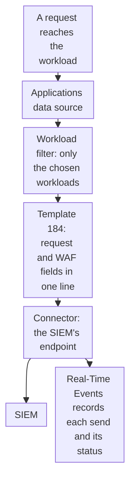

import DocCardGroup from '@aziontech/webkit/doc-card-group'
import DocCard from '@aziontech/webkit/doc-card'
import DocSteps from '@aziontech/webkit/doc-steps'
import DocStep from '@aziontech/webkit/doc-step'
import Tabs from '~/components/webkit/Tabs.vue'

You send every request to an application, with the WAF fields of the same request, to a security information and event management (SIEM) platform from Azion Console or the Azion API. To send only the requests WAF analyzed, refer to [Stream WAF events to a SIEM](/en/documentation/guides/application-security/firewall-and-waf/integrate-siems/).

A [Data Stream](/en/documentation/platform/data-stream/) stream on the _Applications_ data source, shaped by the _Applications + WAF Event Collector_ preset, carries the request, the response, and the client address with the WAF score, matches, and block flag of the same request. One log line then answers a question about one request, whether WAF flagged it or not. The cost is volume: the preset sends 51 keys, the most of the five presets, and Data Stream is billed on requests and data transfer.



1. Each request to a chosen workload becomes an event of the _Applications_ data source.
2. The workload filter keeps only the workloads you choose, and leaves the account's other streams active.
3. Template `184` renders each event as one log line with the request fields and the WAF fields.
4. The stream sends the lines to the SIEM's endpoint in batches, and Real-Time Events records each send with the status the endpoint returned.

---

## Prerequisites

- An account user with the **Edit Data Stream** permission. For the permissions, refer to [Stream settings](/en/documentation/platform/data-stream/stream-settings/#permissions).
- A workload whose firewall applies a WAF rule set with a _Set WAF_ rule. To build it, refer to [Apply a rule set to every request](/en/documentation/guides/application-security/firewall-and-waf/apply-rule-set/).
- An endpoint that your SIEM reads. The examples use an Apache Kafka cluster, with the host and port of its servers and one topic. For the other endpoints, refer to [Endpoints](/en/documentation/platform/data-stream/endpoints/).
- A [personal token](/en/documentation/guides/platform/account-and-billing/personal-tokens/) and the ID of the workload, for the API procedure.
- Access to Azion Console, for the Console procedure. Refer to [Access Azion Console](/en/documentation/guides/platform/account-and-billing/how-to-access-azion-console/).

The examples send the requests of the workload `<workload-id>` to the topic `azion.requests` on `kafka1.example.com:9092` and `kafka2.example.com:9092`. Replace them with your workload and endpoint.

---

## Create the stream

The stream takes its scope from a workload filter rather than sampling. A stream carries exactly one of the two, and saving an active stream with sampling, at any rate including `100`, deactivates every other stream on the account with no error. A filter holds up to 600 workloads, and a workload created later is not collected until you add it.

<Tabs client:visible sharedStore="interface">
<Fragment slot="tab.console">Console</Fragment>
<Fragment slot="tab.api">API</Fragment>

<Fragment slot="panel.console">

To create the stream in Azion Console:

<DocSteps>
  <DocStep title="Open Data Stream">

  Access [Azion Console](https://console.azion.com/) > **Data Stream**.

  </DocStep>
  <DocStep title="Select + Stream" />
  <DocStep title="Name the stream">

  In the **General** section, enter a **Name**. For example: `requests-to-siem`.

  </DocStep>
  <DocStep title="Select the Applications data source">

  In the **Input** section, select _Applications_ in **Data Source**.

  </DocStep>
  <DocStep title="Turn off Sampling">

  In the **Transform** section, turn off **Sampling** while **Option** is still _All Current and Future Workloads_.

  </DocStep>
  <DocStep title="Choose the workload">

  Set **Option** to _Filter Workloads_. In **Available Workload**, select the workload and move it to **Chosen Workload**.

  </DocStep>
  <DocStep title="Select the template">

  In the **Render Template** section, select _Applications + WAF Event Collector_ in **Template**. The **Data Set** field shows the keys of each log line.

  </DocStep>
  <DocStep title="Select the endpoint">

  In the **Output** section, select _Apache Kafka_ in **Connector**. Enter `kafka1.example.com:9092,kafka2.example.com:9092` in **Bootstrap Servers** and `azion.requests` in **Kafka Topic**, and turn on **Enable Transport Layer Security (TLS)**.

  </DocStep>
  <DocStep title="Keep the stream active">

  In the **Status** section, keep **Active** turned on.

  </DocStep>
  <DocStep title="Select Save" />
</DocSteps>

The Console shows `Your data stream has been created`. The stream appears in the **Data Stream** list with `workloads` in the **Source** column.

</Fragment>

<Fragment slot="panel.api">

To create the stream with the API, send the `workloads` data source, which is _Applications_ in the Console, with template `184`:

```bash
curl --request POST \
  --url https://api.azion.com/v4/workspace/stream/streams \
  --header 'Authorization: Token <personal-token>' \
  --header 'Content-Type: application/json' \
  --data '{
  "name": "requests-to-siem",
  "active": true,
  "inputs": [{ "type": "raw_logs", "attributes": { "data_source": "workloads" } }],
  "transform": [
    { "type": "filter_workloads", "attributes": { "workloads": [<workload-id>] } },
    { "type": "render_template", "attributes": { "template": 184 } }
  ],
  "outputs": [{
    "type": "kafka",
    "attributes": { "bootstrap_servers": "kafka1.example.com:9092,kafka2.example.com:9092", "kafka_topic": "azion.requests", "use_tls": true }
  }]
}'
```

The API answers `201` with `state` set to `executed` and the stored stream under `data`. Keep its `id`, which every later request on the stream uses. A stream with both `sampling` and `filter_workloads` is refused with `32007`, and one with neither with `32002`.

</Fragment>
</Tabs>

The stream starts sending one to two minutes after it is saved. Saving checks the format of each field and does not contact the endpoint, so a wrong address or topic shows only when the stream sends. For a SIEM with its own connector, select it in **Connector**, or send its `type` in `outputs[0]`: _Splunk_ takes the HTTP Event Collector URL and token, _IBM QRadar_ a URL, and _Elasticsearch_ a URL and an encoded API key. A stream keeps one endpoint, and the API drops any second entry in `outputs` with no error. For every field, refer to [Endpoints](/en/documentation/platform/data-stream/endpoints/).

---

## Confirm the delivery

Real-Time Events records every send of a stream, delivered or not, with the status code the endpoint returned. A stream sends a batch every 60 seconds, or sooner when it reaches 2,000 log lines. A failed send does not stop the stream, and its lines are not sent again. Send a few requests to the workload, then wait about a minute.

<Tabs client:visible sharedStore="interface">
<Fragment slot="tab.console">Console</Fragment>
<Fragment slot="tab.api">API</Fragment>

<Fragment slot="panel.console">

To find the sends in Azion Console:

<DocSteps>
  <DocStep title="Open Real-Time Events">

  Access [Azion Console](https://console.azion.com/) > **Real-Time Events**.

  </DocStep>
  <DocStep title="Select the Data Stream data source" />
  <DocStep title="Read the latest sends">

  Find the rows whose **Endpoint Type** matches your endpoint, and read their **Status Code** and **Streamed Lines**.

  </DocStep>
</DocSteps>

A **Status Code** of `200` means the endpoint accepted the batch.

</Fragment>

<Fragment slot="panel.api">

To read the sends, query the `dataStreamedEvents` dataset, with a range that covers the activation of the stream:

```bash
curl --request POST \
  --url https://api.azion.com/v4/events/graphql \
  --header 'Authorization: Token <personal-token>' \
  --header 'Content-Type: application/json' \
  --data '{"query":"query { dataStreamedEvents(limit: 20, filter: {tsRange: {begin: \"2030-01-01T10:00:00\", end: \"2030-01-01T11:00:00\"}}, orderBy: [ts_DESC]) { ts endpointType statusCode streamedLines dataStreamed } }"}'
```

The API answers `200` with one record per send, the latest first. Each record carries the type of your endpoint in `endpointType`:

```json
{"data":{"dataStreamedEvents":[{"ts":"<time>","endpointType":"<endpoint-type>","statusCode":200,"streamedLines":<lines>,"dataStreamed":<bytes>}]}}
```

An empty `dataStreamedEvents` list means the stream has not sent in the range.

</Fragment>
</Tabs>

A status other than `200` is the answer of the endpoint, and `503` means Data Stream found the endpoint unavailable. For the causes, refer to [Troubleshoot Data Stream](/en/documentation/platform/data-stream/troubleshooting/).

At the SIEM, each log line carries the keys of the template, named after its variables. These keys tie the security decision to the request:

- `request_id` identifies the request, and `remote_addr`, `host`, `request_uri`, and `status` describe it.
- `waf_score` and `waf_match` hold the score of the request and the infractions it matched.
- `waf_block` reads `1` when WAF blocked the request. While `waf_learning` reads `1`, WAF blocks no request, whatever `waf_block` reads.

The SIEM receives one line per request to the workload, each with its WAF fields. The SIEM keeps the lines for as long as you configure it to.

---

## Next steps

<DocCardGroup cols={2}>
  <DocCard title="Stream WAF events to a SIEM" href="/en/documentation/guides/application-security/firewall-and-waf/integrate-siems/" label="Send only the requests WAF analyzed, with the attack family and action of each." />
  <DocCard title="Data sources and variables" href="/en/documentation/platform/data-stream/data-sources-and-variables/#applications" label="What each variable of the Applications data source holds, and which preset carries it." />
  <DocCard title="Endpoints" href="/en/documentation/platform/data-stream/endpoints/" label="The fields of every endpoint a stream sends to, with their bounds and API names." />
  <DocCard title="Data Stream best practices" href="/en/documentation/platform/data-stream/best-practices/#use-the-applications--waf-event-collector-preset-to-feed-a-siem" label="When the combined preset is worth its volume, and how to send fewer variables." />
  <DocCard title="Prepare regulated web applications for security audits" href="/en/documentation/use-cases/secure-applications-and-networks/prepare-regulated-web-applications-for-security-audits/" label="An audit setup that exports every request and WAF event to a destination the team keeps." />
  <DocCard title="Troubleshoot Data Stream" href="/en/documentation/platform/data-stream/troubleshooting/" label="What to change when a send returns a status other than 200." />
</DocCardGroup>
