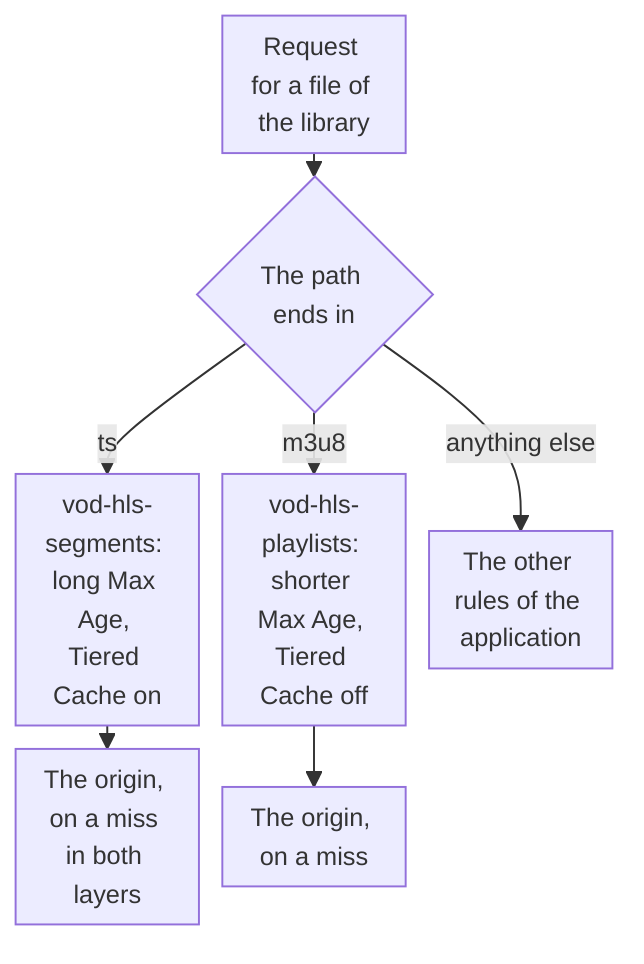

import DocCardGroup from '@aziontech/webkit/doc-card-group'
import DocCard from '@aziontech/webkit/doc-card'
import DocSteps from '@aziontech/webkit/doc-steps'
import DocStep from '@aziontech/webkit/doc-step'
import Tabs from '~/components/webkit/Tabs.vue'

You give the segments and the playlists of an on-demand HLS library their own cache settings, and apply each one with a rule on its file extension, from Azion Console, the Azion API, or the Azion CLI. For a live stream, refer to [Enforce HLS cache for live streaming](/en/documentation/guides/media-and-streaming/streaming/enforce-hls-cache/) when your own origin produces it, or to [Deliver a live stream from Live Ingest](/en/documentation/guides/media-and-streaming/streaming/deliver-a-live-stream-from-live-ingest/) when Live Ingest does.

An HLS title is a set of playlists, `.m3u8`, and the segments they list, `.ts`. A segment of an encoded title does not change, so it can stay cached for a long time and use [Tiered Cache](/en/documentation/platform/applications/cache/tiered-cache/). A playlist can be rewritten when a title is re-published, so it takes a shorter cache time, and it stays out of the Tiered Cache layer so that a URL purge removes it.



1. A path that ends in `.ts` takes the `vod-hls-segments` cache setting.
2. A path that ends in `.m3u8` takes the `vod-hls-playlists` cache setting.
3. Any other path is left to the other rules of the application.
4. A miss reaches the origin through the connector, and the response is cached under the setting its path took.

---

## Prerequisites

- An application that serves the library through a connector, to a bucket or to an HTTP origin. For a bucket, refer to [Use a bucket as an application origin](/en/documentation/guides/application-development/data/use-bucket-as-origin/).
- A [personal token](/en/documentation/guides/platform/account-and-billing/personal-tokens/), for the API procedures.
- The [Azion CLI](/en/documentation/devtools/cli/) installed and authorized, for the CLI procedures.
- Access to Azion Console, for the Console procedures. Refer to [Access Azion Console](/en/documentation/guides/platform/account-and-billing/how-to-access-azion-console/).

The examples cache segments for `86400` seconds and playlists for `300` seconds, on an application served at `www.example.com`. Replace them with the values your library needs.

---

## Create the cache settings

Each file type takes its own cache setting. **Max Age** accepts 0 to 31,536,000 seconds. A value below 60 requires [Application Accelerator](/en/documentation/platform/applications/#application-accelerator) on the application, or the API rejects the setting with `21021`, so the examples stay at 60 or more. Tiered Cache requires _Override cache behavior_, or the API rejects the setting with `21001`, and a **Max Age** of at least 3 seconds, or it fails with `21020`.

Both settings override the browser cache to `0` seconds. Real-Time Purge removes a copy from Azion's cache layers, and a copy the viewer's browser keeps stays there until its own TTL ends.

<Tabs client:visible sharedStore="interface">
<Fragment slot="tab.console">Console</Fragment>
<Fragment slot="tab.api">API</Fragment>
<Fragment slot="tab.cli">CLI</Fragment>

<Fragment slot="panel.console">

To create the cache setting for the segments:

<DocSteps>
  <DocStep title="Open the Cache Settings tab">

  Access [Azion Console](https://console.azion.com/) > **Applications**, select the application that serves the library, and select the **Cache Settings** tab.

  </DocStep>
  <DocStep title="Select + Cache" />
  <DocStep title="Name the cache setting">

  In **Name**, enter `vod-hls-segments`.

  </DocStep>
  <DocStep title="Set the browser cache">

  Under **Browser Cache**, select _Override cache settings_ and set the TTL to `0`.

  </DocStep>
  <DocStep title="Set Max Age">

  Under **Cache**, keep _Override cache behavior_ selected and set **Max Age** to `86400`.

  </DocStep>
  <DocStep title="Turn on Tiered Cache">

  In the same section, turn on **Tiered Cache** and select the nearest region in **Tiered Cache Region**.

  </DocStep>
  <DocStep title="Select Save" />
</DocSteps>

Create the cache setting for the playlists with the same steps: name it `vod-hls-playlists`, set **Max Age** to `300`, and leave **Tiered Cache** off.

</Fragment>

<Fragment slot="panel.api">

To create the cache setting for the segments, send its body to the cache settings of the application:

```bash
curl --request POST \
  --url https://api.azion.com/v4/workspace/applications/<application-id>/cache_settings \
  --header 'Authorization: Token <personal-token>' \
  --header 'Content-Type: application/json' \
  --data '{
  "name": "vod-hls-segments",
  "browser_cache": { "behavior": "override", "max_age": 0 },
  "modules": {
    "cache": {
      "behavior": "override",
      "max_age": 86400,
      "tiered_cache": { "enabled": true, "topology": "nearest-region" }
    }
  }
}'
```

The API answers `201` with the new setting under `data`. Record its `id` for the rule:

```json
{"state":"executed","data":{"id":<segments-setting-id>,"name":"vod-hls-segments",...}}
```

Send the same request for the playlists, with `"name": "vod-hls-playlists"`, `"max_age": 300`, and no `tiered_cache` object, and record its `id` as well. Without a `tiered_cache` object, Tiered Cache stays off.

</Fragment>

<Fragment slot="panel.cli">

The CLI flags cannot set **Max Age**, the cache behavior, or Tiered Cache, so the CLI reads the setting from a file. Save the segments setting as `segments.json`:

```json
{
  "name": "vod-hls-segments",
  "browser_cache": { "behavior": "override", "max_age": 0 },
  "modules": {
    "cache": {
      "behavior": "override",
      "max_age": 86400,
      "tiered_cache": { "enabled": true, "topology": "nearest-region" }
    }
  }
}
```

Create the setting from the file:

```bash
azion create cache-setting --application-id <application-id> --file segments.json
```

The command prints the ID of the setting, which the rule names:

```text
Created Cache Settings configuration with ID <segments-setting-id>
```

Save the playlists setting as `playlists.json`, with `"name": "vod-hls-playlists"`, `"max_age": 300`, and no `tiered_cache` object, and create it the same way.

</Fragment>
</Tabs>

Both settings appear in the **Cache Settings** tab of the application, and neither applies to a request until a rule names it.

---

## Apply each setting with a rule on its extension

The _matches_ operator compares the path with a regular expression. `\.ts$` escapes the dot and anchors the pattern at the end of the path, so only a path that ends in `.ts` takes the segments setting. `${uri}` holds the path without the query string, so a segment requested with a query string still matches. The rule uses the _Set Cache Policy_ behavior, which needs no other Product on the application.

<Tabs client:visible sharedStore="interface">
<Fragment slot="tab.console">Console</Fragment>
<Fragment slot="tab.api">API</Fragment>
<Fragment slot="tab.cli">CLI</Fragment>

<Fragment slot="panel.console">

To create the rule for the segments:

<DocSteps>
  <DocStep title="Select the Rules Engine tab of the application" />
  <DocStep title="Select + Rule" />
  <DocStep title="Name the rule">

  In **General**, enter `cache-vod-segments` as the **Name**.

  </DocStep>
  <DocStep title="Select the request phase">

  In **Phase**, select _Request Phase_.

  </DocStep>
  <DocStep title="Set the criterion">

  Under **Criteria**, select the variable `${uri}` and the operator _matches_, and enter `\.ts$` as the argument.

  </DocStep>
  <DocStep title="Select the Set Cache Policy behavior">

  Under **Behaviors**, select _Set Cache Policy_, then select `vod-hls-segments`.

  </DocStep>
  <DocStep title="Select Save" />
</DocSteps>

Create the rule for the playlists with the same steps: name it `cache-vod-playlists`, enter `\.m3u8$` as the argument, and select `vod-hls-playlists`.

</Fragment>

<Fragment slot="panel.api">

To create the rule for the segments, replace `<segments-setting-id>` with the `id` of `vod-hls-segments`. In a JSON body, the backslash of the expression is doubled:

```bash
curl --request POST \
  --url https://api.azion.com/v4/workspace/applications/<application-id>/request_rules \
  --header 'Authorization: Token <personal-token>' \
  --header 'Content-Type: application/json' \
  --data '{
  "name": "cache-vod-segments",
  "active": true,
  "criteria": [[{ "variable": "${uri}", "conditional": "if", "operator": "matches", "argument": "\\.ts$" }]],
  "behaviors": [{ "type": "set_cache_policy", "attributes": { "value": <segments-setting-id> } }]
}'
```

The API answers `202` with a `state` of `pending` and the rule as the platform stored it. Send the same request for the playlists, with `"name": "cache-vod-playlists"`, the argument `"\\.m3u8$"`, and the `id` of `vod-hls-playlists`.

</Fragment>

<Fragment slot="panel.cli">

To create the rule for the segments with the Azion CLI, keep it in a file, because on a command line the shell would expand `${uri}`. Save this body as `rule-segments.json`, with the backslash doubled as JSON requires:

```json
{
  "name": "cache-vod-segments",
  "active": true,
  "criteria": [[{ "variable": "${uri}", "conditional": "if", "operator": "matches", "argument": "\\.ts$" }]],
  "behaviors": [{ "type": "set_cache_policy", "attributes": { "value": <segments-setting-id> } }]
}
```

Create the rule in the request phase of the application:

```bash
azion create rules-engine --application-id <application-id> --phase request --file rule-segments.json
```

The output carries the ID of the new rule:

```text
Created Rules Engine with ID <rule-id>
```

Create the rule for the playlists the same way, with `"name": "cache-vod-playlists"`, the argument `"\\.m3u8$"`, and the ID of `vod-hls-playlists`.

</Fragment>
</Tabs>

Segments are cached for 86,400 seconds in Cache and in the Tiered Cache layer, and playlists for 300 seconds in Cache. A new rule can take a few minutes to propagate.

:::caution
A URL or wildcard purge does not reach the Tiered Cache layer: a cache key purge is the only type that does. To remove a segment held in both layers, purge Tiered Cache first and then Cache, so the first layer is not refilled from a stale copy. For the steps, refer to [Purge cached content](/en/documentation/guides/application-performance/cache-and-purge/purge-cached-content/).
:::

In the [Deliver an on-demand video library](/en/documentation/use-cases/deliver-media-and-streaming/deliver-an-on-demand-video-library/) use case, this section takes these values:

| File type | Cache setting | Max Age | Tiered Cache | Browser cache | Rule | Argument of `${uri}` _matches_ |
| --- | --- | --- | --- | --- | --- | --- |
| Segments | `vod-segments` | `31536000` | On, `nearest-region` | Override, `0` | `vod - cache segments` | `\.ts$` |
| Playlists | `vod-playlists` | `3600` | Off | Override, `0` | `vod - cache playlists` | `\.m3u8$` |

Segments are cached for 31,536,000 seconds in Cache and in the Tiered Cache layer, and playlists for 3,600 seconds in Cache. Browsers keep neither. A new rule takes a few minutes to propagate.

---

## Confirm each file type answers from cache

The request header `Pragma: azion-debug-cache` makes the response carry the `x-cache` header. To confirm the segments setting:

<DocSteps>
  <DocStep title="Request a segment with the debug header">

  ```bash
  curl -sI -H "Pragma: azion-debug-cache" https://www.example.com/<title>/<segment>.ts
  ```

  </DocStep>
  <DocStep title="Run the same command again">

  The `x-cache` header of the second response starts with `HIT`, because Azion answered from the stored copy. The header also carries the IP address of the server that answered and the protocol.

  </DocStep>
</DocSteps>

Repeat the two requests for a playlist, `https://www.example.com/<title>/<playlist>.m3u8`. The first response of each file can carry `MISS`, while Azion fetches it from the origin. For every status the header can carry, refer to [Check the cache status of a response](/en/documentation/guides/application-performance/cache-and-purge/check-page-cache-time/).

In the [Deliver an on-demand video library](/en/documentation/use-cases/deliver-media-and-streaming/deliver-an-on-demand-video-library/) use case, expect:

- **Segments answer from cache.** The second request for `https://videos.example.com/course-101/720p/segment-00001.ts` carries `x-cache: HIT`. The first can carry `MISS`, while the application reads the segment from the bucket.
- **Playlists answer from cache.** The second request for the main playlist carries `x-cache: HIT`.

---

## Next steps

<DocCardGroup cols={2}>
  <DocCard title="Cache settings" href="/en/documentation/platform/applications/cache/cache-settings/" label="Every field of a cache setting, with its type, its default, its bounds, and its errors." />
  <DocCard title="Tiered Cache" href="/en/documentation/platform/applications/cache/tiered-cache/" label="The second cache layer, its topologies, its TTL floor, and how it is purged." />
  <DocCard title="Rules Engine for Applications" href="/en/documentation/platform/applications/rules-engine/#operators" label="Every criterion variable and operator a rule can use." />
  <DocCard title="Deliver an on-demand video library" href="/en/documentation/use-cases/deliver-media-and-streaming/deliver-an-on-demand-video-library/" label="An HLS library stored in Object Storage and served with these two cache settings." />
</DocCardGroup>
