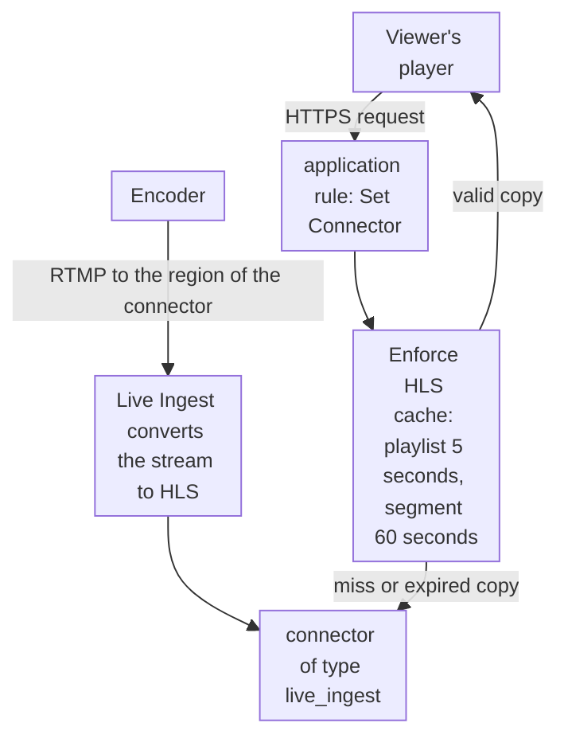

import DocCardGroup from '@aziontech/webkit/doc-card-group'
import DocCard from '@aziontech/webkit/doc-card'
import DocSteps from '@aziontech/webkit/doc-steps'
import DocStep from '@aziontech/webkit/doc-step'
import Tabs from '~/components/webkit/Tabs.vue'

You create the connector that takes a live stream into Azion, and the rule that delivers that stream to viewers, from Azion Console, the Azion API, or the Azion CLI. For an HLS stream that your own origin produces, refer to [Enforce HLS cache for live streaming](/en/documentation/guides/media-and-streaming/streaming/enforce-hls-cache/).

Your encoder pushes the stream over RTMP to [Live Ingest](/en/documentation/platform/connectors/live-ingest/ingestion-and-delivery/), which converts it to HLS: a playlist, `.m3u8`, and the segments it lists, `.ts`. Viewers never reach Live Ingest directly. They request the stream from an application, and a rule of that application names the connector.



1. The encoder pushes the stream over RTMP to Live Ingest, in the region of the connector.
2. Live Ingest converts the stream to HLS.
3. A viewer's player requests the stream from the application, and a rule's _Set Connector_ behavior names the connector.
4. Azion adds the _Enforce HLS cache_ behavior to that rule, which caches each playlist for 5 seconds and each segment for 60 seconds.
5. A valid cached copy answers every viewer, and only an expired or missing copy is fetched through the connector.

---

## Prerequisites

- An application served by a workload, with a hostname that viewers request. To create both, refer to [Applications quickstart](/en/documentation/platform/applications/quickstart/).
- An encoder that pushes RTMP with username and password authentication. Azion provides the credentials and the ingest URLs of a primary and a backup endpoint. For the requirement, refer to [Ingestion](/en/documentation/platform/connectors/live-ingest/ingestion-and-delivery/#ingestion).
- A [personal token](/en/documentation/guides/platform/account-and-billing/personal-tokens/), for the API procedures.
- The [Azion CLI](/en/documentation/devtools/cli/) installed and authorized, for the CLI procedures.
- Access to Azion Console, for the Console procedures. Refer to [Access Azion Console](/en/documentation/guides/platform/account-and-billing/how-to-access-azion-console/).

This guide does not cover how you obtain the ingest URLs and credentials, or the URL layout of the playlist that viewers request. The examples use `my-live-connector` for the connector and `us-east-1` for the region. Replace them with your values.

---

## Create the Live Ingest connector

The connector carries one setting, the region where Live Ingest receives the stream. Choose the region closest to the encoder, not to the viewers: it shortens the path the stream travels before Azion receives it. The region accepts `us-east-1`, `us-east-2`, `br-east-1`, `br-east-2`, and `br-east-3`.

<Tabs client:visible sharedStore="interface">
<Fragment slot="tab.console">Console</Fragment>
<Fragment slot="tab.api">API</Fragment>
<Fragment slot="tab.cli">CLI</Fragment>

<Fragment slot="panel.console">

To create the connector in Azion Console:

<DocSteps>
  <DocStep title="Open the Connectors page">

  Access [Azion Console](https://console.azion.com/) > **Connectors**.

  </DocStep>
  <DocStep title="Start a new connector">

  The **Create Connector** page opens.

  </DocStep>
  <DocStep title="Name the connector">

  In **General**, enter `my-live-connector` as the **Name**.

  </DocStep>
  <DocStep title="Select the Live Ingest type">

  In **Connector Type**, select _Live Ingest_.

  </DocStep>
  <DocStep title="Select the region">

  In **Region**, select `us-east-1`. The field is required.

  </DocStep>
  <DocStep title="Select Create" />
</DocSteps>

The `my-live-connector` connector exists in your account in `us-east-1`.

</Fragment>

<Fragment slot="panel.api">

To create the connector, send its name, its type, and its region to the connectors endpoint:

```bash
curl --request POST \
  --url https://api.azion.com/v4/workspace/connectors \
  --header 'Authorization: Token <personal-token>' \
  --header 'Content-Type: application/json' \
  --data '{
  "name": "my-live-connector",
  "type": "live_ingest",
  "attributes": { "region": "us-east-1" }
}'
```

The API answers `202` with `"state": "pending"`, and the connector reads back with `"attributes": {"region": "us-east-1"}`. Record its `id`: the rule names the connector by it. A request without `region` fails with `10059`, and a region outside the five values fails with `10039`.

</Fragment>

<Fragment slot="panel.cli">

To create the connector with the Azion CLI, save its body as `connector.json`:

```json
{
  "name": "my-live-connector",
  "type": "live_ingest",
  "attributes": { "region": "us-east-1" }
}
```

Create the connector from the file. The command needs `--type` even when the file names the type:

```bash
azion create connector --type live_ingest --file connector.json
```

The output carries the ID of the new connector, which the rule names:

```text
Created Connector with ID <connector-id>
```

</Fragment>
</Tabs>

The connector exists in your account, and no viewer request reaches it until a rule of the application names it. A change to a connector reaches Azion's distributed infrastructure in several minutes.

In the [Stream live events to large audiences](/en/documentation/use-cases/deliver-media-and-streaming/stream-live-events-to-large-audiences/) use case, this section takes these values:

| Setting | Value |
| --- | --- |
| **Name** | `live-ingest-br`, which the delivery rule selects |
| **Type** | _Live Ingest_, `live_ingest` in the API |
| **Region** | `br-east-1`, the region closest to the venue |

The connector exists in your account in `br-east-1`, and no viewer request reaches it until a rule of the application names it.

---

## Send the viewers' requests to the connector

A Request Phase rule with the _Set Connector_ behavior sends the requests it matches to the connector. On an application that serves only the stream, the rule matches every path: `${uri}` starts with `/`. When several matching rules carry _Set Connector_, only the last one runs, so keep this rule after any rule that sends every path to another connector. A new rule goes after the rules the application already has.

<Tabs client:visible sharedStore="interface">
<Fragment slot="tab.console">Console</Fragment>
<Fragment slot="tab.api">API</Fragment>
<Fragment slot="tab.cli">CLI</Fragment>

<Fragment slot="panel.console">

To create the rule in Azion Console:

<DocSteps>
  <DocStep title="Open the application">

  Access [Azion Console](https://console.azion.com/) > **Applications**, and select the application that delivers the stream.

  </DocStep>
  <DocStep title="Select the Rules Engine tab" />
  <DocStep title="Select + Rule" />
  <DocStep title="Name the rule">

  In **General**, enter `send-to-live-ingest` as the **Name**.

  </DocStep>
  <DocStep title="Select the request phase">

  In **Phase**, select _Request Phase_.

  </DocStep>
  <DocStep title="Set the criterion">

  Under **Criteria**, select the variable `${uri}` and the operator `starts_with`, and enter `/` as the argument.

  </DocStep>
  <DocStep title="Select the Set Connector behavior">

  Under **Behaviors**, select _Set Connector_.

  </DocStep>
  <DocStep title="Select the Live Ingest connector">

  In **Connector**, select `my-live-connector`. Azion adds the _Enforce HLS cache_ behavior to the rule.

  </DocStep>
  <DocStep title="Select Save" />
</DocSteps>

The rule appears in the **Rules Engine** tab, under the **Request** heading.

</Fragment>

<Fragment slot="panel.api">

To create the rule, send it to the Request Phase rules of the application. Replace `<connector-id>` with the `id` of the connector:

```bash
curl --request POST \
  --url https://api.azion.com/v4/workspace/applications/<application-id>/request_rules \
  --header 'Authorization: Token <personal-token>' \
  --header 'Content-Type: application/json' \
  --data '{
  "name": "send-to-live-ingest",
  "active": true,
  "criteria": [[{ "variable": "${uri}", "conditional": "if", "operator": "starts_with", "argument": "/" }]],
  "behaviors": [{ "type": "set_connector", "attributes": { "value": <connector-id> } }]
}'
```

The API answers `202` with a `state` of `pending` and the rule as the platform stored it. _Enforce HLS cache_ has no API `type` to send, because Azion adds it to the rule.

</Fragment>

<Fragment slot="panel.cli">

To create the rule with the Azion CLI, keep it in a file, because on a command line the shell would expand `${uri}`. Save this body as `rule.json`, and replace `<connector-id>` with the ID of the connector:

```json
{
  "name": "send-to-live-ingest",
  "active": true,
  "criteria": [[{ "variable": "${uri}", "conditional": "if", "operator": "starts_with", "argument": "/" }]],
  "behaviors": [{ "type": "set_connector", "attributes": { "value": <connector-id> } }]
}
```

Create the rule in the request phase of the application:

```bash
azion create rules-engine --application-id <application-id> --phase request --file rule.json
```

The output carries the ID of the new rule:

```text
Created Rules Engine with ID <rule-id>
```

</Fragment>
</Tabs>

Every request of the application now reaches the stream through the connector, under the live HLS cache policy. A new rule can take a few minutes to propagate.

In the [Stream live events to large audiences](/en/documentation/use-cases/deliver-media-and-streaming/stream-live-events-to-large-audiences/) use case, this section takes these values:

| Setting | Value |
| --- | --- |
| **Name** | `live - send to Live Ingest`, in the Request Phase |
| **Criterion** | `${uri}` starts with `/`, because the application on `live.example.com` serves only the stream |
| **Behavior** | _Set Connector_, naming `live-ingest-br` |

The rule carries _Set Connector_ and _Enforce HLS cache_.

---

## Keep the cache of the stream to Enforce HLS cache

_Enforce HLS cache_ bypasses the cache settings of the application and applies the cache policy Azion defines for live HLS. A cache setting that a _Set Cache Policy_ behavior applies to these requests therefore has no effect, so do not add one. To confirm the rule carries the policy:

<DocSteps>
  <DocStep title="Open the Rules Engine tab of the application">

  Access [Azion Console](https://console.azion.com/) > **Applications**, select the application, and select the **Rules Engine** tab.

  </DocStep>
  <DocStep title="Open the send-to-live-ingest rule" />
  <DocStep title="Read the behaviors">

  The rule carries _Set Connector_, naming `my-live-connector`, and _Enforce HLS cache_.

  </DocStep>
</DocSteps>

The application caches each playlist for 5 seconds and each segment for 60 seconds. One cached copy of a segment answers every viewer who requests it in that time, so a large audience does not send each of its requests to Live Ingest.

:::note
Live Ingest is billed on Data Ingestion, the volume of stream data that Azion ingests, and a test transmission is ingested like a real one. For the rate, refer to [Pricing](/en/documentation/fundamentals/pricing/#live-ingest).
:::

In the [Stream live events to large audiences](/en/documentation/use-cases/deliver-media-and-streaming/stream-live-events-to-large-audiences/) use case, expect:

- **The delivery rule carries the live cache policy.** The `live - send to Live Ingest` rule in the **Rules Engine** tab carries _Set Connector_, naming `live-ingest-br`, and _Enforce HLS cache_.

---

## Confirm that the stream answers from cache

Run these requests while the encoder is streaming. Each sends the `Pragma: azion-debug-cache` header, which makes the response carry the `x-cache` header. The examples use `live.example.com` for the hostname that viewers request. Replace it, `<stream>`, and `<segment>` with your values.

Request the playlist twice within 5 seconds:

```bash
curl -sI -H "Pragma: azion-debug-cache" https://live.example.com/<stream>.m3u8
```

The second response carries `x-cache: HIT`. The first can carry `MISS`, while the application fetches the playlist through the connector.

Take the name of a segment from the playlist body, and request it twice within 60 seconds:

```bash
curl -sI -H "Pragma: azion-debug-cache" https://live.example.com/<segment>.ts
```

The second response carries `x-cache: HIT`. For how to read the header, refer to [Check the cache status of a response](/en/documentation/guides/application-performance/cache-and-purge/check-page-cache-time/).

These checks confirm the [Stream live events to large audiences](/en/documentation/use-cases/deliver-media-and-streaming/stream-live-events-to-large-audiences/) use case.

In the [Stream live events to large audiences](/en/documentation/use-cases/deliver-media-and-streaming/stream-live-events-to-large-audiences/) use case, expect:

- **Viewers can play the stream.** Load `https://live.example.com/<stream>.m3u8` in an HLS player, such as the hls.js configuration in [Connectors best practices](/en/documentation/platform/connectors/best-practices/#give-the-player-a-fallback-for-load-errors). The player starts the stream and keeps advancing as the encoder pushes it.

---

## Next steps

<DocCardGroup cols={2}>
  <DocCard title="Ingestion and delivery" href="/en/documentation/platform/connectors/live-ingest/ingestion-and-delivery/" label="How Live Ingest takes the stream in a region, and how the application delivers it." />
  <DocCard title="Connectors best practices" href="/en/documentation/platform/connectors/best-practices/#live-ingest" label="Redundant endpoints, encoder settings, player fallback, alerts, and a load test before the event." />
  <DocCard title="Query Live Ingest connected users" href="/en/documentation/guides/platform/observability/query-connected-users-data-with-graphql/" label="Count the unique sessions of the stream per host, during and after the event." />
  <DocCard title="Stream live events to large audiences" href="/en/documentation/use-cases/deliver-media-and-streaming/stream-live-events-to-large-audiences/" label="A live event delivered from Live Ingest to a large audience, with its values and checks." />
</DocCardGroup>
