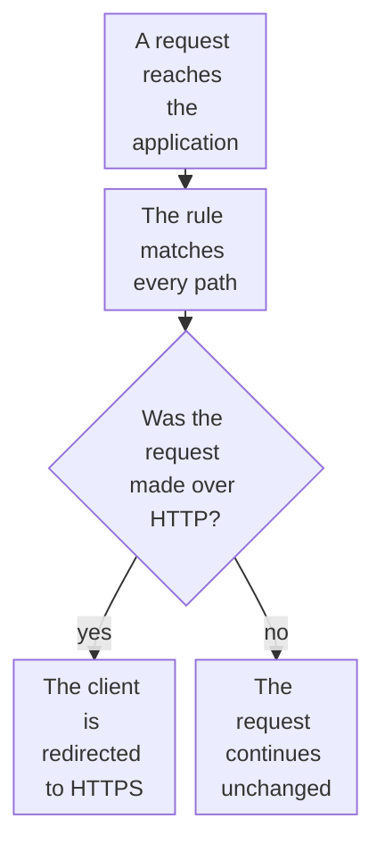

import DocCardGroup from '@aziontech/webkit/doc-card-group'
import DocCard from '@aziontech/webkit/doc-card'
import DocSteps from '@aziontech/webkit/doc-steps'
import DocStep from '@aziontech/webkit/doc-step'
import Tabs from '~/components/webkit/Tabs.vue'

You redirect every request made over plain HTTP to HTTPS with a rule on the application, from Azion Console, the API, or the Azion CLI. For the certificate that HTTPS on your own domain needs, refer to [Request a Let's Encrypt certificate](/en/documentation/guides/application-security/tls-and-certificates/how-to-generate-a-lets-encrypt-certificate/).

The _Redirect HTTP to HTTPS_ behavior redirects a request made over HTTP to HTTPS, and does nothing to a request already made over HTTPS. The rule therefore matches every path, with no condition on the scheme. The behavior requires HTTPS turned on in the protocol settings of the workload that delivers the application.



1. Every request matches the rule, because its criterion is `${uri}` _starts with_ `/`.
2. A request made over HTTP is redirected to HTTPS.
3. A request made over HTTPS continues to the rules that follow, unchanged.

---

## Prerequisites

- An application served by a workload. To create them, refer to [Applications quickstart](/en/documentation/platform/applications/quickstart/).
- **HTTPS support** turned on in the workload's **Protocol Settings**, with a certificate that covers the workload's domains. To have Azion request and renew one, refer to [Request a Let's Encrypt certificate](/en/documentation/guides/application-security/tls-and-certificates/how-to-generate-a-lets-encrypt-certificate/). For the HTTPS ports and the TLS fields, refer to [Workload settings](/en/documentation/platform/workloads/settings/#tls).
- A [personal token](/en/documentation/guides/platform/account-and-billing/personal-tokens/), for the API procedures.
- The [Azion CLI](/en/documentation/devtools/cli/) installed and authorized, for the CLI procedures.

The examples create the rule on the application `<application-id>`, served on `www.example.com`. Replace them with your values.

---

## Create the redirect rule

The rule needs no Product on the application: `${uri}` reads the path without Application Accelerator, and the behavior takes no argument.

<Tabs client:visible sharedStore="interface">
<Fragment slot="tab.console">Console</Fragment>
<Fragment slot="tab.api">API</Fragment>
<Fragment slot="tab.cli">CLI</Fragment>

<Fragment slot="panel.console">

To create the rule in Azion Console:

<DocSteps>
  <DocStep title="Go to the Rules Engine tab">

  Access [Azion Console](https://console.azion.com/) > **Applications** > **your application**, then go to the **Rules Engine** tab.

  </DocStep>
  <DocStep title="Select + Rule" />
  <DocStep title="Name the rule">

  Enter a name that identifies the redirect. For example: `redirect to HTTPS`.

  </DocStep>
  <DocStep title="Select Request Phase" />
  <DocStep title="Match every path">

  In the **Criteria** section, set the criterion to `${uri}` _starts with_ `/`.

  </DocStep>
  <DocStep title="In the Behaviors section, select Redirect HTTP to HTTPS" />
  <DocStep title="Select Save" />
</DocSteps>

The rule appears in the **Request** list of the **Rules Engine** tab.

</Fragment>

<Fragment slot="panel.api">

The criteria carry `${uri}`, which a shell expands, so the body is sent from a file. To create the rule:

<DocSteps>
  <DocStep title="Write the rule to a file">

  Save the following as `rule.json`:

  ```json
  {
    "name": "redirect to HTTPS",
    "active": true,
    "criteria": [[{ "variable": "${uri}", "conditional": "if", "operator": "starts_with", "argument": "/" }]],
    "behaviors": [{ "type": "redirect_http_to_https" }]
  }
  ```

  </DocStep>
  <DocStep title="Send the create request">

  ```bash
  curl --request POST \
    --url https://api.azion.com/v4/workspace/applications/<application-id>/request_rules \
    --header 'Accept: application/json' \
    --header 'Authorization: Token <personal-token>' \
    --header 'Content-Type: application/json' \
    --data @rule.json
  ```

  </DocStep>
</DocSteps>

The API answers `202` with `"state": "pending"` and the rule as it was stored, with its `id` and its `order` in the phase.

</Fragment>

<Fragment slot="panel.cli">

The CLI reads the rule from a JSON file. To create the rule:

<DocSteps>
  <DocStep title="Write the rule to a file">

  Save the following as `rule.json`:

  ```json
  {
    "name": "redirect to HTTPS",
    "active": true,
    "criteria": [[{ "variable": "${uri}", "conditional": "if", "operator": "starts_with", "argument": "/" }]],
    "behaviors": [{ "type": "redirect_http_to_https" }]
  }
  ```

  </DocStep>
  <DocStep title="Create the rule">

  ```bash
  azion create rules-engine --application-id <application-id> --phase request --file rule.json
  ```

  The command prints the ID of the rule:

  ```text
  Created Rules Engine with ID <rule-id>
  ```

  </DocStep>
</DocSteps>

</Fragment>
</Tabs>

Every request made over HTTP is redirected to HTTPS, and every HTTPS request continues unchanged. A new rule takes a few minutes to reach every data center.

:::caution
When the origin redirects HTTPS requests back to HTTP, the two redirects form a loop that ends in a `500` error. Set the connector's **Transport Protocol Policy** to _Force HTTP_, so Azion reaches the origin over HTTP, or remove the redirect. For the fixes, refer to [HTTP status codes](/en/documentation/fundamentals/http-status-codes/#500-internal-server-error).
:::

---

## Place the redirect before rules that end the processing

The platform creates a new rule at the end of its phase. A rule before it whose behavior ends the processing, such as _Deliver_, _Deny (403 Forbidden)_, or _Finish Request Phase_, stops the rules after it, so the requests that rule matches are never redirected. When the list holds such a rule, move the redirect rule ahead of it.

<Tabs client:visible sharedStore="interface">
<Fragment slot="tab.console">Console</Fragment>
<Fragment slot="tab.api">API</Fragment>
<Fragment slot="tab.cli">CLI</Fragment>

<Fragment slot="panel.console">

To move the rule in Azion Console:

<DocSteps>
  <DocStep title="Go to the Rules Engine tab">

  Access [Azion Console](https://console.azion.com/) > **Applications** > **your application**, then go to the **Rules Engine** tab.

  </DocStep>
  <DocStep title="Move the rule">

  In the **Request** list, move `redirect to HTTPS` above every rule that ends the processing.

  </DocStep>
</DocSteps>

</Fragment>

<Fragment slot="panel.api">

To set the order, send the rule IDs of the phase in their new order, the redirect rule first, in the `order` array:

```bash
curl --request PUT \
  --url https://api.azion.com/v4/workspace/applications/<application-id>/request_rules/order \
  --header 'Accept: application/json' \
  --header 'Authorization: Token <personal-token>' \
  --header 'Content-Type: application/json' \
  --data '{ "order": [<redirect-rule-id>, <other-rule-id>] }'
```

The list names every rule of the phase, and each rule's `order` field then holds its new position, starting at `0`.

</Fragment>

<Fragment slot="panel.cli">

To set the order, pass every rule ID of the phase, the redirect rule first:

```bash
azion update rules-engine-order --application-id <application-id> --phase request --rule-ids "<redirect-rule-id>,<other-rule-id>"
```

The command confirms the new order:

```text
Ordered Rules Engine of Application with ID <application-id>
```

</Fragment>
</Tabs>

The redirect rule runs before any rule that ends the processing, so every request made over HTTP reaches it. To see which rules ran on a request, turn on [Debug Rules](/en/documentation/platform/applications/main-settings/#debug-rules).

---

## Next steps

<DocCardGroup cols={2}>
  <DocCard title="Rules Engine for Applications" href="/en/documentation/platform/applications/rules-engine/#redirect-http-to-https" label="The Redirect HTTP to HTTPS behavior and every other behavior a rule can run." />
  <DocCard title="Workload settings" href="/en/documentation/platform/workloads/settings/#tls" label="The certificate, the minimum TLS version, and the cipher suite a workload presents." />
  <DocCard title="Request a Let's Encrypt certificate" href="/en/documentation/guides/application-security/tls-and-certificates/how-to-generate-a-lets-encrypt-certificate/" label="Get a certificate for the workload's domains that Azion renews for you." />
  <DocCard title="Prepare regulated web applications for security audits" href="/en/documentation/use-cases/secure-applications-and-networks/prepare-regulated-web-applications-for-security-audits/" label="Enforce HTTPS as one of the controls an audit asks for." />
</DocCardGroup>
