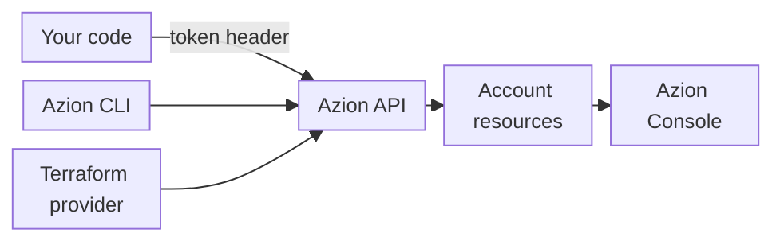

import DocButton from '~/components/webkit/DocButton.vue'
import DocCardGroup from '@aziontech/webkit/doc-card-group'
import DocCard from '@aziontech/webkit/doc-card'

An application programming interface (API) lets a program act on a service without its web interface. A REST API gives each object of the service its own URL: the client reads the object with `GET`, creates it with `POST`, changes it with `PUT` or `PATCH`, and removes it with `DELETE`. Because every action is an HTTP request, the same call runs from a terminal, a script, or a CI/CD pipeline.

**Azion API** exposes the resources of your Azion account as a REST API over HTTPS, at the base URL `https://api.azion.com/v4`. Each request carries a personal token, responses return JSON, and each change also appears in [Azion Console](https://console.azion.com/). Use the Azion API to create, read, update, and delete applications, firewalls, functions, network lists, workloads, and the other resources of your account from your own code.

You can also manage the same resources with the [Azion CLI](/en/documentation/devtools/cli/) or the [Azion Terraform Provider](/en/documentation/devtools/terraform/). To query metrics, events, billing, and consumption data, use the [GraphQL API](/en/documentation/devtools/graphql/).

<DocButton href="/en/documentation/devtools/api/quickstart/" label="Get started" size="medium" />
<DocButton href="https://api.azion.com/" label="Go to the API reference" kind="secondary" size="medium" />

---

## Request structure

A request names a resource path under the base URL and sends the personal token in a header. This request lists the IDs of the workloads in an account:

```bash
curl --request GET \
  --url 'https://api.azion.com/v4/workspace/workloads?page_size=100&fields=id' \
  --header 'Accept: application/json' \
  --header 'Authorization: Token [TOKEN VALUE]'
```

A `200` returns one page of results:

```json
{
  "count": 3,
  "total_pages": 1,
  "page": 1,
  "page_size": 100,
  "next": null,
  "previous": null,
  "results": [
    {"id": 1234567890},
    {"id": 1234567891},
    {"id": 1234567892}
  ]
}
```

- **Path**: resource endpoints sit under `/v4/workspace/`, such as `/v4/workspace/workloads` and `/v4/workspace/network_lists`.
- **Header**: `Authorization` carries the personal token with the `Token` scheme.
- **Query parameters**: `page_size=100` asks for up to 100 results on the page, and `fields=id` keeps only the `id` of each result.
- **List envelope**: `count` is the number of workloads in the account, `total_pages` and `page` place the page in the list, and `results` holds the workloads. `next` and `previous` are `null` because the list has one page.

If you have called a REST API that returns JSON, the model transfers unchanged: a method, a URL, a credential header, and a JSON body. The [Azion API reference](https://api.azion.com/) lists every path, method, parameter, and response. The API serves its OpenAPI specification at `https://api.azion.com/v4/openapi/openapi.yaml`.

---

## API clients

Your own code is one client of the Azion API among several. The Azion CLI and the Azion Terraform Provider reach the same endpoints.



1. Your code, or an HTTP client such as `curl`, sends a request to `https://api.azion.com/v4` with your personal token in the `Authorization` header.
2. The Azion CLI and the Azion Terraform Provider call the same API.
3. The API authenticates the token, then creates, reads, changes, or deletes the resources of your account.
4. Azion Console shows the same resources, so a change made through the API appears there too.

---

## Methods and errors

Most endpoints take the same methods, split between a collection path and an item path, and errors share one response shape:

- **Methods**: a collection path, such as `/v4/workspace/network_lists`, takes `GET` to list and `POST` to create. An item path, such as `/v4/workspace/network_lists/<network-list-id>`, takes `GET`, `PUT`, `PATCH`, and `DELETE`. Another method returns `405` with code `10007`, and the `Allow` header of the response lists the methods the path takes.
- **Success bodies**: a request for one resource returns it inside `data`. A `POST` or a `PATCH` returns `"state": "executed"` beside `data`, and a `DELETE` returns only `{"state": "executed"}`.
- **Error bodies**: an error returns an `errors` array. Each item carries a `code`, a `title`, a `detail`, a `status` written as a string, and usually a `source` that names the header or the body field at fault. A `POST` that omits two required fields returns two items, one per field.

For the errors a request can return and how to fix each one, refer to [Troubleshoot Azion API](/en/documentation/devtools/api/troubleshooting/).

---

## Authentication

Every request to the Azion API carries a [personal token](/en/documentation/fundamentals/personal-tokens/) in the `Authorization` header, with the `Token` scheme:

```text
Authorization: Token [TOKEN VALUE]
```

The API also accepts a personal token with the `Bearer` scheme, as `Authorization: Bearer [TOKEN VALUE]`, and accepts the `Token` scheme written in lowercase. You create a personal token in Azion Console or with the Azion CLI, and Azion shows its value only once, at creation. To create one, refer to [Manage personal tokens](/en/documentation/guides/platform/account-and-billing/personal-tokens/).

A request without the header returns `401` with code `10002`. A request whose token the API does not accept returns `401` with code `10001`. Both responses carry the header `WWW-Authenticate: Bearer realm="api"`.

---

## Pagination and query parameters

A list request returns one page of results, and five query parameters choose which page and what each result holds. The page count comes back in `total_pages`, and `next` and `previous` are `null` when no next or previous page exists. To read the following page, send the same request with `page` increased by one.

| Parameter | Effect |
| --- | --- |
| `page` | Selects one page of the list, counted from `1`. |
| `page_size` | Sets the number of results per page: 10 by default, 100 at most. |
| `fields` | Keeps only the fields in a comma-separated list, such as `fields=id,name`. |
| `ordering` | Sorts the list by one field, such as `ordering=name`. A `-` before the field sorts in descending order, as in `ordering=-id`. |
| `search` | Narrows the list to the results that match a search term, such as `search=astro`. |

An `ordering` value that names no field is ignored: the request returns `200` and the list keeps its default order by ID. On a single resource, `fields` can return more than the fields you named: on a network list, `fields=id,name` also returns `is_versioned` and `version`. For the terms the API uses, refer to [Glossary](/en/documentation/devtools/api/glossary/).

---

## API versions

Azion API v4 is the version that these pages document, served at `https://api.azion.com/v4`, and its OpenAPI specification declares version `4.0.0`. An account moves to it from API v3 through a migration. For the resources and endpoints that change, refer to [API v4 Migration](/en/documentation/fundamentals/api-v4-migration/). To check the version of your account, refer to [Verify your account's API version](/en/documentation/guides/application-security/access-and-compliance/verify-account-migration/).

---

## Limits

Two bounds apply to every list request, and each returns an error past its value:

| Limit | Value | Past the value |
| --- | --- | --- |
| Results per page, `page_size` | 10 by default, 100 at most | `400`, code `10097` |
| Page number, `page` | From `1` to the `total_pages` value of the list | `404`, code `10004` |

Every authenticated response also carries four rate limit headers. The headers look like this:

```text
X-RateLimit-Limit: 200
X-RateLimit-Remaining: 199
X-RateLimit-Reset: 2026-10-03T14:18:14.621625
X-RateLimit-Scope: global-default
```

`X-RateLimit-Limit` is `200` and `X-RateLimit-Scope` is `global-default` on every response. `X-RateLimit-Remaining` counts down from the limit as you send requests. `X-RateLimit-Reset` gives the time of the next reset as an ISO 8601 timestamp with no time zone, about one minute after the request.

---

## Next steps

<DocCardGroup cols={2}>
  <DocCard title="Azion API quickstart" href="/en/documentation/devtools/api/quickstart/" label="Send your first requests, then create, rename, and delete a network list." />
  <DocCard title="Manage personal tokens" href="/en/documentation/guides/platform/account-and-billing/personal-tokens/" label="Create the token that authenticates every request." />
  <DocCard title="Troubleshoot Azion API" href="/en/documentation/devtools/api/troubleshooting/" label="Fix a request that fails with 401, 400, 404, or 405." />
  <DocCard title="Azion API reference" href="https://api.azion.com/" label="Look up the path, method, and fields of any endpoint." />
</DocCardGroup>
