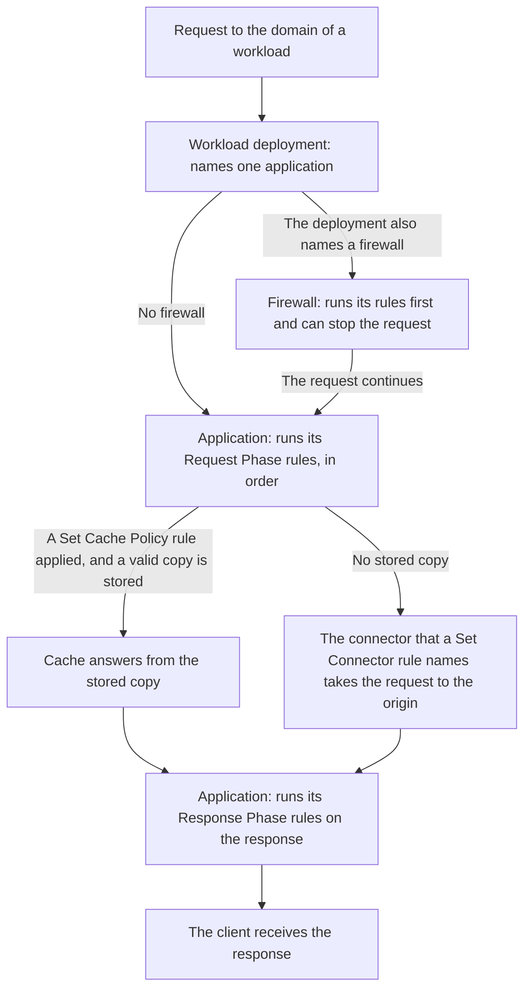

import DocButton from '~/components/webkit/DocButton.vue'
import DocCardGroup from '@aziontech/webkit/doc-card-group'
import DocCard from '@aziontech/webkit/doc-card'

A reverse proxy is a server that receives requests in place of the servers that hold your content, the origins. It reads each request before an origin does and decides what happens to it. It can answer from a copy it stored earlier, add or remove a header, run code, or pass the request to an origin and relay the answer. Clients reach one domain, and logic that each origin would otherwise carry runs in front of all of them.

**Applications** is the Platform Resource that runs that proxy on Azion's distributed infrastructure, close to your users, for each [workload](/en/documentation/platform/workloads/) whose deployment names it. An application acts through rules, which run in a request phase and a response phase. Its rules decide which [connector](/en/documentation/platform/connectors/) takes a request to your origin, what is answered from a stored copy, and which function runs. Use Applications to route each path to its origin, cache responses, add or filter headers, rewrite requests, run your own code, or resize and convert images on demand.

<DocButton href="/en/documentation/platform/applications/quickstart/" label="Quickstart" size="medium" />
<DocButton href="/en/documentation/platform/applications/rules-engine/" label="Applications reference" kind="secondary" size="medium" />

---

## Rule structure

Rules carry the logic of an application. A rule tests each request against its criteria and, when the request matches, runs its behaviors. Sent as the body of `POST /v4/workspace/applications/<application-id>/request_rules`, this rule hands every request to the connector that reaches your origin:

```json
{
  "name": "send-to-origin",
  "active": true,
  "criteria": [
    [
      {
        "variable": "${uri}",
        "conditional": "if",
        "operator": "starts_with",
        "argument": "/"
      }
    ]
  ],
  "behaviors": [
    {
      "type": "set_connector",
      "attributes": { "value": <connector-id> }
    }
  ]
}
```

- `criteria` holds groups of conditions, and the first condition of a group opens with `if`. Here, `${uri}`, the URI without its query string, matches every request with `starts_with` and `/`, because every path starts with `/`. The same rule on `${request_uri}`, which keeps the query string, is refused with `400` and error `25047` while Application Accelerator is off.
- `behaviors` lists what the rule does to each request it matches. `set_connector` hands the request to the connector whose ID is in `attributes.value`, and the connector holds the address of your origin.
- `name` and `active` are the rule's own fields. The API answers `202` and returns the rule with `order` set to `0`, its position among the Request Phase rules of the application.
- Azion Console builds the same rule in the application's **Rules Engine** tab, from **+ Rule**, _Request Phase_, a criterion on `${uri}`, and the _Set Connector_ behavior.

If you have routed traffic by path in a reverse proxy, the model transfers: criteria are the match condition, behaviors the action, and a connector the backend server.

---

## Request path

Creating an application serves nothing. An application handles only the requests of a workload whose deployment names it, and it reaches an origin only through a rule that names a connector.



1. A workload receives the request, and its deployment names the application. In Azion Console, the binding is the **Application** field of **Deployment Settings**, and `azion create workload-deployment` takes it as `--application-id`. When the deployment also names a [firewall](/en/documentation/platform/firewall/), the firewall runs its rules first and can stop the request.
2. The application runs its Request Phase rules, in order. A behavior that ends the processing, such as _Deny (403 Forbidden)_, answers the client, and no later rule runs.
3. When a _Set Cache Policy_ rule applied a cache setting and a valid copy is stored, Cache answers from the copy, and the origin is not asked.
4. Otherwise, the connector that a _Set Connector_ rule names takes the request to the origin. When several matching rules carry _Set Connector_, only the last one runs.
5. The application runs its Response Phase rules on the response, and the client receives it.

A new application has Cache and Functions on, Application Accelerator and Image Processor off, and no rules. Until a rule names a connector, it has no origin to send a request to. No propagation time is guaranteed for a change. A new workload answers with Azion's placeholder `404` until its binding to the application propagates, which took 5 minutes 51 seconds in one case and about 11 minutes in another. Until then, answers alternate between the placeholder and the application, so send the request again until they agree. For the two phases, the order in which rules and behaviors run, and propagation, refer to [How Applications works](/en/documentation/platform/applications/how-it-works/).

---

## Resources

Cache, Application Accelerator, and Image Processor are Products enabled on an application, each with its own switch in [Main Settings](/en/documentation/platform/applications/main-settings/#products) › **Modules**.

### Cache

Cache answers later requests for an object from a copy of the origin response, kept in the data center that fetched it until its time to live (TTL) ends. Use it to keep static files close to your users, serve large video files in fragments, keep answering while the origin is down, or remove a copy the moment the origin changes. Cache is on in every new application, but it stores nothing until a _Set Cache Policy_ rule applies a cache setting, the object that holds the TTLs.

For how long a copy lives and what ends it early, and for the fields, keys, purges, and second cache layer behind it, refer to [Expiration and freshness](/en/documentation/platform/applications/cache/expiration-and-freshness/), [Cache settings](/en/documentation/platform/applications/cache/cache-settings/), [Cache keys](/en/documentation/platform/applications/cache/cache-keys/), [Real-Time Purge](/en/documentation/platform/applications/cache/real-time-purge/), and [Tiered Cache](/en/documentation/platform/applications/cache/tiered-cache/), and to cache your first response, refer to the [Cache quickstart](/en/documentation/platform/applications/cache/quickstart/).

### Application Accelerator

Application Accelerator decides what besides the URL makes two requests different, such as a query-string argument, a cookie, the device group, or the request method, and Cache then keeps a separate copy for each. Turn it on when one URL has more than one correct response, such as a personalized page, an API response that changes with a query string, a catalog that differs by device, or a response to a `POST`. Its switch is off on a new application, and turning it on also unlocks `POST` and `OPTIONS` caching, a **Max Age** below 60 seconds, seven more Rules Engine behaviors, and the `${request_uri}` and `${device_group}` variables.

For what each variation costs and how a purge reaches it, and for the fields that set it, refer to [Cache variation](/en/documentation/platform/applications/application-accelerator/cache-variation/) and [Application Accelerator settings](/en/documentation/platform/applications/application-accelerator/settings/), and to vary a first cache setting, refer to the [Application Accelerator quickstart](/en/documentation/platform/applications/application-accelerator/quickstart/).

### Image Processor

Image Processor builds a derived image from the source image on the origin, following the `ims` query string of the request, such as `?ims=fit-in/400x400`, and never saves the result as an asset of the account. Turn it on when pages need one image in several sizes, crops, qualities, or formats, such as WEBP for the browsers that accept it, without storing or uploading a file for each variant. Its switch is off on a new application, and turning it on processes nothing by itself: a Request Phase rule with _Optimize Images_ decides which requests reach it.

For how the delivered format is chosen and how the cache keeps derived images apart, the operations `ims` accepts, and the headers and behaviors involved, refer to [Image delivery](/en/documentation/platform/applications/image-processor/image-delivery/), [URL parameters](/en/documentation/platform/applications/image-processor/url-parameters/), and [Image Processor settings](/en/documentation/platform/applications/image-processor/settings/), and to request your first derived image, refer to the [Image Processor quickstart](/en/documentation/platform/applications/image-processor/quickstart/).

---

## Scope and limits

- **Phases**: a rule runs in the Request Phase, on the request before a response exists, or in the Response Phase, on the response delivered to the user. The phase is set when the rule is created and cannot change, and the choice of origin and of cache setting happens only in the Request Phase. For the variables and behaviors of each phase, and the Product each one needs, refer to [Rules Engine for Applications](/en/documentation/platform/applications/rules-engine/#phases).
- **Origins**: the application record names no origin, so two rules with two connectors can send `/api/` to one server and every other path to another. Behind a connector, the origin can be web servers in your infrastructure, a cloud service, or an [Object Storage](/en/documentation/platform/object-storage/) bucket, as [Use a bucket as an application origin](/en/documentation/guides/application-development/data/use-bucket-as-origin/) shows. One connector can spread traffic across several origins through [Load Balancer](/en/documentation/platform/connectors/#load-balancer). Azion Console states that origins have been redesigned as connectors.
- **Functions**: an application runs your code through a [function instance](/en/documentation/platform/applications/functions-instances/), which binds one function from [Functions](/en/documentation/platform/functions/) to the application with its own arguments. A rule with _Run Function_ invokes the instance, and an instance that no rule names never runs. **Functions** is on in a new application. For the Response Phase, the instance form in Azion Console states `Only Lua functions can be used in the Response phase.` To attach your first function, refer to [Instantiate a function on an application](/en/documentation/guides/application-development/getting-started/instantiate-functions/).
- **Cache and images in code**: Cache runs no code, so a function that reads and writes cached entries uses the [Cache API](/en/documentation/devtools/runtime/api-reference/cache/). A function that processes images itself uses the WASM Image Processor library, a surface other than Image Processor, as [Where Image Processor stops](/en/documentation/platform/applications/image-processor/image-delivery/#where-image-processor-stops) explains.
- **Devices**: a [device group](/en/documentation/platform/applications/device-groups/) names the devices whose `User-Agent` header matches a regular expression. A rule tests it through `${device_group}`, and a cache setting can keep one copy per group, both with Application Accelerator on. For an expression that matches only the devices you mean, refer to [Applications best practices](/en/documentation/platform/applications/best-practices/#match-a-device-group-on-the-words-that-only-that-device-sends).
- **WebSocket**: [WebSocket Proxy](/en/documentation/platform/applications/websocket/) carries a WebSocket connection, opened with the `Upgrade: websocket` and `Connection: upgrade` headers, between your users and the origin through an application. It is available with Business, Enterprise, or Mission-Critical Support, or with a Reserved Capacity or Saving Plan contract, on request to [technical support](/en/documentation/support/). Azion recycles keepalive connections approximately every 15 minutes, so the client reopens a WebSocket connection that closes.
- **Workloads**: domains, protocols, and certificates belong to the workload that serves the application, so an application carries no delivery settings of its own. _Redirect HTTP to HTTPS_ needs HTTPS on the workload. The error page a client sees when the connector receives a 4xx or 5xx response from your origin is set by [Custom Pages](/en/documentation/platform/workloads/#custom-pages) on the workload. To request an application on your own domain from one device before you change its DNS records, refer to [Test an application through the hosts file](/en/documentation/guides/application-development/getting-started/stage-applications-through-hosts-file/).
- **Interfaces**: you create and manage applications on the **Applications** page of [Azion Console](https://console.azion.com). Each application has the **Main Settings**, **Device Groups**, **Cache Settings**, **Functions Instances**, and **Rules Engine** tabs. **Clone**, a row action of the **Applications** list, creates a separate application that starts with the settings of the original, as [Clone an application](/en/documentation/guides/application-development/getting-started/clone-applications/) shows. The [Azion API](https://api.azion.com/) serves applications at `/v4/workspace/applications`, and [Azion CLI](/en/documentation/devtools/cli/) manages them with commands such as `azion create application`, `azion update application`, and `azion create rules-engine`. [`azion.config.js`](/en/documentation/devtools/cli/azion-config-js/), [Azion Lib](/en/documentation/devtools/azion-lib/application/), and the [Azion Terraform provider](/en/documentation/devtools/terraform/) also create and configure applications. An account that has not migrated to API v4 follows [Applications | v3](/en/documentation/platform/applications/v3/).
- **Observability**: with **Debug Rules** on in [Main Settings](/en/documentation/platform/applications/main-settings/#debug-rules), [Real-Time Events](/en/documentation/platform/real-time-events/) and [Data Stream](/en/documentation/platform/data-stream/) show the rules each request ran, in the `$traceback` field. The setting is off on a new application. A response to a request sent with `Pragma: azion-debug-cache` reports its cache status, such as `HIT` or `MISS`, in the `x-cache` header. [Real-Time Metrics](/en/documentation/platform/real-time-metrics/) shows Cache and Tiered Cache traffic. For the tools and queries, refer to [Troubleshoot Applications](/en/documentation/platform/applications/troubleshooting/) and [Troubleshoot Applications](/en/documentation/platform/applications/troubleshooting/#a-problem-shows-in-traffic-but-not-in-the-responses-you-request).
- **Limits**: an application holds up to 200 rules across both phases. A rule carries 1 to 5 groups of 1 to 10 criteria, and 1 to 10 behaviors. An account holds 10 applications on Developer Support, 50 on Business, 200 on Enterprise, and a customizable number on Mission-Critical. A cache setting takes a **Max Age** of at least 60 seconds without Application Accelerator, and a single cached object can reach 10 GB. For every bound, the answer past it, and the bounds of each Product, refer to [Applications limits](/en/documentation/platform/applications/limits/).
- **Billing**: Cache is billed on purges, Application Accelerator on data transfer, and Image Processor on processed images, and turning on a Product can generate usage-related costs. Each plan includes an amount of each, such as 1,000 purges a month on Hobby and 2,000 on Pro. For the amounts, refer to [Applications limits](/en/documentation/platform/applications/limits/#included-usage-per-plan), and for the rates, refer to [Pricing](/en/documentation/fundamentals/pricing/).
- **Terms**: the [Applications glossary](/en/documentation/platform/applications/glossary/) defines the words the Applications pages give a specific meaning, such as rule, phase, behavior, cache setting, cache key, and derived image.

---

## Next steps

<DocCardGroup cols={2}>
  <DocCard title="Quickstart" href="/en/documentation/platform/applications/quickstart/" label="Send every request of a new application to your origin." />
  <DocCard title="How it works" href="/en/documentation/platform/applications/how-it-works/" label="Follow a request through an application, and see where each Product acts on it." />
  <DocCard title="Rules Engine for Applications" href="/en/documentation/platform/applications/rules-engine/" label="Look up a variable, an operator, or a behavior, and the Product it needs." />
  <DocCard title="Guides and tutorials" href="/en/documentation/platform/applications/guides/" label="Complete a specific task, from a device group to a framework template." />
  <DocCard title="Limits" href="/en/documentation/platform/applications/limits/" label="Look up a bound, the answer past it, or what a plan includes." />
  <DocCard title="Troubleshooting" href="/en/documentation/platform/applications/troubleshooting/" label="Find the cause when requests never reach the origin, or a rule does not act." />
</DocCardGroup>
