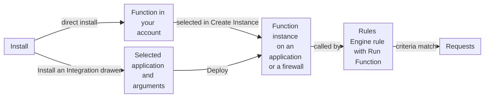

import FrameBox from '@aziontech/webkit/frame-box'
import ItemList from '@aziontech/webkit/item-list'
import DocItem from '@aziontech/webkit/doc-item'

A software catalog lets you add code that someone else builds and maintains to your own setup, instead of writing it yourself. You take a listing into your account, and you decide where it runs, with which settings, and when to move to a later version.

[Azion Marketplace](/en/documentation/platform/marketplace/) is that catalog in [Azion Console](https://console.azion.com/). Azion and third-party sellers, the independent software vendors (ISVs), publish two kinds of listings in it. An integration is a function that you install in your account and then run on an application or a firewall. A template is a preconfigured project that you deploy to create an application and the resources around it. Publishing a listing is a separate process; for it, refer to [Seller requirements and fees](/en/documentation/platform/marketplace/marketplace-seller-guide/).

The sections follow an integration from the install to the request it runs on, then cover versions, licenses, what a template deploys, and the permissions an install requests.

---

## Integrations

A Marketplace integration is a function with two parts. Its code defines what the integration does, and you cannot modify it. Its arguments, the **Args**, set the values the code reads, and you customize them for your use.

Selecting **Install** on an integration's page in Azion Console follows one of two flows, depending on the integration:

- **Direct install.** The install adds the integration's function to your account, and nothing more. The integration's page then shows "Successfully installed!" and "Latest version installed!". No request reaches the function until you create a function instance and a rule yourself, as described below. A/B Testing installs this way.
- **The Install an Integration drawer.** An integration that ships an install template opens this drawer instead. Under **Select an Application**, you choose the application in the **Application** list, or create one with **Create New**. The drawer then shows a form with the integration's arguments, which differ per integration, and the privileges the install requests. Deploying from the drawer instantiates the integration on the selected application.

After a direct install, running the integration on traffic takes three objects on the application or the firewall:

- **The Functions module.** You turn it on in the **Modules** section of the resource's **Main Settings** tab.
- **A function instance.** You create it in the resource's **Functions Instances** tab. The **Create Instance** drawer asks for a **Name** and a **Function**, where the installed integration is listed, and fills **Arguments** with the integration's default arguments in JSON. The drawer's help text reads "Customize the arguments in JSON format. Once set, they can be called in code using EVENT.ARGS('ARG_NAME')."
- **A Rules Engine rule with the Run Function behavior.** The rule's criteria decide which requests run the instance.

For example, after you install A/B Testing, its function appears as _A/B Testing [Global]_ in the **Function** list of the **Create Instance** drawer on an application. Selecting it fills **Arguments** with its defaults, which you then adjust for that application.

This diagram follows an integration from the install to the requests it runs on, through either flow:

1. In a direct install, the integration's function becomes available in your account. On an application or a firewall with the **Functions** module on, you create a function instance that selects the integration and sets its arguments.
2. In the drawer flow, you select an application and fill the integration's arguments. Deploying creates the function instance on that application.
3. A Rules Engine rule whose behavior is **Run Function** calls the instance.
4. Each request that matches the rule's criteria runs the integration's code with the instance's arguments.

A firewall adds one condition: it inspects requests only when a workload's deployment names it. An integration on a firewall that no deployment names runs on no request. For more information, refer to [How Firewall works](/en/documentation/platform/firewall/how-it-works/).

The direct flow keeps the install apart from the instance and the rule, so the install never changes your traffic, and you choose where the integration runs afterward. The arguments live on the instance, so two resources can run the same integration with different arguments. The cost is that a direct install alone does nothing: an integration with no instance, or with no rule that runs it, never runs. The drawer flow ties the install to one application from the start. For the steps of both flows, refer to [Install an integration](/en/documentation/guides/application-development/integrations/install-an-integration/).

### Application and firewall integrations

Each integration runs on one of two Platform Resources. An application integration processes data and runs services close to your users, inside the request path of an [application](/en/documentation/platform/applications/). A firewall integration handles network security, authentication, and traffic control on a [firewall](/en/documentation/platform/firewall/).

The two kinds do not mix. On a firewall, the **Function** list of the **Create Instance** drawer shows only firewall functions, such as _Bot Manager Lite v0.2.0_. The firewall's **Functions Instances** tab also appears only when its **Functions** module is on. To see where each integration runs, refer to [Marketplace integrations](/en/documentation/platform/marketplace/integrations/#where-an-integration-runs).

---

## Versions

Azion and its partners update Marketplace integrations when they add features. When a later version of an installed integration exists, the integration's page in Azion Console enables the **Get New Version** button. In the application list of the install drawer, the _Update Available_ tag marks an application that can take the later version. When the installed version is the latest, the page reads "Latest version installed!" instead.

Getting a version does not overwrite the version an application runs. Azion Console warns that "Updating will create a new instance of the integration's function." Your existing function instance keeps its version until you select the later one in the instance's **Function** list. That control has a cost: an update reaches your traffic only when you change each instance yourself.

For example, you can select the later version on a test application first. Once it passes your validation, you select it on the application that serves production. For the steps, refer to [Update an integration](/en/documentation/guides/application-development/integrations/update-an-integration/).

---

## Licenses

The license of a Marketplace integration decides how you obtain it. The integration's page shows its license on a card beside the action that installs it:

| License | What the card offers | What you provide |
| --- | --- | --- |
| **Free License** | "Install this integration using the available free model." and the **Install** button | Nothing beyond the install. You pay only when you use the integration, subject to its terms of use |
| **Bring Your Own License** | Use of a license you purchased before | Valid credentials from the integration's provider, which authenticate your account and connect Azion with the provider |
| **Buy to Subscribe** | A contact with the Azion Sales Team | The subscription you agree with Azion Sales |

Under Free License and Bring Your Own License, Azion charges for the Azion services that your use of the integration generates. A third-party integration needs valid credentials from its provider, so have them before you install. For how sellers set these models and their charges, refer to [Seller requirements and fees](/en/documentation/platform/marketplace/marketplace-seller-guide/#business-models).

---

## Templates

A Marketplace template works differently from an integration. Instead of adding a function to resources you already have, deploying a template creates the resources a project runs on:

- **An application** that holds every setting of the template.
- **An Azion domain** that gives access to the application. You can also [add a custom domain](/en/documentation/guides/platform/migration/configure-a-domain/).
- **The configuration the use case needs**, set by the template.
- **A function**, in some templates, with its arguments and the dependencies it requires.
- **A GitHub repository** with the template's files, including the function and a GitHub Action. Once you activate the action, each change deploys continuously, and the repository keeps a trackable deployment history.

After the deployment, every one of these resources is yours, and you can change any setting in Azion Console. Some templates based on frameworks can also start from the Azion CLI. For more information, refer to [CLI quickstart](/en/documentation/devtools/cli/quickstart/).

A template can also bring costs and accounts with it. Some templates need Azion products that you activate separately in Azion Console, and those products can generate usage costs; for rates, refer to [Pricing](/en/documentation/fundamentals/pricing/). Some templates integrate with a third-party service, which requires an account with that service and its initial setup, and the service can charge for usage. Every template and its guide is listed on [Marketplace templates](/en/documentation/platform/marketplace/templates/).

---

## Permissions

An integration that changes an application needs privileges on it. When an install opens the **Install an Integration** drawer and you select an application, Azion Console lists those privileges with the message "Azion Marketplace requires the following privileges on the selected Application." and a link to **Marketplace's Permissions**.

The privileges cover the modules of the application's **Main Settings** that the integration uses, such as **Functions**, and the rules of its Rules Engine, where the **Run Function** behavior calls the integration. An integration that runs on a firewall needs more privileges than an application grants. For each privilege and why an integration asks for it, refer to [Marketplace permissions](/en/documentation/platform/marketplace/permissions-marketplace/).

---

## Related resources

<FrameBox>
<ItemList>
  <DocItem title="Marketplace integrations" href="/en/documentation/platform/marketplace/integrations/">Every integration, what it does, whether it runs on an application or a firewall, and its guide.</DocItem>
  <DocItem title="Install an integration" href="/en/documentation/guides/application-development/integrations/install-an-integration/">The steps that install an integration and run it with a function instance and a rule.</DocItem>
  <DocItem title="Marketplace quickstart" href="/en/documentation/platform/marketplace/first-steps/">A first walk through the catalog, from finding a listing to installing it.</DocItem>
  <DocItem title="Marketplace templates" href="/en/documentation/platform/marketplace/templates/">Every template, what it deploys, and the Console link that starts the deployment.</DocItem>
</ItemList>
</FrameBox>
