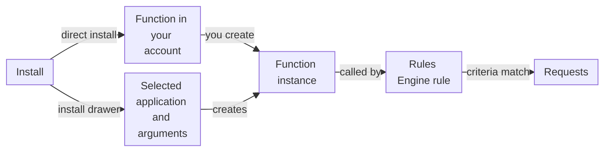

import DocButton from '~/components/webkit/DocButton.vue';
import DocCardGroup from '@aziontech/webkit/doc-card-group'
import DocCard from '@aziontech/webkit/doc-card'

A software catalog lists code that other teams build and maintain, so you add it to your own setup instead of writing it. You pick a listing, take it into your account, and decide where it runs and with which settings. The publisher keeps the code, and you keep the configuration.

**Azion Marketplace** is that catalog in [Azion Console](https://console.azion.com/). Azion and third-party sellers, which are independent software vendors (ISVs), software developers, and open-source communities, publish two kinds of listings in it. An integration is a function that runs on one of your applications or firewalls. A template is a preconfigured project that you deploy to create an application. Use Marketplace to block bots, validate tokens, emails, and phone numbers, run A/B tests, centralize redirects, or start a project from a framework.

<DocButton href="/en/documentation/platform/marketplace/first-steps/" label="Quickstart" size="medium" />
<DocButton href="/en/documentation/platform/marketplace/guides/" label="Marketplace guides" kind="secondary" size="medium" />

---

## Integrations and templates

The catalog in Azion Console opens on a **Search on Marketplace** field, the **Featured** and **New releases** sections, and **Categories** such as _Security_ and _Performance_. Each listing has its own page, with an **Overview**, its **Usage**, a **Changelog**, **Support** details, and a license card beside the action that installs it.

- **An integration** carries code that you cannot modify and arguments, the **Args**, that you customize. Each integration runs on an application or on a firewall, never on both. Every integration, what it does, and where it runs is on [Marketplace integrations](/en/documentation/platform/marketplace/integrations/).
- **A template** creates resources instead of adding to existing ones: an application, an Azion domain, the configuration of the use case, a function in some templates, and a GitHub repository with the template's files. Every template and its guide is on [Marketplace templates](/en/documentation/platform/marketplace/templates/).

Each listing has a guide with its settings and dependencies. The guides are on [Marketplace guides and tutorials](/en/documentation/platform/marketplace/guides/). The section's vocabulary is on the [Glossary](/en/documentation/platform/marketplace/glossary/).

---

## Integration path

Installing an integration does not always change your traffic. Depending on the integration, **Install** follows one of two flows, and an integration runs on a request only when a Rules Engine rule calls its function instance.

1. In a direct install, **Install** adds the integration's function to your account and nothing more. A/B Testing installs this way.
2. On an application or a firewall with the **Functions** module on, you create a function instance that selects the integration. The instance holds the arguments, prefilled with the integration's defaults.
3. An integration that ships an install template opens the **Install an Integration** drawer instead. You select an application, fill the integration's arguments, and the drawer instantiates the integration on that application.
4. A Rules Engine rule with the **Run Function** behavior calls the instance. Each request that matches the rule's criteria runs the integration's code with the instance's arguments.

Because the arguments live on the instance, two resources can run one integration with different values. For the full model, including versions and what a template deploys, refer to [How Marketplace works](/en/documentation/platform/marketplace/how-it-works/). For the steps of both flows, refer to [Install an integration](/en/documentation/guides/application-development/integrations/install-an-integration/).

---

## Scope and limits

- **Platform resources**: an application integration processes data and runs services inside the request path of an [application](/en/documentation/platform/applications/). A firewall integration handles network security, authentication, and traffic control on a [firewall](/en/documentation/platform/firewall/), which runs only when a workload's deployment names it.
- **Licenses**: an integration's page offers one of three licenses. **Free License** installs with **Install**, and you pay only when you use the integration, subject to its terms of use. **Bring Your Own License** runs the integration with a license or credentials you already hold, and **Buy to Subscribe** leads to the Azion Sales Team. Refer to [Licenses](/en/documentation/platform/marketplace/how-it-works/#licenses).
- **Third-party credentials**: an integration from a third-party provider needs valid credentials from that provider, which authenticate your account and connect Azion with the provider. Some need an account or an initial setup on the provider's side.
- **Permissions**: an integration that changes an application requests privileges on its **Main Settings** modules and its Rules Engine rules, and Azion Console lists them before the install. A firewall integration needs more privileges than an application grants. Refer to [Marketplace permissions](/en/documentation/platform/marketplace/permissions-marketplace/).
- **Costs**: Azion charges for the Azion services that your use of an integration generates. A template can need Azion products that you activate separately, and a third-party service it uses can charge for usage. For rates, refer to [Pricing](/en/documentation/fundamentals/pricing/).
- **Versions**: a later version of an installed integration does not replace the version your instances run. Updating creates a new instance of the integration's function, and you move each instance yourself. Refer to [Update an integration](/en/documentation/guides/application-development/integrations/update-an-integration/).
- **Interfaces**: you browse, install, and update listings in [Azion Console](https://console.azion.com/). Some framework-based templates can also start from the [Azion CLI](/en/documentation/devtools/cli/).
- **Selling**: Azion reviews each seller and each product before it publishes them, and charges sellers a tiered listing fee on each transaction. Refer to [Seller requirements and fees](/en/documentation/platform/marketplace/marketplace-seller-guide/) and the [Marketplace Agreement](/en/documentation/agreements/marketplace-agreement/).

When you have a problem installing or using a Marketplace listing, refer to the [Support guidelines](/en/documentation/support/).

---

## Next steps

<DocCardGroup cols={2}>
  <DocCard title="Quickstart" href="/en/documentation/platform/marketplace/first-steps/" label="Install the Hello World integration on an application and see its response." />
  <DocCard title="How Marketplace works" href="/en/documentation/platform/marketplace/how-it-works/" label="Follow an integration from the install to the requests it runs on." />
  <DocCard title="Marketplace integrations" href="/en/documentation/platform/marketplace/integrations/" label="Find an integration for a use case, and see where it runs." />
  <DocCard title="Marketplace templates" href="/en/documentation/platform/marketplace/templates/" label="Start a project from a template, and see what it deploys." />
  <DocCard title="Marketplace guides and tutorials" href="/en/documentation/platform/marketplace/guides/" label="Set up a specific integration or template, step by step." />
  <DocCard title="Become a Marketplace seller" href="/en/documentation/platform/marketplace/isv-signup/" label="Publish your own product in the catalog." />
</DocCardGroup>
