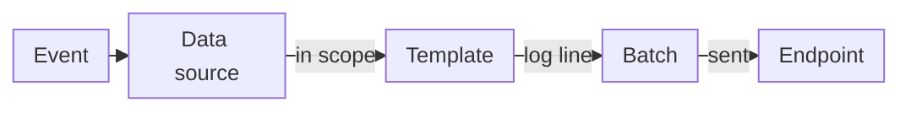

import DocButton from '~/components/webkit/DocButton.vue';
import DocCardGroup from '@aziontech/webkit/doc-card-group'
import DocCard from '@aziontech/webkit/doc-card'

Log streaming is a way to collect the records a platform writes about its traffic and its account. The platform pushes each record to a destination you run as it happens, such as a SIEM (a security information and event management system), a data warehouse, or a stream processor. You analyze the records in your own tools, and you do not poll an API to collect them.

**Data Stream** sends the event logs of [Activity History](/en/documentation/fundamentals/activity-history/), [applications](/en/documentation/platform/applications/), [functions](/en/documentation/platform/functions/), and WAF to one endpoint per stream. Each stream shapes the events with a template and sends them in batches. Use Data Stream to [feed a SIEM with WAF events](/en/documentation/guides/application-security/firewall-and-waf/integrate-siems/), [keep request logs in a data warehouse](/en/documentation/guides/platform/observability/endpoint-google-bigquery/), audit the changes made to your account, or [debug functions](/en/documentation/guides/platform/observability/debugging-functions-data-stream/).

<DocButton href="/en/documentation/platform/data-stream/quickstart/" label="Quickstart" size="medium" />
<DocButton href="/en/documentation/platform/data-stream/stream-settings/" label="Stream settings" kind="secondary" size="medium" />

---

## Stream object

A stream is one JSON object. This one sends every Activity History event to a bucket over the S3 protocol:

```json
{
  "name": "activity-to-bucket",
  "active": true,
  "inputs": [{ "type": "raw_logs", "attributes": { "data_source": "activity_history" } }],
  "transform": [
    { "type": "sampling", "attributes": { "rate": 100 } },
    { "type": "render_template", "attributes": { "template": 251 } }
  ],
  "outputs": [
    {
      "type": "s3",
      "attributes": {
        "host_url": "https://s3.us-east-005.azionstorage.net", "region": "us-east-005",
        "bucket_name": "<your-bucket>", "object_key_prefix": "activity",
        "access_key": "[ACCESS KEY]", "secret_key": "[SECRET KEY]",
        "content_type": "plain/text"
      }
    }
  ]
}
```

- `inputs` holds the data source, by its API slug. `activity_history` is *Activity History* in Azion Console.
- `transform` holds the scope of the stream, which is exactly one of a `sampling` item and a `filter_workloads` item. A `rate` of `100` sends every event.
- `transform` also holds the template that renders each event as a log line. Template `251` is the *Activity History Collector* preset.
- `outputs` holds the one endpoint the stream sends to. The Console labels this field **Connector**.

The Console form writes the same object, and its sections **General**, **Input**, **Transform**, **Render Template**, **Output**, and **Status** map to these keys. For every field, refer to [Stream settings](/en/documentation/platform/data-stream/stream-settings/#stream-object).

---

## Delivery path

A stream does not send each log line when its event happens. It renders events into log lines, groups the lines in a batch, and sends the batch.



1. An event happens: a request reaches an application, a function writes a log message, WAF analyzes a request, or someone changes the account.
2. The data source records the event. The stream keeps the event only when it falls inside the scope that sampling or the workload filter sets.
3. The template renders the event as one log line. Its data set maps each key of the line to a variable, such as `"status": "$status"`.
4. The log line joins a batch, which closes at 2,000 log lines or after 60 seconds, whichever comes first. A log line can wait up to a minute before it leaves.
5. The stream sends the closed batch to the endpoint. Data Stream checks each endpoint once a minute, and discards the log lines of an interval when the endpoint is unavailable.
6. [Real-Time Events](/en/documentation/platform/real-time-events/data-sources/#data-stream) records every send, with the HTTP status the endpoint returned.

Saving a stream checks the format of its fields, not the endpoint, so the first delivery records in Real-Time Events are the test of a stream. For each stage, refer to [How Data Stream works](/en/documentation/platform/data-stream/how-it-works/).

---

## Scope and limits

- **Data sources**: a stream collects from one of four data sources: *Activity History*, *Applications*, *Functions*, or *WAF Events*. *WAF Events* needs [Firewall](/en/documentation/platform/firewall/) with WAF. For the variables of each one, refer to [Data sources and variables](/en/documentation/platform/data-stream/data-sources-and-variables/).
- **Endpoints**: a stream sends to one of 11 endpoint types: *Standard HTTP/HTTPS POST*, *Apache Kafka*, *Simple Storage Service (S3)*, *Google BigQuery*, *Elasticsearch*, *Splunk*, *AWS Kinesis Data Firehose*, *Datadog*, *IBM QRadar*, *Azure Monitor*, and *Azure Blob Storage*. Sending the same events to two endpoints takes two streams. For the fields of each type, refer to [Endpoints](/en/documentation/platform/data-stream/endpoints/).
- **Templates**: Azion provides five [preset templates](/en/documentation/platform/data-stream/templates-and-payload/#preset-templates), and you write a [custom template](/en/documentation/platform/data-stream/templates-and-payload/#custom-templates) to choose the variables of each log line.
- **Batching**: a batch holds 2,000 log lines or 60 seconds of events. An *AWS Kinesis Data Firehose* endpoint receives batches of 500 log lines or 60 seconds, and a *Standard HTTP/HTTPS POST* batch also closes at its **Payload Max Size**. Logs reach your infrastructure in up to 3 minutes.
- **Scope**: a stream carries a sampling rate or a filter of chosen [workloads](/en/documentation/platform/workloads/), never both. Saving an active stream with sampling deactivates every other stream on the account, while streams with a workload filter run side by side. For both options, refer to [Stream settings](/en/documentation/platform/data-stream/stream-settings/#transform).
- **Interfaces**: you create, view, edit, and delete streams in [Azion Console](https://console.azion.com/) and through the [Azion API](https://api.azion.com/v4), at `/v4/workspace/stream/streams`. Azion CLI has no stream command. To change or remove a stream, refer to [Edit, stop, or delete a stream](/en/documentation/guides/platform/observability/delete-data-stream/).
- **Permissions**: **View Data Stream** shows the streams of the account, and **Edit Data Stream** is needed to create, edit, or delete one. For how they are granted, refer to [Teams and permissions](/en/documentation/fundamentals/teams-permissions/).
- **Delivery records**: Real-Time Events records each send with its status, log lines, and bytes. The **Data Stream** tab of the [Real-Time Metrics Observe dashboards](/en/documentation/platform/real-time-metrics/observe-dashboards/#data-stream) adds up the sends over time.
- **Usage per plan**: Data Stream needs no activation step: a stream runs once you save it. It is billed on Requests and Data Transfer, and each plan includes a monthly amount of both, listed in [Data Stream limits](/en/documentation/platform/data-stream/limits/#included-usage-per-plan). For the rates, refer to [Pricing](/en/documentation/fundamentals/pricing/#data-stream).
- **Failures**: when an endpoint is unavailable or answers with an error, the log lines of that send do not reach it. For the causes and fixes, refer to [Troubleshoot Data Stream](/en/documentation/platform/data-stream/troubleshooting/).

Data Stream does not store or query logs. Real-Time Events keeps the raw events of your products for 7 days, and Activity History events for 2 years, while your endpoint keeps what the stream sends for as long as you decide.

---

## Next steps

<DocCardGroup cols={2}>
  <DocCard title="Quickstart" href="/en/documentation/platform/data-stream/quickstart/" label="Send your first logs to a bucket now." />
  <DocCard title="How it works" href="/en/documentation/platform/data-stream/how-it-works/" label="Follow an event from its data source to your endpoint." />
  <DocCard title="Endpoints" href="/en/documentation/platform/data-stream/endpoints/" label="Find the fields for your SIEM or data platform." />
  <DocCard title="Data Stream guides and tutorials" href="/en/documentation/platform/data-stream/guides/" label="Complete a specific task with a stream." />
</DocCardGroup>
