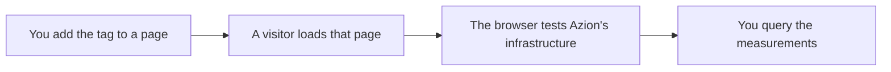

import DocButton from '~/components/webkit/DocButton.vue'
import DocCardGroup from '@aziontech/webkit/doc-card-group'
import DocCard from '@aziontech/webkit/doc-card'

Real User Monitoring (RUM) is a passive monitoring model that captures data from the device of a person actually using a site. A script the page carries runs inside that browser, measures what the visit was like, and sends the result back. The model answers how your content reached real people, in the conditions those people were in, rather than what a test scheduled from elsewhere would find. For how the industry uses the term, and how it compares with synthetic monitoring, refer to [Real-time monitoring](https://www.azion.com/en/learning/observability/what-is-real-time-monitoring/).

**Edge Pulse** runs that model on the pages you publish, and monitors in real time the performance and quality of your visitors' access to your web applications. You put the [Edge Pulse JavaScript tag](/en/documentation/platform/edge-pulse/javascript-tag/) on each page you want measured. The browser of every visitor who loads one measures navigation, availability, latency, and bandwidth against Azion's distributed infrastructure. Use Edge Pulse to see what your visitors experienced, find where content delivery is inefficient, and improve the experience the next visitor gets.

<DocButton href="/en/documentation/platform/edge-pulse/quickstart/" label="Quickstart" size="medium" />
<DocButton href="/en/documentation/platform/edge-pulse/javascript-tag/" label="Edge Pulse JavaScript tag" kind="secondary" size="medium" />

---

## Measurement path

Both ends of the chain are yours. You decide which pages carry the tag, and you decide when to ask for the result. Edge Pulse hands the measurements back as a query rather than as a view.

1. You copy the Edge Pulse JavaScript tag from Azion Console and paste it into the page, before the closing `body` tag. One tag covers one page, and no object on the platform changes.
2. A visitor opens the page, and their browser executes the tag. The moment it executes follows from which of the two tags you pasted.
3. The tag runs one test against three addresses of Azion's distributed infrastructure, then stays quiet on that browser for 30 minutes.
4. The results travel from the browser to Azion's processing servers.
5. You read them back with the GraphQL API that [Real-Time Events](/en/documentation/platform/real-time-events/) serves.

For what a single test measures, how one visitor is told from another, and where a result goes afterward, refer to [How Edge Pulse works](/en/documentation/platform/edge-pulse/how-it-works/).

---

## Scope and limits

- **Collection**: the Edge Pulse JavaScript tag is the only way to collect a measurement, and it goes on each page you want to monitor. Tagging one page of a site measures that page alone, and an untagged page produces no measurement at all.
- **Tags**: Azion Console serves two forms of the tag, the **Default Tag** and the **Pre-loading Tag**. The second form exists for pages whose Content Security Policy settings rule out inline JavaScript. For where each form goes and when it executes, refer to [Edge Pulse JavaScript tag](/en/documentation/platform/edge-pulse/javascript-tag/).
- **Fixed collection**: the tag has no settings. There is no sampling rate, no field to exclude, and no way to leave your own traffic out. It also measures the page load it runs on and does not watch for later route changes, so a single-page application is measured once per full load.
- **Cadence**: a single test covers three addresses of Azion's distributed infrastructure, and one visitor contributes a test every 30 minutes. The cadence bounds what a visitor's device spends on being measured.
- **Browser settings**: the `navigator.doNotTrack` value in a visitor's browser governs the lifetime of the identifier Edge Pulse assigns to that visitor. For both values and what each one does, refer to [Edge Pulse JavaScript tag](/en/documentation/platform/edge-pulse/javascript-tag/).
- **Interfaces**: you take the tag from [Azion Console](https://console.azion.com), behind a **Copy to Clipboard** button. That is all Azion Console holds for Edge Pulse: there is no page that charts or lists the measurements. You read them with the GraphQL API that Real-Time Events serves, and neither version 4 nor version 3 of the REST API exposes Edge Pulse, so every read is a query. To get a token and send a first query, refer to [GraphQL API first steps](/en/documentation/devtools/graphql/first-steps/).
- **Availability**: every Azion account has Edge Pulse activated already, so there is no product to create and no setting to turn on. The **Hobby**, **Pro**, and **Enterprise** plans all include it at no additional charge, per [Pricing](/en/documentation/fundamentals/pricing/#edge-pulse).

Edge Pulse answers what a visit felt like from the visitor's side. It does not count what Azion served, request by request, which is [Real-Time Metrics](/en/documentation/platform/real-time-metrics/). For where real-user measurements sit among the other ways to measure how fast an application answers, refer to [Test the speed of an application](/en/documentation/fundamentals/test-speed/). For the terms these pages use, refer to [Glossary](/en/documentation/platform/edge-pulse/glossary/).

---

## Next steps

<DocCardGroup cols={2}>
  <DocCard title="Edge Pulse quickstart" href="/en/documentation/platform/edge-pulse/quickstart/" label="Copy the tag and start collecting measurements from your pages." />
  <DocCard title="How Edge Pulse works" href="/en/documentation/platform/edge-pulse/how-it-works/" label="Trace one measurement from the tagged page through the test to the query." />
  <DocCard title="Edge Pulse JavaScript tag" href="/en/documentation/platform/edge-pulse/javascript-tag/" label="The two forms of the tag, where each one goes, and what it collects." />
  <DocCard title="Real-Time Events GraphQL API fields" href="/en/documentation/devtools/graphql/gql-real-time-events-fields/" label="The fields the pulseEvents dataset carries, and how a query is shaped." />
</DocCardGroup>
