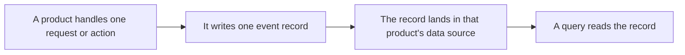

import DocButton from '~/components/webkit/DocButton.vue'
import DocCardGroup from '@aziontech/webkit/doc-card-group'
import DocCard from '@aziontech/webkit/doc-card'

A system that serves traffic can write one record for each piece of work it does: the address a request came from, the path it asked for, the status it answered with, and the time it took. Those records are kept for a fixed period and searched field by field, so a question asked after the fact is answered from what was written rather than from what anyone remembers. At the end of the period the records are removed, and the question they would have answered can no longer be asked.

**Real-Time Events** is the Platform Resource that holds those records on Azion's distributed infrastructure and serves them back. Each Azion product writes its own records into a data source of its own, and each data source carries the set of preorganized variables that product fills. Use Real-Time Events to search the records of past traffic, inspect a possible attack, debug a [function](/en/documentation/platform/functions/), measure how an [application](/en/documentation/platform/applications/) performs, or check what changed on an account.

<DocButton href="/en/documentation/platform/real-time-events/quickstart/" label="Quickstart" size="medium" />
<DocButton href="/en/documentation/platform/real-time-events/guides/" label="Real-Time Events guides" kind="secondary" size="medium" />

---

## Query structure

A query names the dataset it reads, the period it covers, the values that narrow it, and the fields it returns. This query asks the `workloadEvents` dataset for the most recent request that answered `400` inside a ten-minute window:

```graphql
{
  workloadEvents(
    limit: 1
    filter: {
      tsRange: { begin: "2026-01-01T12:00:00", end: "2026-01-01T12:10:00" }
      statusIn: [400]
    }
    orderBy: [ts_DESC]
  ) {
    ts
    requestId
    host
    status
  }
}
```

The row it returns:

```json
{
  "ts": "2026-01-01T12:03:51Z",
  "requestId": "0123456789abcdef0123456789abcdef",
  "host": "<your-workload-domain>",
  "status": 400
}
```

- `workloadEvents` is the dataset that holds the records of the HTTP Requests data source. Every data source has one.
- `filter` carries `tsRange`, which bounds the period, and one argument per value the search narrows on, such as `statusIn`.
- `orderBy` sets the order the rows come back in, and `limit` caps how many of them do.
- The selection set names the fields the response carries, and a field it does not name is not returned.

The API is GraphQL, so what you know about selection sets, arguments, and nested input objects applies to a query. A search in [Azion Console](https://console.azion.com) makes the same choices through its own controls, and names each field of a record a variable rather than a field.

---

## Record path

Real-Time Events observes nothing on its own. A record exists because a product wrote it, so an application that serves no request and an account nobody touches produce no records at all.



1. A product handles one unit of work: a request, a DNS query, a delivery to a configured endpoint, or an action on the account.
2. The product writes one event record for that unit, holding one value per variable its data source defines.
3. The record is written into the data source of the product that produced it and into no other, so a search selects one data source before it selects anything else.
4. A query names that data source, a period, and any filters, and reads the records that match. A record becomes queryable a short time after the event rather than at the instant of it.
5. The record is removed at the end of its retention period, whether or not anyone read it.

A variable is not an event of its own. One event produces one record, and the variables are the fields of that record. For the full path, the delay before a record answers a search, and what a query reads before it returns a row, refer to [How Real-Time Events works](/en/documentation/platform/real-time-events/how-it-works/).

---

## Scope and limits

- **Data sources**: eight, one for each product that writes records. They are HTTP Requests, Functions, Functions Console, Image Processor, Tiered Cache, Edge DNS, Data Stream, and Activity History. Each one carries its own variables, because each product writes a different record. For every data source, the dataset that holds it, and the variables it carries, refer to [Data sources](/en/documentation/platform/real-time-events/data-sources/).
- **Interfaces**: you read the records in **Azion Console**, and with the Real-Time Events GraphQL API at `https://api.azion.com/v4/events/graphql`. That address also serves the GraphiQL Playground in a browser. To get a token and send a first query, refer to [GraphQL API first steps](/en/documentation/devtools/graphql/first-steps/). For the fields each dataset carries, refer to [Real-Time Events GraphQL API fields](/en/documentation/devtools/graphql/gql-real-time-events-fields/).
- **Retention**: an event record is kept for 7 days, equal to 168 hours, and is then removed. Activity History records are kept for 2 years instead. A period reaching further back than retention returns nothing for the part that falls outside it, because there is nothing left there to read.
- **Query bounds**: one query is bounded on the rows it returns, the fields it selects, and the size of its payload. The GraphQL API bounds the rate it accepts requests at, and the log database bounds the rows one query reads before it answers. An unfiltered search over a broad period reaches that last bound, and fails rather than returning a partial result. For every value and the answer a query past it receives, refer to [Limits](/en/documentation/platform/real-time-events/limits/).
- **Billing**: Real-Time Events is charged on two metrics, Storage and Data Scan, both per GB. Storage measures the volume of records kept, and Data Scan the volume a query reads rather than the volume it returns, per [Pricing](/en/documentation/fundamentals/pricing/).

Real-Time Events answers questions about individual records and does not aggregate them. Aggregated counters over the same traffic are [Real-Time Metrics](/en/documentation/platform/real-time-metrics/), and a continuous feed of the same records to an endpoint you own is [Data Stream](/en/documentation/platform/data-stream/).

---

## Next steps

<DocCardGroup cols={2}>
  <DocCard title="Real-Time Events quickstart" href="/en/documentation/platform/real-time-events/quickstart/" label="Run a first search and read the record it returns." />
  <DocCard title="How Real-Time Events works" href="/en/documentation/platform/real-time-events/how-it-works/" label="Follow one record from the product that writes it to the query that reads it." />
  <DocCard title="Data sources" href="/en/documentation/platform/real-time-events/data-sources/" label="Find which product writes the record you need, and the variables it carries." />
  <DocCard title="Limits" href="/en/documentation/platform/real-time-events/limits/" label="Look up a retention period, a query bound, or what a refused query receives." />
</DocCardGroup>
