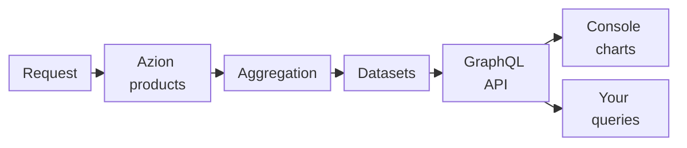

import DocButton from '~/components/webkit/DocButton.vue'
import DocCardGroup from '@aziontech/webkit/doc-card-group'
import DocCard from '@aziontech/webkit/doc-card'

A metric is a number computed from many requests over a slice of time, such as a count of requests, a sum of bytes, or the share of content served from cache. A metrics dashboard plots those numbers as charts, one point per minute, hour, or day, so you see how traffic changes without reading each request. A log is the opposite view: one record per request, with its details.

**Real-Time Metrics** aggregates the metrics that the Azion products serving your traffic generate, and shows them as charts in [Azion Console](https://console.azion.com/) and through the [GraphQL API](/en/documentation/devtools/graphql/). It is an Observe product that creates nothing in your account and has nothing to turn on: it is active on every account, and its charts follow your traffic within minutes. Use Real-Time Metrics to quantify requests and data transferred, see the bandwidth that cache saves, and check the availability and performance of your content through status codes and request times. Use it also to find security threats and bots, count function invocations and DNS queries, troubleshoot a drop or a spike, and compare one period with another.

<DocButton href="/en/documentation/platform/real-time-metrics/quickstart/" label="Quickstart" size="medium" />
<DocButton href="/en/documentation/platform/real-time-metrics/build-dashboards/" label="Build dashboards" kind="secondary" size="medium" />

---

## Metrics query

Every chart is the answer to a GraphQL query. This query reads the total requests and the total data transferred of every application in the account:

```graphql
query TrafficLast24Hours($begin: DateTime!, $end: DateTime!) {
  httpMetrics(
    limit: 1
    filter: { tsRange: { begin: $begin, end: $end } }
  ) {
    requestsTotal
    dataTransferredTotal
  }
}
```

- `httpMetrics` is the dataset, the aggregated metrics of the requests that your applications serve. Each kind of traffic has its own dataset.
- `tsRange` sets the period with `begin` and `end`. Every query must carry a time range, or the API answers `400`.
- `requestsTotal` and `dataTransferredTotal` are computed fields: each holds a total for the whole range. `dataTransferredTotal` is in bytes, the sum of the data transferred in and out.
- The query groups by nothing, so the API returns one row that holds the totals.

Sent to `https://api.azion.com/v4/metrics/graphql` with a personal token and the variables `{"begin": "2026-01-01T12:00:00", "end": "2026-01-02T12:00:00"}`, the query answers `200`:

```json
{
  "data": {
    "httpMetrics": [
      {
        "requestsTotal": 1985,
        "dataTransferredTotal": 149684815.0
      }
    ]
  }
}
```

The row holds the totals of every application in the account for those 24 hours. If you know GraphQL, you know the query model: any GraphQL client that sends a `POST` request with a token reads the same numbers as the Console. To send this query with `curl` and narrow it to one host, refer to the [Real-Time Metrics quickstart](/en/documentation/platform/real-time-metrics/quickstart/). For every field of each dataset, refer to [Real-Time Metrics GraphQL fields](/en/documentation/devtools/graphql/gql-real-time-metrics-fields/).

---

## From traffic to a chart

Real-Time Metrics does not collect anything you configure. It reads what the products serving your traffic already record, after Azion aggregates it.



1. A client sends a request, and the product that handles it, such as an application or WAF, records it as an event.
2. Azion aggregates the events into metrics per time bucket, such as a count of requests or a sum of bytes. Aggregation takes up to 10 minutes, so the newest points of a chart can still rise.
3. The metrics are stored in datasets, one per kind of traffic, such as `httpMetrics` for the requests of your applications.
4. The GraphQL API at `https://api.azion.com/v4/metrics/graphql` answers queries on those datasets.
5. Each chart in Azion Console sends a query to that same API, so a chart and a query you write read the same numbers.
6. Your own queries, and Grafana dashboards, read the same datasets through the API.

For the path of a request, the size of each point, and how counting differs from Billing, refer to [How Real-Time Metrics works](/en/documentation/platform/real-time-metrics/how-it-works/).

---

## Your own charts

The GraphQL API that every Console chart queries is also the route to charts of your own. You can group, filter, or extend a chart's query over a range the chart does not draw, and plot the result where you choose.

- **From a chart**: **Copy query** in a chart's menu copies the exact query and variables that the chart sends. To run the copied text, refer to [Copy query](/en/documentation/platform/real-time-metrics/filters-and-time-range/#copy-query).
- **From a guide**: worked queries [break down requests by status code](/en/documentation/guides/platform/observability/break-down-requests-by-status-code/), [measure cache offload for a domain](/en/documentation/guides/platform/observability/measure-cache-offload/), [find the top sources of WAF threats](/en/documentation/guides/platform/observability/find-top-waf-threat-sources/), and [query the httpBreakdownMetrics dataset](/en/documentation/guides/platform/observability/query-httpbreakdownmetrics-data-with-graphql/). Cache offload is the share of content that Azion delivers without fetching it from your origin.
- **In Grafana**: the Azion data source plugin queries Real-Time Metrics from a local Grafana instance that allows unsigned plugins. To set it up, refer to [Install the Azion plugin for Grafana](/en/documentation/guides/platform/observability/integrate-grafana/). Then [import the pre-built Grafana dashboard](/en/documentation/guides/platform/observability/azion-plugin-grafana-pre-built-dash/) or [build a custom Grafana dashboard](/en/documentation/guides/platform/observability/azion-plugin-grafana-custom-dash/). Two dashboards also ship as JSON: [Import the Data Transferred dashboard](/en/documentation/guides/platform/observability/data-transferred-dash/) and [Import the Real-Time Metrics dashboard](/en/documentation/guides/platform/observability/metrics-dash/).

---

## Scope and limits

- **Interfaces**: you read Real-Time Metrics on the **Real-Time Metrics** page of Azion Console, in the **Observe** group of the menu, and through the GraphQL API with a [personal token](/en/documentation/guides/platform/account-and-billing/personal-tokens/). For how the API is structured, refer to [GraphQL API overview](/en/documentation/devtools/graphql/overview/). Grafana reads it through the Azion plugin. The Azion CLI has no metrics command, and Terraform has nothing to manage, because Real-Time Metrics creates no object.
- **Dashboards**: the Console groups the dashboards in three categories, **Build**, **Secure**, and **Observe**, each with one tab per product. **Build** holds [Applications](/en/documentation/platform/applications/), [Tiered Cache](/en/documentation/platform/applications/cache/tiered-cache/), [Functions](/en/documentation/platform/functions/), and [Image Processor](/en/documentation/platform/applications/#image-processor), described in [Build dashboards](/en/documentation/platform/real-time-metrics/build-dashboards/). **Secure** holds [WAF](/en/documentation/platform/firewall/#waf), [Edge DNS](/en/documentation/platform/edge-dns/), [Bot Manager](/en/documentation/platform/firewall/#bot-manager), and **Threats Breakdown**, described in [Secure dashboards](/en/documentation/platform/real-time-metrics/secure-dashboards/). **Observe** holds [Data Stream](/en/documentation/platform/data-stream/), described in [Observe dashboards](/en/documentation/platform/real-time-metrics/observe-dashboards/). A product's dashboard reports data only after that product is active in your account.
- **Controls**: one time range and one set of filters apply to every chart of a dashboard. The range starts at **Last 5 minutes** and reaches at most 730 days back, with no future dates. Filters narrow the charts by a field, such as a host, or by a typed query. A chart's menu copies its query or exports its points as a CSV file. For every control, refer to [Filters and time range](/en/documentation/platform/real-time-metrics/filters-and-time-range/), and for the tasks, refer to [Filter a Real-Time Metrics dashboard](/en/documentation/guides/platform/observability/add-filters-metrics/) and [Export a chart's data and query](/en/documentation/guides/platform/observability/analyze-metrics/).
- **Data**: every value is aggregated, never a single request, and a metric takes up to 10 minutes to aggregate. Each point covers a minute, an hour, or a day, depending on the length of the range. For the range at which each size applies, refer to [Resolution](/en/documentation/platform/real-time-metrics/how-it-works/#resolution).
- **Retention and limits**: most datasets keep 2 years of data. A query returns at most 10,000 rows and selects at most 37 fields. For every bound and the response past it, refer to [Real-Time Metrics limits](/en/documentation/platform/real-time-metrics/limits/).
- **Billing**: Real-Time Metrics is included with the platform at no additional charge, as [Pricing](/en/documentation/fundamentals/pricing/#real-time-metrics) states. It counts each event once or not at all, so its totals can differ from Billing, on average by less than 1%. When they differ, Billing is the reference. For the two counting approaches, refer to [Counting and Billing](/en/documentation/platform/real-time-metrics/how-it-works/#counting-and-billing).
- **Logs and user experience**: Real-Time Metrics shows totals, not the requests behind them. The individual requests, the logs, are in [Real-Time Events](/en/documentation/platform/real-time-events/). To send the logs to a destination outside Azion, use Data Stream. To measure the experience of your real users, use [Edge Pulse](/en/documentation/platform/edge-pulse/), a Real User Monitoring (RUM) product.
- **Help**: [Best practices for Real-Time Metrics](/en/documentation/platform/real-time-metrics/best-practices/) covers which range and which source to trust for a number. [Troubleshoot Real-Time Metrics](/en/documentation/platform/real-time-metrics/troubleshooting/) covers an empty chart, a dropping last point, or totals that differ from Billing. The [glossary](/en/documentation/platform/real-time-metrics/glossary/) defines terms such as offload, dataset, and resolution.

---

## Next steps

<DocCardGroup cols={2}>
  <DocCard title="Quickstart" href="/en/documentation/platform/real-time-metrics/quickstart/" label="Read the requests and data transferred of your applications in the Console or with one query." />
  <DocCard title="Build dashboards" href="/en/documentation/platform/real-time-metrics/build-dashboards/" label="Find what each Applications chart measures and the field that returns it." />
  <DocCard title="How it works" href="/en/documentation/platform/real-time-metrics/how-it-works/" label="Follow a request until it becomes a point on a chart." />
  <DocCard title="Guides and tutorials" href="/en/documentation/platform/real-time-metrics/guides/" label="Complete a specific task, from a status-code breakdown to a Grafana dashboard." />
</DocCardGroup>
