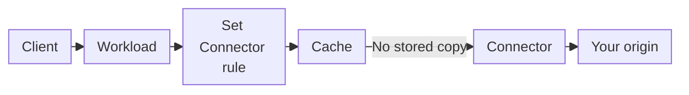

import DocButton from '~/components/webkit/DocButton.vue'
import DocCardGroup from '@aziontech/webkit/doc-card-group'
import DocCard from '@aziontech/webkit/doc-card'

A reverse proxy answers clients on behalf of a server you run, called the origin. When the proxy cannot answer from what it already holds, it opens its own connection to the origin and forwards the request. On that connection, it decides how to address the origin: the hostname in the `Host` header, the path, the protocol, and the port. Clients never connect to the origin, so you can move or protect the origin without any change on the client side.

**Connectors** is the Platform Resource that holds those decisions on Azion. A connector is an object of its own: it stores the address of your origin and the settings that shape every request to it, and a rule in an [application](/en/documentation/platform/applications/) sends requests to it with the _Set Connector_ behavior. Several applications can reuse one connector, so the connection settings of an origin live in one place. Use Connectors to send traffic to a cloud server or a server in your data center, serve objects from an Object Storage bucket, spread requests across several servers, keep clients from reaching your origin directly, or deliver a live stream.

<DocButton href="/en/documentation/platform/connectors/quickstart/" label="Quickstart" size="medium" />
<DocButton href="/en/documentation/platform/connectors/settings/" label="Connector settings" kind="secondary" size="medium" />

---

## Connector object

A connector is one JSON object. This body creates a connector of type `http` that sends requests to `httpbin.org` over HTTPS:

```json
{
  "name": "my-connector",
  "type": "http",
  "attributes": {
    "addresses": [{ "address": "httpbin.org" }],
    "connection_options": {
      "transport_policy": "force_https",
      "host": "httpbin.org"
    }
  }
}
```

- `type` decides what the connector reaches: `http` for a server you run, `storage` for an Object Storage bucket, or `live_ingest` for a live stream.
- `addresses` lists the origin servers, each a hostname or an IP address with no protocol and no port. Every address takes the ports `80` and `443` unless you set others.
- `connection_options` shapes each request to the origin. Here, `force_https` connects over HTTPS only, and `host` sends the origin its own name instead of the hostname the client requested, which is the default `${host}`.
- Every key left out takes its default, and Load Balancer and Origin Shield stay off.

Sent to `POST /v4/workspace/connectors`, this body answers `202` with `"state": "pending"` and the full object, every default filled in. If you know an upstream from another proxy, a connector is that object, stored apart from the rules that send traffic to it. For every field and its default, refer to [Connector settings](/en/documentation/platform/connectors/settings/#connector-object).

---

## Request path

Creating a connector does not send traffic to it. A connector receives requests only from an application rule that names it, and the application itself serves only the hostnames of a [workload](/en/documentation/platform/workloads/) whose deployment names that application.



1. A client requests a hostname of a workload, and the workload's deployment hands the request to the application.
2. The application runs its Request Phase rules in order. A matching rule with the _Set Connector_ behavior names one connector.
3. When a cache setting applies and a valid copy is stored, Azion answers from cache, and the request never reaches the connector.
4. Otherwise, the connector opens a connection to its address and sends the request with its `Host` header, path prefix, and protocol.
5. The origin answers the connector, the application runs its Response Phase rules, and the client receives the response.

A rule names the connector by its ID, so every rule that names it, in any application, follows a change to the connector without an edit of its own. The dependency also runs the other way: the API refuses to delete a connector that a rule still names. For each step of the path, refer to [How Connectors works](/en/documentation/platform/connectors/how-it-works/). For a request that fails along it, refer to [Troubleshoot Connectors](/en/documentation/platform/connectors/troubleshooting/).

---

## Resources

Load Balancer and Origin Shield act on a connector of type `http` once you enable them on the connector. Live Ingest acts through a connector of its own type, `live_ingest`.

### Load Balancer

Load Balancer spreads the requests of one connector across up to 15 addresses, so your content stays available when one origin server fails and no single server carries all the load. A balancing method, _Round Robin_, _Least Connections_, or _IP Hash_, chooses the address for each request, and the weight and server role of each address shape that choice. The rules that name the connector still decide which requests are balanced.

For how each method chooses an address, refer to [Balancing methods](/en/documentation/platform/connectors/load-balancer/balancing-methods/), and to enable it on your first connector, refer to the [Load Balancer quickstart](/en/documentation/platform/connectors/load-balancer/quickstart/).

### Origin Shield

Origin Shield protects the origin of a connector of type `http` in two ways. With Origin IP ACL, your origin's firewall accepts only the IPv4 and IPv6 prefixes of the `Azion Origin Shield` network list, a perimeter at layers 3 and 4 that refuses every connection from another source. With HMAC, the connector signs each request with the credentials of an S3-compatible storage provider, so a private bucket answers it. Turn it on when clients must not reach your origin directly, or when the origin serves only signed requests.

For how each defense works and how the list is updated, refer to [Origin IP ACL and HMAC](/en/documentation/platform/connectors/origin-shield/origin-ip-acl-and-hmac/). To serve a private bucket through a signed connector, refer to [Sign origin requests with HMAC](/en/documentation/guides/application-development/getting-started/sign-origin-requests-with-hmac/).

### Live Ingest

Live Ingest takes a live stream that your encoder pushes over RTMP, in the region of a connector of type `live_ingest`, and converts it to HLS. An application then delivers the stream to viewers through that connector. Use it for live events, e-sports matches, and educational broadcasts.

For how the stream reaches Azion and the viewers, refer to [Ingestion and delivery](/en/documentation/platform/connectors/live-ingest/ingestion-and-delivery/).

---

## Scope and limits

- **Connector types**: a connector of type `http` reaches servers you run by hostname or IP address, such as a cloud server, a server in your data center, or an S3-compatible endpoint. It is the only type with addresses, connection options, Load Balancer, and Origin Shield. A connector of type `storage` reads a bucket of [Object Storage](/en/documentation/platform/object-storage/) in your account, narrowed to a prefix, and a connector of type `live_ingest` takes a live stream in one of five regions. Azion Console offers the three as the **Connector Type** cards _HTTP_, _Object Storage_, and _Live Ingest_. For the fields of each, refer to [Connector settings](/en/documentation/platform/connectors/settings/#general).
- **Interfaces**: you create and manage connectors on the **Connectors** page of [Azion Console](https://console.azion.com/), through the [Azion API](https://api.azion.com/) at `/v4/workspace/connectors`, and with the `azion_connector` resource of [Terraform](/en/documentation/devtools/terraform/connectors/). [Azion CLI](/en/documentation/devtools/cli/) takes no flag per setting: `azion create connector --type http --file my-connector.json` reads the JSON body from a file and prints `Created Connector with ID <connector-id>`.
- **Limits**: a connector holds one address, or up to 15 with Load Balancer on, and its `name` takes 1 to 255 characters. For every bound and the error past it, refer to [Connectors limits](/en/documentation/platform/connectors/limits/).
- **Timeouts**: a connector without Load Balancer has no configurable timeout and follows the platform defaults listed in [How Connectors works](/en/documentation/platform/connectors/how-it-works/#connection-reuse-and-timeouts). With Load Balancer on, the connection timeout, the read and write timeout, and the retries on a connection failure become settings.
- **Rule precedence**: when several matching rules carry the _Set Connector_ behavior, only the last one runs. One application can therefore send `/images/` to a connector of type `storage` and every other path to a connector of type `http`. To write the rules, refer to [Rules Engine for Applications](/en/documentation/platform/applications/rules-engine/).
- **Propagation**: a connector change takes effect without another deployment, and it reaches Azion's distributed infrastructure in several minutes, with data centers applying it at different times. Until then, requests can meet the old or the new settings. For how to plan a change around it, refer to [Connectors best practices](/en/documentation/platform/connectors/best-practices/).
- **Testing**: a connector receives only the requests of the rules that name it. A rule that matches one path sends that path alone to the connector you are trying, while every other path keeps its current origin, as the [Connectors quickstart](/en/documentation/platform/connectors/quickstart/) does.
- **DNS-level balancing**: Load Balancer chooses among the addresses of one connector, after the request reaches Azion. Weighted DNS records that split traffic between IP addresses at resolution time belong to [Edge DNS](/en/documentation/platform/edge-dns/), as [How to perform a load balance between DNS records](/en/documentation/guides/application-security/dns/load-balance-dns/) shows.
- **Origin offload**: Origin Shield protects the origin with an allowlist and request signing. A second cache layer between Azion's cache and your origin, which cuts the requests that reach it, is [Tiered Cache](/en/documentation/platform/applications/cache/tiered-cache/), turned on per cache setting of the application.
- **SNI Check**: on an HTTPS request, Azion compares the hostname the client requests with the names the workload's certificate covers, and answers `421 Misdirected Request` when the certificate cannot cover it. For the decision steps, refer to [SNI Check](/en/documentation/platform/connectors/sni-check/).
- **API v4**: on API v3, the origins of an application carried the role of a connector, and Connectors replaces them on API v4. For an account that still runs API v3, refer to [Origins](/en/documentation/platform/connectors/origins/), and for the mapping between the two models, refer to [API v4 Migration](/en/documentation/fundamentals/api-v4-migration/).
- **Observability**: [Data Stream](/en/documentation/platform/data-stream/) records the origin leg of each request in its `$upstream_*` variables, such as `$upstream_status`, the HTTP status code of the origin, and `$upstream_response_time`, the time to receive the origin's response. A cached response carries `-` in both.
- **Billing**: every plan includes Single Origin, a connector with one address. Load Balancer is billed on Data Transfer, Origin Shield on Shielded Connectors, and Live Ingest on Data Ingestion. For the amounts each plan includes, refer to [Connectors limits](/en/documentation/platform/connectors/limits/), and for the rates, refer to [Pricing](/en/documentation/fundamentals/pricing/).
- **Terms**: the [Connectors glossary](/en/documentation/platform/connectors/glossary/) defines the words these pages give a specific meaning, such as address, server role, path prefix, and Single Origin.

---

## Next steps

<DocCardGroup cols={2}>
  <DocCard title="Quickstart" href="/en/documentation/platform/connectors/quickstart/" label="Create a connector, send one path to it with a rule, and check the response." />
  <DocCard title="How it works" href="/en/documentation/platform/connectors/how-it-works/" label="Follow a request from a rule through the connector to your origin." />
  <DocCard title="Connector settings" href="/en/documentation/platform/connectors/settings/" label="Look up a field, its default, or the values it accepts." />
  <DocCard title="Guides and tutorials" href="/en/documentation/platform/connectors/guides/" label="Complete a specific task, from a bucket origin to the Host header." />
</DocCardGroup>
